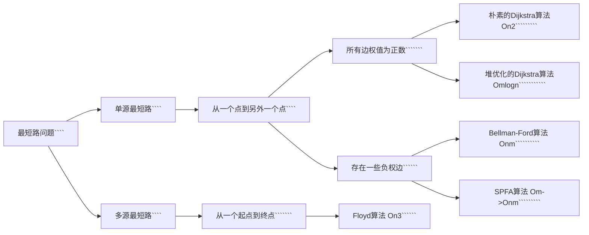

+++
date = '2023-11-25T13:54:38+08:00'
draft = false
title = '计算机算法机试指南'
tags = 'notes'
show_toc = true
twikoo = true
keywords = ['算法', '心得', '程序设计', '机试', '上机']
description = "我的算法学习之路的完全心得笔记，走过的弯路与总结的模板。"
+++

# 计算机算法机试指南

> 打响计算机CSP算法以及机试必胜的第一战✌️

**算法解题思路七步法：**


**算法复杂度分析**

<!--  -->


### 前缀和

#### 模板回顾

```cpp
//一维前缀和
S[i] = a[1] + a[2] + ... a[i]
a[l] + ... + a[r] = S[r] - S[l - 1]
做一个Sn数组，表示前n个数的和
单独求某区段的和 就只需要 S[r] - S[l-1];

求前n项和的数组Sn
for (int i = 1; i <= n; i ++ ) scanf("%d", &a[i]);
    for (int i = 1; i <= n; i ++ ) S[i] = S[i-1] + a[i];  //前缀和的初始化

--区间和的计算 S[r] - S[l-1]
```

```cpp
//二维前缀和
[含容斥原理的应用]
自己分析的时候注意 x表示行、y表示列。
分析时不要看成点，而是应该把点看成格子去理解！！！
S[i, j] = 第i行j列格子左上部分所有元素的和
以(x1, y1)为左上角，(x2, y2)为右下角的子矩阵的和为：
S[x2, y2] - S[x1 - 1, y2] - S[x2, y1 - 1] + S[x1 - 1, y1 - 1]
```

```cpp
//注意事项
用模板前缀和时，默认i >= 1 ; j >= 1;
定义数组时；数组大小比规定大小大 10 最为保险
100000 ---> 100010
```

#### 3956.截断数组

> https://www.acwing.com/problem/content/description/3959/
>
> 不要想当然的做题，一定要善于分析，懂得思考，善于进行抽象思维，固定一刀的情况，去枚举另外的切割方式，思路见代码中的注释。
>
> **思路：利用前缀和，固定第二刀，分析第一刀的可能情况即可**，凡是涉及累加运算的，一定要想到前缀和！

```cpp
#include<bits/stdc++.h>

using namespace std;
const int N = 100010;
typedef long long ll;
ll n,sum;
ll a[N],s[N];
int main()
{
    scanf("%lld",&n);
    for(int i = 1; i <= n; i ++){
        scanf("%lld",&a[i]);
        s[i] = s[i-1] + a[i];
    }
    //如果不能被分为三段则表示有0种方案
    if(s[n] % 3 != 0){
        printf("0\n");
        return 0;
    }
    //为了降低时间复杂度，我们单独枚举第二刀的位置即可
    //固定第二刀位置，我们分析第一刀恰好为num的情况，计为cnt
    //如果第二刀之前总和为2*num，那么此时的情况数应该为已有的情况数+cnt
    ll num = s[n] / 3;
    ll cnt = 0, res = 0;
    for(int i = 2; i < n; i ++){
        if(s[i - 1] == num) cnt ++; //表示第一刀的可能情况
        if(s[i] == num * 2) res += cnt; //此时放置第二刀
    }
    printf("%lld\n",res);
    return 0;
}
```

#### 1230. K倍区间

> 很巧妙的一道题，这里我们采用前缀和的方式存放余数
> $$
> s[i] = (s[i-1] + a[i])\%k\ -->余数前缀和\\
> if \ s[i] == 0 \ -->表示1～i其区间本身就是一个满足条件的解\\
> if \ (s[R] - s[L - 1])\%k == 0\ (表示L-R区间满足条件)\\
> \ 	也就是说，s[R]\%k == s[L-1]\%k \ 如果两个区间的余数相同，那么也能构成一个k倍区间\\
> answer=sum(s[0]) + C_{cnt(余数相同的个数)}^2
> $$
> 大概思路如上所示，在编写代码的时候有几个很巧妙的地方
>
> ```
> 例如：设置初始值cnt[0]=1
> -ans += cnt[s[i]];
> -cnt[s[i]]++;
> 这两行代码的顺序不能变更，这样还不需要用组合公示，虽然理解难度增加了，但代码长度和时间复杂度减少一个常数
> ```

```cpp
#include <bits/stdc++.h>

using namespace std;
typedef long long ll;
const int N = 100010;
ll a[N],s[N];
int cnt[N];
ll ans;
int n,k;
int main()
{
    scanf("%d%d",&n,&k);
    cnt[0] = 1; //如果余数为0的话，那么其本身就是一个合法的区间
    for(int i = 1; i <= n; i ++){
        scanf("%lld",&a[i]);
        s[i] = (s[i-1] + a[i])%k; //用前缀和的方法存下其模的余数
    }
    for(int i = 1;i <= n; i ++){
        ans += cnt[s[i]];  //这里两行代码不能更改顺序，这里的处理方法类似于组合C^2_n
        cnt[s[i]]++; //此时余数相等的情况+1
    }
    printf("%lld\n",ans);
    return 0;
}
```

> 类题：https://www.acwing.com/problem/content/101/
>
> **注意点：**1.不能开long long；2.注意给出的坐标的下标是从0开始的；3.时刻注意数组的范围，不要想当然做题；

```cpp
#include<bits/stdc++.h>

using namespace std;
typedef long long ll;
int ans;
const int N = 5010;
int s[N][N]; //注意这里不要开long long,否则会MLE，要学会自己计算Memory
int n;
int r;
int maxx,maxy;
int main()
{
    scanf("%d%d",&n,&r);
    r = min(r, 5001); //考虑周到
    maxx = maxy = r; //限制初始边界
    for(int i = 0; i < n; i ++){
        int x,y,w;
        scanf("%d%d%d",&x,&y,&w);
        x++,y++;//注意前缀和算法要从下标为1开始！！！！粗心大意
        s[x][y]+=w;
        maxx = max(maxx,x);
        maxy = max(maxy,y);
    }
    for(int i = 1; i <= maxx; i ++){ //二维前缀和
        for(int j = 1; j <= maxy; j ++){
            s[i][j] = s[i - 1][j] + s[i][j - 1] + s[i][j] - s[i - 1][j - 1];
        }
    }
    for(int i = r; i <= maxx; i ++){ //二维前缀和的求解，枚举右下角的端点
        for(int j = r; j <= maxy; j ++){
            ans = max(ans, s[i][j] - s[i-r][j] - s[i][j-r] + s[i-r][j-r]);
        }
    }
    printf("%lld\n",ans);
    return 0;
}
```

### 差分

#### 模板回顾

```cpp
//一维差分
a数组是b数组的前缀和。
假想一个B数组，使得A数组是B数组的前缀和，那么称B数组为A数组的差分。
对B数组求一个前缀和就能得到A数组
假设a数组全部都是0，a数组中的值，相当于进行了n次插入操作。

差分模板：
  给区间[l,r]中的每个数加上c;
	B[l] += c;
	B[r+1] -= c;
//实例
void insert(int l, int r,int c)
{
   b[l] += c;   //b为a的差分，bl+c则bl后的每一项al都会+c
   b[r + 1] -= c;  //所以要使得后面r+1都要-c
}
//不同问题在这一步的处理方式不同
for (int i = 1; i <= n; i ++)
{
    scanf("%d",&a[i]);
    insert(i,i,a[i]);   //假设a里面全是0，a内的每一项都是通过插入实现的
}
while(m --)
{
		int l,r,c;     
  	scanf("%d%d%d",&l,&r,&c);
    insert(l,r,c);
}
for (int i = 1; i <= n ;i ++) b[i] += b[i - 1]; //将b变成前缀和-->为了得到原来的数组
```

```cpp
//二维差分
给以(x1, y1)为左上角，(x2, y2)为右下角的子矩阵中的所有元素加上c：
S[x1, y1] += c, S[x2 + 1, y1] -= c, S[x1, y2 + 1] -= c, S[x2 + 1, y2 + 1] += c
  
对数组b进行前缀和累加可以恢复到原来数组a
b[i][j] = b[i][j] + b[i - 1][j] + b[i][j - 1] - b[i - 1][j - 1]; //二维数组自身的前缀和求法
```

#### 100.增减序列

> https://www.acwing.com/problem/content/102/

> **差分思路：**将区间都需要+C的情况，转化为只需要对两个数进行加减。
> 原序列为$a$，差分序列为$b$
>
> 差分数组有几个特殊的值$b_1$和$b_{n+1}$，如果需要原序列相等，那么差分数组应该为$\{b_1,0,...,0\} 其中b_1为一个常数，只需要让b_2\sim b_n为0即可$
>
> 对于差分数组的$L$和$R$的取值有如下四种操作方式：
>
> 1⃣️$2\le L\le R \le n-1$ 选择一个$b_i$在$2\le n-1$中，一个$+/-1，另一个$ $-/+1$
>
> 2⃣️$L=1,R \le n-1$ 让$b_1 +/-1$，选一个在$2\le n-1$中的数$-/+1$
>
> 3⃣️$L\ge2, R=n$ 让$b_{n+1} +/-1$，选择另外一个数$-/+1$
>
> 4⃣️$L=1,R=n$，表示让这个序列都$+/-1$ –>在本题中没有意义；
>
> 对于差分序列$b_2\sim b_n$ ，假设其所有的正数和为$q$，所有的负数和为$p$
>
> 以贪心的方式选择1⃣️，这样能够更快的选择两个数进行变换【2⃣️3⃣️只能变一个数】，那么首先优先选择1⃣️，此时需要的操作次数为$min\{q,p\}$ 次，也就是将其中的正数/负数首先变成0，然后再使用2⃣️3⃣️方法对于剩下的数，剩下的数有$||q|-|p||$次，也就是最少还需要$||q|-|p||$次操作2⃣️和3⃣️：
> **结论：**最少需要的次数$ans1 = min\{q,p\}+||q|-|p|| =max\{q,p\}$
>
> 接下来讨论此时的方案数有多少种？对于1⃣️的操作是固定不变的，那么方案差异主要在于2⃣️和3⃣️，对于2⃣️和3⃣️的不同种情况一共有：$ans2=||p|-|q||+1$种 （理由如下：）
>
> ```
> 2⃣️			3⃣️
> 0			||p|-|q||
> 1			||p|-|q||-1
> 2			||p|-|q||-2
> ...			...
> ||p|-|q||		0
> ```

```cpp
#include <bits/stdc++.h>

using namespace std;
const int N = 100010;
typedef long long ll;
int b[N];
int a[N];
int n;
ll q,p;
int main()
{
    scanf("%d",&n);
    for(int i = 1; i <= n; i ++){
        scanf("%d",&a[i]);
        b[i] = a[i] - a[i-1];
        if(i == 1) continue;
        if(b[i] < 0) q += b[i];
        if(b[i] > 0) p += b[i];
    }
    ll ans1 = max(abs(q),abs(p));
    ll ans2 = abs(abs(q) - abs(p)) + 1ll;
    printf("%lld\n%lld",ans1,ans2);
    return 0;
}
```

#### 3729.改变数组元素

> https://www.acwing.com/problem/content/3732/

> 平平无奇的差分数组方法，对于差分数组，脑袋里面一定要时刻有那个差分/前缀和的概念

```cpp
#include <bits/stdc++.h>

using namespace std;
int T;
const int N = 200010;
int b[N];
void insert(int l,int r){
    b[l] += 1;
    b[r] -= 1;
}
int main()
{
    scanf("%d",&T);
    while(T--){
        int n;
        scanf("%d",&n);
        memset(b,0,sizeof b); //记得每次清0
        for(int i = 1; i <= n; i ++){
            int x;
            scanf("%d",&x); //当前操作
            if(x == 0) continue; //如果为0表示不操作
            insert(max(0,i-x+1),i+1); //否则将这一段区间进行差分+1
        }
        for(int i = 1; i <= n; i ++){
            b[i] += b[i-1]; //前缀和恢复原数组
        }
        for(int i = 1; i <= n; i ++){
            if(b[i] > 0) b[i] = 1; //这里只记录>1的为1即可！
            printf("%d ", b[i]);
        }
        printf("\n");
    }
    return 0;
}
```

### 二分

#### 模版回顾

```cpp
//整数二分【易错点：边界问题的选取】
当l = mid 的时候要补上l+r+1;
当r = mid 的时候不需要补上;

//模版一：
适用条件：区间[L,R]被划分为[L,mid], [mid+1,R]时使用;
//区间[l,r] 被划分位[l,mid] 和[mid+1,r]时使用
int bsearch_1(int l, int r)
{
    while (l < r)
    {
        int mid = l + r >> 1; //取中间值 相当于 (l+r)/2;
        if (check(mid)) r = mid;  // check()判定mid是否满足性质
        else l = mid + 1;
    }
    return 1;
}

//模版二
适用条件：区间[L,R]被划分为[L,mid-1],[mid,R]时使用;
int bsearch_2(int l, int r)
{
    while(l < r)
    {
        int mid = l + r + 1 >> 1;
        if (check(mid)) l = mid;
        else r = mid - 1;
    }
    return 1;
}
```

```cpp
//浮点数二分
特点：没有整除的概念，所以没有整数二分的边界问题，可以严格的二分
不断二分，直到二分的长度足够小的时候可以认为二分获得的是一个数了;
bool check(double x);

double bsearch_3(double l, double r)
{
    const double eps=1e-6; //精度
    while (r-l > eps)
    {
        double mid = (l+r)/2;
        if (check()) r=mid;
        else l=mid;
    }
    return l;
}
注意：精确度比要求的精确度多两位的情况下是比较保险的
如：保留6位，1e-8更为保险。
```

有单调性一定可以二分，但没有单调性有可能可以二分，所以二分的本质不是单调性

**本质：把整个区间一分为二，一部分满足、一部分不满足；二分能找到边界点分出这两个部分 [本质：边界]**

> 模板题：查找数的范围，分别是选择的lower和upper两种二分查找的方式，最终获得其区间。https://www.acwing.com/problem/content/791/
>
> ```cpp
> #include<bits/stdc++.h>
> 
> using namespace std;
> int n,q,k;
> const int N = 100010;
> int a[N];
> int main()
> {
>  scanf("%d%d",&n,&q);
>  for(int i = 0; i < n; i ++){
>      scanf("%d",&a[i]);
>  }
>  while(q --){
>      scanf("%d",&k);
>      int l = 0,r = n - 1;
>    	//lower方式获取下区间边界
>      while(l < r){
>          int mid = l + r >> 1;
>          if(a[mid] >= k){
>              r = mid;
>          }
>          else{
>              l = mid+1;
>          }
>      }
>    	//找不到的情况
>      if(a[l] != k) printf("-1 -1\n");
>      else{//upper方式获取上区间边界
>          printf("%d ",l);
>          l = 0, r = n-1;
>          while(l < r){
>              int mid = l + r + 1 >> 1;
>              if(a[mid] <= k){
>                  l = mid;
>              }
>              else{
>                  r = mid - 1;
>              }
>          }
>          printf("%d\n",l);
>      }
>  }
>  return 0;
> }
> ```

#### 1460.我在哪？（哈希+二分）

> https://www.acwing.com/problem/content/1462/

```cpp
//本题主要难点在于获取当前字符串的所有子串，用二分的方法查找合适情况。
#include <bits/stdc++.h>
#include <cstring>
#include <unordered_set>
using namespace std;
int n;
string str;
bool check(int mid){
    unordered_set<string> st; //set来代替字符串哈希
    for(int i = 0; i + mid <= n; i ++){
        string curstr = str.substr(i,mid);
        if(st.count(curstr)) return false;
        st.insert(curstr);
    }
    return true;
}
int main()
{
    scanf("%d",&n);
    cin >> str;
    int l = 0, r = n;
    while(l < r){ //二分查找
        int mid = l + r >> 1;
        if(check(mid)){
            r = mid;
        }
        else{
            l = mid + 1;
        }
    }
    printf("%d\n",l);
    return 0;
}
```

#### 1221.四平方和 （哈希+二分）以及几点启发

> https://www.acwing.com/problem/content/1223/

> 1. 符号重载的方式，代码示例种使用得很经典，还有另外的方式，通过手写bool cmp，导入到sort(a,a+n,cmp)中
> 2. 关于二分中L和R的边界值的选取，应该要选择满足要答案要求的边界范围，不能盲目将LR区间设置很大！！比如说在本题，二分查找答案是在0~pos中寻找满足条件的下标，因此此时L=0,R=pos才行！

```cpp
#include <bits/stdc++.h>
#include <vector>
using namespace std;
typedef long long ll;
int n;
const int N = 2500010;
struct sumup4{
    ll sum,c,d;
    bool operator< (const sumup4 &t) const{ //符号重载，主要用于sort函数
        if(sum != t.sum) return sum < t.sum;
        if(c != t.c) return c < t.c;
        return d < t.d;
    }
}sumup4[N];
int main()
{
    scanf("%d",&n);
    int pos = 0;
    for(int c = 0; c*c <= n; c ++){
        for(int d = c; c*c+d*d <= n; d++){
            sumup4[pos++] = {c*c+d*d,c,d}; //充分利用C++11的特性
        }
    }
    sort(sumup4,sumup4+pos);
    for(int a = 0; a*a <= n; a ++){
        for(int b = 0; a*a+b*b <= n; b ++){
            ll t = n - (a*a+b*b);
            int l = 0, r = pos-1;
            while(l < r){
                int mid = l + r >> 1;
                if(sumup4[mid].sum >= t) r=mid;
                else l=mid+1;
            }
            if(sumup4[l].sum == t){
                printf("%d %d %d %d\n",a,b,sumup4[l].c,sumup4[l].d);
                return 0;
            }
        }
    }
    return 0;
}
```

#### 1227.分巧克力

> https://www.acwing.com/problem/content/1229/

```cpp
//关于二分边界问题——此路不通走彼路
//r=mid不行就换成l=mid试一下
#include <bits/stdc++.h>
using namespace std;
const int N = 100010;
int n,k;
int pos = 0;
struct Cake{
    int h;
    int w;
}cake[N];
bool check(int mid){
    int cnt = 0;
    for(int i = 0; i < pos; i ++){
        int h = cake[i].h, w = cake[i].w;
        if(mid > h || mid > w) continue;
        int hnum = h / mid;
        int wnum = w / mid;
        cnt += hnum*wnum;
        if(cnt >= k) return true;
    }
    return false;
}
int main()
{
    scanf("%d%d",&n,&k);
    int maxsize = 0;
    for(int i = 0; i < n; i ++){
        int h,w;
        scanf("%d%d",&h,&w);
        cake[pos ++] = {h,w};
        maxsize = max(maxsize,h);
        maxsize = max(maxsize,w);
    }
    int l = 0, r = maxsize;
    while(l < r){
        int mid = l + r + 1 >> 1;
        if(check(mid)) l = mid;
        else r = mid - 1;
    }
    printf("%d\n",l);
    return 0;
}
```

#### 113.特殊排序（交互题）

> https://www.acwing.com/problem/content/115/
> 读懂题目甚至比题目本身还难；
> 反对称性：$a>b,b<a$
> 传递性：$a<b,b<c\rightarrow a<c$

```cpp
// Forward declaration of compare API.
// bool compare(int a, int b);
// return bool means whether a is less than b.
//**这道题目其实就可以转化为对于一个已排好序多数组，插入元素**
//**选择合适的位置插入元素，这里选择位置时，可以使用二分查找算法**
class Solution {
public:
    vector<int> specialSort(int N) {
        scanf("%d", &N);
        vector <int> ans;
        ans.push_back(1); //插入二分，先把1插进去，这样其他数就能和1进行比较了
        for(int i = 2 ; i <= N ; i ++)
        {
            int l = 0 , r = ans.size(); //在ans中进行二分
            while(l < r)
            {
                int mid = (l + r) >> 1; //大于mid 的 第一个数
                if(compare(i,ans[mid])) //
                r = mid;
                else l = mid + 1;
            }
            ans.insert(ans.begin() + l, i);//然后在给定位置插入i
        }
        return ans;
    }
};
```

### 双指针算法

```cpp
实际上将原来的多重循环，使用双指针的方式在一个循环内完成
for (int i = 0, j = 0; i < n; i ++ )
{
    while (j < i && check(i, j)) j ++ ;

    // 具体问题的逻辑
}
核心思想--->将穷举O(n^2)算法优化到O(n)
常见问题分类：
    (1) 对于一个序列，用两个指针维护一段区间
    (2) 对于两个序列，维护某种次序，比如归并排序中合并两个有序序列的操作
```

**窍门**：先写一个暴力解法，去思考**限制条件**和**单调性关系**，然后想办法去优化，将On2 --> On;

#### 799.最长连续不重复字序列（双指针经典咏流传）

> https://www.acwing.com/problem/content/801/

```cpp
#include <bits/stdc++.h>
using namespace std;
const int N = 100010;
int a[N],n;
int x[N];
int main()
{
    scanf("%d",&n);
    for(int i = 0; i < n; i ++) scanf("%d",&a[i]);
    int ans = 0;
    // --j------------i--，考虑i为右端点去思考j的情况，双指针算法常用
    //特别经典，一定要熟透于心，很多时候都要想到，固定一个端点
    for(int i = 0, j = 0; i < n; i ++){
        x[a[i]] ++;
        int res = 0;
        while(j < i && x[a[i]] > 1){ // 经典咏流传， 这里j < i和x[a[i]] > 1都很经典
            x[a[j]] --;
            j++;
        }
        res = i - j + 1;
        ans = max(ans,res);
    }
    printf("%d\n",ans);
    return 0;
}
```

```cpp
//两个序列，一个从前往后，一个从后往前寻找两个序列的下标，使得a[i] + b[j] = k的i，j值
//注意，这里成立的前提条件是a,b是升序序列
int main()
{
    scanf("%d%d%lld",&n,&m,&x);
    for(int i = 0;i < n; i ++) scanf("%d",&a[i]);
    for(int i = 0;i < m; i ++) scanf("%d",&b[i]);
    for(int i = 0, j = m - 1; i < n; i ++){
        while(a[i] + b[j] > x) j --; //与暴力的区别，j不会回退
        if(a[i] + b[j] == x) printf("%d %d\n",i,j);
    }
    return 0;
}
```

#### 1238.日志统计（双指针经典II）

> https://www.acwing.com/problem/content/1240/

```cpp
int main()
{
    scanf("%d%d%d", &n, &d, &k);
    for (int i = 0; i < n; i ++ ) scanf("%d%d", &logs[i].x, &logs[i].y);
    sort(logs, logs + n); //先给时间排个序!
  //这一步跟上面经典的双指针算法如出一辙，变了一点点，一定要灵活应对。
    for (int i = 0, j = 0; i < n; i ++ )//将j---i,这里i为右端点进行枚举
    {
        int id = logs[i].y;
        cnt[id] ++ ; //也是一样记录当前元素的个数
        while (logs[i].x - logs[j].x >= d) //给定两端点的枚举条件
        {
            cnt[logs[j].y] -- ; //当j需要移动的情况
            j ++ ; //现在移动j左端点指针
        }
        if (cnt[id] >= k) st[id] = true; //当满足题目所给条件时进行输出
    }
    for (int i = 0; i <= 100000; i ++ )
        if (st[i])
            printf("%d\n", i);
    return 0;
}
```

### 高精度

> <center>高精度总结</center>
>
> 

**下面函数中vector 取引用 &A ,&B 目的是为了节省内存空间。只取引用。不单独开辟空间！**

#### 大整数相加

```cpp
//大整数相加模板
vector<int> add (vector<int> &A, vector<int> &B)
{
    if (A.size() < B.size()) return add(B,A);
    
    vector<int> C;
    int t = 0; //t表示进位数
    for (int i = 0;i < A.size() || i < B.size();i++)
    {
        if (i < A.size()) t = t + A[i];
        if (i < B.size()) t = t + B[i];
        C.push_back(t%10);  //只存进位数的个位
        t = t/10; //如果进位大于10的话，进到下一位
    }
    if (t) C.push_back(t);
    return C;
}
```

#### 大整数相减 

##### 易错点：

1. 字符串转整型 善用ASCII码
2. **该模板一定要先判断是否A>=B！！** （要注意负数可能存在的情况！）

```cpp
//大整数的减法模板
vector<int> sub (vector<int> &A,vector<int> &B)
{
    vector<int> C;
    for(int i = 0, t = 0;i < A.size(); i ++)
    {
        t = A[i] - t;
        if (i < B.size()) t = t - B[i];
        C.push_back((t + 10) % 10);
        if (t < 0) t = 1;  //说明借了一位
        else t = 0;  //说明没有借
    }
    
    while (C.size() > 1 && C.back() == 0) C.pop_back(); //把最后的 0 的弄出去
    return C;
}
```

#### 大整数 乘以 小整数 A*b

```cpp
//把 b 看成一个整体去和A相乘
string A;
int b;
vector<int> mu;

vector<int> mul(vector<int> &A, int b)
{
    vector<int> C;
    int t = 0;
    for (int i = 0;i < A.size() || t;i ++)
    {
        if (i < A.size()) t = t + A[i] * b;
        C.push_back(t % 10);
        t = t / 10;
    }
    while (C.size() > 1 && C.back == 0) C.pop_back();
    return C;
}
```

##### 大整数 乘以 大整数 A*A

<!-- >  -->

> 

```cpp
//分治算法！先不处理进位！
#include<iostream>
#include<string>
#include<algorithm>
#define N 11000
using namespace std;
int main(){
    string s1,s2;
    cin>>s1>>s2;
    //首先倒序输入
    reverse(s1.begin(),s1.end());
    reverse(s2.begin(),s2.end());
   
    int a[N]={0};//初始化结果数组
    for(int i=0;i<s1.length();++i){
        for(int j=0;j<s2.length();++j){
            a[i+j]+=(s1[i]-'0')*(s2[j]-'0');
        }
    }//先不处理进位
    
    for(int i=0;i<N-1;++i){
        a[i+1]+=a[i]/10;
        a[i]=a[i]%10;
    }
    //处理进位
    
    int i=N-1;
    while(a[i]==0)
        i--;
    for(int j=i;j>=0;--j)
        cout<<a[j];
    //倒序输出！
    return 0;
}
```

#### 大整数 除以 小整数

##### 易错点：

1.为了与其他几个运算更为通用，大整数的存储方式仍是倒着储存，但是，切记结果应该再倒数一次
这时候可利用 algorithm头文件中的 reverse函数进行倒置
2.记得倒序输出的时候也要删除前导0 pop_back()
3.同样写 主函数的时候不要忘了 写输入，然后一定要记得 利用ASCII 进行字符与整数之间的转换！

```cpp
//A / b = C （商）  ....r为余数, A >= 0, b > 0

#include <algorithm>        ----- reverse
vector<int> div(vector<int> &A, int b, int &r)
{
    vector<int> C;
    r = 0;
    for (int i = A.size() - 1; i >= 0; i --)
    {
        r = r * 10 + A[i];
        C.push_back(r/b);
        r %= b;
    }
    reverse(C.begin(), C.end());  //除法是从高位开始计算的，但为了通用(+ - x)起见，一律逆序存数。最后输出的时候需要倒过来。
    while (C.size() > 1 && C.back() == 0) C.pop_back(); //删除前导0
    return C;
}
```

#### 高精度综合「进制转换」——清华大学机试

> **大致思路：**将原来的大整数转化为二进制，然后将二进制数进行倒置，再将其转化为十进制。
> 需要用到高精度除法和高精度加法

```cpp
#include <bits/stdc++.h>
using namespace std;

//高精度除法
vector<int> div(vector<int> &A, int b, int &r)
{
    r = 0;
    vector<int> C;
    reverse(A.begin(), A.end());
    for(int i = 0; i < A.size(); i ++)
    {
        r = r * 10 + A[i];
        C.push_back(r / b);
        r %= b;
    }

    reverse(C.begin(), C.end());
    while(C.size() > 1 && C.back() == 0) C.pop_back();
    return C;
}

//高精度加法
vector<int> add(vector<int> A,vector<int> B)
{
    vector<int> C;
    int t = 0;
    for(int i = 0; i < A.size(); i ++)
    {
        t += A[i];
        if(i < B.size()) t += B[i];

        C.push_back(t % 10);
        t /= 10;
    }
    if(t) C.push_back(t);
    return C;
}

//高精度十进制转二进制
vector<int> dec_to_bin(vector<int> &D)
{
    vector<int> B;
    int r = 0;
    while(D.size() > 1 || (D.size() == 1 && D[0] != 0))
    {
        D = div(D, 2, r);
        B.push_back(r);
    }
    return B;
}

//高进度二进制转十进制
vector<int> bin_to_dec(vector<int> &B)
{
    vector<int> D;
    D.push_back(0);
    for(int i = 0; i < B.size(); i ++)
    {
        D = add(add(D, D), {B[i]});
    }
    return D;
}

int main()
{
    string a;
    cin >> a;
    vector<int> A;
    for(int i = a.size() - 1; i >= 0; i --) A.push_back(a[i] - '0');
    vector<int> B = dec_to_bin(A);
    vector<int> D = bin_to_dec(B);
    for(int i = D.size() - 1; i >= 0; i --) cout << D[i];
    cout << endl;
    return 0;
}
```

### 递推

> 这就像道智力题啦，要发现规律

#### 3777.砖块

> https://www.acwing.com/problem/content/description/3780/

```cpp
思路：贪心——遇到这种数据量很少的，就直接暴力枚举吧～
最终的字符串，要么全为白色，要么全为黑色。
>以目标全为白色为例，遍历字符串的前 n−1个砖块，每遇到一个黑色砖块，就对其进行一次操作，将该砖块和下一个砖块变为另一种颜色，并将结果记录到数组中。如果发现最后一个砖块不为白色，那说明无法将砖块全部转化为白色；黑色同理。
>若最终全转化为白色和全转化为黑色均不可行，则输出 −1，否则输出一种可行的方案即可。
```

#### 95.费解的开关

> https://www.acwing.com/problem/content/97/

```cpp
#include<iostream>
#include<queue>
#include<unordered_map>
using namespace std;
int t;
//当前状态，当前到最终状态所需步数
unordered_map<int, int>vis;
//改这个灯及其上下左右相邻的灯的状态
//改第idx个灯;左,不为最左一个;上，不为第一排;下，不为最后一排;右，不为右一个
int turn(int st, int idx) { //这里用位运算压缩的方式存放一种状态
    st ^= (1 << idx);
    if (idx % 5) st ^= 1 << idx - 1;
    if (idx >= 5) st ^= 1 << idx - 5;
    if (idx < 20) st ^= 1 << idx + 5;
    if ((idx % 5) < 4) st ^= 1 << idx + 1;
    return st;
}
//从最终状态逆序遍历，遍历所有的状态，所以不用管地图什么样，直接bfs完，查对应map就完事了
void bfs() {
    //0-2^25-1（25个1），共2^25种状态
    int st = (1 << 25) - 1;//左移 右移的优先级是最低的，比加减还要低。所以这里的括号是必需的
    queue<int>q;
    q.push(st);
    while (q.size())
    {
        int t = q.front();
        q.pop();
        if (vis[t] == 6) break;//判断6步以内使所有的灯都变亮。
        for (int i = 0; i < 25; i++) {//尝试当前状态的每盏灯
            st = turn(t, i);//新的状态
            if (!vis.count(st)) {//该状态未被遍历过
                vis[st] = vis[t] + 1;
                q.push(st);
            }
        }
    }
}
int main() {
    bfs();//用map+深搜的方式存下所有可能的情况以及对应的解决方法
    cin >> t;
    while (t--)
    {
        int sum = 0;
        for (int i = 0; i < 25; i++) {
            char ch;
            cin >> ch;
            sum += ((ch - '0') << i);//25个字符二进制压缩成数字
        }
        if (vis[sum] == 0 && sum != (1 << 25) - 1) cout << -1 << endl;
        else cout << vis[sum] << endl;

    }
    return 0;
}
```

### 递归

#### 树的遍历🌲（回顾了一下建树/前序/中序/后序/层次遍历）

> https://www.acwing.com/problem/content/1499/

<!-- > -->

> 

```cpp
#include <iostream>
#include <cstring>
#include <algorithm>
#include <unordered_map>
#include <queue>

using namespace std;
const int N = 40;
int n;
int postorder[N], inorder[N];               //前序遍历，中序遍历
unordered_map<int, int> l, r, pos;          //用哈希表模拟二叉树

//il ir中序遍历区间； pl pr后序遍历区间
int build(int il, int ir, int pl, int pr)
{
    int root = postorder[pr];
    int k = pos[root];                      //得到根节点在中序遍历中的下标

    //k大于il表示根节点左边还有节点，即当前根节点存在左子树，下同
    //下面两行是难点，举例解释见图
    if (il < k) l[root] = build(il, k - 1, pl, pl + k - 1 - il);
    if (ir > k) r[root] = build(k + 1, ir, pl + k - il, pr - 1);

    return root;
}

void bfs(int root)                          //BFS用来层序遍历输出
{
    queue<int> q;
    q.push(root);
    while (q.size())
    {
        auto t = q.front();
        q.pop();
        cout << t << ' ';

        if (l.count(t)) q.push(l[t]);       //判断该节点的左右儿子是否存在
        if (r.count(t)) q.push(r[t]);       //存在则加入队列，等待下一层遍历
    }
}

int main()
{
    cin >> n;
    for (int i = 0; i < n; i ++ ) cin >> postorder[i]; //输入后序遍历树
    for (int i = 0; i < n; i ++ )
    {
        cin >> inorder[i]; //输入中序遍历树
        pos[inorder[i]] = i;                //记录中序遍历每个点位置（剪枝）
    }

    int root = build(0, n - 1, 0, n - 1);   //参数为中序遍历区间和后序遍历区间
    bfs(root);

    return 0;
}
```

#### 约数之和【经典数学知识】

> https://www.acwing.com/problem/content/99/

##### 补充数学知识（1）约数相关性质

> [1，n]里约数有i的个数是$\lfloor\frac{n}{i}\rfloor$ 
>
> 如上，n = 12时；
>
> 1~12之间的数，有以1为约数的有 12/1 = 12个
> 							有以2为约数的有 12/2 = 6个
> 							有以3为约数的有  12/3 = 4个
>
> 求所有约数的和，可以使用 s+=n/i
>
> > **上述算法的进一步优化**：
> >
> > 打表后发现，表中有很多$\lfloor\frac{n}{i}\rfloor$是相等的，比如12的5、6都是一样的。
> >
> > 对于这些一样的数每次都计算一次非常浪费时间，可以每次$i$跳转到$\lfloor\frac{n}{j}\rfloor = \lfloor\frac{n}{i}\rfloor+1$
> >
> > 这样的j上 对于中间一样的数一次性计算完毕。
> >
> > ```cpp
> > for(int i = 1, j; i <= n; i=j+1)
> > {
> > 	j = n/(n/i);
> > ans += (n/i)*(j-i+1);
> > }
> > ```
>
> 试除法求所有约数
>
> ```cpp
> vector<int> get_divisors(int x)
> {
>     vector<int> res;
>     for (int i = 1; i <= x / i; i ++ )
>         if (x % i == 0)
>         {
>             res.push_back(i);
>             if (i != x / i) res.push_back(x / i);//如果n是i的平方，可能有两个，这里目的是只存下一个
>         }
>     sort(res.begin(), res.end());
>     return res;
> }
> ```

**约数个数与约数之和**$N = p_1^{c_1} * p_2^{c_2} * ... *p_k^{c_k}$ 

```cpp
如果 N = p1^c1 * p2^c2 * ... *pk^ck
约数个数： (c1 + 1) * (c2 + 1) * ... * (ck + 1)
约数之和： (p1^0 + p1^1 + ... + p1^c1) * ... * (pk^0 + pk^1 + ... + pk^ck)
```

**数论常见的问题：**

- 对于每一个大于等于2的正整数n，都有$N=p_1^{c_1}*p_2^{c_2}*...*p_m^{c_m}$
- 正整数N的欧拉函数$phi(N)=N*(1-\frac{1}{p_1})*(1-\frac{1}{p_2})*...*(1-\frac{1}{p_m})=p_1^{c_1-1}*(p_1-1)*p_2^{c_2-1}*(p_2-1)*...*p_m^{c_m-1}*(p_m-1)$
- 正整数N的约数个数：$d(N)=(1+c_1)*(1+c_2)*...*(1+c_m)$
- 正整数N的所有约数和：$s(N)=(1+p_1+p_1^2+...+p_1^{c_1})*(1+p_2+p_2^2+...+p_2^{c_2})*(1+p_m+p_m^2+...+p_m^{c_m})$

##### 欧拉筛约数的方法⭐️

> 证明见：https://blog.csdn.net/weixin_43896346/article/details/88396182

- 欧拉筛

```cpp
inline void sieve(int x) {
    for(reg int i = 2;i <= x;i ++) {
        if(! vis[i])
            prim[++ len] = i;
        for(reg int j = 1;j <= len && i * prim[j] <= x;j ++) {
            vis[i * prim[j]] = 1;
            if(i % prim[j] == 0)
                break;
        }
    }
}
//试除法求质数
for (int i = 2; i <= x / i; i ++ ){
  while(x%i == 0){
    x/=i;
    primes[i]++;
  }
  if(x > 1) primes[x]++;
}
```

- 欧拉函数

```cpp
inline void sieve(int x) {
	phi[1] = 1;
    for(reg int i = 2;i <= x;i ++) {
        if(! vis[i]) {
        	prim[++ len] = i;
        	phi[i] = i - 1;	//因为欧拉函数代表小于这个数的且与这个数互质的数的个数，所以质数的欧拉函数为它本身减1
        }
        for(reg int j = 1;j <= len && i * prim[j] <= x;j ++) {
            vis[i * prim[j]] = 1;
            if(i % prim[j] == 0) {
            	phi[i * prim[j]] = phi[i] * prim[j];
                break;
            }
            phi[i * prim[j]] = phi[i] * (prim[j] - 1);
        }
    }
}
```

- 约数个数

```cpp
inline void sieve(int x) {
    for(reg int i = 2;i <= x;i ++) {
        if(! vis[i]) {
        	prim[++ len] = i;
        	d[i] = 2;	//质数的约数只有1和它本身
        	sum[i] = 1;
        }
        for(reg int j = 1;j <= len && i * prim[j] <= x;j ++) {
            vis[i * prim[j]] = 1;
            if(i % prim[j] == 0) {
            	sum[i * prim[j]] = sum[i] + 1;
            	d[i * prim[j]] = d[i] / (sum[i] + 1) * (sum[i] + 2);
                break;
            }
            sum[i * prim[j]] = 1;
            d[i * prim[j]] = d[i] * 2;
        }
    }
}
```

- 约数和

```cpp
inline void sieve(int x) {
    for(reg int i = 2;i <= x;i ++) {
        if(! vis[i]) {
        	prim[++ len] = i;
        	psum[i] = s[i] = i + 1;
        }
        for(reg int j = 1;j <= len && i * prim[j] <= x;j ++) {
            vis[i * prim[j]] = 1;
            if(i % prim[j] == 0) {
            	psum[i * prim[j]] = psum[i] * prim[j] + 1;
            	s[i * prim[j]] = s[i] / psum[i] * psum[i * prim[j]]
                break;
            }
            psum[i * prim[j]] = prim[j] + 1;
            s[i * prim[j]] = s[i] * psum[i * prim[j]];
        }
    }
}
```

> 本题思路：【分治法(分解为k为偶数和k为奇数的情况进行分治讨论)+约数+快速幂】

```cpp
#include<iostream>
#include<unordered_map>
using namespace std;
typedef long long LL;
const int mod = 9901;
int A, B;
//保存质因子以及出现的次数
unordered_map<int, int> primes;
//试除法质因子分解
void divide(int n) {
    for(int i = 2; i <= n / i; i++) {
        if(n % i == 0) {
            while(n % i == 0) {
                primes[i]++;
                n /= i;
            }
        }
    }
    if(n > 1) {
        primes[n]++;
    }
}
//快速幂
int qmid(int a, int b) {
    int res = 1;
    while(b) {
        if(b & 1) res = (LL)res * a % mod;
        a = (LL)a * a % mod;
        b >>= 1;
    }
    return res;
}
//p0 + .. + pk-1
int sum(int p, int k) {
    if(k == 1) return 1;  //边界
    if(k % 2 == 0) {  
        return (LL)(qmid(p, k / 2) + 1) * sum(p, k / 2) % mod;
    }
    return (qmid(p, k - 1) + sum(p, k - 1)) % mod;
}
int main(){
    cin >> A >> B;

    //对A分解质因子
    divide(A);

    int res = 1;
    for(auto it : primes) {
        //p是质因子，k是质因子的次数
        int p = it.first, k = it.second * B;
        // res要乘上每一项, 注意这里是k + 1
        res = (LL)res * sum(p, k + 1) % mod;
    }
    if(!A) res = 0;

    cout << res << endl;

    return 0;
}
```

### 并查集

- 朴素的并查集

  ```cpp
  int p[N]; //存储每个点的祖宗节点
  //返回x的祖宗节点
  int find(int x)
  {
      if(p[x] != x) p[x] = find(p[x]); //如果p[x]不是根节点的话，那么就让p[x]为他的祖宗结点
      return p[x];
  }
  
  //初始化，假设节点编号是1~n
  for(int i = 1; i <= n; i ++) p[i] = i;
  
  //合并a和b所在的两个集合
  p[find(a)] = find(b); //合并操作 也就是让a的祖宗结点的父亲等于b的祖宗结点
  ```

- 维护size的并查集

  ```cpp
  int p[N], size[N];
  //p[]存储每个点的祖宗结点，size[]只有祖宗结点的有意义，表示祖宗结点所在集合中的点的数量
  
  //返回x的祖宗结点
  int find(int x)
  {
      if(p[x] != x) p[x] = find(p[x]);
      return p[x];
  }
  //初始化，假定结点编号1~n
  for(int i = 1; i <= n; i ++)
  {
      p[i] = i;
      size[i] = 1;
  }
  
  //合并a和b所在的两个集合
  size[find(b)] += size[find(a)];
  p[find(a)] = find(b);
  ```

- 维护到祖宗节点的并查集

  ```cpp
  int p[N],d[N];
  //p[]存储每个点的祖宗结点，d[x]存储x到p[x]的距离
  
  //返回x的祖宗结点
  int find(int x)
  {
      if(p[x] != x)
      {
          int u = find(p[x]);
          d[x] += d[p[x]];
          p[x] = u;
      }
      return p[x];
  }
  
  //初始化，假定结点编号是1~n
  for(int i = 1; i <= n; i ++)
  {
      p[i] = i;
      d[i] = 0;
  }
  
  //合并a和b所在的两个集合
  p[find(a)] = find(b);
  d[find(a)] = distance; //根据具体问题，初始化find(a)的偏移量
  ```

#### 带权的综合并查集

> https://www.acwing.com/problem/content/240/

```cpp
#include <bits/stdc++.h>

using namespace std;
const int N = 30010,M = 30000;
int T;
int p[N];
int dist[N],s[N];
int find(int x){
    if(p[x] != x){
        int u = find(p[x]);
        dist[x] += dist[p[x]];
        p[x] = u;
    }
    return p[x];
}
int main()
{
    ios::sync_with_stdio(false);
    cin.tie(0),cout.tie(0);
    cin >> T;
    for(int i = 1; i <= M; i ++){
        p[i] = i;
        s[i] = 1;
    }
    while(T --){
        string op;
        int a,b;
        cin >> op >> a >> b;
        int pa = find(a), pb = find(b);
        if(op == "M"){
            if(pa != pb){
                p[pa] = pb;
                dist[pa] = s[pb];
                s[pb] += s[pa];
            }
        }
        else{
            if(pa != pb) cout << "-1\n";
            else{
                cout << max(0,abs(dist[a] - dist[b]) - 1) << "\n";
            }
        }
    }
    return 0;
}
```

### 哈希

- 一般哈希

```cpp
(1) 拉链法
    int h[N], e[N], ne[N], idx;

    // 向哈希表中插入一个数
    void insert(int x)
    {
        int k = (x % N + N) % N;
        e[idx] = x;
        ne[idx] = h[k];
        h[k] = idx ++ ;
    }

    // 在哈希表中查询某个数是否存在
    bool find(int x)
    {
        int k = (x % N + N) % N;
        for (int i = h[k]; i != -1; i = ne[i])
            if (e[i] == x)
                return true;
        return false;
    }
(2) 开放寻址法
    //注意开坑位N的时候要多开比原数据多两到三倍
    const int null = 0x3f3f3f3f;
    int h[N];

    // 如果x在哈希表中，返回x的下标；如果x不在哈希表中，返回x应该插入的位置
    int find(int x)
    {
        int t = (x % N + N) % N;
        while (h[t] != null && h[t] != x)
        {
            t ++ ;
            if (t == N) t = 0;
        }
        return t;
    }
//开放寻址法的话，如果是删除，就是先找到那个数，然后打上一个标记，表示这个数被删除了
```

- 字符串哈希

```cpp
核心思想：将字符串看成P进制数，P的经验值是131或13331，取这两个值的冲突概率低
小技巧：取模的数用2^64，这样直接用unsigned long long存储，溢出的结果就是取模的结果

typedef unsigned long long ULL; //可以不用取模了，这个溢出就等价于进行取模
ULL h[N], p[N]; // h[k]存储字符串前k个字母的哈希值, p[k]存储 P^k mod 2^64

// 初始化
p[0] = 1;
for (int i = 1; i <= n; i ++ )
{
    h[i] = h[i - 1] * P + str[i];
    p[i] = p[i - 1] * P;
}

// 计算子串 str[l ~ r] 的哈希值
ULL get(int l, int r)
{
    return h[r] - h[l - 1] * p[r - l + 1];
}
```

### 数据结构｜栈｜队列｜单调栈&单调队列⭐️

- **单链表**

```cpp
// head存储链表头，e[]存储节点的值，ne[]存储节点的next指针，idx表示当前用到了哪个节点
int head, e[N], ne[N], idx;

// 初始化
void init()
{
    head = -1;
    idx = 0;
}

// 在链表头插入一个数a
void insert(int a)
{
    e[idx] = a, ne[idx] = head, head = idx ++ ;
}

// 将头结点删除，需要保证头结点存在
void remove()
{
    head = ne[head];
}
```

- **双链表**

> 结点为idx=0的结点为头结点
> 结点为idx=1的结点为尾结点
>
> `规定的是0表示头结点，1表示尾结点，如果idx从1开始的时候，可以重新设置0表示头结点，-1表示尾结点`
>
> 故此后面再加入的结点是从idx=2编号开始插入or删除的

```cpp
// e[]表示节点的值，l[]表示节点的左指针，r[]表示节点的右指针，idx表示当前用到了哪个节点
int e[N], l[N], r[N], idx;

// 初始化
void init()
{
    //0是左端点，1是右端点
    r[0] = 1, l[1] = 0;
    idx = 2;
}

// 在节点a的右边插入一个数x
void insert(int a, int x)
{
    e[idx] = x;
    l[idx] = a, r[idx] = r[a];
    l[r[a]] = idx, r[a] = idx ++ ;
}

// 删除节点a
void remove(int a)
{
    l[r[a]] = l[a];
    r[l[a]] = r[a];
}

//关于双链表的遍历
int pos = r[0];
while(pos != 1)//当指向右边界节点时,循环结束
{
    cout << e[pos] << " ";
    pos = r[pos];
}
```

- **栈**

```cpp
// tt表示栈顶
int stk[N], tt = 0;

// 向栈顶插入一个数
stk[ ++ tt] = x;

// 从栈顶弹出一个数
tt -- ;

// 栈顶的值
stk[tt];

// 判断栈是否为空，如果 tt > 0，则表示不为空
if (tt > 0)
{

}
```

> **表达式求值问题**

```cpp
#include <bits/stdc++.h>
#include <unordered_map> //哈希表主要用于存运算符优先性
#include <stack>
using namespace std;

stack<int> num; //数栈
stack<char> op; //运算符栈
void eval()
{
    int x;
    auto b = num.top();
    num.pop();
    auto a = num.top();
    num.pop();
    auto c = op.top();
    op.pop();
    if(c == '+') x = a + b;
    else if(c == '-') x = a - b;
    else if(c == '*') x = a * b;
    else x = a / b;
    num.push(x);
}
int main()
{
    unordered_map<char, int> pr{{'+', 1}, {'-', 1}, {'*', 2}, {'/', 2}}; //扩展可以增加{'^',3}
    string str;
    cin >> str;
    for(int i = 0; i < str.size(); i ++)
    {
        auto c = str[i];
        if(isdigit(c))
        {
            int x = 0;
            int j = i;
            while(j < str.size() && isdigit(str[j]))
                x = x * 10 + str[j ++] - '0';
            i = j - 1; //注意更新下i
            num.push(x); //数栈处理
        }
        else if(c == '(') op.push(c); //左括号立马入栈
        else if(c == ')')
        {
            while(op.top() != '(') eval(); //如果遇上右括号，那就先把括号内的全都给算完
            op.pop();//弹出左括号
        }
        else//如果是一般操作符的话，判断优先级再进行运算
        {
            while(op.size() && pr[op.top()] >= pr[c]) eval();
            op.push(c);
        }
    }
    while(op.size()) eval();//如果还剩下运算符的话，那么一直计算直到所有运算符计算完毕
    cout << num.top();
}
```

> **后缀表达式求值**

```cpp
#include <bits/stdc++.h>
using namespace std;
stack<int> n;
char ch;
int s,x,y;
int main()
{
    while(ch != '@')
    {
        ch = getchar();
        switch(ch)
        {
            case '+': x = n.top(); n.pop(); y = n.top(); n.pop(); n.push(x+y); break;
            case '-': x = n.top(); n.pop(); y = n.top(); n.pop(); n.push(y-x); break;
            case '*': x = n.top(); n.pop(); y = n.top(); n.pop(); n.push(x*y); break;
            case '/': x = n.top(); n.pop(); y = n.top(); n.pop(); n.push(y/x); break;
            case '.': n.push(s); s = 0; break;
            default : s = s * 10 + ch - '0'; break;
        }
    }
    printf("%d\n",n.top());
    return 0;
}
```

- **队列**

```cpp
// hh 表示队头，tt表示队尾
int q[N], hh = 0, tt = -1;

// 向队尾插入一个数
q[ ++ tt] = x;

// 从队头弹出一个数
hh ++ ;

// 队头的值
q[hh];

// 判断队列是否为空，如果 hh <= tt，则表示不为空
if (hh <= tt)
{

}
```

- **循环队列**

```cpp
// hh 表示队头，tt表示队尾的后一个位置
int q[N], hh = 0, tt = 0;

// 向队尾插入一个数
q[tt ++ ] = x;
if (tt == N) tt = 0;

// 从队头弹出一个数
hh ++ ;
if (hh == N) hh = 0;

// 队头的值
q[hh];

// 判断队列是否为空，如果hh != tt，则表示不为空
if (hh != tt)
{

}
```

> - 单调递增栈：单调递增栈就是从栈底到栈顶数据是从大到小
> - 单调递减栈：单调递减栈就是从栈底到栈顶数据是从小到大
>
> ```cpp
> //单调递增栈
> while(!st.empty() && a[i] <= st.top()){
>             st.pop();
>             if(st.empty()) cout << "-1 ";
>         }
>         if(!st.empty()) cout << st.top() << " ";
>         st.push(a[i]);
> ```

```cpp
stack<int> st;
//此处一般需要给数组最后添加结束标志符，具体下面例题会有详细讲解
for (遍历这个数组)
{
	if (栈空 || 栈顶元素大于等于当前比较元素)
	{
		入栈;
	}
	else
	{
		while (栈不为空 && 栈顶元素小于当前元素)
		{
			栈顶元素出栈;
			更新结果;
		}
		当前数据入栈;
	}
}
//单调栈的一般模板，数组栈
常见模型：找出每个数左边离它最近的比它大/小的数
int tt = 0;
for (int i = 1; i <= n; i ++ )
{
    while (tt && check(stk[tt], i)) tt -- ;
    stk[ ++ tt] = i;
}
```

> 单调队列的实现方式

```cpp
常见模型：找出滑动窗口中的最大值/最小值
int hh = 0, tt = -1;
for (int i = 0; i < n; i ++ )
{
    while (hh <= tt && check_out(q[hh])) hh ++ ;  // 判断队头是否滑出窗口
    while (hh <= tt && check(q[tt], i)) tt -- ;
    q[ ++ tt] = i;
}
```

#### 滑动窗口

```cpp
//STL法
#include<bits/stdc++.h>
#include<queue>
using namespace std;
const int N = 1000010;
int a[N],n,k;
deque<int> q;
int main()
{
    scanf("%d%d",&n,&k);
    for(int i = 1; i <= n; i ++) scanf("%d",&a[i]);
    for(int i = 1; i <= n; i ++){
        while(!q.empty() && a[i] < q.back()){ //新加入的值要小于队尾元素的话，则弹出
            q.pop_back();
        }
        q.push_back(a[i]);//加入新的元素
        //判断队头是否出队
        if(i - k > 0 && q.front() == a[i - k]){
            q.pop_front();
        }
        //如果满足的话，输出队首元素
        if(i - k >= 0) cout << q.front() << " ";
    }
    q.clear(); //记得清空一下队列；
    cout << endl;
    for(int i = 1; i <= n; i ++){
        while(!q.empty() && a[i] > q.back()){
            q.pop_back();
        }
        q.push_back(a[i]);
        if(i - k > 0 && q.front() == a[i - k]){
            q.pop_front();
        }
        if(i - k >= 0) cout << q.front() << " ";
    }
    return 0;
}
```

```cpp
#include <bits/stdc++.h>
using namespace std;
const int N = 1000100;
int n,k;
int a[N];
int q[N];
int hh = 0, tt = -1;
int main()
{
    cin >> n >> k;
    for(int i = 1; i <= n; i ++) cin >> a[i];
    for(int i = 1; i <= n; i ++)
    {
        while(hh <= tt && q[hh] + k <= i) hh ++;
        while(hh <= tt && a[q[tt]] >= a[i]) tt--;
        q[++tt] = i;
        if(i >= k) cout << a[q[hh]] << " ";
    }
    cout << endl;
    hh = 0, tt = -1;
    for(int i = 1; i <= n; i ++)
    {
        while(hh <= tt && q[hh] + k <= i) hh ++;
        while(hh <= tt && a[q[tt]] <= a[i]) tt --;
        q[++tt] = i;
        if(i >= k) cout << a[q[hh]] << " ";
    }
    return 0;
}
```

> 滑动窗口扩展——前缀和的滑动窗口
>
> ```cpp
> for(int i = 1; i <= n; i ++){
>      cin >> a[i];
>      s[i] = s[i-1]+a[i];
>  }
>  q.push_back(0);//放入一个0，因为前缀和是从下标1开始的，这里也要放入一个0，防止前缀和计算时越界
>  for(int i = 1; i <= n; i ++){
>      if(i - q.front() > m && !q.empty()){
>          q.pop_front();
>      }
>      ans = max(ans, s[i] - s[q.front()]); //为什么要递增滑动窗口？因为s[i] - s[q.front()]
>      while(!q.empty() && s[q.back()] >= s[i]){ //这里应该是要递增的滑动窗口才行
>          q.pop_back();
>      }
>      q.push_back(i);
>  }
> ```

> 类似题：第十四届蓝桥杯 —>把滑动窗口变成一个二维的
>
> https://www.acwing.com/problem/content/4967/ 

> 思路：我们可以固定列的表示，将其转化为一个一维的问题，例如对于A\*B窗口，我们首先对于每一个A\*1求一个最值$b_i$——>滑动窗口模版
>
> <!-- >  -->
> 

```cpp
#include <iostream>
#include <cstring>
#include <algorithm>

using namespace std;

typedef long long LL;
const int N = 1010, MOD = 998244353;

int n, m, A, B;
int w[N][N];
int rmax[N][N], rmin[N][N];
int q[N];

void get_max(int a[], int b[], int tot, int k)//滑动窗口求最大值模版
{
    int hh = 0, tt = -1;
    for (int i = 0; i < tot; i ++ )
    {
        if (hh <= tt && q[hh] <= i - k) hh ++ ;
        while (hh <= tt && a[q[tt]] <= a[i]) tt -- ;
        q[ ++ tt] = i;
        b[i] = a[q[hh]];
    }
}

void get_min(int a[], int b[], int tot, int k) //滑动窗口求最小值模版
{
    int hh = 0, tt = -1;
    for (int i = 0; i < tot; i ++ )
    {
        if (hh <= tt && q[hh] <= i - k) hh ++ ;
        while (hh <= tt && a[q[tt]] >= a[i]) tt -- ;
        q[ ++ tt] = i;
        b[i] = a[q[hh]];
    }
}

int main()
{
    scanf("%d%d%d%d", &n, &m, &A, &B);
    for (int i = 0; i < n; i ++ )
        for (int j = 0; j < m; j ++ )
            scanf("%d", &w[i][j]);

    for (int i = 0; i < n; i ++ )
    {
        get_max(w[i], rmax[i], m, B);
        get_min(w[i], rmin[i], m, B);
    }

    int res = 0;

    int a[N], b[N], c[N];
    for (int i = B - 1; i < m; i ++ )
    {
        for (int j = 0; j < n; j ++ ) a[j] = rmax[j][i];
        get_max(a, b, n, A);
        for (int j = 0; j < n; j ++ ) a[j] = rmin[j][i];
        get_min(a, c, n, A);
        for (int j = A - 1; j < n; j ++ )
            res = (res + (LL)b[j] * c[j]) % MOD;
    }

    printf("%d\n", res);
    return 0;
}
```


### KMP

> 注意去体会next数组的含义

```cpp
// s[]是长文本，p[]是模式串，n是s的长度，m是p的长度
求模式串的Next数组：
for (int i = 2, j = 0; i <= m; i ++ )
{
  	//模式串第一个位置不存在公共前后缀，故为j初始化为0开始；
    while (j && p[i] != p[j + 1]) j = ne[j];//如果不相等，则回溯
    if (p[i] == p[j + 1]) j ++ ;//如果j+1个位置的字符和第i个位置的字符相等，j++
    ne[i] = j;//j值就是截止到第i个位置，最长前后缀子串的长度
}

// 匹配
for (int i = 1, j = 0; i <= n; i ++ )
{
    while (j && s[i] != p[j + 1]) j = ne[j];//如果不相等，则回溯
    if (s[i] == p[j + 1]) j ++ ;//如果模式串的j+1个位置的字符和字符串第i个位置的字符相等，j++
    if (j == m) //如果此时的长度与模式串一样的话，则匹配成功 
    {
        j = ne[j];
        // 匹配成功后的逻辑
    }
}
```

> ```cpp
> #include <bits/stdc++.h>
> using namespace std;
> int m,n;
> const int N = 1000010;
> char s[N],p[N];
> int ne[N];
> int main()
> {
>  cin >> m >> p + 1; //按下面的写法的话应该注意下标从1开始
>  cin >> n >> s + 1;
>  //Get next
>  for(int i = 2, j = 0; i <= m; i ++){
>      while(j && p[i] != p[j + 1]) j = ne[j];
>      if(p[i] == p[j + 1]) j ++;
>      ne[i] = j;
>  }
>  for(int i = 1, j = 0; i <= n; i ++){
>      while(j && s[i] != p[j + 1]) j = ne[j];
>      if(s[i] == p[j + 1]) j ++;
>      if(j == m){
>          cout << i - m << " ";
>          j = ne[j];
>      }
>  }
>  return 0;
> }
> ```

#### Next数组周期

> next数组存在周期性，**循环元**
> $$
> 对于next数组，从前往后进行遍历;\\
> if\ i \% (i - ne[i])->则表示S[1\sim (i-ne[i])]是S[1\sim i]的最小循环元\\
> 那么存在多少个最小循环元呢，答案是：i/(i-ne[i])
> $$

```cpp
#include<bits/stdc++.h>
using namespace std;
const int N = 1000010;
int n;
int main()
{
    for(int p = 1; p; p ++){
        cin >> n;
        if(n == 0) break;
        char str[N];
        cin >> str + 1;
        cout << "Test case #" << p << "\n";
        int ne[N];
        //next数组,next数组存在周期性，要利用这个性质
        for(int i = 2, j = 0; i <= n; i ++){
            while(j && str[i] != str[j+1]) j = ne[j];
            if(str[i] == str[j + 1]) j ++;
            ne[i] = j;
        }
        for(int i = 2; i <= n; i ++){
            if(i % (i - ne[i])==0 && ne[i]){
                cout << i << " " << i / (i - ne[i]) << "\n";
            }
        }
        cout << "\n";
    }
    return 0;
}
```

### Trie树

```
Trie的基本操作过程：
1.初始化
	一棵空Trie仅包含一个根节点，该点的字符指针均指向空。
2.插入
	当需要插入一个字符串S时，我们令一个指针P起初指向根节点。然后，依次扫描S中的每个字符c;
	1)若P的c字符指针指向一个已经存在的结点Q,则令P = Q
	2)若P的c字符指针指向空，则新建一个结点Q，令P的c字符指针指向Q,然后令P = Q
	当S中的字符扫描完毕时，在当前结点P上标记它是一个字符串的末尾
3.检索
	当需要检索一个字符串S在Trie中是否存在时，我们令一个指针P起初指向根节点，然后依次扫描S中的每个字符c;
	1)若P的c字符指针指向空，则说明S没用被插入过Trie，结束检索。
	2)若P的c字符指针指向一个已经存在的结点Q,则令P = Q
	当S中的字符扫描完毕时，若当前结点P被标记为一个字符串的末尾，则说明S在Trie中存在，否则说明S没有被插入过Trie
```

```cpp
int trie[SIZE][26], tot = 1; //初始化，假设字符串由小写字母构成
void insert(char *str)
{//插入一个字符串
 int len = strlen(str), p = 1;
 for(int k = 0; k < len; k ++)
 {
     int ch = str[k] - 'a';
     if(trie[p][ch] == 0) trie[p][ch] = ++tot;
     p = trie[p][ch];
 }
 end[p] = true;
}
bool search(char *str)
{//检索字符串是否存在
 int len = strlen(str), p = 1;
 for(int k = 0; k < len; k ++)
 {
     p = trie[p][str[k] - 'a'];
     if(p == 0) return false;
 }
 return true;
}
```

> yxc模版
>
> ```cpp
> int son[N][26], cnt[N], idx;
> // 0号点既是根节点，又是空节点 <---
> // son[][]存储树中每个节点的子节点
> // cnt[]存储以每个节点结尾的单词数量
> 
> // 插入一个字符串
> void insert(char *str)
> {
>  int p = 0;
>  for (int i = 0; str[i]; i ++ )
>  {
>      int u = str[i] - 'a';
>      if (!son[p][u]) son[p][u] = ++ idx;
>      p = son[p][u];
>  }
>  cnt[p] ++ ;
> }
> 
> // 查询字符串出现的次数
> int query(char *str)
> {
>  int p = 0;
>  for (int i = 0; str[i]; i ++ )
>  {
>      int u = str[i] - 'a';
>      if (!son[p][u]) return 0;
>      p = son[p][u];
>  }
>  return cnt[p];
> }
> ```

#### 最大异或和

> https://www.acwing.com/problem/content/3488/

> 一看到区间和——>就要想到前缀和
>
> > Trie树_最大异或对(Trie建树求解思想) —⭐️在这个基础上增加了长度限制（是关键）

```cpp
#include <bits/stdc++.h>

using namespace std;
const int N = 3100010;
int trie[N][2],n,m;
int s[N],idx; //idx索引编号
int cnt[N];//cnt[n]的作用是标记滑动窗口内0，1的数量
void insert(int x, int v){
    int p = 0;
    for(int i = 30; ~i; i --){
        int t = x >> i & 1;
        if(!trie[p][t]) trie[p][t] = ++idx;
        p = trie[p][t];
        cnt[p] += v;//⭐️:v表示有多少个节点可以到达此处
    }
}
int query(int x){
    int p = 0;
    int res = x;
    for(int i = 30; ~i; i --){
        int t = x >> i & 1;
        if(cnt[trie[p][!t]] > 0){//当x对面的那个数！x存在时(0,1)，另外一个分支⭐️
            t = (t + 1) % 2;//x就变成另外一个数 !x
        }
        res ^= t << i;
        p = trie[p][t];
    }
    return res;
}
int main()
{
    ios::sync_with_stdio(false);
    cin.tie(0),cout.tie(0);
    cin >> n >> m;
    for(int i = 1; i <= n; i ++){
        cin >> s[i];
        s[i] = s[i - 1] ^ s[i];
    }
    int ans = 0;
    insert(0,1); //先插入一个0
    for(int i = 1;i <= n;i ++){
        if(i > m) insert(s[i - m - 1], -1);//将滑动窗口外的数除去，这时就要修改cnt，故-1
        ans = max(ans,query(s[i]));//在滑动窗口内求最大值
        insert(s[i], 1);//求完后记得插入该值，方便后面的值进行异或
    }
    cout << ans << "\n";
    return 0;
}
```

### BFS广度优先遍历

bfs模版：

```cpp
queue<int> q;
st[1] = true; // 表示1号点已经被遍历过
q.push(1);
while (q.size())
{
    int t = q.front();
    q.pop();

    for (int i = h[t]; i != -1; i = ne[i])
    {
        int j = e[i];
        if (!st[j])
        {
            st[j] = true; // 表示点j已经被遍历过
            q.push(j);
        }
    }
}
```

#### 1562.微博转发

> https://www.acwing.com/problem/content/1564/

> 思路点：bfs广度优先遍历，别忘了怎么建图，与此同时，这里限制bfs的层数的方面值得学习！

```cpp
#include <bits/stdc++.h>

using namespace std;
const int N = 1100;
int h[N],ne[N*100],e[N*100],idx;
int vis[N];
int n,l,k;
void add(int a, int b){
    e[idx] = b;
    ne[idx] = h[a];
    h[a] = idx++;
}
int bfs(int x){
    queue<int> q;
    q.push(x);
    memset(vis,0,sizeof vis);
    vis[x] = 1;
    int res = 0;
    for(int u = 0; u < l; u ++){//限制遍历层数
        int sz = q.size(); //每一层的节点
        while(sz --){
            auto t = q.front();
            q.pop();
            for(int i = h[t]; ~i; i = ne[i]){
                int j = e[i];
                if(!vis[j]){
                    q.push(j);
                    vis[j] = 1;
                    res ++;
                }
            }
        }
    }
    return res;
}
int main()
{
    ios::sync_with_stdio(false);
    cin.tie(0),cout.tie(0);
    cin >> n >> l;
    memset(h,-1,sizeof h);
    for(int i = 1; i <= n; i ++){
        int m;
        cin >> m;
        while(m --){
            int a;
            cin >> a;
            add(a,i);
        }
    }
    cin >> k;
    while(k --){
        int x;
        cin >> x;
        cout << bfs(x) << "\n";
    }
    return 0;
}
```

### DFS深度优先遍历

dfs模版：

```
int dfs(int u)
{
    st[u] = true; // st[u] 表示点u已经被遍历过

    for (int i = h[u]; i != -1; i = ne[i])
    {
        int j = e[i];
        if (!st[j]) dfs(j);
    }
}
```

#### 165. 小猫爬山⭐️

> 因为这里N比较小，但M比较大，故此这里不是一个背包问题，是一个DFS搜索问题。
> 同时也要想到怎么样才能不重不漏地枚举到每一个元素：
> $$
> 对于每一个C_i 都有\\
> 	\begin{eqnarray}
> 		C_i=
> 		\begin{cases}
> 			放到已有的车& 枚举每辆车看是否超重，若没有超过则继续递归 (1)\\
> 			放到新的车& 新加一辆车(2)
> 		\end{cases}
> 	\end{eqnarray}
> $$
> dfs的参数dfs(u,k) u表示当前枚举的猫的个数，k表示当前车的个数
>
>
> $$
> 剪枝优化\\
> (1)k\ge ans & return\\
> (2)dfs是一棵递归树，尽可能考虑决策少的分支 &\\
> (3)对于（10）中的（1）可以进行划分，重的猫选择更少，可以优先选择重的猫
> $$

```cpp
int n, m;
int w[N];
int sum[N];
int ans = N; //注意首先就是，每只猫都安排一辆车，此时ans最大
void dfs(int u, int k)
{
    // 最优性剪枝
    if (k >= ans) return;
    if (u == n)
    {
        ans = k;
        return;
    }
    for (int i = 0; i < k; i ++ )
        if (sum[i] + w[u] <= m) // 可行性剪枝
        {
            sum[i] += w[u];
            dfs(u + 1, k);
            sum[i] -= w[u]; // 恢复现场
        }
    // 新开一辆车
    sum[k] = w[u];
    dfs(u + 1, k + 1);
    sum[k] = 0; // 恢复现场
}
int main()
{
    cin >> n >> m;
    for (int i = 0; i < n; i ++ ) cin >> w[i];
    // 优化搜索顺序
    sort(w, w + n);
    reverse(w, w + n);
    dfs(0, 0);
    cout << ans << endl;
    return 0;
}
```

#### 1209.带分数（强化版全排列）

> 很有意思的题
>
> 1. 运用到了dfs的全排列；
> 2. 将除法运算转化为了乘法运算；
> 3. 将全排列分成了三个部分进行分析计算；
>
> ```cpp
> //stl函数的方法
>   do {
>     for (int i = 0; i < 9; i++) {
>       for (int j = i + 1; j < 9; j++) {
>         int a = calc(0, i);
>         int b = calc(i + 1, j);
>         int c = calc(j + 1, 8);
>         if (a == 0 || b == 0 || c == 0) {
>           continue;
>         }
>         if (a * c + b == c * target) {
>           ++res;
>         }
>       }
>     }
>     // 调用函数生成全排列
>   } while (next_permutation(num, num + 9));
> ```

```cpp
//全排列升级版
#include<bits/stdc++.h>
using namespace std;
const int N = 110;
int num[N],vis[N];
int ans,n;
int calnum(int l, int r){
    int res = 0;
    for(int i = l; i <= r; i ++){
        res = res*10+num[i];
    }
    return res;
}
void dfs(int u){
    //递归出口
    if(u == 9){
        //这里我们应该将原问题分成三个部分
        for(int i = 0; i < 7; i ++){
            for(int j = i + 1; j < 8; j ++){
                int a = calnum(0,i);
                int b = calnum(i+1,j);
                int c = calnum(j+1,8);
                //将除法转化为乘法⭐️
                if(n*c == a*c+b) ans++;
            }
        }
        return;
    }
    //全排列的递归搜索
    for(int i = 1; i <= 9; i ++){
        if(!vis[i]){
            num[u] = i;
            vis[i] = 1;
            dfs(u+1);
            num[u] = 0;
            vis[i] = 0;
        }
    }
}
int main()
{
    ios::sync_with_stdio(false);
    cin.tie(0),cout.tie(0);
    cin >> n;
    dfs(0);
    cout << ans << "\n";
    return 0;
}
```

### 搜索与图论概述



#### 拓扑排序

> - 必须是有向图
> - 是宽搜的扩展

```cpp
int d[N]; //存放每个点的入度 ，注意输入时候需要给入度自增
//邻接表完成算法，头插法可以使用y总的模板，尾插法可以使用 vector<int> Gt[N]; 直接push_back可以在尾部增加结点。
bool topsort()
{
    int hh = 0, tt = -1;//数组模拟队列

    // d[i] 存储点i的入度
    for (int i = 1; i <= n; i ++ )
        if (!d[i])
            q[ ++ tt] = i; //存入队列为0的点

    while (hh <= tt) //队列不为空
    {
        int t = q[hh ++ ]; //获取队头元素，并出队操作

        for (int i = h[t]; i != -1; i = ne[i]) //第i个单链表往后查找
        {
            int j = e[i]; 
            if (-- d[j] == 0) //如果j的入度也为0了，则也将j入队
                q[ ++ tt] = j;
        }
    }

    // 如果所有点都入队了，说明存在拓扑序列；否则不存在拓扑序列。
    return tt == n - 1;
}
```

> **时刻注意看到DAG就耀想到拓扑排序！！！！** 有向无环图

#### 3696. 构造有向无环图

> https://www.acwing.com/problem/content/3699/
>
> 先看已经有的有向边，如果已经构成了环，那么肯定不能输出一个DAG
> 如果没有的话，那么后续的无向边只需按top顺序输出即可

```cpp
#include<bits/stdc++.h>
using namespace std;
const int N = 200010;
int h[N],ne[N],e[N],d[N],idx,n,m,t,k,x,y;
vector<int> anstop;
struct Edge{
    int a,b;
}edge[N];
int pos[N];
void add(int a,int b){
    e[idx] = b, ne[idx] = h[a], h[a] = idx++;
}
bool topsort(){
    queue<int> q;
    for(int i = 1; i <= n; i ++){
        if(!d[i]) q.push(i);
    }
    while(q.size()){
        auto t = q.front();
        q.pop();
        anstop.push_back(t);
        for(int i = h[t]; ~i; i=ne[i]){
            int j = e[i];
            if(--d[j] == 0) q.push(j);
        }
    }
    if(anstop.size() == n) return true;
    return false;
}
int main()
{
    scanf("%d",&t);
    while(t --){
        int cnt = 0;
        scanf("%d%d",&n,&m);
        memset(h,-1,sizeof h);
        memset(d,0,sizeof d);
        idx = 0;
        anstop.clear();
        for(int i = 0; i < m; i ++){
            scanf("%d%d%d",&k,&x,&y);
            if(!k) edge[cnt ++] = {x,y};
            else{
                add(x,y);
                d[y] ++;
            }
        }
        if(!topsort()) puts("NO");
        else{
            puts("YES");
            for(int i = 1; i <= n; i ++){
                for(int j = h[i]; ~j; j = ne[j]){
                    printf("%d %d\n",i, e[j]); //注意⭐️ i --> e[j]
                }
            }
            for(int i = 0; i < n; i ++) pos[anstop[i]] = i; //标记拓扑顺序
            for(int i = 0; i < cnt; i ++){ //找拓扑顺序
                int a = edge[i].a, b = edge[i].b;
                if (pos[a] > pos[b]) swap(a, b);
                printf("%d %d\n", a, b);
            }
        }
    }
}
```

#### Dijkstra算法

#### 朴素Dijkstra

> 适合稠密图On2，稠密图适合用邻接矩阵来存储

```cpp
int g[N][N];  // 存储每条边
int dist[N];  // 存储1号点到每个点的最短距离
bool st[N];   // 存储每个点的最短路是否已经确定

// 求1号点到n号点的最短路，如果不存在则返回-1
int dijkstra()
{
    memset(dist, 0x3f, sizeof dist);
    dist[1] = 0;

    for (int i = 0; i < n - 1; i ++ ) //迭代n次
    {
        int t = -1;     // 在还未确定最短路的点中，寻找距离最小的点
        for (int j = 1; j <= n; j ++ ) //然后遍历一下所有点
            if (!st[j] && (t == -1 || dist[t] > dist[j])) //t还没有遍历或者当前这个t不是最短的
                t = j; //那么就把当前的t更新为j //这一步是为了找还没有遍历的j中，dist[t]的最小值

        //if(t == n) break;
        
        // 用t更新其他点的距离
        for (int j = 1; j <= n; j ++ )
            dist[j] = min(dist[j], dist[t] + g[t][j]); //用1~j的长度更新一下1~t~j的长度

        st[t] = true; //标记t已经倍访问了
    }

    if (dist[n] == 0x3f3f3f3f) return -1;
    return dist[n];
}
```

#### 堆优化的Dijkstra算法

> 适合稀疏图，时间复杂度O(mlogn)
>
> > ①初始化距离：dis[1] = 0；dist[x] = +∞  //起点为0，其他无穷大
> > ②for i : 0~n
> > 		s[N]表示当前已经确定最短距离的点
> > 		t <--- 不在s中的距离最近的点    //优化这里的目的是找最小的点--->采用堆来优化，每次就能获取到最小的值了，时间复杂度到了O(1)
> > 		将t加到s里面去，然后用t来更新其他点的距离(判断dist[x] ?> dist[t])  //改为遍历所有的边m
> > 							---->这里这一步又要去更改堆中的数，修改堆中的数的时间复杂度(Ologn) 故一共mlogn

```cpp
typedef pair<int, int> PII; //维护距离和结点编号，故此是个PII存

int n;      // 点的数量
int h[N], w[N], e[N], ne[N], idx;       // 邻接表存储所有边
int dist[N];        // 存储所有点到1号点的距离
bool st[N];     // 存储每个点的最短距离是否已确定

// 求1号点到n号点的最短距离，如果不存在，则返回-1
int dijkstra()
{
    memset(dist, 0x3f, sizeof dist);
    dist[1] = 0;
    priority_queue<PII, vector<PII>, greater<PII>> heap; //优先队列默认是大根堆，改为小根堆
    heap.push({0, 1});      // first存储距离，second存储节点编号

    while (heap.size())
    {
        auto t = heap.top(); //每次找到当前距离最小的点
        heap.pop();

        int ver = t.second, distance = t.first;
		//ver表示编号，distance表示距离
        if (st[ver]) continue;  //如果当前点之前已经出来过了（可能是个冗余备份（STL优先队列性质））那就不必处理了
        st[ver] = true;

        for (int i = h[ver]; i != -1; i = ne[i])
        {
            int j = e[i]; //遍历所有边
            if (dist[j] > distance + w[i]) //如果1~j大于1~t~j就把dist[j]更新一下
            {
                dist[j] = distance + w[i];
                heap.push({dist[j], j});
            }
        }
    }

    if (dist[n] == 0x3f3f3f3f) return -1;
    return dist[n];
}
```

##### Dijikstra （超级源点问题）-单源最短路的组合

> https://www.acwing.com/problem/content/1490/

```cpp
#include<bits/stdc++.h>
using namespace std;
const int N = 100010*3;
typedef long long ll;
int n,m;
int h[N],ne[N],w[N],e[N],st[N],idx;
ll dist[N];
ll ans[N];
int shop[N];
typedef pair<int, ll> PII;
void add(int a,int b,int c){
    e[idx] = b, w[idx] = c, ne[idx] = h[a], h[a] = idx++;
}
void dijikstra(){
    memset(dist,0x3f,sizeof dist);
    memset(st,0,sizeof st);
    dist[0] = 0; //超级源点
    priority_queue<PII, vector<PII>, greater<PII>> heap;
    heap.push({0,0});
    while(heap.size()){
        auto cur = heap.top();
        heap.pop();
        int ver = cur.second;
        ll distance = cur.first;
        if(st[ver]) continue;
        st[ver] = 1;
        for(int i = h[ver]; ~i; i = ne[i]){
            int j = e[i];
            if(dist[j] > distance + w[i]){
                dist[j] = distance + w[i];
                ans[j] = min(ans[j], dist[j]);
                heap.push({dist[j],j});
            }
        }
    }
}
int main()
{
    scanf("%d%d",&n,&m);
    memset(h,-1,sizeof h);
    memset(ans,0x3f,sizeof ans);
    for(int i = 0; i < m ; i++){
        int x,y,z;
        scanf("%d%d%d",&x,&y,&z);
        add(x,y,z),add(y,x,z);
    }
    int k;
    scanf("%d",&k);
    for(int i = 0; i < k; i ++){
        scanf("%d",&shop[i]);
        // ans[shop[i]] = 0;
        //超级源点
        add(0,shop[i],0);
        // dijikstra(shop[i]);
    }
    dijikstra();
    int p;
    scanf("%d",&p);
    while(p --){
        int query;
        scanf("%d",&query);
        // printf("%lld\n",ans[query]);
        printf("%lld\n",dist[query]);
    }
    return 0;
}
```

#### Bellman-Ford算法

> 时间复杂度$O(n*m)$

> ①循环n次  for 1~n   <----这里迭代n次就是不超过n条边
> 	每一次的话 循环所有边 
> 		for 所有边 a,b,w   a ---w--> b
> 			存储方式可以是开一个结构体数组 {a,b,w}
> 		dist[b] = min(dist[b], dist[a]+w)   -->更新过程叫做 松弛操作
> 	遍历完毕后 都可以满足 dist[b] ≤ dist[a] + w
>
> TIP：如果有负权回路的情况下，最短路径是可能不存在的
>
> > 迭代完n次，也就是一条路径上有n条边，n+1个点，说明一定存在一个负环  <---但bellman算法的时间复杂度较高，一般还是得用SPFA来求负环

> 什么时候只能用Bellman算法？
> **有边数限制的情况下**：如，从1号点到n号店的最多经过k条边的最短距离

```cpp
int n, m;       // n表示点数，m表示边数
int dist[N];        // dist[x]存储1到x的最短路距离

struct Edge     // 边，a表示出点，b表示入点，w表示边的权重
{
    int a, b, w;
}edges[M];

// 求1到n的最短路距离，如果无法从1走到n，则返回-1。
int bellman_ford()
{
    memset(dist, 0x3f, sizeof dist);
    dist[1] = 0;

    // 如果第n次迭代仍然会松弛三角不等式，就说明存在一条长度是n+1的最短路径，由抽屉原理，路径中至少存在两个相同的点，说明图中存在负权回路。
    for (int i = 0; i < n; i ++ )
    {
        for (int j = 0; j < m; j ++ )
        {
            int a = edges[j].a, b = edges[j].b, w = edges[j].w;
            if (dist[b] > dist[a] + w)
                dist[b] = dist[a] + w;
        }
    }

    if (dist[n] > 0x3f3f3f3f / 2) return -1;
    return dist[n];
}
```

#### SPFA算法

> 必须要求不含有负环

> **队列优化的Bellman-ford算法**
>
> 1.建立一个队列，最初队列中只含有起点1
> 2.取出队头节点x，扫描它的所有出边（x,y,z），若dist[y] > dist[x] + z的话，则使用dist[x] + z更新dist[y]。同时，若y不在队列中的话，则把y入队。
> 3.重复上述的步骤，直到队列为空
>
> > 发现：在任意时刻，该算法的队列中都保存着待扩展的节点。每次入队相当于完成一次dist数组的更新操作，使其满足三角形不等式。一个节点可能会入队、出队多次。最终，图中节点收敛到全部满足三角形不等式的形态。
> >
> > **!Tip** `优化的方式：这个队列避免了Bellman-ford算法中对不需要扩展的节点的冗余扫描，在随机图上的运行效率为O(km)级别，k是一个较小的常数，但是！在某些特殊构造的图中，该算法可能退化到O(nm)，需谨慎使用！`

[模板]\(网格状的图更容易卡SPFA到O(nm))

```C++
int n;      // 总点数
int h[N], w[N], e[N], ne[N], idx;       // 邻接表存储所有边
int dist[N];        // 存储每个点到1号点的最短距离
bool st[N];     // 存储每个点是否在队列中

// 求1号点到n号点的最短路距离，如果从1号点无法走到n号点则返回-1
int spfa()
{
    memset(dist, 0x3f, sizeof dist);
    dist[1] = 0;

    queue<int> q;
    q.push(1);
    st[1] = true;

    while (q.size())
    {
        auto t = q.front();
        q.pop();

        st[t] = false;

        for (int i = h[t]; i != -1; i = ne[i])
        {
            int j = e[i];
            if (dist[j] > dist[t] + w[i])
            {
                dist[j] = dist[t] + w[i];
                if (!st[j])     // 如果队列中已存在j，则不需要将j重复插入
                {
                    q.push(j);
                    st[j] = true;
                }
            }
        }
    }

    if (dist[n] == 0x3f3f3f3f) return -1;
    return dist[n];
}
```

##### SPFA算法判负环

```
利用 spfa 算法判断负环有两种方法：
- spfa 的 dfs 形式，判断条件是存在一点在一条路径上出现多次。
- spfa 的 bfs 形式，判断条件是存在一点入队次数大于总顶点数。
```

> 设cnt[x]表示从1到x的最短路径包含的边数，cnt[1] = 0。当执行更新dist[y] = dist[x] + z时，同样更新cnt[y] = cnt[x] + 1。此时如果发现cnt[x] ≥ n，则由抽屉原理可以知道，该图中一定存在负环。

```C++
int n;      // 总点数
int h[N], w[N], e[N], ne[N], idx;       // 邻接表存储所有边
int dist[N], cnt[N];        // dist[x]存储1号点到x的最短距离，cnt[x]存储1到x的最短路中经过的点数
bool st[N];     // 存储每个点是否在队列中

// 如果存在负环，则返回true，否则返回false。
bool spfa()
{
    // 不需要初始化dist数组
    // 原理：如果某条最短路径上有n个点（除了自己），那么加上自己之后一共有n+1个点，由抽屉原理一定有两个点相同，所以存在环。

    queue<int> q;
    for (int i = 1; i <= n; i ++ )
    {
        q.push(i);
        st[i] = true;
    }

    while (q.size())
    {
        auto t = q.front();
        q.pop();

        st[t] = false;

        for (int i = h[t]; i != -1; i = ne[i])
        {
            int j = e[i];
            if (dist[j] > dist[t] + w[i])
            {
                dist[j] = dist[t] + w[i];
                cnt[j] = cnt[t] + 1;
                if (cnt[j] >= n) return true;     // 如果从1号点到x的最短路中包含至少n个点（不包括自己），则说明存在环
                if (!st[j])
                {
                    q.push(j);
                    st[j] = true;
                }
            }
        }
    }

    return false;
}
```

##### SPFA输出路径

> 我们定义一个path[]数组，path[i]表示源点s到i的最短路程中，结点i之前的结点的编号(父结点)，我们在借助结点u对结点v松弛的同时，标记下path[v]=u，记录的工作就完成了。然后递归输出即可。

```C++
void printpath(int k){
    if (path[k]!=0) printpath(path[k]);
    cout << k << " ";
}
```

#### Floyd算法（多源最短路）

> d[i，j] 原理：基于动态规划DP
>
> > for k: 1 ~ n
> > 	for i : 1 ~ n
> > 		for j : 1 ~ n
> > 			d[i,j] = min (d[i,j], d[i,k] + d[k,j])
>
> > **原理：**
> >
> > 状态表示：d[k, i, j ]表示**经过若干个编号不超过k的节点**，从i到j的最短长度。该问题可以划分为两个子问题，经过编号不超过k-1的节点从i到j，或者从i先到k再到j。
> > 状态更新：	**D[k,i,j] = min(D[k-1,i,j], D[k-1, i, k] + D[k-1,k,j])**				
> > 最初值为D[0,i,j] = A[i,j] 可以发现**k是阶段，所以必须置于最外层的循环中**
> >
> > 与背包问题的状态转移方程类似，k这一维可被忽略，最初，我们可以直接用D保存邻接矩阵，然后执行动态规划的过程。当最外层循环到k时，内层由状态转移：
> > 					**D[i,j] = min(D[i,j], D[i,k]+D[k,j])**
>
> > Floyd算法的应用：
> > 		传递闭包：Floyd算法可以用于解决传递闭包问题
> > 		`建立邻接矩阵d[i,j],   d[i,j]=1表示i与j有关系， d[i,j]=0表示i与j没有关系。特别的：d[i,i]=1`

【模板】

```C++
初始化：
    for (int i = 1; i <= n; i ++ )
        for (int j = 1; j <= n; j ++ )
            if (i == j) d[i][j] = 0;
            else d[i][j] = INF;

// 算法结束后，d[a][b]表示a到b的最短距离
void floyd()
{
    for (int k = 1; k <= n; k ++ )
        for (int i = 1; i <= n; i ++ )
            for (int j = 1; j <= n; j ++ )
                d[i][j] = min(d[i][j], d[i][k] + d[k][j]);
}
```

**【FLOYD的妙用】**

```cpp
#include <bits/stdc++.h>
using namespace std;
typedef long long ll;
const int N = 900;
int n,de[N],st[N];
ll ans[N],d[N][N];
//floyd yyds!!!
int main()
{
    scanf("%d",&n);
    for(int i = 1; i <= n; i ++){
        for(int j = 1; j <= n; j ++){
            scanf("%lld",&d[i][j]);
        }
    }
    for(int i = 1; i <= n; i ++) scanf("%d",&de[i]);
    for(int k = n; k > 0; k --){
        int v = de[k]; //当前添加的点
        st[v] = 1; //确认添加点
        for(int i = 1; i <= n; i ++){
            for(int j = 1; j <= n; j ++){
                d[i][j] = min(d[i][j],d[i][v] + d[v][j]);
            }
        }
        ll sum = 0;
        for(int i = 1; i <= n; i ++){
            for(int j = 1; j <= n; j ++){
                if(st[i] && st[j]) sum += d[i][j];
            }
        }
        ans[k] = sum;
    }
    for(int i = 1; i <= n; i ++) printf("%lld ",ans[i]);
    return 0;
}
```

【Floyd的妙用2】

> https://www.acwing.com/problem/content/3515/
>
> 【深刻理解floyd】
> floyd动态规划过程：f(k,i,j) 表示从i到j在只经过1~k中的点作为中间点的所有路径的最短距离
>
> 在这里可以逆序枚举k点

```cpp
#include <bits/stdc++.h>

using namespace std;
typedef long long ll;
ll res = 0;
const int N = 510;
int n;
ll ans[N];
int d[N][N];
bool st[N];
int main()
{
    scanf("%d",&n);
    //memset(d,0x3f,sizeof d);
    for(int i = 1; i <= n; i ++){
        for(int j = 1; j <= n; j ++){
            scanf("%d",&d[i][j]);
        }
    }
    for(int k = n; k > 1; k --){//逆序枚举删点，当k==1表示只剩下最后一个点
        for(int i = 1; i < n; i ++){
            for(int j = i + 1; j <= n; j ++){
                d[i][j] = d[j][i] = min(d[i][k] + d[k][j], d[i][j]); //枚举一半，优化速度
                if(i >= k && j >= k){ //i和j不能在1～k的范围内
                    res += 2 * d[i][j];
                }
            }
        }
    }
    printf("%lld\n",res);
    return 0;
}
```

### 最小生成树

#### 朴素版Prim算法

```
算法流程与dijikstra算法很像
1.初始化距离为正∞ dist[i] <- ∞
2. n次循环 1~n
	(1)找到集合外距离最近的点 -->赋值给t
	(2)用t更新其他点到集合的距离 st[t] = true <-- 与dijikstra算法的区别
	
>注意巧妙处理重边问题
```

> 时间复杂度 $O(n^2+m)$ n表示点数，m表示边

```C++
int n;      // n表示点数
int g[N][N];        // 邻接矩阵，存储所有边
int dist[N];        // 存储其他点到当前最小生成树的距离
bool st[N];     // 存储每个点是否已经在生成树中


// 如果图不连通，则返回INF(值是0x3f3f3f3f), 否则返回最小生成树的树边权重之和
int prim()
{
    memset(dist, 0x3f, sizeof dist);

    int res = 0;
    for (int i = 0; i < n; i ++ )//循环n次
    {
        int t = -1;
        for (int j = 1; j <= n; j ++ ) //找到集合外距离最近的点并赋值给t
            if (!st[j] && (t == -1 || dist[t] > dist[j]))
                t = j;

        if (i && dist[t] == INF) return INF;

        if (i) res += dist[t];
        st[t] = true;

        for (int j = 1; j <= n; j ++ ) dist[j] = min(dist[j], g[t][j]); //用t更新其他点到集合的距离-->与dijikstra的唯一区别
    }

    return res;
}
```

#### 朴素版Kruscal算法

```
1.先将所有边按权重从小到大的顺序进行排序 O(mlogn)
2.从小到大枚举每条边w(a,b)=c,如果当前a,b不连通的话，那我们就将这条边加入到集合中
```

> 时间复杂度 $O(mlogm)$, n表示点数，m表示边

```C++
int n, m;       // n是点数，m是边数
int p[N];       // 并查集的父节点数组

struct Edge     // 存储边
{
    int a, b, w;

    bool operator< (const Edge &W)const
    {
        return w < W.w;
    }
}edges[M];
//只要存储所有边就好了，故此没必要用很复杂的数据结构
int find(int x)     // 并查集核心操作
{
    if (p[x] != x) p[x] = find(p[x]);
    return p[x];
}

int kruskal()
{
    sort(edges, edges + m);

    for (int i = 1; i <= n; i ++ ) p[i] = i;    // 初始化并查集

    int res = 0, cnt = 0;
    for (int i = 0; i < m; i ++ )
    {
        int a = edges[i].a, b = edges[i].b, w = edges[i].w;

        a = find(a), b = find(b);
        if (a != b)     // 如果两个连通块不连通，则将这两个连通块合并
        {
            p[a] = b;
            res += w;
            cnt ++ ; //存放的是最小生成树中的边的数目
        }
    }

    if (cnt < n - 1) return INF;
    return res;
}
```

### 割点

#### Tarjan算法

> 在无向图中可以用于求 **割点** 或 **桥**
>
> > **割点**：在某无向连通图中，如果去掉与其相连的边，图就不再连通，则其为割点
>
> > **桥**：在某无向连通图中，如果去掉某一条边则不再连通，则该边为桥

Tarjan算法引入几点定义：

> 时间戳dfn[x]

在图的深度优先遍历过程中，按照每个结点第一次被访问的时间顺序，依次给予N个结点1~N的整数标记，该标记就被称为“时间戳”，记为dfn[x];

> 搜索树

在无向连通图中任选一个结点出发进行深度优先遍历，每个点只访问一次。所有发生递归的边(x,y)构成一棵树，我们把它称为“无向连通图的搜索树”。

> 追溯值low[x]

除了时间戳之外，tarjan算法还引入了一个追溯值low[x]。设subtree(x)表示搜索树中以x为根的子树，low[x]定义为以下结点的时间戳的最小值：
	1.subtree(x)中的结点
	2.通过1条不在搜索树上的边，能够到达subtree(x)的结点

```
追溯值用来表示从当前节点 x 作为搜索树的根节点出发，能够访问到的所有节点中，时间戳最小的值 —— low[x]。那么，我们要限定下什么是“能够访问到的所有节点”？，其需要满足下面的条件之一即可：
	·以 x 为根的搜索树的所有节点
	·通过一条非搜索树上的边，能够到达搜索树的所有节点
```

> :bell:对tarjan算法代码的理解：
>
> ```
> (割点)
> 主函数中；
> 进行一次完整的dfs,
> for(i = 0 ;i < v; i ++)
> 	if(!dfs[i]) dfs(i)
> 
> 深度搜索dfs的过程：
> dfs(x)
> //进行一下初始化
> dfn[x] = low[x] = time++; //时间戳和追溯值
> child = 0;//因为割点的判定中有child数量的计数关系，故此再设一变量记录
> //扫描一下哪些点和x相邻
> for(y = 0; y < v ; y ++)
> 	if(g[x][y]) //表示x-->y
> 		if(!dfn[y]) // 表示y还没被访问过-->x是y的父节点
> 			child++;//这个时候才能表示y是x的孩子
> 			fa[y] = x; //y的父节点是x -->表示y一定能访问到x -->不能去更新时间戳
> 			dfs(y);//又以y为起点进行dfs
> 			//判断是否为割点，注意进行割点存储
> 			if(fa[x] == -1 && child >=2) //case1:x是割点(x是根结点并且有2个或以上的子节点)
> 			if(fa[x] != -1 && low[y] >= dfn[x]) //case2: x不是根节点，x有子节点
> 			if(low[y] > dfn[x]) //x -> y是桥📍
> 			//注意更新
> 			low[x] = min(low[x],dfn[y]); //如果y可以追溯到比x更早的时间戳祖先，则将low[x]更新📍
> 		else if(y!=fa[x])(y不是x的父节点，y可能是x的祖先结点，如果y是x的父节点，那不能去更新，否则割边求的时候会出问题)
> 			low[x] = min(low[x],dfn[y]); 📍
> ```

> **Tarjan判断强连通分量**
>
> <!-- >  -->
> 
>
> DFS搜索时，把每个顶点都放入栈内，然后回溯更新追溯值，直到到达某个点时的追溯值和时间戳相等时如上b(2,2)，出栈直到该点，那么出栈的这些元素便是一个强连通分量(b,c,d)
>
> ```
> Tarjan求取强连通分量的代码思路
> time //时间戳
> stack //需要一个栈来存放DFS的元素
> dfn[] = low[] = {0}初始化为0
> 主函数：
> 	for(x= 0; x < v; x ++)
> 		if(dfn[x] == 0) dfs(x) //进行一次深搜
> 深搜dfs函数：
> 	stack.push(v);
> 	dfn[x] = low[x] = time ++; //初始化时间戳和追溯值
> 	for(y = 0; y < v; y ++)//判断与x相连的点
> 		if(g[x][y]) //如果x能够到达y
> 			if(dfn[y] == 0) //如果y之前没有被访问过，可确定x为y的父节点
> 				dfs(y); //以y为起点再进行一次深搜
> 				low[x] = min(low[x],low[y]) //注意更新一下low
> 			else if(y in stack)//如果y在栈内的话
> 				low[x] = min(low[x],low[y]) //y可能回溯到更早的位置，因此x也要更新一下low
> 	if(dfn[x] == low[x])
> 		stack.pop 直到x -->注意存一下出栈的元素，这些元素便是一个强连通分量
> ```

```C++
/**********************************************
    强连通分量 strongly connected component
**********************************************/
//代码用邻接表存储的图。换邻接表的效率更高
void tarjan_dfs(int x, int dfn[], int low[], stack<int>& s, bool in_stack[])
{
    static int time = 1;
    dfn[x] = low[x] = time++;
    s.push(x);
    in_stack[x] = true;
    for(int y = 0; y < V; y++)
    {
        if(g[x][y])
        {
            if(0 == dfn[y])
            {
                tarjan_dfs(y, dfn, low, s, in_stack);
                low[x] = min(low[x], low[y]);
            }
            else if(in_stack[y])
                low[x] = min(low[x], dfn[y]);
        }
    }
    if(dfn[x] == low[x])
    {
        int tmp;
        do
        {
            tmp = s.top(); s.pop();
            in_stack[tmp] = false;
            cout<<tmp<<"-";
        }while(tmp != x);
        cout<<endl;
    }
}
void scc_tarjan()
{
    int dfn[V] = {0}, low[V] = {0};
    bool in_stack[V] = {false};
    stack<int> s;
    for(int i = 0; i < V; i++)
        if(!dfn[i])
            tarjan_dfs(i, dfn, low, s, in_stack);
}
int main()
{
    scc_tarjan();
    return 0;
}
```

> **割点判定法则：**
>
> x是割点的两种情况：
>
> 1. `x不是根节点&&x有儿子结点&&low[x的儿子]>=dfn[x]`
> 2. `x是根节点&&x有>=两个子节点`
>
> <!-- >  -->
> 

> **割边判定法则：**
>
> 无向边(x,y)是桥，当且仅当搜索树上存在x的一个子节点y，满足：
> 				dfn[x] < low[y]
>
> **易知：桥一定是搜索树中的边，并且一个简单环中的边一定都不是桥**
>
> <!-- >  -->
> 

```C++
//下面程序可以求出一张无向图中的所有的桥。
//特别注意：因为遍历的是无向图，故此从每个子节点出发都一定能访问到其父节点fa。根据low的计算方法，(x,fa)属于搜索树上的边，且fa不是x的子节点，故不能用fa的时间戳来更新low[x]
//但是这样如果只记录每个结点的父结点，会出现无法处理重边的情况——当x与fa之间有多条边时，(x,fa)一定不是桥。在这些重复计算的边中，只有一条算是“搜索树上的边”，其他的几条都不算。故有重边时，dfn[fa]能用来更新low[x]
//巧妙的处理方法是：改为记录“递归进入每个结点的边的编号”。编号可以认为是边在邻接表中存储的下标位置。将每一条无向边看作是双向的有向边。
const int SIZE = 100010;
int h[SIZE],ver[SIZE*2],next[SIZE*2];
int dfn[SIZE],low[SIZE],n,m,tot,num;
bool bridge[SIZE*2];
void add(int x, int y)
{
    ver[++tot] = y;
    next[tot] = head[x];
    head[x] = tot;
}//类似于头插法
// x 代表当前搜索树的根节点，in_edge 代表其对应的序号（tot）
void tarjan(int x, int in_edge)
{
    // 在搜索之前，先初始化节点 x 的时间戳与追溯值
    dfx[x] = low[x] = ++num;
    // 通过 head 变量获取节点 x 的直接连接的第一个相邻节点的序号
    // 通过 Next 变量，迭代获取剩下的与节点 x 直接连接的节点的序号
    for(int i = head[x]; i; i = next[i])
    {
        // 此时，i 代表节点 y 的序号
        int y = ver[i];
        // 如果当前节点 y 没有被访问过
        if(!dfn[y])
        {
            // 递归搜索以 y 为根的子树
            tarjan(y,i);
            // 计算 x 的追溯值
            low[x] = min(low[x],low[y]);
            
            // 桥的判定法则
            if(low[y] > dfn[x])
            {
                bridge[i] = bridge[i^1] = true;// 标记当前节点是否为桥
            }
        }
        else if (i != (in_edge ^ 1 )) // 当前节点被访问过，且 y 不是 x 的“父节点”
        {
            low[x] = min (low[x],dfn[y]);
        }
    }
}
int main(){
    cin >> n >> m;
    tot = 1;
    for(int i = 1; i <= m; i ++)
    {
        int x,y;
        cin >> x >> y;
        add(x,y),add(y,x); //无向边的连接
    }
    
    for(int i = 1; i <= n; i++)
    {
        if(!dfn[i]) tarjan(i,0);
    }
    
    for(int i = 2; i < tot; i += 2)
    {
        if(bridge[i])
        {
            cout << ver[i^1] << " " << ver[i] << endl;
        }
    }
}
```

### 数论

#### 质数

- 试除法求质数

  ```C++
  bool is_prime(int x)
  {
      if (x < 2) return false;
      for (int i = 2; i <= x / i; i ++ )
          if (x % i == 0)
              return false;
      return true;
  }
  //端点判定
  用i <= x/i 就肯定不会溢出
  //如果是i*i <= x 的话，如果i ~ INT_MAX的时候，i*i容易溢出(溢出就会变成负数)
  ```

- 分解质因数—试除法(枚举)

  ```C++
  void divide(int x)
  {
      for (int i = 2; i <= x / i; i ++ )
          if (x % i == 0)
          {
              int s = 0;
              while (x % i == 0) x /= i, s ++ ;
              cout << i << ' ' << s << endl;
          }
      if (x > 1) cout << x << ' ' << 1 << endl;
      cout << endl;
  }
  ```

##### 朴素筛法求素数

```C++
int primes[N], cnt;     // primes[]存储所有素数
bool st[N];         // st[x]存储x是否被筛掉

void get_primes(int n)
{
    for (int i = 2; i <= n; i ++ )
    {
        if (st[i]) continue;
        primes[cnt ++ ] = i;
        for (int j = i + i; j <= n; j += i)
            st[j] = true;
    }
}
```

##### 埃氏（Eratosthenes）筛法

<!-- >  -->

> 

O(nlognlogn)

```C++
const int MAX_N = 10005;
int prime[MAX_N];  //第i个素数
bool is_prime[MAX_N+1];  //is_prime[i]为true时表示i是素数
//返回n以内素数的个数
int sieve(int n)
{
    int p = 0;
    for(int i = 0; i <= n; i++) is_prime[i] = true;
    is_prime[0] = is_prime[1] = false;
    for(int i = 2; i <= n; i++){
        if(is_prime[i])
        {
            prime[p++] = i;
            for(int j = 2*i; j <= n; j+=i) is_prime[j] = false;  //筛去所有素数的倍数
        }
    }
    return p;
}
```

##### 线性筛法求素数(欧拉筛|埃筛的优化版)

> n只会被最小质因子筛掉
>
> 埃筛每次筛都有可能有重复的筛法如，2x3 = 6筛一次，3x2 = 6又筛一次
> 我们只需要筛它的最小质因子就好了。

```C++
int primes[N], cnt;     // primes[]存储所有素数
bool st[N];         // st[x]存储x是否被筛掉
//这个模板下标是从0开始的
void get_primes(int n)
{
    for (int i = 2; i <= n; i ++ )
    {
        if (!st[i]) primes[cnt ++ ] = i;
        for (int j = 0; primes[j] < n / i; j ++ )
        {
            //因为primes[j]是从小到大开始的，所以获取的primes[j]一定是最小质因数
            //最小质因数 pj*i 一定是个合数
           
            st[primes[j] * i] = true;
            if (i % primes[j] == 0) break; //成立时，primes[j]一定是i的最小质因子
            			//不成立时，pj一定小于i的所有质因子，pj也一定是Pj*i的最小质因子
        }
    }
}
```

#### 约数

##### 试除法求所有约数

```C++
vector<int> get_divisors(int x)
{
    vector<int> res;
    for (int i = 1; i <= x / i; i ++ )
        if (x % i == 0)
        {
            res.push_back(i);
            if (i != x / i) res.push_back(x / i);//如果n是i的平方，可能有两个，这里目的是只存下一个
        }
    sort(res.begin(), res.end());
    return res;
}
```

##### 约数个数与约数之和

```C++
如果 N = p1^c1 * p2^c2 * ... *pk^ck
约数个数： (c1 + 1) * (c2 + 1) * ... * (ck + 1)
约数之和： (p1^0 + p1^1 + ... + p1^c1) * ... * (pk^0 + pk^1 + ... + pk^ck)
```

> $N = p_1^{c_1} * p_2^{c_2} * ... *p_k^{c_k}$ 

c1,c2,....ck 取不同的值的话，就构成了不同的约数。 c1 有 [0~c1]种选法---> 也就是c1+1种选法，每一种选法相乘的话，得到的便是约数的个数 
将求约数的个数转化为c1~ck的选法的个数[即乘法原理]

**欧拉筛筛约数个数**

```cpp
inline void sieve(int x) {
    for(reg int i = 2;i <= x;i ++) {
        if(! vis[i]) {
        	prim[++ len] = i;
        	d[i] = 2;	//质数的约数只有1和它本身
        	sum[i] = 1;
        }
        for(reg int j = 1;j <= len && i * prim[j] <= x;j ++) {
            vis[i * prim[j]] = 1;
            if(i % prim[j] == 0) {
            	sum[i * prim[j]] = sum[i] + 1;
            	d[i * prim[j]] = d[i] / (sum[i] + 1) * (sum[i] + 2);
                break;
            }
            sum[i * prim[j]] = 1;
            d[i * prim[j]] = d[i] * 2;
        }
    }
}
```

**欧拉筛筛约数和**

```cpp
void sieve (int n){
	sum[1] = 1;
    for (int i = 2; i <= n; i++){
        if (!vis[i]){
            prim[++cnt] = i;
            psum[i] = sum[i] = i + 1;
        }
        for (int j = 1; j <= cnt && i * prim[j] <= n; j++){
            vis[i * prim[j]] = 1;
            if (i % prim[j] == 0){
                psum[i * prim[j]] = psum[i] * prim[j] + 1;
                sum[i * prim[j]] = sum[i] / psum[i] * psum[i * prim[j]];
				break;
            }
            psum[i * prim[j]] = prim[j] + 1;
            sum[i * prim[j]] = sum[i] * (prim[j] + 1);
        }
    }
}
```

##### 最大公约数|欧几里得算法|辗转相除法

> (a，b)  ||  (b，a mod b)
> 左边的最大公约数 = 右边的最大公约数
>
> 当b = 0 时候， (a，0)的最大公约数就是a  (0能整除任何数)

```C++
int gcd(int a, int b)
{
    return b ? gcd(b, a % b) : a;
}
```

> ```C++
> 证明：a可以表示成a = kb + r，则r = a mod b
> 假设d是a,b的一个公约数，则有
> d|a, d|b，而r = a - kb，因此d|r
> 因此d是(b,a mod b)的公约数
> 假设d 是(b,a mod b)的公约数，则
> d | b ， d |r ，但是a = kb +r
> 因此d也是(a,b)的公约数
> 因此(a,b)和(b,a mod b)的公约数是一样的，其最大公约数也必然相等，得证。
> ```

##### 扩展的欧几里得算法

```C++
// 求x, y，使得ax + by = gcd(a, b)
int exgcd(int a, int b, int &x, int &y)
{
    if (!b)
    {
        x = 1; y = 0;
        return a;
    }
    int d = exgcd(b, a % b, y, x);
    y -= (a/b) * x;
    return d;
}
```

#### 整除分块

> 求：$\sum_{i=1}^n\lfloor\frac{n}{i}\rfloor$

**对于每个$\lfloor\frac{n}{i}\rfloor$​ 相同的区间[l,r]，有r = n/(n/l)**

整除分块就是合并所有个数相同的情况的约数，因为个数相同的情况是连续出现的，故此如果具体到求约数的和的问题可以采用等差数列的方法进行求解。

> 将时间复杂度降低到$O(\sqrt n)$

```C++
for(int l = 1, r; l <= n; l = r + 1)
{
    r = n / (n / l);
    ans += (r - l + 1) * (n / l);
    //整除分块，合并计算所有约数个数相同的部分，降低时间复杂度
}
```

##### 整除分块，求解1~n约数之和

```C++
LL sum(int n)
{
    LL s = 0;
    if(n <= 1) return n;
    for(int l = 1,r; l <= n; l = r + 1)
    {
        r = n/(n/l);
        s  += (r - l + 1) * (n/l) * (l+r) /2; // n(a1+an)/2
        //如果遇到相同的部分，按等差数列进行求和计算
    }
    return s;
}
```

#### 整除规律

**被1整除：**
任何数都能被1整除
**被2整除：**
个位上是0、2、4、6、8的都能被2整除
**被3整除：**
每一位数字之和能被3整除，那么就能被3整除
**被4整除：**
若一个整数的末尾两位数能被4整除，则这个数能被4整除。
**被5整除：**
若一个整数的末位是0或5，则这个数能被5整除。
**被6整除：**
若一个整数能被2和3整除，则这个数能被6整除。
**被7整除：（比较麻烦一点）**
若一个整数的个位数字截去，再从余下的数中，减去个位数的2倍，如果差是7的倍数，则原数能被7整除。如果差太大或心算不易看出是否7的倍数，就需要继续上述「截尾、倍大、相减、验差」的过程，直到能清楚判断为止。例如，判断133是否7的倍数的过程如下：13－3×2＝7，所以133是7的倍数；又例如判断6139是否7的倍数的过程如下：613－9×2＝595 ， 59－5×2＝49，所以6139是7的倍数，余类推。
**被8整除：**
若一个整数的未尾三位数能被8整除，则这个数能被8整除。
**被9整除：**
若一个整数的数字和能被9整除，则这个整数能被9整除。
**被10整除：**
若一个整数的末位是0，则这个数能被10整除。
**被11整除：**
若一个整数的奇位数字之和与偶位数字之和的差能被11整除，则这个数能被11整除。11的倍数检验法也可用上述检查7的「割尾法」处理！过程唯一不同的是：倍数不是2而是1！
**被12整除：**
若一个整数能被3和4整除，则这个数能被12整除。
**被13整除：**
若一个整数的个位数字截去，再从余下的数中，加上个位数的4倍，如果差是13的倍数，则原数能被13整除。如果差太大或心算不易看出是否13的倍数，就需要继续上述「截尾、倍大、相加、验差」的过程，直到能清楚判断为止。
**被17整除：**
若一个整数的个位数字截去，再从余下的数中，减去个位数的5倍，如果差是17的倍数，则原数能被17整除。如果差太大或心算不易看出是否17的倍数，就需要继续上述「截尾、倍大、相减、验差」的过程，直到能清楚判断为止。
若一个整数的末三位与3倍的前面的隔出数的差能被17整除，则这个数能被17整除。
**被19整除：**
若一个整数的末三位与7倍的前面的隔出数的差能被19整除，则这个数能被19整除。
若一个整数的个位数字截去，再从余下的数中，加上个位数的2倍，如果差是19的倍数，则原数能被19整除。如果差太大或心算不易看出是否19的倍数，就需要继续上述「截尾、倍大、相加、验差」的过程，直到能清楚判断为止。
**被23整除：**
若一个整数的末四位与前面5倍的隔出数的差能被23(或29)整除，则这个数能被23整除

#### 乘法逆元

`实则倒数的拓展`

> 如果ax≡1 (mod p),且gcd(a,p)=1（a与p互质），则称a关于模p的乘法逆元为x。

##### 费马小定理

假如a是一个整数，p是一个质数，那么$a^p-a$​是p的倍数，可以表示为
$a^p≡a~(mod ~p)$​
如果a不是p的倍数，那么这个定理也可以写成
$a^{p-1}≡1~(mod~ p)$​

> 1. **为何费马小定理可以用来求乘法逆元？**
>
> $a^{p-1}≡1~(mod ~p)$ 进行​变形
>
> $a*a^{p-2}≡1(mod~p)$ 
> 如果a与p互质，那么称a关于模p的乘法逆元为$a^ {p-2}$​

> 2. **乘法逆元有什么用呢？**
>
>    > 可用于求$\frac{a}{b}~mod~p$
>
>    做题时如果结果过大一般都会让你模一个数，确保结果不是很大，而这个数一般是1e9+7，而且这个数又是个素数，加减乘与模运算的顺序交换不会影响结果，但是除法不行。有的题目要求结果mod一个大质数，**如果原本的结果中有除法，比如除以a,那就可以乘以a的逆元替代**。（除一个数等于乘它的倒数，虽然这里的逆元不完全是倒数，但可以这么理解，毕竟乘法逆元就是倒数的扩展）。
>
> 3. **为何可以用扩展的欧几里得算法求得逆元？**
>
>    > 我们都知道模就是余数，比如12%5=12-5*2=2，18%4=18-4*4=2。（/是程序运算中的除）
>    >
>    > 那么ax≡1 (mod p)即ax-yp=1.把y写成+的形式就是ax+py=1，为方便理解下面我们把p写成b就是ax+by=1。就表示x是a的模b乘法逆元，y是b的模a乘法逆元。然后就可以用扩展欧几里得求了。

##### 扩展的欧几里得算法

> 这个方法十分容易理解，而且对于单个查找效率似乎也还不错，比后面要介绍的大部分方法都要快(尤其对于 modp比较大的时候)。
>
> **而且这个做法还有个好处在于，当 a⊥p （互质），但 p 不是质数的时候也可以使用。**

```C++
void Exgcd(ll a, ll b, ll &x, ll &y) 
{
    if (!b) x = 1, y = 0;
    else Exgcd(b, a % b, y, x), y -= a / b * x;
}
int main() {
    ll x, y;
    Exgcd (a, p, x, y);
    x = (x % p + p) % p;
    printf ("%d\n", x); //x是a在mod p下的逆元
}
```

##### 快速幂计算

`快速幂计算配合费马小定理`

> > **费马小定理前提：**
> > 若p为质数，a为正整数，且a、p互质。
> > 才有$a^{p-1}\equiv 1 (mod\ p)$​
> > 此时$x = a^{p-2}$​
>
> > > 如果p不为质数，则需要使用欧拉定理，费马小定理不再适用
> > > 此时$x = a^{phi(m)-1}$

> $a*x≡1~(mod\ p)$
> $x ≡ a^{p-2}(mod\ p)$

故此可以利用快速幂计算$a^{ p-2}(mod~p)$的值便是它的逆元

 ```C++
ll fpm(ll x, ll power, ll mod) 
{
    x %= mod;
    ll ans = 1;
    for (; power; power >>= 1, (x *= x) %= mod)
    	if(power & 1) (ans *= x) %= mod;
    return ans;
}
int main() {
	ll x = fpm(a, p - 2, p); //x为a在mod p意义下的逆元
}
 ```

👆以上两种方式只适合用于求解单个逆元

##### 逆元的线性递推公式

如果牵涉到求解一段序列的逆元的情况，则最好使用逆元的线性递推公式

> 参考资料：https://www.cnblogs.com/zjp-shadow/p/7773566.html

```C++
inv[1] = 1;
for(int i = 1; i < p; ++ i)
    inv[i] = (p - p / i) * inv[p % i] % p;
```

> 逆元的递推式，求证过程：(只需要获得第一个元素便可递推获取后面的逆元)

> 不妨令：
> $t = \lfloor\frac{p}{i}\rfloor$​​​​
> $k = p\%i$​​​​​
> 则有$p=i*t+k$​​​
> 即$i*t+k\equiv0~(mod~p)$​​
> 移项可得： $i*k\equiv-k(mod\ p)$​​
> $设i'为i对于模p的逆元，k'为k对于模p的逆元，两侧分别乘上i'k;$​
> $i*t*i'*k'\equiv-k*i'*k' (mod\ p)$​
> ​由于$i*i'(mod\ p)=1,k*k'(mod \ p)=1$
> 故此$t*k'\equiv-i'(mod \ p)$
>
> 若用inv[N]表示逆元，那么上面式子等价于
> $t*inv[k] \equiv-inv[i](mod\ p)$
> 带入k和t可得：
> 	$\lfloor\frac{p}{i}\rfloor*inv[p\%i] \equiv-inv[i] (mod\ p)$
>
> 即：$inv[i]=-\lfloor\frac{p}{i}\rfloor*inv[p\%i]$
> 将负化正：(为了防止出现负数)
> 		$inv[i] = (p-\lfloor\frac{p}{i}\rfloor*inv[p\%i]\%p)\%p$​​

`inv[i] = (p - p / i) * inv[p % i] % p;` <---得证，乘法逆元的递推式

**(a % b + b) % b <----负数取模为正数**

#### 关系运算

> $n~=~k*p+r$   (r表示余数) (k表示除数)
>
> 👆带余除法定理，是整除理论的基础

##### 整除运算 | 

> 任给两个整数 a,b，其中 b ̸= 0，如果 ∃q ∈ Z,s.t. a = bq，那么，我们称 b 整除 a，记作 b | a。 反之，我们称 b 不整除 a，记作 b ∤ a。
>
> > 注意：规定a≠0。当b=0时，对于任意a，取k=0，就有0=0*a，即是说0能被任意整数整除。

```C++
基本性质：
1 c|b, b|a ⇔ c|a
2 b|a, c ̸= 0 ⇔ c*b|c*a
3 c|a, c|b ⇔ ∀m, n ∈ Z, c|ma + nb
4 b|a, a ̸= 0 ⇔ |b|≤|a|
5 cb|ca ⇔ b|a
6 b|a, a ̸= 0 ⇔ a/b|a
7 a|b ⇔ -a|b ⇔ a|-b ⇔ |a|||b|
8 若a|bc，且a与c互质，则a|b

    
若c|a，c|b，则称c是a，b的公因数。若d是a，b的公因数，d≥0，且d可被a，b的任意公因数整除，则d是a，b的最大公因数。若a，b的最大公因数等于1，则称a，b互素，也称互质。
-------------------------------------------------------------------------
累次利用带余除法可以求出a，b的最大公因数，这种方法常称为辗转相除法。又称欧几里得算法。
```

##### 取模运算 % (MOD)

```C++
c = a/b;
a%b: r = a - c*b;  --> a%b = a-(a|b)*b
```

```C++
说明：
1. 同余式：正整数a，b对p取模，它们的余数相同，记做 或者a ≡ b (mod p)。 ||a%p=b%p
2. n % p 得到结果的正负由被除数n决定,与p无关。
    例如：7%4 = 3， -7%4 = -3， 7%-4 = 3， -7%-4 = -3
```

##### 基本性质

> 1. 若p|(a-b)，则a≡b (% p)。例如 11 ≡ 4 (% 7)， 18 ≡ 4(% 7)
> 2. (a % p)=(b % p)意味a≡b (% p)
> 3. 对称性：a≡b (% p)等价于b≡a (% p)
> 4. 传递性：若a≡b (% p)且b≡c (% p) ，则a≡c (% p)

##### 运算法则

> 取模四则运算：
>
> ① $(a+b)\%p = (a\%p+b\%p)\%p$
> ② $(a-b)\%p=(a\%p-b\%p)\%p$
> ③ $(a*b)\%p=(a\%p*b\%p)\%p$
> ④ $a^b\%p = ((a\%p)^p)%p$
>
> 结合律：
>
> ① $((a+b)\%p+c)\%p = (a+(b+c)\%p)%p$
> ② $((a*b)\%p*c)\%p = (a*(b*c)\%p)%p$
>
> 交换律:
>
> ① $(a+b)\%p = (b+a)\%p$
> ② $(a*b)\%p = (b*a)\%p$
>
> 分配律：
>
> $((a+b)\%p*c)\%p = ((a*c)\%p + (b*c)\%p)\%p$
>
> 重要定理：
>
> - 若a≡b (% p)，则对于任意的c，都有(a + c) ≡ (b + c) (%p)；（10）
>
> - 若a≡b (% p)，则对于任意的c，都有(a * c) ≡ (b * c) (%p)；（11）
>
> - 若a≡b (% p)，c≡d (% p)，则 (a + c) ≡ (b + d) (%p)，(a - c) ≡ (b - d) (%p)，
>
>   (a * c) ≡ (b * d) (%p)，(a / c) ≡ (b / d) (%p)； （12）

#### 欧拉函数

> 欧拉函数：
> φ(n)表示1~n之间，与n互质的正整数（包括1），记作φ(n)
>
> $φ(n)=n*(1-1/p1)*(1-1/p2)*(1-1/p3)*(1-1/p4)……(1-1/pn)$

```
证明过程：
	思路：容斥原理
```

**【模板】**

```C++
int phi(int x)
{
    int res = x;
    for (int i = 2; i <= x / i; i ++ )
        if (x % i == 0)
        {
            res = res / i * (i - 1);
            while (x % i == 0) x /= i;
        }
    if (x > 1) res = res / x * (x - 1);

    return res;
}
```

> 欧拉函数的一些性质：
>
> (1)当m,n互质时，有phi(m\*n) = phi(m)\*phi(n)
> (2)若i%p==0, 有phi(i\*p) = p\*phi(i)
> (3)对于互质x与p，有$x^{phi(n)}\equiv1(mod\ p)$因此x的逆元为$x^{phi(n)-1}$​​ 这就是欧拉定理
> （特别地，当p为质数时，phi（p）=p-1,此时逆元为x^(p-2)，即费马小定理）
>
> > 欧拉定理：
> > 如果正整数n和整数a互质，
> > 		则有 $a^{\varphi(n)}\equiv1(mod\ n)$ 
> > $\varphi(n)是欧拉函数$​​ 
> >
> > > > 求正整数$3^{83}的最后两位$​
> > > > 1.法一，对$3^n$进行递推求解，发现规律和周期
> > > > 2.利用欧拉定理：
> > > >
> > > >  << 利用欧拉定理快速求解
> >
> > > 利用欧拉定理可以解决的问题类型：
> > >
> > > 
>
> (4)当n为奇数的时候，phi(2n)=phi(n)
> (5)若x与p互质，则p-x也与p互质，因此小于p且与p互质的数之和为phi(x)*x/2
> (6)如果正整数n>2,那么$\varphi(n)是偶数$​​
> (7)如果n|N,那么$\varphi(n)|\varphi(N)$
> (8)对于正整数a,n，有n|$\varphi(a^n-1)$
> (9)对于正整数m,n，有$\varphi(mn)=\varphi(m)\varphi(n)\frac{gcd(m,n)}{\varphi(gcd(m,n))}$​
> (10)对于正整数n，有$\sum_{d|n}\varphi(d)=n$
> (11)对于正整数n，有$\sum_{1≤k≤n,gcd(k,n)=1}\frac{k}{n}=\frac{\varphi(n)}{2}$

##### 【优化】线性筛求欧拉函数

```C++
int primes[N], cnt;     // primes[]存储所有素数
int euler[N];           // 存储每个数的欧拉函数
bool st[N];         // st[x]存储x是否被筛掉

void get_eulers(int n)
{
    euler[1] = 1;
    for (int i = 2; i <= n; i ++ )
    {
        if (!st[i])
        {
            primes[cnt ++ ] = i;
            euler[i] = i - 1;
        }
        for (int j = 0; primes[j] <= n / i; j ++ )
        {
            int t = primes[j] * i;
            st[t] = true;
            if (i % primes[j] == 0)
            {
                euler[t] = euler[i] * primes[j];
                break;
            }
            euler[t] = euler[i] * (primes[j] - 1);
        }
    }
}
```

#### 快速幂

> 作用：能快速求出$~a^k~\%~p~$​

10^9次的数可以在logn的时间复杂度下求出来

> 原理：反复平方
> 预处理出初始值：
> $a^k\ mod\ p$
> $a^{2^0} mod \ p$
> $a^{2^1} mod \ p$
> $a^{2^2} mod \ p$
> $a^{2^{log_k}} mod \ p$
>
> 做法就是想办法将后面的$a^k$想办法用前面初始化的值进行替代求解
>
> 

【模板】

```C++
求 m^k mod p，时间复杂度 O(logk)。
int qmi(int m, int k, int p)
{
    int res = 1 % p, t = m;
    while (k)
    {
        if (k&1) res = res * t % p;
        t = t * t % p;
        k >>= 1;
    }
    return res;
}
```

#### 快速乘

> 基本原理：
>
> 用来求两个大数的积取模（a*b%c）时我们会用到快速乘取模，其时间复杂度为O(logN).*
> *我们知道当两个大数相乘的时候会爆long long，快速乘其实就是来防止有两个较大的数相乘而直接乘爆, 所以用快速乘, 其原理就是
> 利用乘法分配律将a*b转化为多个式子相加的形式求解，当然这里的乘法分配律是将b（后面那个数）转化为二进制形式计算。

```C++
ll mul(ll a, ll b, ll mod) //快速乘
{
    ll r = 0;
    while(b)
    {
        if(b & 1) r = (r+a) % mod;
        a = (a + a) % mod;
        b >>= 1;
    }
    return r % mod;
}
```

#### 扩展的欧几里得算法

##### 裴蜀定理

> 对于任意正整数a,b，一定存在整数x,y，使得ax+by=c (c是gcd(a,b)的倍数)

【扩展欧几里得模板】

> 当b == 0时；
>
> 找一组解使得 ax+by=gcd(a,b)
> 即就是 ax + 0*y = gcd(a,0) = a;
> 显然 x = 1, y = 0 符合要求
>
> 当b != 0 时；
>
> 用d存储一下此时的结果
> b\*y+(a mod b)\*x = d;
> a mod b = a - $\lfloor\frac{a}{b}\rfloor$ * b;
> 故此 b*y + (a - $\lfloor\frac{a}{b}\rfloor$​ )* b = d;
>
> 整理可得： $ax+b*(y-\lfloor\frac{a}{b}\rfloor*x) = d$
> x 未发生改变
> y = y - (a/b)*x

```C++
// 求x, y，使得ax + by = gcd(a, b)
int exgcd(int a, int b, int &x, int &y)
{
    if (!b)
    {
        x = 1; y = 0;
        return a;
    }
    int d = exgcd(b, a % b, y, x);
    //递归结束的时候就会已经得到一组x,y,使其ax+by=d
    y -= (a/b) * x; // <--y发生了改变
    return d;
}
```

##### 一元多项式——秦九韶算法

> 对于：
>
> $f(x) = a_nx^n+a_{n-1}x^{n-1}+...+a_1x+a_0$
>
> 可以改写成如下形式：
>
> $f(x)$
> $=a_nx^n+a_{n-1}x^{n-1}+...+a_1x+a_0$
> $=(a_nx^{n-1}+a_{n-1}x^{n-2}+...+a_2x+a_1)x+a_0$​
> $.$
> $.$
> $=(...((a_nx+a_{n-1})x+a_{n-2})x+...+a_1)x+a_0$​

//算法实现：来自百度百科

```C++
cin >> n;
double *a = new double[n+1];//n次多项式申请n+1大小的数组
for(int i = n; i >= 0; i --)
    cin >> a[i];//读入各项系数
double x0,ans=a[n];
cin >> x0;
for(int i = n-1;i >= 0;i --)
    ans = ans*x0 + a[i];//最高次项开始，往外展开
```

//个人整理

```C++
//秦九韶算法计算这个多项式的值
const int p = 1e9+7;
bool calc(ll x)
{
    sum=0;
    for(ll i=n;i>=1;i--)
    {
        sum=((A[i]+sum)*x)%p;//这里从最高位开始进行秦九韶计算
        //这里套用秦九韶算法求多项式的值 注意A[0]并不需要乘x！
    }
    sum=(sum+A[0])%p;//这里再算上A[0]
    return !sum;//如果答案是0说明x值为该多项式的解，返回1(true) 
}
```

#### 组合计数

> $C_n^m = \frac{m!}{n!*(m-n)!}$​
>
> 组合数的一些性质
>
> （1）组合数的递推式:$C_a^b=C_{a-1}^b+C_{a-1}^{b-1}$​
> （2）$C_{m+r+1}^r=\sum_{i=0}^rC_{m+i}^i$​​
> （3）$C_m^n*C_n^r=C_m^r*C_{m-r}^{n-r }$​
> （4）$\sum_{i=0}^mC_m^i=2^m$​
> （5）$C_m^0-C_m^1+C_m^2-...±C_m^m=0$
> （6）$C_m^0+C_m^2+C_m^4...=C_m^1+C_m^3+C_m^5+...=2^{m-1}$​
> （7）$C_{m+n}^r=C_m^0*C_n^r+C_m^1*C_n^{r-1}+...+C_m^r*C_n^0$​
> （8）$n*C_m^n=m*C_{m-1}^{n-1}$
> （9）$\sum_{i=1}^nC_n^i*i=n*2^{n-1}$
> （10）$\sum_{i=1}^nC_n^i*i^2=n*(n+1)*2^{n-2}$
> （11）$\sum_{i=0}^n(C_n^i)^2=C_{2n}^n$

##### 递归法求组合数

```C++
// c[a][b] 表示从a个苹果中选b个的方案数
for (int i = 0; i < N; i ++ )
    for (int j = 0; j <= i; j ++ )
        if (!j) c[i][j] = 1;
        else c[i][j] = (c[i - 1][j] + c[i - 1][j - 1]) % mod;
```

##### 通过预处理逆元的方式求组合数

```C++
首先预处理出所有阶乘取模的余数fact[N]，以及所有阶乘取模的逆元infact[N]
如果取模的数是质数，可以用费马小定理求逆元
int qmi(int a, int k, int p)    // 快速幂模板
{
    int res = 1;
    while (k)
    {
        if (k & 1) res = (LL)res * a % p;
        a = (LL)a * a % p;
        k >>= 1;
    }
    return res;
}

// 预处理阶乘的余数和阶乘逆元的余数
fact[0] = infact[0] = 1;
for (int i = 1; i < N; i ++ )
{
    fact[i] = (LL)fact[i - 1] * i % mod;
    infact[i] = (LL)infact[i - 1] * qmi(i, mod - 2, mod) % mod; //逆元
}
```

##### 杨辉三角形

```C++
            1
          1   1
        1   2   1
      1   3   3   1
    1   4   6   4   1
  1   5   10 10   5   1
1   6  15  20  15   6   1
```

> 观察该杨辉三角形我们可以发现，其中任何一个数都是某个组合数：
> $n = C_n^1 = C_n^{n-1}$
>
> 还可以知道1的多种表示形式：$1 = C_n^0=C_n^n$
>
> 故此我们可以把x写成下面的形式：
> $x = \sum_{i=1}^{k-1}1+(x-k+1)$​
> $= \sum_{i=1}^{k-1}C_i^0+C_{x-k+1}^1$​​
>
> 这样便可以验证构造的k个组合数都满足下标限制且两两不同

```C++
//杨辉三角形与组合数的关系
解决问题：用动态规划求从n个元素中选出m个元素的所有组合个数
设f[i][j]为已在i个元素中抽取j个元素，对于上一步的描述，有可能是：
    ·这一步没有抽取元素,之前已经抽了j个元素：f[i-1][j];
	·这一步抽取了一个元素，之前已经抽了j-1个元素：f[i-1][j-1]
将这两种情况加起来便是f[i][j]的结果，
        由此得出式子：f[i][j]=f[i-1][j]+f[i-1][j-1]
        > 边界条件：f[0][0] = 1
				  f[i][i] = 1
//杨辉三角形中第i行第j列的数字正是C_i^j的结果！
//通过动态规划，将组合数与杨辉三角联系起来
```

##### 卢卡斯定理

> $C_m^n\equiv C_{m~mod ~p}^{n~mod ~p}*C_{\lfloor\frac{m}{p}\rfloor}^{\lfloor\frac{n}{p}\rfloor}~(mod~p)$​
> $C_m^n\equiv\prod_{i=0}^kC_{m_i}^{n_i}$​
>
> > 一般都可以使用预处理逆元的方式预处理求出组合数
> >
> > 但如果p比m小的话，就不能保证n和m-n的逆元存在了，它们可能是p的倍数
>
> 规定：当M < N时，$C_m^n=0$
>
> **要求：p必须为质数**

【模板】

```C++
若p是质数，则对于任意整数 1 <= m <= n，有：
    C(n, m) = C(n % p, m % p) * C(n / p, m / p) (mod p)

int qmi(int a, int k, int p)  // 快速幂模板
{
    int res = 1 % p;
    while (k)
    {
        if (k & 1) res = (LL)res * a % p;
        a = (LL)a * a % p;
        k >>= 1;
    }
    return res;
}

int C(int a, int b, int p)  // 通过定理求组合数C(a, b)
{
    if (a < b) return 0;

    LL x = 1, y = 1;  // x是分子，y是分母
    for (int i = a, j = 1; j <= b; i --, j ++ )
    {
        x = (LL)x * i % p;
        y = (LL) y * j % p;
    }

    return x * (LL)qmi(y, p - 2, p) % p;
}

int lucas(LL a, LL b, int p)
{
    if (a < p && b < p) return C(a, b, p);
    return (LL)C(a % p, b % p, p) * lucas(a / p, b / p, p) % p;
}
```

### 分治

> **<u>分治算法简介：</u>**
>
> 在计算机科学中，分治法是一种很重要的算法。字面上的解释是“分而治之”，就是把一个复杂的问题分成两个或更多的相同或相似的子问题，再把子问题分成更小的子问题……直到最后子问题可以简单的直接求解，原问题的解即子问题的解的合并。这个技巧是很多高效算法的基础，如排序算法(快速排序，归并排序)，傅立叶变换(快速傅立叶变换)……

分治策略是：对于一个规模为n的问题，若该问题可以容易地解决（比如说规模n较小）则直接解决，否则将其分解为k个规模较小的子问题，这些子问题互相独立且与原问题形式相同，递归地解这些子问题，然后将各子问题的解合并得到原问题的解。这种算法设计策略叫做分治法。

> <u>**分治法所适用的情况**</u>   
>
> 分治法所能解决的问题一般具有以下几个特征：
>
>     1) 该问题的规模**缩小到一定的程度**就可以容易地解决
>     
>     2) 该问题可以**分解为若干个规模较小的相同问题**，即该问题**具有最优子结构性质**。
>     
>     3) 利用该问题分解出的子问题的解**可以合并为该问题的解**；
>     
>     4) 该问题所分解出的**各个子问题是相互独立的**，即**子问题之间不包含公共的子子问题**。
>
> > > 第一条特征是绝大多数问题都可以满足的，因为问题的计算复杂性一般是随着问题规模的增加而增加；
> > >
> > > **第二条特征是应用分治法的前提**它也是大多数问题可以满足的，此特征反映了递归思想的应用；、
> > >
> > > **第三条特征是关键，能否利用分治法完全取决于问题是否具有第三条特征**，如果**具备了第一条和第二条特征，而不具备第三条特征，则可以考虑用贪心法或动态规划法**。
> > >
> > > **第四条特征涉及到分治法的效率**，如果各子问题是不独立的则分治法要做许多不必要的工作，重复地解公共的子问题，此时虽然可用分治法，但**一般用动态规划法较好**。

分治算法：
	· 问题的规模小到一定程度可以直接求解
	· 问题可以分解为若干个相同的子问题
	· 利用子问题的解可以组合成原问题的解
	· 各子问题之间是相互独立的

**<u>分治法的基本步骤</u>**

> 分治法在每一层递归上都有三个步骤：
>
> step1 分解：将原问题分解为若干个规模较小，相互独立，与原问题形式相同的子问题；
>
> step2 解决：若子问题规模较小而容易被解决则直接解，否则递归地解各个子问题
>
> step3 合并：将各个子问题的解合并为原问题的解。

> 普通分治的典型例题：
>
> 1. **归并排序的模板过程** //实际上左右两边已经有序了
>
>    归并排序的主要思想：先分治再合并，递归结束条件是分到每次只剩下一个元素(也就l == r)
>
>    ```C++
>    const int N = 1e6+10;
>    int q[N],tmp[N];
>    
>    void merge_sort(int q[], int l, int r)
>    {
>        if (l>=r) return; //当区间里面的个数是一个或者没有的话则退出
>        //当归并中的元素只有一个的话，那肯定是有序的，可以直接纳入合并的里面
>        //否则的话，就运行下面的程序
>        int mid = l+r >>1;
>    
>        merge_sort(q,l,mid);
>        merge_sort(q,mid+1,r);  //递归处理左右两边
>    
>        //最后一步是将两个有序序列合并
>        int k = 0, i = l, j = mid +1;
>        //k表示已经归并排序的个数
>        //归并排序需要另外开一个数组来储存数据temp
>        while(i <= mid && j<=r)
>            if (q[i] <= q[j]) tmp[k++] = q[i++];
>        	else temp[k++] = q[j++];
>        while (i <= mid) tmp[k++] = q[i++]; //如果左边还没有归并完，则直接把左边部分的数移动到原来数组后面
>        while (j <= r) tmp[k++] = q[j++];  //如果右边还没有归并完，则直接把右边部分的数据移动到原来数组后面
>    
>        for (i = l,j = 0;i <= r;i ++,j ++) q[i] = tmp[j]; //最后需要把处理后的数据返回到原来的数组内
>    } 
>    ```
>
> 2. **快速排序**
>
>    ```C++
>    void quicksort(int l, int r)
>    {
>        //如果最后，分治到只有一个元素，那肯定是有序的，无需操作直接返回即可
>        if(l >= r) return;
>    
>        //否则，该序列仍然无序，则应该进行如下操作才行
>        //将问题分解成小问题
>        //处理一趟快速排序的过程
>        LL x = a[l + r >> 1];
>        int i = l-1;
>        int j = r+1;
>        while(i<j)
>        {
>            do i ++; while(a[i] < x);
>            do j --; while(a[j] > x);
>            if(i < j ) swap(a[i],a[j]);
>        }
>        //递归处理左右两边，进行多趟快速排序
>        quicksort(l, j);
>        quicksort(j+1, r);
>    }
>    ```
>
> 3. **求最大子段和**  https://www.luogu.com.cn/problem/P1115
>
> 4. **逆序对个数** https://www.luogu.com.cn/problem/P1908

### 归并

#### 归并排序

主要思想：分治

>1.以整个数组的中间部分来分，分成左右两部分  //下标的中间位置
>
>2.分成左右两部分   //先递归两边  //左右两边变成两个有序的数组
>
>3.将两个有序的数组合并成一个有序的数组 //合二为一
>
>**先分治、再合并**

```C++
const int N = 1e6+10;
int q[N],tmp[N];
    
void merge_sort(int q[], int l, int r)
{
    if (l>=r) return; //当区间里面的个数是一个或者没有的话则退出
    //当归并中的元素只有一个的话，那肯定是有序的，可以直接纳入合并的里面
    //否则的话，就运行下面的程序
    int mid = l+r >>1;
    
    merge_sort(q,l,mid);
    merge_sort(q,mid+1,r);  //递归处理左右两边
    
    //最后一步是将两个有序序列合并
    int k = 0, i = l, j = mid +1;
    //k表示已经归并排序的个数
    //归并排序需要另外开一个数组来储存数据temp
    while(i <= mid && j<=r)
        if (q[i] <= q[j]) tmp[k++] = q[i++];
    	else temp[k++] = q[j++];
    while (i <= mid) tmp[k++] = q[i++]; //如果左边还没有归并完，则直接把左边部分的数移动到原来数组后面
    while (j <= r) tmp[k++] = q[j++];  //如果右边还没有归并完，则直接把右边部分的数据移动到原来数组后面
    
    for (i = l,j = 0;i <= r;i ++,j ++) q[i] = tmp[j]; //最后需要把处理后的数据返回到原来的数组内
} 
```

`注：归并排序是稳定的排序算法`

##### 多路归并

> 重在思考方式

> 经典题目：序列
> 给定 m 个序列，每个包含 n 个非负整数。
>
> 现在我们可以从每个序列中选择一个数字以形成具有 m 个整数的序列。
>
> 很明显，我们一共可以得到 $n^m$ 个这种序列，然后我们可以计算每个序列中的数字之和，并得到$n^m$ 个值。
>
> 现在请你求出这些序列和之中最小的 n 个值。

> 思路：
> 
>
> 注意此处的a数组要求排好序，那么分组后的每组都将会是有序的，只需使用小根堆的方式在每次合并两个数组的时候，都选取最小的就好了(需要一定的推导)，因为一次合并m组过于困难，故此可以每次合并两组，一共进行m-1次合并
>
> > 反思：思考问题的时候需要化繁为简，需要透过现象看到本质，也就是从最简单的情况开始一步一步推导到题目所要求的解法当中。

```C++
#include <bits/stdc++.h>
#include <queue>
#include <vector>
using namespace std;
int T,m,n;
const int N = 2010;
typedef pair<int,int> PII; //first 值， second 下标
int a[N],b[N],w[N];

void merge()
{
    priority_queue<PII, vector<PII>, greater<PII>> heap;
    for(int i = 0; i < n; i ++) heap.push({a[0] + b[i], 0}); //存放值和序号
    
    for(int i = 0; i < n; i ++)
    {
        auto t = heap.top();
        heap.pop();
        int s = t.first, idx = t.second;
        w[i] = s;
        heap.push({s - a[idx] + a[idx + 1], idx + 1}); //将下一个值放入这个小根堆中 下一个值就是 s - a[当前值] - a[下一个值]
    }
    for(int i = 0; i < n; i ++) a[i] = w[i];
}

int main()
{
    scanf("%d", &T);
    while(T --)
    {
        scanf("%d%d",&m,&n);
        for(int i = 0; i < n; i ++) scanf("%d", &a[i]);
        sort(a, a + n);
        
        for(int i = 0; i < m - 1; i ++) //归并，一次归并m组有点困难，但可以每次合并两组，一共合并m-1次
        {
            for(int j = 0; j < n; j ++ ) scanf("%d", &b[j]);
            merge();
        }
        for(int i = 0; i < n; i ++) printf("%d ", a[i]);
        puts("");
    }
    return 0;
}
```

### 贪心

**贪心常规道路，排序/差值/拆分/和值 取最大**

[区间选点](https://www.acwing.com/problem/content/907/)
[最大不相交区间数量](https://www.acwing.com/problem/content/910/)

```
1.将每个区间按右端点从小到大排序
2.从前往后依次枚举每个区间
	如果当前区间中已经包含点，则直接pass
	否则，选择当前区间的右端点
```

[区间分组](https://www.acwing.com/problem/content/908/)

```
1.将所有区间按左端点从小到大排序
2.从前往后处理每个区间
	判断能否将其放到某个现有的组当中
```

[区间覆盖](https://www.acwing.com/problem/content/909/)

```
1.将所有区间按左端点从小到大排序
2.从前往后依次枚举每个区间，在所有能覆盖start(s端点)当中,选择一个右端点最大的区间，然后将start更新成右端点的最大值
```

[合并果子(哈夫曼树)贪心](https://www.acwing.com/problem/content/150/)

```
证明；一颗哈夫曼树
1.值最小的两个点，深度一定最深，且可以互为兄弟
2.合并过程中都是选的最小的两个点进行合并，合并后从n个节点的哈夫曼树问题转化成了n-1个节点的哈夫曼树问题
```

[排队打水](https://www.acwing.com/problem/content/description/915/)

```
SUM_T总时间=t1x(n-1)+t2x(n-2)+t3x(n-3)+...+tnx1;
最优解便是：按照从小到大的顺序排序，总时间最小。

证明：（交换调整反证法）
假设所排的顺序不是按照从小到大排序的话,
必然存在两个元素前一个比后一个大。
ti > t(i+1)
将ti与t(i+1)交换
交换前：ti*(n-i)+t(i+1)*(n-i-1)
交换后：t(i+1)(n-i)+ti*(n-i-1)
差:ti-t(i+1) > 0
也就是交换后 总值还更小了，则说明原来的序列不是最优解
```

[货舱选址](https://www.acwing.com/problem/content/106/)

```
排序后都去减去中间的数的绝对值

证明：
f(x) = |x1 - x| + |x2 - x| + ... + |xn - x|  -->求最值
	 = (|x1 - x| + |xn - x|) + (|x2 - x| + |xn-2 - x|) + ... +
	 --->转化为|a-x|+|b-x|的值最小
```

### 动态规划

> 为了保证这些计算能够**按顺序、不重复地进行**，动态规划要求**已经求解的子问题不受后续阶段的影响**。这个条件也被叫做**"无后效性**"。
> 换言之，就是**动态规划对状态空间的遍历构成一张有向无环图，遍历顺序就是该有向无环图的一个拓扑序。**
>
> <u>有向无环图中的节点对应问题中的“状态”，图中的边则对应状态之间的“转移”，转移的选取就是动态规划的“决策”</u>
>
> 很多情况下，动态规划用于求解最优化问题。此时，下一阶段的最优解应该能够由前面各阶段子问题的最优解导出。这个条件被称为“最优子结构性质”

**三要素：** <u>状态、阶段、决策</u>

**三个基本条件：** <u>子问题重叠性、无后效性、最优子结构性质</u>

#### 动态规划做题步骤

> ```mermaid
> graph LR
> A[DP`] --> B[状态表示fn````]
> A --> C[状态计算```]
> ```
>
> 状态表示：就是思考Dp问题应该用几维，如背包问题最好是一维数组
> 					状态表示：**集合**、**属性**   （每一个状态代表着一个集合）
>
> 状态计算：思考如果通过计算从一个状态转移到另外一个状态——也可以是集合的划分
>
> DP优化：某些难的问题还需考虑动态规划的优化
>
> `确定子问题—>定义状态—>转移方程—>避免重复求解`

#### 线性DP三个经典问题

|                          |          |                                                              |
| ------------------------ | -------- | ------------------------------------------------------------ |
| LIS问题 [最长上升子序列] | 问题描述 | 最长上升子序。给定一个长度为N的数列A，求数值单调递增的子序列的长度最长是多少。A的任意子序列B可以表示为B = {$A_{k1},A_{k2},...,A_{kp}$}，其中$k_1<k_2<...<k_p$ |
|                          | 状态表示 | F[i]表示以A[i]为结尾的“最长上升子序列”的长度                 |
|                          | 阶段划分 | 子序列的结尾位置（数列A种的位置，从前到后）                  |
|                          | 转移方程 | $F[i] = max_{0≤j≤i,A[j]<A[i]}\{F[j]+1\}$                     |
|                          | 边界     | · F[0] = 0                                                   |
|                          | 目标     | $max_{1≤i≤N}\{F[i]\}$                                        |
|                          |          |                                                              |
| LCS问题[最长公共子序列]  | 问题描述 | 最长公共子序列。给定两个长度分别为N和M的字符串A和B，求既是A的子序列又是B的子序列的字符串的长度最长是多少 |
|                          | 状态表示 | F[i,j]表示前缀子串A[1\~i]与B[1\~j]的最长公共子序列的长度     |
|                          | 阶段划分 | 已经处理的前缀长度（两个字符串中的位置，及一个二维坐标）     |
|                          | 转移方程 | $$ F[i,j]=max \left \{  \begin{aligned} F[i-1,j] && 表示继承之前的 \\ F[i,j-1] &&表示继承之前的    \\ F[i-1,j-1]+1  && if A[i] = B[j] 找到一个新的+1 \end{aligned} \right. $$​​ |
|                          | 边界     | F[i,0] = F[0,j] = 0                                          |
|                          | 目标     | F[N,M]                                                       |
|                          |          |                                                              |
| 数字三角形问题           | 问题描述 | 给定一个共有N行的三角矩阵A，其中第i行有i列。从左上角除法，每次可以向下方或右下方走一步，最终到达底部。球吧经过的所有位置上的数加起来的和最大是多少 |
|                          | 状态表示 | F[i,j]表示从左上角走到第i行第j列，和的最大值是多少           |
|                          | 阶段划分 | 路径的结尾位置（矩阵中的行、列位置，也就是一个二维坐标）     |
|                          | 转移方程 | $$ F[i,j]=A[i,j] + max\left\{ \begin{aligned} F[i-1,j] &  & \\ F[i-1,j-1] & & if\  \  \ j > 1  \end{aligned} \right. $$ |
|                          | 边界     | F[1,1] =A[1,1]                                               |
|                          | 目标     | max{F[N,j]}                                                  |
|                          |          |                                                              |

##### LIS最长上升子序列问题

【朴素算法实现】O(n2)

```cpp
int lis(int n)
{
    int dp[MAX];
    for(int i = 1;i <= n; i ++)
    {
        dp[i] = 1;
        for(int j = 1; j <= i; j ++) //这一步可优化
        {
            if(a[j] < a[i] && dp[j] + 1 > dp[i])
            {
               dp[i] = dp[j] + 1;
               //from[i] = j; //记录路径 
            }
        }
    }
    int maxx = 0;
    for(int i = 0; i < x; i++)
        maxx = max(dp[i],maxx);
    return maxx;
}
```

> 记录以每一个元素解为的最长上升子序列长度
>
> ```cpp
> for(i = 1; i <= N; i ++){
> 	if(dp[i] == 1) f[i] = 1 ;
> 	for(j = 1; j <= N: j ++)
> 		if(base[i] > base[j] && dp[j] == dp[i] - 1) f[i] += f[j] ;
> 		else if(base[i] == base[j] && dp[j] == dp[i]) f[i] = 0 ;
> 	if(f[i] == ans) res ++ ;
> 	}
> ```

> 记录路径
>
> > 只要记录前驱，然后递归输出即可（也可以用栈的）
>
> ```cpp
> void output(int x)
> {
> 	if(!x)return;
> 	output(from[x]);
> 	cout << data[x] << " ";
> 	//迭代输出 
> }
> //x表示的是，最长上升子序列的最后一个元素下标
> ```

【二分优化版】 O(nlogn)

> 通过二分去查找，优化内循环

```C++
int lis(int n)
{
    int len = 0;
    f[0] = 0; //存放一下最长子序列
	for(int i = 1; i <= n; i ++)
    {
        cin >> t;
        if(t > f[len]) f[++len] = t;
        else
        {
            int l = 0;
            int r = len;
            int mid;
            while(l < r)
            {
                mid = l + r >> 1;
                if(f[mid] > t) r = mid;
                else l = mid + 1;
            }
            f[l] = min(t,f[l]); //f[l] = t; 也可
        }
    }
    return len;
}
```

##### LCS最长公共子串问题

> dp\[i]\[j]表示A的前i位，B的前j位的LCS的长度

```C++
for(int i = 1; i <= n; i++)
{
	for(int j = 1; j <= m; j ++)
    {
        dp[i][j] = max(dp[i-1][j], dp[i][j-1]); //如果不相同的话则继承最大的长度
        if(a[i] == b[j])
        {
            dp[i][j] = max(dp[i][j], dp[i-1][j-1] + 1); //如果相同的话，则更新的时候要加上1 
        }
    }
}
return dp[n][m];
```

> LCS转化为LIS问题洛谷P1439
> https://www.luogu.com.cn/problem/P1439

变题：最长连续公共子串问题

> https://www.acwing.com/problem/content/3511/

```
思路：MLE //注意辨别与LCS问题的区别
f[i][j]表示 1~ai,1~bj且ai,bj为结尾的所有公共子串
属性：最长公共串长度
转移：
1.如果ai==bj且ai,bj都是字母，则f[i][j]=f[i-1][j-1]+1
2.其他，f[i][j]=0
```

```cpp
//MLE
#include <bits/stdc++.h>
using namespace std;
const int N = 20010;
int f[N][N];
char p[N],s[N];
int res = 0;
int main()
{
    scanf("%s", p + 1);
    scanf("%s", s + 1);
    int n = strlen(p+1);
    int m = strlen(s+1);
    for(int i = 1; i <= n; i ++){
        for(int j = 1; j <= m; j ++){
            if(p[i] == s[j] && !(p[i] >= '0' && p[i] <= '9')){
                f[i][j] = max(f[i][j], f[i - 1][j - 1] + 1);
                res = max(f[i][j], res);
            }
            else f[i][j] = 0;
        }
    }
    printf("%d\n",res);
    return 0;
}
```

> 上面的代码内存超限，观察优化可以得到`for(int j = 1; j <= m; j ++)`类似于01背包的优化方法，可以采用滑动数组的方式对空间进行优化。
>
> 采用类似01背包的方式进行优化后如下所示：
> 需要注意的是：这里写成`` f[j] = max(f[j], f[j-1]+1)`` 会出问题
>
> 这里绝对不能生搬硬套0/1背包的解问题，为什么呢？`一定要自己思考，不要生搬硬套`
>
> 我们可以将原问题转换到二维之前的情况：
> 对于本体，原来的转移方式是`f[i][j] = f[i-1][j-1] + 1`
>
> ```
> 此时i只取决于上一步的i-1，故此可以优化第一维度。
> 如果这里取f[j] = max(f[j], f[j-1]+1)的话
> 表示f[i][j] = max(f[i - 1][j], f[i - 1][j - 1] + 1);
> ```
>
> 对比优化前的0/1背包：`f[i][j] = max(f[i-1][j], f[i-1][j-v] + w)` 这样才能优化为`f[j]=max(f[j],f[j-v]+w)`

```cpp
#include <bits/stdc++.h>
using namespace std;
const int N = 10010;
int f[N];
char p[N],s[N];
int res = 0;
int n,m;
int main()
{
    scanf("%s%s", p + 1, s + 1);
    n = strlen(p+1);
    m = strlen(s+1);
    // for(int i=1;i<=n;i++){
    //     for(int j=m;j>=1;j--){
    //         if(p[i]==s[j] && isalpha(p[i]) && isalpha(s[j]))f[j]=f[j-1]+1;
    //         else f[j]=0;
    //         res=max(res,f[j]);
    //     }
    // }
    for(int i = 1; i <= n; i ++){
        for(int j = m; j >= 1; j --){
            if(p[i] == s[j] && !(p[i] >= '0' && p[i] <= '9')){
                f[j] = f[j - 1] + 1; //IMPORTANT！
            }
            else f[j] = 0;
            res = max(res, f[j]);
        }
    }
    printf("%d\n",res);
    return 0;
}
```

##### 数字三角形

> ```C++
> int ans = 0;
> for(int i = 1; i <= n; i ++)
> {
> for(int j = 1; j <= i; j ++)
> {
>   cin >> dp[i][j];
>   dp[i][j] += max(dp[i-1][j-1], dp[i-1][j]);
>   ans = max(ans,dp[i][j]);
> }
> }
> cout << ans;
> ```

##### 整数划分问题

> 老生常谈的动态规划

> 将n划分成不大于m的划分法

(1) 划分多个整数可以存在相同：

```C++
dp[n][m] = d[n][m-1] + dp[n-m][m];
dp[n][m] :表示整数n的划分中，每个数不大于m的划分数
    划分分为两种情况：
    1.划分中每个数都小于m，相当于每个数不大于m-1，故划分数位dp[n][m-1]
    2.划分中有一个数为m，那就在n中减去m，剩下的就相当于n-m进行划分，故为dp[n-m][m]
```

(2) 划分成多个不同的整数

```C++
dp[n][m] = dp[n][m-1] + dp[n-m][m01];
dp[n][m] :表示整数n的划分中，每个数不大于m的划分数
    划分分为两种情况：
    1.划分中每个数都小于m,相当于每个数不大于m-1，划分数为dp[n][m-1]
    2.划分中有一个数为m,在n中减去m,剩下相当于对n-m进行划分，并且每个数不大于m-1，故划分数为dp[n-m][m-1]
```

=>(3) 将n划分成k个数的划分法

```C++
dp[n][k] = dp[n-k][k] + dp[n-1][k-1]
    划分方法：
    1.n份中不包含1的分法，为保证每份都 >= 2,可以先拿出k个1分到每一份，然后再把剩下的n-k分成k份，分法有：dp[n-k][k]
    2.n份中至少有一份为1的分法，可以先拿出一个1作为单独的一份，剩下的n-1再分成k-1份，分法有：dp[n-1][k-1]
```


> 典型例题：AcWing 1050. 鸣人的影分身
>
> > https://www.acwing.com/problem/content/1052/
>
> > 思维过程：
> >
> > 【思路】相当于把m个相同的苹果放入n个盘子种的方法的个数
> > 对放入的情况进行讨论：
> > （１）当ｎ＞ｍ（盘子个数大于苹果个数）：一定有ｍ－ｎ个盘子空着，那么这种情况和把ｍ个苹果放入ｍ个盘子效果是一样的
> >
> > （２）当ｎ＜＝ｍ时，盘子个数小于苹果个数
> > 	１、至少有一个盘子是空着的，相当于把ｍ个苹果放入到ｎ－１盘子中
> > 	２、当每个盘子都有时，每个盘子至少一个
> > 		就是ｆ（ｍ－ｎ，ｎ），把每个盘子的苹果都拿出一个
> > 			递归
> > 			１盘子数不断减少，当ｎ＝＝１时，返回１
> > 			２苹果不断减少，定义ｍ＝＝０，返回１

```C++
int dp(int m, int n){
	if(m==0 || n==1) return 1;
    if(m < n) return dp(n,m);
    else{
        return dp(m,n-1)+dp(m-n,n);
    }
}
```

```C++
//暴搜
void dfs(int u, int start, int sum) {
    if (u == n) {
        if (sum == m)res++;
        return;
    }
    for (int i = start; i <= m; i++) {
        sum += i;
        dfs(u + 1, i ,sum);
        sum -= i;
    }
}
```

> **典型例题：**第十四届蓝桥杯——接龙数列——**类似于最长公共子序列问题** ⭐️本题DP真的很巧妙，小技巧！！大妙招！！！大突破！！！
>
> https://www.acwing.com/problem/content/4961/ 
>
> 题目描述：对于一个数列 删除数字使其构造的接龙数列的长度最大
> 接龙数列：前一个数的末尾等于后一个数的前面
>
> **思路：**
>
> 1. 求删除最少的数使其构造的接龙数列最长=该数列中存在的最长的接龙数列，然后使用数列的长度-最大的接龙数列的长度=需要删除的最少的数
>
> 2. 传统的DP动态规划的求解子问题；「每一个数是否为接龙数只取决于上一个数的某尾是否与当前数字的前面相等」
>
> 3. 分析过程「类似最长公共子序列分析过程」
>
>    1. 状态表示$F[i]$
>
>       - 集合：表示以第i个数结尾的所有接龙子序列的集合
>       - 属性：子序列的最长长度
>
>       
>
>    2. 状态计算
>
>       - 由1状态表示可以得到f[i]可以分为如上几个类：
>         1. 无：表示没有办法找出i的前一个数与其组成接龙序列
>         2. $a_1$：表示$a_i$可以与$a_1$组成接龙序列
>         3. 最大可以到$a_{i-1}$能够与$a_i$组成接龙序列
>       - 我们要求$f(i)$所有集合中的最大长度。
>         1. 对于无的空集，那么最大子集就是本身，长度为1；
>         2. 对于其中每个子集，他们的最大值就是$f[j]+1$
>         3. 那么对于$$f[i]$$集合的长度，就是取$$max(1, f[j]+1)$$的最大值
>
>    3. 时间复杂度的优化
>
>       - 如果直接按上面的方法进行求解的话，得到的是$O(n^2)$的算法，只能过50%的样例;
>         1. 因为在j循环中，我们只关心$back[i] == pre[j]$的数的情况，也就是说其他情况不用去考虑；
>         2. 我们可以开一个辅助数组g[10]，用于求解其中以数字0,1,2,3,4,5,6,7,8,9结尾的数中最大的长度，这样的话每次求最大长度就不需要遍历i-1次了，直接获取其最大的集合数$g[pre[i]]$ 

```cpp
// 50%的求法 O(n^2)时间复杂度
#include <bits/stdc++.h>
using namespace std;
const int N = 100010;
int a[N],dp[N];
int n;
char ch[30];
int pre[N],back[N];//分别存每个数的前缀和末尾
int main()
{
    scanf("%d",&n);
    for(int i = 0; i < n; i ++){
        scanf("%s",ch);
        pre[i] = ch[0] - '0';
        back[i] = ch[strlen(ch) - 1] - '0';
    }
    int ans = 0;
    for(int i = 0; i < n; i ++){
        dp[i] = max(1, dp[i]);
        for(int j = 0; j < i; j ++){
            if(back[j] == pre[i]){
                dp[i] = max(dp[i], dp[j] + 1);
            }
        }
        ans = max(ans, dp[i]);
    }
    printf("%d", n - ans);
    return 0;
}
```

```cpp
#include <bits/stdc++.h>
using namespace std;
const int N = 100010;
int a[N],dp[N];
int n;
char ch[30];
int pre[N],back[N];//分别存每个数的前缀和末尾
int g[10]; //数组优化循环，存的是以某个数字结尾的最大的长度
int main()
{
    scanf("%d",&n);
    for(int i = 0; i < n; i ++){
        scanf("%s",ch);
        pre[i] = ch[0] - '0';
        back[i] = ch[strlen(ch) - 1] - '0';
    }
    int ans = 0;
    for(int i = 0; i < n; i ++){
        dp[i] = max(1, dp[i]);
        dp[i] = max(dp[i], g[pre[i]] + 1); //思维很重要，优化思维！！！
        g[back[i]] = max(g[back[i]], dp[i]);
        ans = max(ans, dp[i]);
    }
    printf("%d", n - ans);
    return 0;
}
```

### 动态规划—背包问题

> 有时候要注意下题目的要求，究竟是要正好装满还是不超过，这一条件的唯一区别就是初始dp值的不同，0还是-INF
>
> ```
> //背包九讲内的解释
> 这是为什么呢？可以这样理解：初始化的 F 数组事实上就是在没有任何物品可以放
> 入背包时的合法状态。如果要求背包恰好装满，那么此时只有容量为 0 的背包可以在什
> 么也不装且价值为 0 的情况下被“恰好装满”，其它容量的背包均没有合法的解，属于
> 未定义的状态，应该被赋值为 -∞ 了。如果背包并非必须被装满，那么任何容量的背包
> 都有一个合法解“什么都不装”，这个解的价值为 0，所以初始时状态的值也就全部为 0
> 了。
> ```

#### 0/1背包问题

<!--  -->


> 有N件物品和一个容量为V的背包。第i件物品的费用是c[i]，价值是w[i]。求解将哪些物品装入背包可使这些物品的费用总和不超过背包容量，且价值总和最大。

用“已经处理的物品数“作为DP的”阶段“
以”背包中已经放入的物品的总体积“作为附加维度

则有：
	F[i，j] 表示从前i个物品中选出了总体积为j的物品放入背包，物品的最大价值和
	$$ F[i,j]=max\left\{ \begin{aligned} F[i-1,j] && 不选第i个物品 \\ F[i-1,j-V_i]+W_i &  & 选第i个物品\\\end{aligned} \right. $$​​

· 不选第i个物品，也就是意味着选前i-1个物品，空间为j的情况下的最优解
· 选第i个物品，前i-1个物品的体积最多为j-v[i]

```
//背包九讲文中的解释：
如果不放第i件物品，那么问题转化为“前i−1件物品放入容量为v的背包中”，价值为 F[i − 1, v]；
如果放第i件物品，那么问题就转化为“前i−1件物品放入剩下的容量为v−Ci的背包中”，此时能获得的最大价值就是F[i−1, v−Ci]再加上通过放入第i件物品获得的价值 Wi。
```

【朴素版解法】二维数组

```C++
memset(f, 0xcf, sizeof f);
f[0][0] = 0;
for(int i = 1; i <= n; i ++)
{
    for(int j = 0; j <= m; j ++)
    {
        f[i][j] = f[i-1][j];
        if(j >= v[i])
        {
            f[i][j] = max(f[i][j], f[i-1][j-v[i]]+w[i]);
        }
    }
}
return f[n][m];
```

【滚动数组优化版】

> 需要特别注意使用了倒序循环，这是为了满足线性DP的无后效性
> 	如果使用正序循环，将会出现第i个物品被使用了两次的情况，这样违背了线性DP的无后效性原则
> 如果是
>
> ```C++
> for(int j = v[i]; j <= m; j ++)
> {
> 	f[j] = max(f[j], f[j-v[i]] + w[i]);
> }
> ---等价于
> f[i][j] = max(f[i][j],f[i][j-v[i]]+w[i]);  ---并不是我们所希望的 f[i][j] = max(f[i][j],f[i-1][j-v[i]]+w[i]);
> 从后往前进行遍历for(int j = m; j >= v[i]; j --) 则可以解决这个问题
> ```
>
> 👇此时f[j]表示空间<=i的最大价值，最后直接输出f[m]即可，也与初始化有关，如果初始值都是0的话，所以如果存在一个k<m使得空间最大为k的情况下f[k]有最大价值，那么f[m]一定可以从k这个状态转移过来——即f[m]一定是最大值
> 但是如果题目要求装满背包的话，也就是将物品恰装入一个容量为m的背包中，只需要将初始化条件更改一下即可，将f设置为-INF,其中f[0]=0即可确保状态一定是从0转移过来的。

```C++
int f[Max_m+1];
memset(f, 0xcf, sizeof f);
for(int i = 1; i <= n; i++)
{
    for(j = m; j >= v[i]; j --)
    {
        f[j] = max(f[j], f[j-v[i]] + w[i]);
    }
}
return f[m];
```

#### 完全背包问题

> 有N种物品和一个容量为V的背包，每种物品都有<u>无限件</u>可用。第i种物品的费用是c[i]，价值是w[i]。求解将哪些物品装入背包可使这些物品的费用总和不超过背包容量，且价值总和最大。

F[i，j] 表示从前i个物品中选出了总体积为j的物品放入背包，物品的最大价值和
	$$ F[i,j]=max\left\{ \begin{aligned} F[i-1,j] && 不选第i种物品 \\ F[i,j-V_i]+W_i &  & j>= V_i\ \ 从第i种物品中选一个\\\end{aligned} \right. $$​​​​

初值：f\[0]\[0] = 0;  其他为-INF;  目标是max{F\[N]\[j]} 
因为每一种物品都有无限个，我们只管去取k个i种物品就好了

> 1. 不装入第i种物品，即`dp[i−1][j]`，同01背包；
> 2. 装入第i种物品，此时和01背包不太一样，因为每种物品有无限个（但注意书包限重是有限的），所以此时不应该转移到`dp[i−1][j−w[i]]`而应该转移到`dp[i][j−w[i]]`，即装入第i种商品后还可以再继续装入第i种商品。

【解法一：常规贪心】

> $F[i,v] = max \{F[i-1,V-kCi]+kWi | 0\leq kCi \leq v \}$

每个物品可以放的上限为$\lfloor v/Ci \rfloor$​ ，为了得到F[i, v] 需要遍历所有的k∈(1...n)，找出所有k值下F[i,v]的最大值

> 空间复杂度 $O(VN)$ 时间复杂度$O(VN\sum_{i=1}^N V/C_i)$

```
    F [0..V ] ←0
        for i ← 1 to N
            for v ← Ci to V
                for k ← 0 to V/Ci
                    F [i, v] ← max(F [i-1,v-kCi] + kWi)
                    
//如何求出取物品的路径
    v_0 = V
    for i ← N to 1
        for k ← 0 to V/ci
            if(f[i][v_0] = f[i-1][v_0-k*ci]+k*wi){
                print("选取了k个物品i")
                v_0 = v_0 - k*ci;
                break;
            }
```

【解法二：转化为朴素的0/1背包】

```C++
for(int i=1;i<=n;i++)
{
	for(int j=0;j<=m;j++)
	{
		dp[i][j] = dp[i-1][j];
		if(j >= v[i])
			dp[i][j]=max(dp[i][j],dp[i][j-v[i]]+w[i]);
	} 
}
return dp[n][m];
```

【空间优化版】必须从1开始枚举，与0/1背包避免覆盖恰恰相反这里要满足覆盖

```C++
for(int i = 1; i <= n; i ++)
{
    for(int j = v[i]; j <= m; j ++)
    {
        dp[j] = max(dp[j],dp[j-v]+w);
    }
}
return dp[m];
```

#### 多重背包问题

> 有 N 种物品和一个容量为 V 的背包。第 i 种物品最多有 Mi 件可用，每件耗费的 空间是 Ci，价值是 Wi。求解将哪些物品装入背包可使这些物品的耗费的空间总和不超 过背包容量，且价值总和最大。

`“拆分物品”的思想和方法`

【解法一】三重循环枚举

```
//与01背包的区别和联系
f[i]表示总体积是i的情况下，最大价值是多少
for(int i = 1; i <= n; i ++)
{
	for(int j = m; j >= v[i]; j --)
	{
		f[j] = max(f[j], f[j-v[i]] + w[i], f[j-2*v[i]] + 2*w[i], ... ,f[j-k*v[i]]+k*w[i]); //三重循环
	}
}
//相比于0/1背包问题，多重背包问题可以选0个、1个、2个...、k个
```

```C++
for(int i = 1; i <= n; i ++)
{
    v,w,s;
    for(int j = m; j >= 0; j --)
    {
        for(int k = 1; k <= s && k*v[i] <= j; k ++) //别盲目用&& 要满足升序排列的时候才能用&&，否则会提前跳出循环
        {
            f[j] = max(f[j], f[j - k*v] + k*w);
        }
    }
}
return f[m];
```


#### 分组背包问题

> 有 N 件物品和一个容量为 V 的背包。第 i 件物品的费用是 Ci，价值是 Wi。这些 物品被划分为 K 组，每组中的物品互相冲突，最多选一件。求解将哪些物品装入背包 可使这些物品的费用总和不超过背包容量，且价值总和最大。

```
背包九讲的问题
for k ← 1 to K
	for v ← V to 0
		for all item i in group k
			F[v] ← max{F[v], F[v − Ci] + Wi}

for(int i = 0; i < n; i ++)
{
	for(int j = m; j >= v; j --)
	{
		f[j] = max(f[j], f[j-v[0]] + w[0], f[j-v[1]] + w[1], ... , f[j-v[s-1] + w[s-1]])
	}
}
return f[m];
```

```C++
for(int i = 0 ; i < n; i ++)
{
    for(int j = 0; j < s; j ++) cin >> v[j] >> w[j];
    for(int j = m; j >= 0; j --)
    {
        for(int k = 0; k < s && j >= v[k]; k ++)//别盲目用&& 要满足升序排列的时候才能用&&，否则会提前跳出循环
        {
            f[j] = max(f[j], f[j-v[k]] + w[k]);
        }
	}
}
```


### 区间DP

`大区间包含小区间`

> 定义状态的时候定义的是一个区间
>
> 区间DP也是属于线性DP的一类，它以“区间长度”作为DP的“阶段”，使用两个坐标（区间的左右端点）描述每个维度。在区间DP中，一个状态由若干个比它更小且包含于它的区间所代表的状态转移而来的，因此区间DP的决策往往就是划分区间的方法。

【典例】合并石子

> 设F[l , r] 表示把最初的第l 堆到第r 堆石子合并成一堆，需要消耗的体力。
>
> 状态转移方程可以为：
> 						$F[l,r] = min_{1≤k≤r}\{F[l,k],F[k+1,r]\}+\sum_{i=l}^rA_i$​
>
> 初始值：$\forall l \in[1,N],F[l,l]=A_l$,其余为正无穷
> 目标：$F[1,N]$​

> 一定要分清**阶段**、**状态**和**决策**，三者应该按照**从外到内的顺序依次循环**

```C++
memset(f, 0x3f, sizeof f); //INF
for(int i = 1; i <= n; i ++){
    f[i][i] = 0;
    sum[i] = sum[i-1] + a[i]; //前缀和
}
for(int len = 2; len <= n; len ++)//阶段：很明显是以len作为一个阶段
	for(int l = 1; l <= n - len + 1; l ++) //状态：枚举左端点
        int r = l + len - 1; //状态：枚举右端点
		for(int k = l; k < r; k ++)
            f[l][r] = min(f[l][r], f[l][k] + f[k + 1][r]); //这一步表示将l~k||k+1~r进行区间合并，并取得合并后还是合并前的最大值
		f[l][r] += sum[r] - sum[l - 1];
```


【区间DP一般模板】$O(n^3)$

```C++
memset(dp,0,sizeof(dp))//初始dp数组
for(int len=2;len<=n;len++){//枚举区间长度
    for(int i=1;i<n;++i){//枚举区间的起点
        int j=i+len-1;//根据起点和长度得出终点
        if(j>n) break;//符合条件的终点
        for(int k=i;k<=j;++k)//枚举最优分割点
            dp[i][j]=min(dp[i][j],dp[i][k]+dp[k+1][j]+w[i][j]);//状态转移方程
    }
}
```

【区间DP优化模板】$O(n^2)$ 空间换时间

 ```C++
for(int len=2;len<=n;len++){
    for(int i = 1;i<=n;i++){
	int j = i+len-1;
	if(j>n) break;
	for(int k = s[i][j-1];k<=s[i+1][j];k++){
	    if(dp[i][j]>dp[i][k]+dp[k+1][j]+w[i][j]){
		dp[i][j]=dp[i][k]+dp[k+1][j]+w[i][j];
		s[i][j]=k;
	    }
    }
}
 ```

### 树形DP

> 给定一个有N个节点的树（通常是无根树，也就是有N-1条无向边）
>
> 我们可以从中任选一个节点为根节点，从而定义出每个节点的深度和每棵子树的根。在树上设计动态规划算法时，**一般就以节点从深到浅（子树从小到大）的顺序作为DP的“阶段“。**
> 在DP的状态表示中，**第一维通常是节点编号（代表该节点为根的子树）**
> ---->更多的时候采用递归的方式进行树形动态规划。**对于每个节点x，先递归在它的每个子节点上进行DP，在回溯时，从子节点向节点x进行状态转移**

【典型例题】

>P1352 没有上司的舞会
>
>> https://www.luogu.com.cn/problem/P1352

> 思考方式：【用递归处理的方式处理树形DP会更好】
>
> 1.状态表示$f[u][0]表示从所有以u为根的点开始选，并且不选u的方案$
>
> ​				$f[u][1]表示从所有以u为根的点开始选，并且选择u的方案$
> ​	属性：求取其max最大值
>
> 2.状态计算
> 		从根节点开始进行枚举，可以用存图的方式存下树图，存图时注意记录一下是否是根节点（也就是该点是否有父节点）
> 		递归处理的时候记得把u的子节点都递归处理一下，因为u的子节点不止一个撒
>
> ​			$f[u][0] += max(f[j][0], f[j][1])$ //如果不选u的话，u的子节点j：可以选也可以不选有两种情况，取最大的情况
> ​	 	  $f[u][1] += f[j][0]$​  //如果选u的话 那么u的子节点肯定都不能选，只有一种情况

```C++
#include <bits/stdc++.h>
using namespace std;
const int N = 6100;
int h[N],e[N],ne[N],idx;
int n;
int f[N][N];
int d[N];
bool has_parent[N];
void add(int a, int b)
{
    e[idx] = b;
    ne[idx] = h[a];
    h[a] = idx++;
}
void dfs(int u)
{
    f[u][1] = d[u];

    for(int i = h[u]; i != -1; i = ne[i])
    {
        int j = e[i];
        dfs(j);
        f[u][0] += max(f[j][0], f[j][1]);
        f[u][1] += f[j][0];
    }
}
int main()
{
    ios::sync_with_stdio(false);
    cin >> n;
    memset(h, -1, sizeof h);
    memset(has_parent, false, sizeof has_parent);
    for(int i = 1; i <= n; i ++) cin >> d[i];
    for(int i = 1; i < n; i ++)
    {
        int in,to;
        cin >> in >> to;
        add(to,in);
        has_parent[in] = true;
    }
    int root = 1;
    while(has_parent[root] == true) root++;
    dfs(root);
    cout << max(f[root][0], f[root][1]);
    return 0;
}
```

### 状态压缩DP

> 前置知识：**位运算**

> **n <= 20或者 n*m <= 100才能使用，否则时间复杂度可能会过高** 如果题目有提到这样的数据范围，要提高警惕，大概率是状压DP

> 可以去解决NP问题，如TSP问题
>
> 若集合大小不超过N，集合中每个元素都是小于K的自然数，则我们可以把这个集合看作一个N位K进制数，以一个[0,K^N-1]之间的十进制整数的形式作为DP状态压缩的一维
> **把集合转化为整数记录在Dp状态中的一类算法**，被称为状态压缩动态规划

```
【位运算相关知识引入】
n << 1 表示n*2
n >> 1 表示n/2
n << m 表示n*2^m
n >> m 表示n/2^m
(n & 1) == 1 判断奇偶性
-----------------------
int A,B //两个集合
int c 新的元素
A |= 1 << c 将c插入到A集合中
A &=~(1 << c)  在集合中删除c
A ^= 1 << c 在集合中删除c，明确已知A中含c
a & (-a)  lowbit A的计算
A = 0  将集合置为0
A | B 并集
A & B 交集
int si = 15 集合的大小
int all = (1 << si) - 1 全集
all ^ A  全集里面求一个子集
(A&B) == B 说明B是A的子集

(A & (1 << i))//获取集合A的第i位的数据(0 or 1)
//枚举所有子集
for(int i = 0; i <= all; i ++) ;
//枚举某一个集合的所有子集
int subset = A
do
{
	subset = (subset - 1)&A;
}while(subset != A)
//枚举一个集合中的某一元素有多少个
int cnt = 0;
for(int i = 0; i < si; i ++)
{
	if(A & (1 << i)) cnt ++;
	
	cnt;
}
或者
for(int i = A; i; i >>= 1)
{
	cnt += i&1;
}
//
```

```
lowbit操作  a&(-a)
取出二进制中最后一个1以后的结果
如：
01101011  ->  1
01100100  ->  100
10001000  ->  1000

highbit操作
取出二进制中的最高位
inline int highbit(int x)
{
	int p = low_bit(x);
	while(p != x) x -= p, p = low_bit(x);
	return p;
}

判断一个数是否是2的幂
int powerof2(int x)
{
	return x && !(x & (x - 1));
}
```


> 问题剖析

```
【经典问题】
 TSP问题（旅行商问题）是指旅行家要旅行n个城市，要求各个城市经历且仅经历一次然后回到出发城市，并要求所走的路程最短。
```

> TSP状态转移方程：
>
> 用 V’ 表示一个点的集合，假设从顶点 s 出发， d ( i , V’ ) 表示当前到达顶点 i，经过 V’ 集合中所有顶点一次的最小花费。
>
> 1. 当 V’ 为仅包含起点的集合，也就是：d ( s , { s } ) = 0 ;
> 2. 其他情况，则对子问题求最优解。需在 V’ 这个城市集合中，尝试每一个城市结点，并求出最优解。
>        $d(i,V'+{i})=\min_{k\in V'}\left\{d(k,V')+C_{ki}\right\}$​ 
> 3. 最后的求解方式为:
>        $Answer = \min_{i\in S}\left\{ d(i,S)+c_{is} \right\}\quad其中S为所有点的集合$

`状态转移方程就是上文所述，但是还有一个问题，我们如何存储点集这个状态？显然是无法用set作为dp数组的下标的。因此，这里我们使用状态压缩，也就是用一个整数来表示一个点集`

时间复杂度 $o(n^22^n)$     空间复杂度 $o(n^22^n)$   ​

> ```
> input.txt
> 16
> A 2.5 4.0
> B 1.2 -2.4
> C 8.7 1.2
> D 3.6 12.1
> E -5.5 0.94
> F -6.6 -12.6
> G 0.18 5.219
> H 12.5 14.3609
> I 22.5 -5.26
> J 1.61 4.5
> K 2.1 -5.6
> L 0 25
> M 9.2 -32
> N -1 7
> O -5 -8
> P 21 35
> ```

```C++
#include <bits/stdc++.h>
#define sqr(x) ((x) * (x))
using namespace std;
typedef long long LL;
const int maxn = 18;
const double PI = acos(-1);
const int mod = 1e9 + 7;
using namespace std;
const int INF = 0x3f3f3f3f;
// 定义变量
int type; // type == 1 满秩矩阵格式, type == 2 二维坐标式
int s;
int N; // 城市结点数量
int init_point;
double dp[1 << maxn][maxn];
// 动态规划状态数组dp[i][j]，i表示集合V’，j表示当前到达的城市结点
double dis[maxn][maxn]; // 两个城市结点之间的距离
vector<int> path[1 << maxn][maxn]; //路径
double ans;
vector<int> ans_path;
// 定义结构体
struct vertex 
{
    double x, y; // 城市结点的坐标
    string id;   // 城市结点的id
    void input() {
        cin >> id;
        scanf("%lf %lf", &x, &y);
    }
}node[maxn];
//距离函数
double Dist(const vertex &a, const vertex &b) {
    return sqrt(sqr(a.x - b.x) + sqr(a.y - b.y));
}

void init() { // 数据初始化
    scanf("%d", &N);
    for (int i = 0; i < N; i++) //存储一下输入
        node[i].input();
    for (int i = 0; i < N; i++) {
        for (int j = 0; j < N; j++)
            dis[i][j] = Dist(node[i], node[j]); // 计算城市之间的距离
    }
    for (int i = 0; i < (1 << N); i++) {
        for (int j = 0; j < N; j++)
            dp[i][j] = INF,path[i][j].clear();
    } //初始化，除了dp[1][0]，其余值都为INF
    ans = INF;
    return;
}
//复杂度 2^N * N^2
//状态压缩
void slove() {
    int M = (1 << N);
    // M就是第四部分所说的V’状态总数，1<<N表示2^N，总共有2^N种状态
    dp[1][0] = 0;
    path[1][0].push_back(0);
    // 假设固定出发点为0，从0出发回到0的花费为0。TSP只要求是一个环路，所以出发点可以任选
    for (int i = 1; i < M; i++) {
        // 枚举V’的所有状态
        for (int j = 1; j < N; j++) { //枚举本层情况
            // 选择下一个加入集合的城市
            if (i & (1 << j)) //如果集合i的第j位已经是1，则说明j已经在集合内了
                continue;
            // 城市已经存在于V’之中
            if (!(i & 1)) // 如果i是0的话，也就说固定在为0的城市出发的话
                continue;
            // 出发城市固定为0号城市
            for (int k = 0; k < N; k++) { //枚举上一层的情况，当上一层对本层有影响时
                // 在V’这个城市集合中尝试每一个结点，并求出最优解
                if (i & (1 << k)) { //k在集合i中
                    // 确保k已经在集合之中并且是上一步转移过来的结点
                    if(dp[i][k] + dis[k][j] < dp[(1 << j) | i][j]){
                        dp[(1 << j) | i][j] = dp[i][k] + dis[k][j];
                        path[(1 << j) | i][j] = path[i][k];
                        path[(1 << j) | i][j].push_back(j);
                    }
                    dp[(1 << j) | i][j] = min(dp[(1 << j) | i][j],
                                              dp[i][k] + dis[k][j]); // 有影响则进行转移方程
                } // 将j点加入到i集合中
            }
        }
    }
    for (int i = 0; i < N; i++){
        if(dp[M - 1][i] + dis[i][0] < ans){
            ans = dp[M - 1][i] + dis[i][0];
            ans_path = path[M-1][i];
        }
    }
    // 因为固定了出发点，所以要加上到城市0的距离。另外要从所有的完成整个环路的集合V’中选择，完成最后的转移
}
int main() {
    init();
    slove();
    cout << "TSP路径长度: " << ans << endl << "TSP回路： ";
    for(int i = 0; i < (int)ans_path.size(); i++){
        if(i) cout << ' ';
        cout << node[ans_path[i]].id;
    }cout << endl;
    return 0;
}
```

【状压DP的常用模板】

```C++
int maxn = 1 << n; //规定状态的上界
for (int i = 0;i < maxn; i ++){
    if (i & (i << 1)) continue;//如果i情况不成立就忽略
    Type[++top] = i;//记录情况i到Type数组中
}
for (int i = 1; i <= top; i ++){
    if (fit(situation[1], Type[i]))
        dp[1][Type[i]] = 1;//初始化第一层
}
for (int i = 2;i <= 层数(dp上界); i ++){
    for (int l = 1; l <= top; l ++)//穷举本层情况
        for (int j = 1; j <= top; j ++)//穷举上一层情况(上一层对本层有影响时)
            if (situation[i], Type[l]和Type[j]符合题意)
                dp[i][l] = dp[i][l] + dp[i-1][j];//改变当前层(i)的状态(l)的方案种数
}
for (int i = 1; i <= top; i ++) ans += dp[上界][Type[i]];
```


### 树状数组

用数组来模拟树形结构，和Trie树的构造方式有类似之处

> 功能：【可以解决大部分基于区间上的更新以及求和问题】
> 1.快速求前缀和（$O(logn)$
> 2.修改某一个数 ($O(logn)$)
>
> > 之前所学的方法：
> > 1.直接用数组存下来：$O(n) 、O(1)$
> > 2.前缀和数组$O(1)、O(n)$

树状数组：是一种基于二进制的方法实现的。

<!--  -->


​																			</center>(传统的树型结构)</center>

对于树状数组

<!--  -->


> 黑色数组表示原来的数组 A[i]
> 红色的结构就表示建立的树状数组C[i] —— $C_x表示以x结尾的，长度为2^k的区间和$
>
> 可以用二进制表示
>
> $x= 2^{i^k}+2^{i^{k-1}}+...+2^{i}$
> 显然有$i^k>i^{i^{k-1}}>...>i  且k≤logx$

```
有：
C[1] = A[1];
C[2] = A[1] + A[2];
C[3] = A[3];
C[4] = A[1] + A[2] + A[3] + A[4];
C[5] = A[5];
C[6] = A[5] + A[6];
C[7] = A[7];
C[8] = A[1] + A[2] + A[3] + A[4] + A[5] + A[6] + A[7] + A[8];
```

> 发现其规律：$C[i]=A[i-2^k+1]+A[i-2^k+2]+...+A[i]$  k为i的二进制中从最低为到高位连续0的长度(也就是最后一个1的位置)---> lowbit()
>
> $[R-lowbit(R)+1, R]$ --->区间--->这就表示我们可以用一个数组来表示一个区间了。

> $lowbit操作$
>
> 这里利用的负数的存储特性，负数是以补码存储的，对于整数运算 x&(-x)有
> ● 当x为0时，即 0 & 0，结果为0；
> ●当x为奇数时，最后一个比特位为1，取反加1没有进位，故x和-x除最后一位外前面的位正好相反，按位与结果为0。结果为1。
> ●当x为偶数，且为2的m次方时，x的二进制表示中只有一位是1（从右往左的第m+1位），其右边有m位0，故x取反加1后，从右到左第有m个0，第m+1位及其左边全是1。这样，x& (-x) 得到的就是x。 
> ●当x为偶数，却不为2的m次方的形式时，可以写作x= y * (2^k)。其中，y的最低位为1。实际上就是把x用一个奇数左移k位来表示。这时，x的二进制表示最右边有k个0，从右往左第k+1位为1。当对x取反时，最右边的k位0变成1，第k+1位变为0；再加1，最右边的k位就又变成了0，第k+1位因为进位的关系变成了1。左边的位因为没有进位，正好和x原来对应的位上的值相反。二者按位与，得到：第k+1位上为1，左边右边都为0。结果为2^k。
> 总结一下：x&(-x)，当x为0时结果为0；x为奇数时，结果为1；x为偶数时，结果为x中2的最大次方的因子。

<!--  -->


#### 建立树状数组

> 通过父节点去找子节点：
> $C[i] = A[i-2^k+1]+A[i-2^k+2]+...+A[i]$ 每次将lowbit的1去掉累加
>
> 通过子节点去找父节点：
> $A[i]包含于C[i+2^k]、C[(i+2^k)+2^k]...$ //是一个迭代的过程，修改一次父节点在修改一次父节点，最多也就只需要修改logx次

```C++
//修改:
for(i=x;i<=n;i+=lowbit(i)) tr[i]+=c;
//查询
for(i=x;i-=lowbit(i)) tr[i]-=c;
```

```C++
int n;
int a[N],c[N];
int lowbit(int x){
    return x&(-x);
}
void update(int i,int k){ //在i位置加上k
    while(i <= n){
        c[i] += k;
      //c[i] = max(c[i],k); 如果是求单调最大值的话
        i += lowbit(i);
    }
}

int getsum(int i){ //求a[1-i]的和  查询是从后往前
	int res = 0;
    while(i > 0){
        res += c[i];
      //res = max(res, c[i]); //同样
        i -= lowbit(i);
    }
    return res;
}
```

==**树状数组的原数组必须从1开始编号**==

例题：https://www.acwing.com/problem/content/243/

数据结构类型的题的难点就在于如何去转化成我们数据结构所能解决的问题

> 原则上就是转化成修改某一个数/求某一区间的前缀和。

> 这一题的话，注意如果n的范围爆int的话，记得需要进行离散化处理
>
> 不妨用一个数组集合来实现，以每一个点作为下端点来讨论
> 讨论一下：对于 $y_k$ 思考左边有多少个小于它，右边有多少个小于它
> 						以及 左边有多少个大于它，右边有多少个大于它  相乘即可
> ---》通过引入集合的方式巧妙的将其转化为了求前缀和的方法！！！【思维之妙，妙不可言！！！】
>
> <!-- >  -->
> 

```C++
#include <iostream>
#include <cstring>
#include <algorithm>

using namespace std;
const int N = 2000010;
typedef long long LL;

int a[N],c[N];
int big[N],small[N];
//small[i]表示左边比第i个位置小的数的个数
//big[i]表示左边比第i个位置大的数的个数
//不是1~n的话，需要离散化
int n;
int lowbit(int x)  // 返回末尾的1
{
    return x & -x;
}
int update(int i, int k)
{
    while(i <= n){
        c[i] += k;
        i += lowbit(i);
    }
}
int getsum(int i)
{
    int res = 0;
    while(i > 0){
        res += c[i];
        i -= lowbit(i);
    }
    return res;
}
//把横坐标上的每一点当作中间端点进行讨论
int main()
{
    scanf("%d", &n);
    for(int i = 1; i <= n; i ++){
        scanf("%lld", &a[i]);
    }
    //从左往右一遍扫一遍进行预处理
    //从左向右，依次统计每个位置左边比第i个数y小的数的个数、以及大的数的个数
    for(int i = 1; i <= n; i ++){
        int y = a[i]; //第i个数
        big[i] = getsum(n) - getsum(y); //前面已经加入到树状数组中的数中进行统计，左边比第i个数大的个数，
        //也就是前面已经加入到树状数组的值中，统计[y+1,n]之间的个数
        small[i] = getsum(y - 1);//前面已经加入到树状数组中的数中，左边比第i个数小的个数，
        //也就是前面已经加入到树状数组的值中，统计[1,y-1]之间的个数
        update(y, 1);//将这第i个数加入到树状数组当中，也就是a[i]出现了一次
    }
    //然后从右往左一遍
    memset(c, 0, sizeof c);
    LL ans1=0,ans2=0;
    for(int i = n ; i; i --){
        int y = a[i];
        ans1 += big[i] * (LL)(getsum(n) - getsum(y));
        ans2 += small[i] * (LL)(getsum(y-1));
        update(y, 1);
    }
    printf("%lld %lld", ans1, ans2);
    return 0;
}
```

#### 关于建树方面的优化

> 我们可以先把前缀和数组处理好
>
> 然后 $C[x]=S[x]-S[x-lowbit(x)]$  -->$O(n)$

**进一步思考**

- 单点更新，单点查询——普通数组便可实现
- 单点更新，区间查询——前缀和/树状数组/线段树
- 区间更新，单点查询——差分/差分建立树状数组
- 区间更新，区间查询——

#### 对于区间更新，单点查询的树状数组

> 对于区间更新，我们类比前缀和和差分
> 这个时候，我们需要改变一下建树的方法，而不能和之前一样根据数据建树，应该引入差分建树方法。

规定$A[0] = 0$
则有 $A[i]=\sum_{j=1}^i;\\D[j]=A[j]-A[j-1]$

--> 利用差分的思想建树

```C++
int lowbit(int x){
	return x & (-x);
}
void update(int i, int k){
	while(i <= n){
        c[i] += k;
        i += lowbit(i);
    }
}
int getsum(int i){
    int res = 0;
    while(i > 0){
        res += c[i];
        i -= lowbit(i);
    }
    return res;
}
//区别在于建树过程
//树状数组还是得从1开始编号
for(int i = 1; i <= n; i ++){
    cin >> a[i];
    update(i, a[i] - a[i - 1]); //输入初值的时候也相当于更新了
}
[x,y] 区间加上k;
update(x, k);
update(y+1, -k);
sum = getsum(i);
```

#### 对于区间更新，区间查询的树状数组

$b数组的前缀和\sum_{i=1}^xb[i]就是经过这些指令后a[x]增加的值。\\ 那么序列a的前缀和a[1 -> x]整体增加的值就是 \\ \sum_{i=1}^x \sum_{j=1}^i b[j] = \sum_{i=1}^x(x-i+1)*b[i]=\sum_{i=1}^xb[i]-\sum_{i=1}^xi*b[i]$

这种分离包含有多个变量的项，使公式中不同变量之间相互独立的思想非常重要！！

故此对于区间查询，我可以再新建一个树状数组$维护i*b[i]的前缀和$

```
对于每一个 C l r d操作
1.在树状数组C0中，把位置l上加上d
2.在树状数组c0中，把位置r+1上减去d
3.在树状数组c1中，把位置l上的数加上 l*d
4.在树状数组c1中，把位置r+1上的数减去 (r+1)*d
对于操作 Q l r 区间查询，我们还需要建立一个数组sum来存储序列a的原始前缀和
拆成1~r和1~l-1的形式：
(sum[r] + (r+1)*getsum(c0,r)-getsum(c1,r) - (sum[l-1]+l*getsum(c0,l-1)-getsum(c1,l-1)))
```

<!--  -->


```C++
#include <iostream>
#include <cstring>
#include <algorithm>

using namespace std;
const int N = 100010;
typedef long long ll;
ll a[N],c0[N],c1[N];
int n,m;
//ll s[N]; ---> 可以用s[N]表示原来数组的前缀和，当然也可以把输入初值直接当作更新了值
ll s[N];
int lowbit(int x)  // 返回末尾的1
{
    return x & -x;
}
void update(ll c[], int i,int k){
    while(i <= n){
        c[i] += k;
        i += lowbit(i);
    }
}
ll getsum(ll c[], int i){
    ll res = 0;
    while(i > 0){
        res += c[i];
        i -= lowbit(i);
    }
    return res;
}
int main()
{
    scanf("%d%d", &n, &m);
    for (int i = 1; i <= n; i ++ ){
        scanf("%lld", &a[i]);
        //update(c0,i,a[i] - a[i-1]);
        s[i] = a[i] + s[i-1];
    }
    char op;
    int x,l,r;
    while (m -- ){
        scanf("%s", &op);
        if(op == 'C'){
            scanf("%d%d%d", &l, &r, &x);
            update(c0,l,x);
            update(c0,r+1,-x);
            update(c1,l,l*x);
            update(c1,r+1,-(r+1)*x);
        }
        else{
            scanf("%d%d%d", &l, &r, &x);
            ll ans = s[r] + (r+1)*getsum(c0,r)-getsum(c1,r);
            ans -= s[l-1] + l*getsum(c0,l-1)-getsum(c1,l-1);
            printf("%lld\n",ans);
        }
    }
    return 0;
}
```

### 线段树

主要函数 建立树 Build_tree、更新树 Update_tree、查询树 Query_tree

【递归方式】：建立树

```C++
//建立树
void Build_tree(int arr[], int tree[], int node, int start, int end)
{
    if(start == end) //递归出口  //此处start、end是指在arr内的范围
        						//tree[]与node绑定，具体访问的结点位置
        						//这里表示已经到叶子节点了
    {
        tree[node] = arr[end];
        return; 
    }
    int mid = (start + end) >> 1;
    int left_node = mid << 1;
    int right_node = mid << 1 | 1;
    Build_tree(arr, tree, left_node, start, mid);
    Build_tree(arr, tree, right_node, mid + 1, end);
    tree[node] = tree[left_node] + tree[right_node];
}

//更新树
void Update(int arr[], int tree[], int node, int start, int end, int idx, int val)
{
    if(start == end)
    {
        arr[idx] = val;
        tree[node]= val;
    }
    int mid = (start + end) >> 1;
    int left_node = mid << 1;
    int right_node = mid << 1 | 1;
    if(idx >= start && idx <= mid)
    {
        Update(arr, tree, left_node, start, mid, idx, val);
    }
    else
    {
        Update(arr, tree, right_node, mid + 1, end, idx, val);
    }
    tree[node] = tree[left_node] + tree[right_node];
}

//查询树
int Query(int arr[], int tree[], int node, int start, int end, int L, int R)
{
    if(R < start || L > end) //极端情况下，如果区间L,R不在线段树的结点区间里面
    {
        return 0;
    }
    //每次都会到达叶子结点，时间复杂度变高，存在问题，判断条件应该为只要L,R在start和end范围之内即可
    if ( start <= L && R <= end)
    {
        return tree[node];
    }
    if(start == end) //直接到叶子结点的话
    {
        return tree[node]; 
    }
    int mid = start + end >> 1;
    int left_node = node << 1;
    int right_node = node << 1 | 1;
    int sum_left = Query(arr, tree, left_node, start, mid, L, R);
    int sum_right = Quert(arr, tree, right_node, mid + 1, end, L, R);
    return sum_left + sum_right;
}
```

【深入讨论】 https://blog.csdn.net/zearot/article/details/48299459

【Update&单点修改&&区间修改】

> 线段树的区间修改也是将区间分成子区间，但是要加一个标记，称作懒惰标记。
> 标记的含义：
> 本节点的统计信息已经根据标记更新过了，但是本节点的子节点仍需要进行更新。
> 即，如果要给一个区间的所有值都加上1，那么，实际上并没有给这个区间的所有值都加上1，而是打个标记，记下来，这个节点所包含的区间需要加1.打上标记后，要根据标记更新本节点的统计信息，比如，如果本节点维护的是区间和，而本节点包含5个数，那么，打上+1的标记之后，要给本节点维护的和+5。这是向下延迟修改，但是向上显示的信息是修改以后的信息，所以查询的时候可以得到正确的结果。有的标记之间会相互影响，所以比较简单的做法是，每递归到一个区间，首先下推标记（若本节点有标记，就下推标记），然后再打上新的标记，这样仍然每个区间操作的复杂度是O(log2(n))。
>
> 标记有相对标记和绝对标记之分：
> 相对标记是将区间的所有数+a之类的操作，标记之间可以共存，跟打标记的顺序无关（跟顺序无关才是重点）。
> 所以，可以在区间修改的时候不下推标记，留到查询的时候再下推。
> 注意：如果区间修改时不下推标记，那么PushUp函数中，必须考虑本节点的标记。
>         而如果所有操作都下推标记，那么PushUp函数可以不考虑本节点的标记，因为本节点的标记一定已经被下推了（也就是对本节点无效了）
> 绝对标记是将区间的所有数变成a之类的操作，打标记的顺序直接影响结果，
> 所以这种标记在区间修改的时候必须下推旧标记，不然会出错。
>
> 注意，有多个标记的时候，标记下推的顺序也很重要，错误的下推顺序可能会导致错误。
>
> 之所以要区分两种标记，是因为非递归线段树只能维护相对标记。
> 因为非递归线段树是自底向上直接修改分成的每个子区间，所以根本做不到在区间修改的时候下推标记。
> 非递归线段树一般不下推标记，而是自下而上求答案的过程中，根据标记更新答案。
>
> **区间修改 Lazy_tag 懒惰标记的下推**

```C++
//区间修改 A[L,R] += C;
int Add[N]; //懒惰标记
void Update(int L, int R, int C, int l, int r, int rt)
{
    if(L <= l && r <= R) //如果本区间完全在操作区间内，那就只修改rt当前结点，就懒得往下修改了
    {
        Sum[rt] += C*(r - l + 1); //更新数字和，向上保持正确
        Add[rt] += C; //增加懒惰标记，表示本区间的Sum正确，子区间的Sum仍需要根据Add的值来调整
        return;
    }
    //如果不在那个区间内的话，则下推
    int mid = (l + r) >> 1;
    PushDown(rt, m - l + 1, r - m); //下推标记
    //判断左右子树与[L,R]是否有交集，有的话才会递归
	if(L <= mid) Update(L, R, C, l, m, rt << 1);
    if(R > mid) Update(L, R, C, m + 1, r, rt << 1 | 1);
    PushUp(rt);//更新本节点信息
}

//下推函数
//查询A[L,R]的和
void PushDown(int rt, int ln, int rn)
{
    //ln左子树的数量, rn为右子树的数量
    if(Add[rt])
    {
        //下推标记
        Add[rt << 1] += Add[rt];
        Add[rt << 1 | 1] += Add[rt];
        //修改子节点的Sum使之与对应的Add相对应
		Sum[rt << 1] += Add[rt] * ln;
        Sum[rt << 1 | 1] += Add[rt] * rn;
        //清除本节点标记
        Add[rt] = 0;
    }
}

//区间查询
int Query(int L, int R, int l, int r, int rt)
{
    if(L <= l && r <= R)
    {
        return Sum[rt];
    }
    int mid = (l + r) >> 1;
    //下推标记，否则Sum可能不正确
    PushDown(rt, mid - l + 1, r - mid);
    
    //累计答案
    int ANS = 0;
    if(L <= mid) ANS += Query(L, R, l, mid, rt << 1);
    if(R > mid) ANS += Query(L, R, mid + 1, r, rt << 1 | 1);
    return ANS;
}

Build(1,n,1);
Update(L,R,C,1,n,1);
int ANS = Query(L,R,1,n,1);
```

### STL函数

> Upper_bound()和lower_bound()函数
>
> ```cpp
> #include<bits/stdc++.h>
> using namespace std;
> int main() {
> int a[] = {1, 1, 1, 2, 2, 2, 3, 3, 3, 4, 4, 4};
> 
> cout << (lower_bound(a, a + 12, 4) - a) << endl; //输出 9
> cout << (upper_bound(a, a + 12, 4) - a) << endl; //输出 12
> cout << (lower_bound(a, a + 12, 1) - a) << endl; //输出 0
> cout << (upper_bound(a, a + 12, 1) - a) << endl; //输出 3
> cout << (lower_bound(a, a + 12, 3) - a) << endl; //输出 6
> cout << (upper_bound(a, a + 12, 3) - a) << endl; //输出 9
> cout << (lower_bound(a, a + 12, 5) - a) << endl; //输出 12
> cout << (upper_bound(a, a + 12, 5) - a) << endl; //输出 12
> cout << (lower_bound(a, a + 12, 0) - a) << endl; //输出 0
> cout << (upper_bound(a, a + 12, 0) - a) << endl; //输出 0
> 
> return 0;
> ```

> `priority_queue<int> q 优先队列队列` 
> q.top()默认是最大值
> `priority_queue<int, vector<int>, greater<int>> q;`
> q.top()变成为最小值

```C++
vector, 变长数组，倍增的思想
    size()  返回元素个数
    empty()  返回是否为空
    clear()  清空
    front()/back()
    push_back()/pop_back()
    begin()/end()
    []
    支持比较运算，按字典序

pair<int, int>
    first, 第一个元素
    second, 第二个元素
    支持比较运算，以first为第一关键字，以second为第二关键字（字典序）

string，字符串
    size()/length()  返回字符串长度
    empty()
    clear()
    substr(起始下标，(子串长度))  返回子串
    c_str()  返回字符串所在字符数组的起始地址

queue, 队列
    size()
    empty()
    push()  向队尾插入一个元素
    front()  返回队头元素
    back()  返回队尾元素
    pop()  弹出队头元素

priority_queue, 优先队列，默认是大根堆
    size()
    empty()
    push()  插入一个元素
    top()  返回堆顶元素
    pop()  弹出堆顶元素
    定义成小根堆的方式：priority_queue<int, vector<int>, greater<int>> q;

stack, 栈
    size()
    empty()
    push()  向栈顶插入一个元素
    top()  返回栈顶元素
    pop()  弹出栈顶元素

deque, 双端队列
    size()
    empty()
    clear()
    front()/back()
    push_back()/pop_back()
    push_front()/pop_front()
    begin()/end()
    []

set, map, multiset, multimap, 基于平衡二叉树（红黑树），动态维护有序序列
    size()
    empty()
    clear()
    begin()/end()
    ++, -- 返回前驱和后继，时间复杂度 O(logn)

    set/multiset
        insert()  插入一个数
        find()  查找一个数
        count()  返回某一个数的个数
        erase()
            (1) 输入是一个数x，删除所有x   O(k + logn)
            (2) 输入一个迭代器，删除这个迭代器
        lower_bound()/upper_bound()
            lower_bound(x)  返回大于等于x的最小的数的迭代器
            upper_bound(x)  返回大于x的最小的数的迭代器
    map/multimap
        insert()  插入的数是一个pair
        erase()  输入的参数是pair或者迭代器
        find()
        []  注意multimap不支持此操作。 时间复杂度是 O(logn)
        lower_bound()/upper_bound()

unordered_set, unordered_map, unordered_multiset, unordered_multimap, 哈希表
    和上面类似，增删改查的时间复杂度是 O(1)
    不支持 lower_bound()/upper_bound()， 迭代器的++，--

bitset, 圧位
    bitset<10000> s;
    ~, &, |, ^
    >>, <<
    ==, !=
    []

    count()  返回有多少个1

    any()  判断是否至少有一个1
    none()  判断是否全为0

    set()  把所有位置成1
    set(k, v)  将第k位变成v
    reset()  把所有位变成0
    flip()  等价于~
    flip(k) 把第k位取反
```

> 个人整理

```C++
//STL容器的使用心得
1. vector 变长数组，倍增思想
    size() 返回元素个数
    empty() 是否为空
    clear() 并不是所有都有这个函数
    -倍增的思想，vector是自动变长的，当系统为某一个程序分配空间的时候
    有一个很大的特点是所需的时间基本上与这个空间大小无关，与申请次数有关
    --倍增的思想就是每一次元素不够的话，就申请一个原来的两倍的空间，然后把原来
    --的数copy到新开的空间中
    front(),back()
    push_back, pop_back() 
    begin()/end() ,vector也支持随机存取
    ---------vector 迭代器遍历法-------------
    vector<int>::iterator i
    i = a.begin; i != a.end(); i ++
    ---------vector 范围遍历——---------------
    for(auto x : a) cout << x << " ";
    ----------------------------------------
    --当一个变量特别长的时候写auto更省事~
    [vector黑科技---支持比较运算]
    vector<int> a(4,3) 4个3
    vector<int> b(3,4) 3个4
    //按字典序进行比较运算
    --->输出a<b

    ----pair<int,int> p //定义一个二元组
    p.first, p.second
    pair也支持比较运算，也按字典序进行比较的
    构造pair的时候的语法
    1.p = make_pair(10,10)
    2.p = {10, 10}
    如何存3个不同的东西？
    --- pair<int, pair<int,int>> p

2. string 字符串
    substr() 返回子串
        substr(1,2) 从1开始 长度是2
    c_str() 返回头指针
        想要printf输出的话，则需要使用a.c_str()
    支持加法运算
        string a = "zsx"
        a += "yyds"
    
3.queue, priority_queue
    push(), front(), pop(), top()
    push(), top(), pop()
    对于priority_queue 默认是大根堆
    如果想定义为小根堆的话
        1.向堆中插入的时候插入负数
        2.定义的时候
            priority_queue<int, vector<int>, greater,int>> heap
4.stack
    size(),empty(),push(),top(),pop()
5.deque --效率比较低
    双端队列 //加强版的vector
    size(),empty().,clear(),front()/back()
    push_back()/pop_back(), push_front()/pop_front()
    []支持随机存取
    begin()/end()
6.set, map, multiset, multimap
    基于平衡二叉树实现（红黑树）
    本质是动态维护有序序列
    set里面不能有重复元素, multiset可以有
        insert() 插入一个数
        find() 查找一个数
        count() 返回某一个数的个数
        erase() //k+log n
            1.输入一个数x,删除所有x
            2.输入一个迭代器，删除这个迭代器
        核心：lower_bound() // upper_bound()
            lower_bound(x) 返回大于等于x的最小的数的迭代器
            upper_bound(x) 返回大于x的最小的数的迭代器

    map/multimap
        insert() 插入的数是一个pair
        erase() 输入的参数是pair或迭代器
        find()
        []可以像用数组一样用map (map可以进行映射)
        ---但注意该时间复杂度为O(log n)
7.unordered_set, unordered_map, unordered_multiset, unordered_multimap 哈希表
    和上面的类似，但增删改查的时间复杂度是O(1)
    缺点是不支持lower_upper和upper_bound()函数
    凡是和排序有关的操作都是不支持的
8.bitset, 压位
    最大的特点是能省八位空间
    10000MB ---> 64MB
    bitset<10000> s;
    ~,&,|,^
    <<,>>
    ==,!=
    []
    count() 返回有多少个1
    any() 判断是否至少有一个1
    none() 判断是否全为0

    set() 把所有位置成1
    set(k,v) 将第k位变成v
    reset() 把所有位变成0
    flip() 等价于~
    flip(k)把第k位取反
```

### 骗分技巧

可以先跳过第三题，看第四第五题，不会就打暴力骗一些分

> 语言混用
>
> C++、python、JAVA都能用

#### 无解的情况

`若无解，请输出-1`
`printf("-1");` -->可以拿10分

#### 样例包含解的情况

`直接把样例输出出来没准也能拿分！`

#### 万能钥匙——DFS 暴力搜索

如果有的题目很难想出来DP的方法，可以把所有情况都搜索一遍，找出答案

#### 听天由命法

> 有的问题会问你 "YES" 或者 "NO" 或者等式是否成立

```C++
#include <cstdlib>
#include <ctime>

srand(time(NULL));

printf("%d",rand()%X); //生成 0 ~ X-1的随机整数

```

#### 根据题意猜答案

#### 打表找规律

> 有些DP问题可以找出一些递推式

#### 傻瓜式贪心求法

> 根据题意对一些小数据范围的数据进行贪心求法

#### 字符串处理

```C++
#include <sstream>

stringstream ssin;  // 类似于cin ，可以从string读double
str.c_str();
sscanf("");
sprintf("");

substr(); //返回一个string的某一个子串

str + 'a', s + s;

strstr(); //kmp O(n)级别的kmp

s.find(); //查找某个字符在某个地方出现 n^2

string to int; ---> stoi(s);
string to long long ---> stoll(s);
string to float ---> stof(s);
string to double ---> stod(S);

char str[N] to int ---> atoi(str); atoll; atof;

isdigit(); 判断是否是数字;
tolower(); 变成小写;
toupper(); 变成大写;

s.c_str();


#include <string>
#include <sstream>
#include <iostream>
using namespace std;
/*
在<sstream>中有一个类 istringstream可以把字符串根据空格分开。
*/

int main()
{
    string str="AA  BB  CC    B  1 123 ";
    istringstream stream(str); //声明一个istingstream的对象，并且绑定一个字符串。
    string s;
    while(stream>>s){
        cout<<s<<endl;
    }
    return 0;
}

/*
方法stringstream，可以看成一个缓冲区，经常用来string<-->int转换。
*/

int main()
{
    stringstream stream;
    int n;
    string str="1234567";
    stream<<str;//向stream中插入str
    stream>>n;
    //从strea中提取刚才装入的字符串，并将其付给n。并且完成从string 到int的转换。
    cout<<"int型数据："<<n;
    return 0;
}

//Tip: 如果这个stream要多次使用的话，记得每次使用完以后清空一下，stream.clear();


char *strstr(const char *haystack, const char *needle)

//strstr()函数 ---> 这是一个时间复杂度为O(n)的KMP匹配算法
//strstr(模式串, 匹配串) ---> 该函数返回在 haystack 中第一次出现 needle 字符串的位置，如果未找到则返回 null。
```

#### 常数优化

```
·可以在一些非递归函数前 加一个 inline 
·可以在一些变量前加上 register   //register int
```


