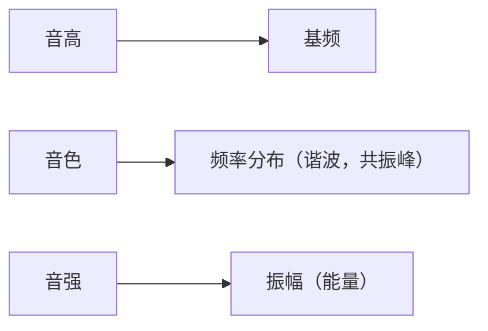

+++
date = '2024-11-25T14:03:03+08:00'
draft = true
title = '语音与信号处理学习笔记'
tags = 'notes'
show_toc = false
twikoo = true
keywords = ['语音信号', 'voice and signal', '选修课']
description = "语音与信号处理学习笔记"

+++

> 选修专业课|授课老师：吴志勇

1. 声音的产生

2. 语谱：不包含随时间T 变化的信息；

   - 用来区分不同的音素；
   - 不同音素具有不同的频谱特征；

3. 语谱图：由多个时间 T 的语谱组成的。

   - 描述信号包含的频率成分和他们的幅度；
   - 宽带语谱图：频率分辨率取300-400Hz，时间分辨率2-5ms，良好的时间分辨率，频率分辨率较差；
   - 窄带语谱图：频率分辨率取50-100Hz，时间分辨率5-10ms，良好的频率分辨率，时间分辨率较差；

4. 音频数字化：把模拟音频信号转换成有限个数表示的离散序列，也就是实现音频数字化。涉及抽样、量化、编码

   - **抽样**：当把模拟声音变成数字声音时，每隔一个时间间隔在模拟声音波形上取一个幅度值，这称之为抽样。该时间间隔称为**抽样周期**（倒数为**采样频率**）
   - **量化**：在数字音频中，用数字来表示音频幅度时，只能把无穷多个电压幅度用有限个数字表示。也就是把某一幅度范围内的电压用一个数字表示，称之为**量化**。良好时所采用的数字上限为**量化精度**。
   - **编码**：对原始的音频数据进行压缩，便于存储和传输。

5. 奈奎斯特抽样定理

   要从抽样信号中无失真地回复（重建、还原）原信号，**采样频率必须大于等于两倍信号谱的最高频率**（**截止频率**）；

   - 如果采样频率没有大于2倍信号最高频率，可能会发生混叠

6. 
