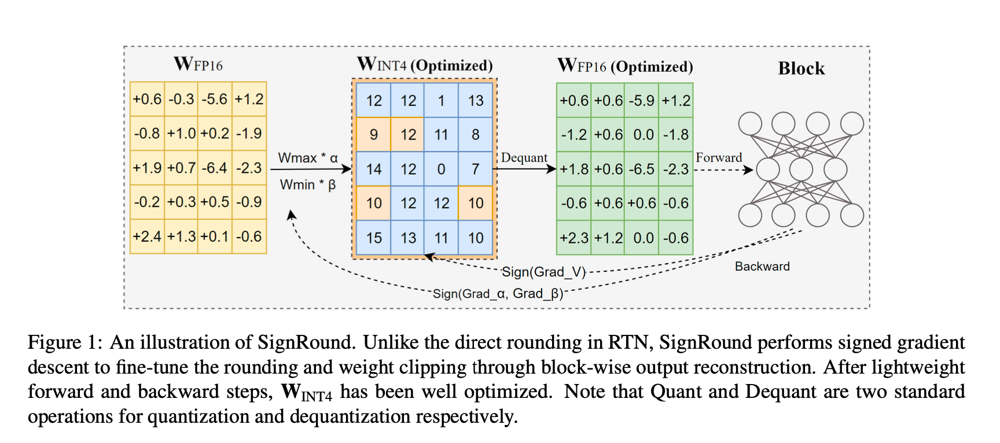
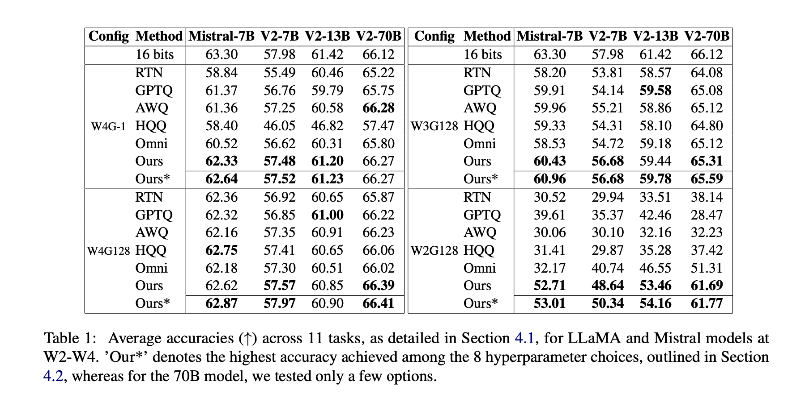

# 2024 年 10 月论文精读

## 【Intel】Optimize Weight Rounding via Signed Gradient Descent for the Quantization of LLMs

> https://arxiv.org/abs/2309.05516
>
> 提供代码实现：https://github.com/intel/auto-round

> 其他比较优秀的方法：GPTQ: https://arxiv.org/abs/2210.17323 ICLR2023

### 摘要

摘要部分「也要学习一下写作方法」

Large Language Models (LLMs) have demonstrated exceptional proficiency in language related tasks, but their deployment poses significant challenges due to substantial memory and storage requirements. **提出问题**：大模型虽然很强，但需要大量的存储需求。

**Weight-only quantization** has emerged as a promising solution, significantly reducing memory and storage needs without sacrificing too much performance. **指明一般解决方法**：权重量化

In this study, we introduce **SignRound**, a method that leverages signed gradient descent (SignSGD) to optimize rounding values and weight clipping in just 200 steps. SignRound integrates the advantages of **Quantization-Aware Training (QAT)** and **Post-Training Quantization (PTQ),** delivering exceptional results across 2 to 4 bits while minimizing tuning costs and avoiding additional inference overhead.  指出本研究的内容：采用有符号的梯度下降的方式优化舍入值和权重裁剪，集成了QAT 和 PTQ 的优势。

For example, SignRound achieved absolute average accuracy improvements ranging from 6.91% to 33.22% at 2 bits, as measured by the average zero-shot accuracy across 11 tasks. It also demonstrates strong generalization in recent models, achieving near-lossless 4-bit quantization in most scenarios. 点出本研究的效果：在2bits 量化的条件下，性能从6.91% 到33.22%，并且在4bit 量化下，几乎达到了无损性能。

### 介绍

1. **LLM部署挑战**：
   - 近年来，大型语言模型（LLM）的采用显著增加，即使在资源受限的设备上也有广泛部署需求。
   - 由于LLM对内存和存储的高要求以及计算需求，在这些设备上部署LLM面临重大挑战。
   
2. **量化技术**：
   - **量化感知训练（QAT）**：在训练过程中模拟低精度表示，使模型适应量化效果，通常精度较高但复杂且资源消耗大。「训练时间长」
   - **训练后量化（PTQ）**：直接量化模型，无需额外训练，简单但可能导致精度显著下降。「快，但精度太低」
   
3. **量化类型**：
   - 量化可应用于激活值和权重。
   - 对LLM的激活值进行量化较为困难，因此**权重量化**更为实用。
   - 内存带宽限制使得权重量化更具优势。
   
4. **权重量化**：
   - 研究重点是权重量化。关键步骤是舍入，通常通过最近舍入（RTN）实现。
   
     缺点：RTN独立量化每个权重，忽略权重间及权重与激活值间的关系。
   
   - 自适应舍入（Adaptive Rounding）探索改进舍入策略以提高精度，但可能因权重显著变化而效果不佳。
   
5. **本研究的优化方法**：
   
   - 选择SignSGD作为优化方法，在有限步骤内逼近最优舍入解。
   - SignSGD因其解空间边界明确和方法简单而选定，仅需少量超参数调整。
   
6. **贡献**：
   
   - 提出一种结合QAT和PTQ优势的权重量化优化方法，将SignSGD 应用在量化任务。
   - 实验结果显示，在2-bit到4-bit的不同量化配置下，性能显著优于近期工作。
   - 该方法发现如果条件的模型的模型超参数可以进一步增强SignSGD 的性能，在不同模型间具有强泛化能力，使用4-bit量化在大多数场景下几乎无损。

#### Rounding Methods.

1. Adaptive Rounding: 他们通过泰勒级数展开来近似任务损失，将舍入任务用作二次无约束二元优化问题。
2. FlexRound: 通过结合元素划分，引入了一种更灵活的四舍五入方法。
3. Oscillation-free: 表明引入可学习参数可能会导致权重振荡问题。
4. AQuant: 引入了一种动态方法，其中边界成为依赖于激活值的函数，以减少激活的量化误差。
5. Signed Gradient Descent: 带符号梯度下降并不常用，通常应用于特定场景，例如降低通信成本。这是因为与原始梯度相比，带符号梯度携带的信息要少得多。最近的研究揭示了在某些条件下基于符号的方法相对于梯度下降的优势。巴勒斯等人。 （Balles et al., 2020）发现，当 Hessian 矩阵集中在其对角线上且最大特征值远大于平均特征值时，基于符号的方法更可取。李等人。 (Li et al., 2023a) 研究了一种基于符号的梯度下降的变体，它表现出更快的收敛速度。萨法里安等人。 （Safaryan 和 Richtárik，2021）提出了一种带有动量的随机符号下降，它在标准有界方差假设下以最优渐近率收敛。这些发现有助于更好地理解有符号梯度下降方法的潜在好处和应用。

### 实验部分

论文包含了大量且详细的实验，这是应该学习的，用丰富的实验来论证其有效性，而不是夸大其词。

详细的实验就不过多介绍了，可以详细去看原论文。

### 总结

在本文中，我们介绍了SignRound，这是一种高效而简洁的方法，用于在大型语言模型的量化中优化权重四舍五入。SignRound使用符号梯度下降，在200个步骤中调整四舍五入值和重量剪切，在大约2.5小时内完成LLAMA-V2-70B的量化。我们的广泛实验表明，在大多数场景中，SignRound在各种模型和权重位方面的表现优于其他量化方法。此外，SignRound在最近的模型中展示了有希望的生成能力，并通过特定于模型的超参数调整实现了增强的性能。

### Openreview 评分介绍「科研总是充满坎坷。」

**要向reviewer 一样去审视论文！**

更新于 2024.10.24，2024 ICLR reject

**最终评价**：This paper proposes a sign gradient descent method to optimize the weight rounding for quantizing llms, which achieves superior performance than gptq and awq for several common llms including opt, llama-1, and llama-2. One notable merit of this paper is its simplicity. **Weaknesses include limited novelty, marginal improvements, and lack of comparisons over previous works AdaRound and FlexRound.** Overall, the reasons to reject slightly overweighs the reasons to accept.

> 缺点包括**新颖性有限**、**改进有限**以及缺乏与之前作品 Ada Round 和 Flex Round 的比较。

比较有价值的评论：

- 优点

  - The paper is easy to follow. 思想容易理解

  - The paper conducts a large number of experiments across various models, tasks and quantization setting. Further, it also consider state-of-the-art LLMs like Llama2 in addition to older ones like OPT and BLOOM.
    - 论文在各种模型、任务和量化设置上进行了大量的实验。此外，除了 OPT 和 BLOOM 等较旧的之外，它还考虑了 Llama2 等最先进的 LL Ms。

  - SignRound appears to bring some performance improvements relative to GPTQ, in particular on smaller models and for zero-shot tasks.
    - 相对于 GPTQ，Sign Round 似乎带来了一些性能改进，特别是在较小的模型和零样本任务上。

  - I also like that the paper includes also handful of **unfavorable results** to provide a more complete.
    - 论文包含了一些模型不太好的结果「不夸大吹嘘」，作为完整的结果展示

- 缺陷
  - The paper essentially seems to apply signed gradient descent (which is not new) to the standard layer-/block-wise rounding problem considered by various LLM PTQ papers. Hence, the overall novelty is low.
    - 该论文本质上似乎将**有符号梯度下降（这并不新鲜）应用于各种 LLM PTQ 论文所考虑的标准层/块舍入问题**。因此，整体新颖性较低。
  - GPTQ Activation-reordering can also be performed without any impact on inference performance (see the official GPTQ repo, option `--static-groups`). Further, if there is no grouping, reordering has no impact on inference. LLaMa1-7B and OPT-66B are known to be GPTQ outliers, for which reordering should be enabled to conduct a fair comparison.
    - 这个评论员绝对是专家。
  - The paper argues that signed gradient descent is preferable over standard straight-through QAT (applied to the layer-wise quantization problem, like ZeroQuant) for this application, but does not provide any ablation studies supporting that point.
    - 启发：论文中提到的每一点，都应该有理有据！
  - Based on Table 5, it appears that for the largest and most interesting models for compression applications, SignRound seems to perform very similar to GPTQ and in some cases even worse.
  - The code is not available in the Supplementary material.
    - 代码实现是很重要的

## LIGHTRAG: SIMPLE AND FAST RETRIEVAL-AUGMENTED GENERATION

> arxiv: https://arxiv.org/abs/2410.05779
>
> github: https://github.com/HKUDS/LightRAG

