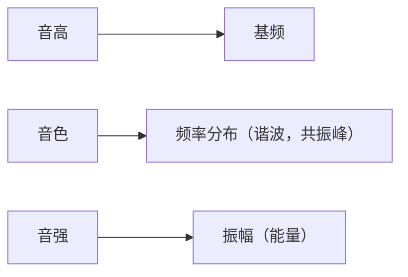

# 语音信号处理

> 选修专业课|授课老师：吴志勇

1. 声音的产生

2. 语谱：不包含随时间T 变化的信息；
   - 用来区分不同的音素；
   - 不同音素具有不同的频谱特征；
3. 语谱图：由多个时间 T 的语谱组成的。
   - 描述信号包含的频率成分和他们的幅度；
   - 宽带语谱图：频率分辨率取300-400Hz，时间分辨率2-5ms，良好的时间分辨率，频率分辨率较差；
   - 窄带语谱图：频率分辨率取50-100Hz，时间分辨率5-10ms，良好的频率分辨率，时间分辨率较差；
