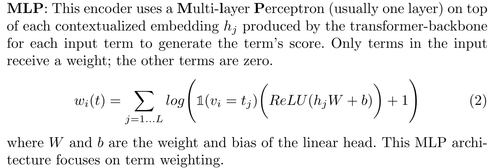

## 相关论文

A Unified Framework for Learned Sparse Retrieval: https://dl.acm.org/doi/abs/10.1007/978-3-031-28241-6_7

SPLADE https://arxiv.org/abs/2109.10086 (SPLADE-max/distilSPLADE-max)-在查询和文档中都完全用到了MLM架构

bge-m3 https://arxiv.org/abs/2402.03216

**MLP:**

DeepCT https://arxiv.org/pdf/1910.10687

uniCOIL https://arxiv.org/pdf/2106.14807

**expMLP/MLM:**

$uniCOIL_{dT5q}$: 使用docT5query来完成passage expansion

$uniCOIL_{tilde}$: 使用TILDE来完成passage expansion

EPIC: 第一个引入MLM来训练文档扩充还有术语评分的端到端的架构；

> Query/Document Expansion: 
>
> - docT5query:https://github.com/castorini/docTTTTTquery
> - TILDE:相当于将MLM改成clsMLM的Sparta
> - Document expansion by query prediction: https://arxiv.org/abs/1904.08375

DeepImpact: $uniCOIL_{dT5q}$(没有查询编码器)

TILDEv2: $uniCOIL_{tilde}$(没有查询编码器)

Sparta: 相当于EPIC移除查询编码器+移除$q(t)和g(t_i)$

## 概述

Learned Sparse Retrieval （LSR）是从稠密检索中得到的稀疏向量

- 每一维度包含类似于 TF 的术语分数；
- 每一维度的分布与词汇表术语相关；
- 具备很强的可解释性和透明性；
- LSR 方法可以重复使用数十年来为传统词汇方法构建和优化的倒排索引基础设施；
- LSR在一定程度上可以达到query expasion的作用，与此同时可以在词汇表中显现出answer；

### 稀疏向量编码

- BINARY 二进制编码

  BINARY 编码器只是将输入标记为术语（单词片段），并考虑输入文本中术语的存在。二进制编码器既不执行项扩展也不执行加权：
  $$
  w_i(t)=max_{j=1..L}\mathbb{1}(v_i=t_j)
  $$
  

  > 

- MLP

​	MLP使用到多层感知器（大多情况下都是一层线性层），只有在输入中的词/术语才有权重，其他的术语的权重为 0：
$$
w_i(t)=\sum_{j=1..L}log(\mathbb{1}(v_i=t_j)(ReLU(h_jW+b)+1)
$$

> 其中w,b为线性头的权重的bias，这个 MLP架构侧重于术语权重。

- expMLP

​	expansion MLP编码器，引入了使用相关的术语预先处理好输入扩展再使用 MLP 头进行处理，通过使用外部模型或外部的资源来获得输入查询的扩展形式。（模型：DocT5Query）

- MLM

  MLM是利用到了Bert模型的MaskedLanguageModel来获得概率分布

- clsMLS

