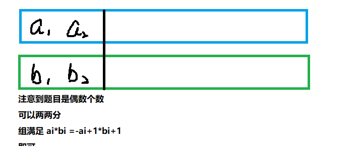

#### 3729.改变数组元素 2021年6月25日

> 给定一个空数组 V 和一个整数数组 a1,a2,…,an。
>
> 现在要对数组 V 进行 n 次操作。
>
> 第 i 次操作的具体流程如下：
>
> 从数组 V 尾部插入整数 0。
> 将位于数组 V 末尾的 ai 个元素都变为 1（已经是 1 的不予理会）。
> 注意：
>
> ai 可能为 0，即不做任何改变。
> ai 可能大于目前数组 V 所包含的元素个数，此时视为将数组内所有元素变为 1。
> 请你输出所有操作完成后的数组 V。
>
> 输入格式
> 第一行包含整数 T，表示共有 T 组测试数据。
>
> 每组数据第一行包含整数 n。
>
> 第二行包含 n 个整数 a1,a2,…,an。
>
> 输出格式
> 每组数据输出一行结果，表示所有操作完成后的数组 V，数组内元素之间用空格隔开。
>
> ##### 数据范围<!-- {docsify-ignore} -->
>
> 1≤T≤20000,
> 1≤n≤2x10^5,
> 0≤ai≤n,
> 保证一个测试点内所有 n 的和不超过  2×10^5 。
>
> ##### 输入样例：<!-- {docsify-ignore} -->
>
> ```
> 3
> 6
> 0 3 0 0 1 3
> 10
> 0 0 0 1 0 5 0 0 0 2
> 3
> 0 0 0
> ```
>
> ##### 输出样例：<!-- {docsify-ignore} -->
>
> ```
> 1 1 0 1 1 1
> 0 1 1 1 1 1 0 0 1 1
> 0 0 0
> ```

> TIP：直接模拟超时了TLE
> 采用巧妙的方法；从后往前进行判断
>
> [L,R]表示要改变数字为1的区间
>
> 如果当前位置位于要改变的区间内，则将此处的a[i]改变成1.

```cpp
#include <iostream>
#include <cstring>

using namespace std;
const int N = 200010;

int main()
{
    int T;
    scanf("%d",&T);
    while(T--)
    {
        int n;
        int a[N];
        int w[N];
        int x;
        scanf("%d",&n);
        memset(w,0,sizeof w);
        int pos = 0;
        for(int i = 0; i < n; i ++)
        {
            scanf("%d",&a[i]);
        }
        //倒着输出 O(n)
        int max_l = N;
        for(int i = n - 1; i >= 0; i --)
        {
            max_l = min(max_l, i - a[i] + 1); //更新边界
            if(max_l <= i) a[i] = 1; //如果在边界内则此处a[i]改为1
        }
        for(int i = 0; i < n; i ++) printf("%d ",a[i]);
        printf("\n");
        
        
        /*!TLE超时
        for(int i = 0; i < n; i ++)
        {
            scanf("%d",&x);
            if (x == 0)
            {
                a[i] = 0;
                continue;
            }
            if (x != 0)
            {
                for(int j = i; j > i - x; j --)
                {
                    if(j < 0) break;
                    a[j] = 1;
                }
            }
        }
        for(int i = 0; i < n; i ++) printf("%d ",a[i]);
        printf("\n");
        */
    }
    return 0;
}
```

#### 3731.序列凑零 2021年6月30日

> 给定一个长度为 n 的整数序列 a1,a2,…,an。
>
> 所有 ai 都是非零整数并且绝对值不超过 100。
>
> 另外，n 是偶数。
>
> 现在，请你构造另一个整数序列 b1,b2,…,bn，使得 a1×b1+a2×b2+…+an×bn=0 成立。
>
> 要求，所有 bi 都是非零整数并且绝对值不超过 100。
>
> 输入格式
> 第一行包含整数 T，表示共有 T 组测试数据。
>
> 每组数据第一行包含整数 n。
>
> 第二行包含 n 个整数 a1,a2,…,an。
>
> 输出格式
> 每组数据输出一行 b1,b2,…,bn。
>
> 可以证明答案一定存在。
>
> 如果答案不唯一，输出任意合理方案均可。
>
> ##### 数据范围<!-- {docsify-ignore} -->
>
> 1≤T≤1000,
> 2≤n≤100,
> |ai|≤100,ai≠0,
> |bi|≤100,bi≠0
>
> ##### 输入样例：<!-- {docsify-ignore} -->
>
> ```
> 2
> 2
> 1 100
> 4
> 1 2 3 6
> ```
>
> ##### 输出样例：<!-- {docsify-ignore} -->
>
> ```
> -100 1
> 1 1 1 -1
> ```

> 首先读题一定要细心，
>
> 要确保找准题干中的关键字，要耐得住寂寞，坐得下板凳。
>
> 

```cpp
#include <iostream>

using namespace std;

const int N = 110;
int a[N];
int b[N];

int main()
{
    int T;
    scanf("%d",&T);
    int n;
    while(T--)
    {
        scanf("%d",&n);
        for(int i = 0; i < n; i ++) scanf("%d",&a[i]);
        for(int i = 0; i < n; i = i + 2)
        {
            b[i+1] = -a[i];
            b[i] = a[i + 1];
        }
        for(int i = 0; i < n ; i ++)
        {
            printf("%d ",b[i]);
        }
        printf("\n");
    }
    return 0;
}
```

#### 3732.矩阵复原 2021年6月30日

> 一个 n×m 的整数矩阵，已知其每一行从左到右拥有哪些元素，每一列从上到下拥有哪些元素。
>
> 但是，行和列的具体顺序并不确定。
>
> 请你根据已知的信息，将矩阵复原并输出。
>
> 输入格式
> 第一行包含整数 T，表示共有 T 组测试数据。
>
> 每组数据第一行包含两个整数 n,m。
>
> 接下来 n 行，每行包含 m 个整数，表示其中一行从左到右的所有元素。
>
> 接下来 m 行，每行包含 n 个整数，表示其中一列从上到下的所有元素。
>
> 输出格式
> 每组数据输出一个 n 行 m 列的矩阵。
>
> 可以证明一定存在唯一解。
>
> 数据范围
> 1≤T≤105,
> 1≤n,m≤500,
> 一个测试点的所有测试数据的 n×m 之和不超过 250000。
> 矩阵中包含 1∼n×m 中的每个数恰好一次。
> 矩阵的每一行和每一列的信息都保证恰好给出一次。
>
> #### 输入样例：<!-- {docsify-ignore} -->
>
> ```
> 2
> 2 3
> 6 5 4
> 1 2 3
> 1 6
> 2 5
> 3 4
> 3 1
> 2
> 3
> 1
> 3 1 2
> ```
>
> #### 输出样例：<!-- {docsify-ignore} -->
>
> ```
> 1 2 3 
> 6 5 4 
> 3 
> 1 
> 2 
> ```

> 因为输入数据的位置并不知晓。
>
> 可以巧妙记录，可以在记录数据的时候
>
> 按行输入的时候，可以额外记录每个数据的y坐标的位置
>
> 按列输入的时候，可以额外记录每个数据的x坐标的位置
>
> `typedef pair<int,int> PII`的巧妙使用

```cpp
#include <bits/stdc++.h>
using namespace std;

typedef pair<int,int> PII;
const int N = 250010;
const int M = 510;
PII a[N];
int w[M][M];

int main()
{
    int T;
    scanf("%d",&T);
    int n,m;
    while(T--)
    {
        scanf("%d%d",&n,&m);
        int cur;
        for(int i = 1; i <= n; i ++)
        {
            for(int j = 1; j <= m; j++)
            {
                scanf("%d",&cur);
                a[cur].second = j;
            }
        }
        for(int i = 1; i <= m; i ++)
        {
            for(int j = 1; j <= n; j ++)
            {
                scanf("%d",&cur);
                a[cur].first = j;                
            }
        }
        for(int i = 1; i <= n * m; i ++)
        {
            w[a[i].first][a[i].second] = i;
        }
        for(int i = 1; i <= n; i ++)
        {
            for(int j = 1; j <= m ; j ++)
            {
                printf("%d ",w[i][j]);
            }
            printf("\n");
        }
    }
    return 0;
}
```

#### 3761.唯一最小数 2021年7月9日

> 给定一个长度为 n 的整数数组 a1,a2,…,an。
>
> 请你找到数组中只出现过一次的数当中最小的那个数。
>
> 输出找到的数的索引编号。
>
> a1 的索引编号为 1，a2 的索引编号为 2，…，an 的索引编号为 n。
>
> 输入格式
> 第一行包含整数 T，表示共有 T 组测试数据。
>
> 每组数据第一行包含整数 n。
>
> 第二行包含 n 个整数 a1,a2,…,an。
>
> 输出格式
> 每组数据输出一行结果，即满足条件的数的索引编号，如果不存在满足条件的数，则输出 −1。
>
> 数据范围
> 1≤T≤2×104,
> 1≤n≤2×105,
> 1≤ai≤n,
> 同一测试点内的所有 n 的和不超过 2×105。
>
> #### 输入样例：<!-- {docsify-ignore} -->
>
> ```
> 6
> 2
> 1 1
> 3
> 2 1 3
> 4
> 2 2 2 3
> 1
> 1
> 5
> 2 3 2 4 2
> 6
> 1 1 5 5 4 4
> ```
>
> #### 输出样例：<!-- {docsify-ignore} -->
>
> ```
> -1
> 2
> 4
> 1
> 2
> -1
> ```

> 思路：
>
> 统计一个数出现的次数的话——>联想到哈希表
>
> 1.统计出现次数为1的数
> 2.找出统计的数字中的最小的数

```cpp
#include <iostream>
#include <cstring>

using namespace std;
const int N = 200010;

int cnt[N],d[N];

int main()
{
    int T;
    scanf("%d",&T);
    while(T--)
    {
        int n;
        int res = -1;
        memset(cnt,0,(n+1)*4); //memset以内存为单位，这里更新一下前n+1个数，*4是因为int占4个字节
        scanf("%d",&n);
        for(int i = 1; i <= n; i ++)
        {
            scanf("%d",&d[i]);
            cnt[d[i]]++;
        }
        for(int i = 1; i <= n; i ++)
        {
            if(cnt[d[i]] == 1)
            {
                if(res == -1 || d[res] > d[i])
                {
                    res = i;
                }
            }
        }
        printf("%d\n",res);
    }
    return 0;
}
```

#### 3762.二进制矩阵[思维题&构造] 2021年7月10日

> 给定一个 n×m 大小的二进制矩阵，矩阵中只包含 0 和 1。
> 现在，你可以进行如下操作：选中一个 2×2 的子矩阵，改变其中 3 个元素的值（0 变为 1，1 变为 0）。
> 你的任务是通过上述操作，将矩阵中的全部元素都变为 0。
> 你的总操作次数不得超过 3nm 次。
> 可以证明，答案一定存在。
>
> 输入格式
> 第一行包含整数 T，表示共有 T 组测试数据。
> 每组数据第一行包含整数 n,m。
> 接下来 n 行，每行包含一个长度为 m 的 01 字符串，表示给定的二进制矩阵。
>
> 输出格式
> 每组数据第一行输出整数 k，表示操作次数，注意 k 的权值范围 [0,3nm]。
> 接下来 k 行，每行包含 6 个整数 x1,y1,x2,y2,x3,y3，描述一次操作中选中的元素的坐标为 (x1,y1)，(x2,y2)，(x3,y3)。
> 元素位置不能相同，且必须出自同一 2×2 子矩阵中。
> 行列均从 1 开始计数，(1,1) 表示输入矩阵中位于左上角的元素，(n,m) 表示输入矩阵中位于右下角的元素。
> 输出任意合理方案均可。
>
> 数据范围
> 1≤t≤5000,
> 2≤n,m≤100,
> 保证将同一测试点内的每组数据的 nm 相加一定不超过  20000 。
>
> #### 输入样例：<!-- {docsify-ignore} -->
>
> ```
> 5
> 2 2
> 10
> 11
> 3 3
> 011
> 101
> 110
> 4 4
> 1111
> 0110
> 0110
> 1111
> 5 5
> 01011
> 11001
> 00010
> 11011
> 10000
> 2 3
> 011
> 101
> ```
>
> #### 输出样例：<!-- {docsify-ignore} -->
>
> ```
> 1
> 1 1 2 1 2 2
> 2 
> 2 1 3 1 3 2
> 1 2 1 3 2 3
> 4
> 1 1 1 2 2 2 
> 1 3 1 4 2 3
> 3 2 4 1 4 2
> 3 3 4 3 4 4
> 4
> 1 2 2 1 2 2 
> 1 4 1 5 2 5 
> 4 1 4 2 5 1
> 4 4 4 5 3 4
> 2
> 1 3 2 2 2 3
> 1 2 2 1 2 2
> ```

> 思路与想法：
>
> 构造类型的题目只需要找出一种符合条件的情况输出即可。
> 以数组中每个1为一个对象进行处理，每将一个1变成0所需要的操作是3次，也就是一共的操作次数的1的个数*3
>
> 

```cpp
#include <iostream>

using namespace std;
const int N = 110;
char g[N][N]; //用字符存

//构造题只需要找出能够满足条件的其中一种情况就好了，要锻炼思维
void printL(int x, int y, int pos)
{
    if(pos == 0) printf("%d %d %d %d %d %d\n", x, y, x + 1, y, x, y + 1);
    else if(pos == 1) printf("%d %d %d %d %d %d\n", x, y - 1, x, y, x + 1, y);
    else if(pos == 2) printf("%d %d %d %d %d %d\n", x - 1, y, x, y, x, y - 1);
    else printf("%d %d %d %d %d %d\n", x - 1, y, x, y, x, y + 1);
}
//pos 表示拐角方向
int main()
{
    int T;
    scanf("%d",&T);
    while(T--)
    {
        int n,m;
        int res = 0;
        scanf("%d%d",&n,&m);
        for(int i = 1; i <= n; i ++)
        {
            cin >> g[i] + 1; //字符数组可以这样表示
            for(int j = 1; j <= m; j ++)
            {
                if(g[i][j] == '1') res += 3;
            }
        }
        printf("%d\n",res);
        for(int i = 1; i <= n; i ++)
        {
            for(int j = 1; j <= m; j ++)
            {
                if(g[i][j] == '1')
                {
                    if(i < n && j < m)
                    {
                        printL(i,j,0);
                        printL(i,j+1,1);
                        printL(i+1,j,3);
                        continue;
                    }
                    if(i == n && j == m)
                    {
                        printL(i,j,2);
                        printL(i-1,j,1);
                        printL(i,j-1,3);
                        continue;
                    }
                    if(i == n)
                    {
                        printL(i,j,3);
                        printL(i-1,j,0);
                        printL(i,j+1,2);
                        continue;
                    }
                    if(j == m)
                    {
                        printL(i,j,1);
                        printL(i,j-1,0);
                        printL(i+1,j,2);
                        continue;
                    }
                }
            }
        }
    }
    return 0;
}
```

#### 3763.数字矩阵 [思维题] 2021年7月14日

> https://www.acwing.com/problem/content/3766/

> 思路与题解：
>
> 对矩阵的相邻元素的操作 
>
> |               |      |              |      |
> | ------------- | ---- | ------------ | ---- |
> | x <--乘一次 √ | xx   | xx           |      |
> |               |      | xx           |      |
> |               |      | x<--乘一次 √ |      |
>
> 发现对任意相邻元素进行x(-1)操作后，实际上可以对矩阵中任意两个元素都进行一次x(-1)操作。
>
> 故此，可以这样做，
>
> a[N]存放负数的值
> b[N]存放正数的值
>
> 如果a中的长度是偶数，那么将a中的负数全部转化为正数+=ans，再将b中的元素累加+=ans;
> 如果a中的长度是奇数，先进行排序，找a,b中最小的元素，将最小的元素置为负数，在进行累加即可。
>
> 当然还有许多可以优化的地方，例如寻找a,b最小的元素可以无需排序，可以在存入的时候加个判断即可。

```cpp
#include <bits/stdc++.h>
using namespace std;
const int N = 210;
int a[N];
int b[N];
int main()
{
    int T;
    scanf("%d", &T);
    int n,m;
    while(T --)
    {
        memset(a, 0, sizeof(a));
        memset(b, 0, sizeof(b));
        scanf("%d%d", &n,&m);
        int x;
        int len_a = 0;
        int len_b = 0;
        int min_a = 0x3f3f3f3f;
        int min_b = 0x3f3f3f3f;
        int min_x;
        for(int i = 1; i <= n; i ++)
        {
            for(int j = 1; j <= m; j ++)
            {
                scanf("%d",&x);
                if(x <= 0)
                {
                    a[++len_a] = -x;
                    min_a = min(min_a,-x);
                }
                else
                {
                    b[++len_b] = x;
                    min_b = min(min_b,x);
                }
            }
        }
        int ans = 0;
        if(len_a % 2 == 0)
        {
            for(int i = 1; i <= n*m; i ++)
            {
                if(len_a > 0)
                {
                    ans = ans + a[len_a--];
                }
                if(len_b > 0)
                {
                    ans = ans + b[len_b--];
                }
            }
        }
        else
        {
            //sort(a+1,a+1+len_a);
            //sort(b+1,b+1+len_b);
            min_x = min(min_a,min_b);
            for(int i = 1; i <= n*m; i ++)
            {
                if(len_a > 0)
                {
                    ans = ans + a[len_a--];
                }
                if(len_b > 0)
                {
                    ans = ans + b[len_b--];
                }
            }
            ans = ans - 2 * min_x;
        }
        printf("%d\n",ans);
    }
    return 0;
}
```

#### 3764.三元数异或

> https://www.acwing.com/problem/content/3767/

> 思路&解题思路：
>
> 异或运算———> 不进位的加法


#### 3767.最小的值

> https://www.acwing.com/problem/content/3770/

> 思路&解题  贪心模拟归纳题
>
> 将题目要求进行一定转化，善于利用题目$x_i\in[0,1]$的性质
>
> $\sum_{i=1}^na_i*p_i - \sum_{i=1}^nb_i*p_i > 0$
>
> > 若：$a_i$ = $b_i$  $p_i = 1$ ①
> > 若：$a_i > b_i \ \  p_i = 1$ ②
> > 若：$a_i<b_i \ p_i = -1$ ③
> >
> > 考虑对$\sum_{i=1}^na_i*p_i - \sum_{i=1}^nb_i*p_i > 0$ ④ 的贡献值
> > ①对④的贡献值是0
> > ②对④的贡献值是sum1
> > ③对④的贡献值是sum2
> >
> > 假设满足条件的$p_i=t$ 则，$sum1*t > sum2+1$时也就是$t = \lceil sum2+1/sum1\rceil$
> >
> > 统计$a$大于$b$的次数sum1，b大于等于a的次数sum2
> > 如果sum1 == 0  则输出 -1
> > 如果sum1 > sum2 则输出 1
> > 如果sum1 < = sum2 则输出 $\lceil(sum1+sum2)/sum1\rceil$ 
> >
> > > 关于取整
> > >
> > > $\lceil\frac{a}{b}\rceil  = \lfloor\frac{a+b-1}{b}\rfloor$

```cpp
#include <bits/stdc++.h>
using namespace std;
const int N = 110;
int a[N],b[N];
//贪心+分析模拟
int main()
{
    int n;
    cin >> n;
    int sum1 = 0;
    int sum2 = 0;
    for(int i = 1 ; i <= n; i ++) cin >> a[i];
    for(int i = 1 ; i <= n; i ++) cin >> b[i];
    for(int i = 1 ; i <= n; i ++)
    {
        if(a[i] > b[i]) sum1 ++;
        if(a[i] < b[i]) sum2 ++;
    }
    if(sum1 == 0) cout << -1 <<endl;
    else if (sum1 > sum2) cout << 1 << endl;
    else cout<<ceil((sum1 + sum2)/sum1) <<endl;
    return 0;
}
```

#### 3771.选取石子

> https://www.acwing.com/problem/content/description/3774/

> 思路题解：**善用STL库与哈希表**
>
> 需要满足的条件是 $x-y = a_x -a_y$ 也就是说 $a_x-x=a_y-y$ 再转化也就是$t=a[i] - i$ 
>
> 可以发现，每一类数都可以归类为一类t，这是一种映射关系，故此可以采用一种数据结构进行存储 —— 【哈希表】
>
> 观察题目数据 $t = a_i - i$的组合数值范围只在$[1-2*10^5,4*10^5-1] = [-199999,399999]$，故此我们可以在读取所有石子后，遍历所有可能的t值。

```cpp
#include <bits/stdc++.h>
using namespace std;
typedef long long LL;

int main()
{
    int n;
    cin >> n;
    vector<LL> a(n+1);
    map<int, LL> mp;
    LL ans = 0;
    for(int i = 1; i <= n; i ++)
    {
        cin >> a[i];
        mp[a[i] - i] += a[i];
    }
    for(int i = -200010; i <= 400010; i ++)
    {
        ans = max(ans,mp[i]);
    }
    cout << ans <<endl;
}
```


---

### 2022年2月8日

#### AcWing 1726. 挤奶顺序

> https://www.acwing.com/problem/content/description/1728/

> 思路：
>
> **分类讨论**的思想方式：
> 1、“1”被直接限定了位置，那么就直接输出1所限定的位置
> 2、“1”被间接限定了位置（也就是说1在那m个数之中），那么就从没有摆的地方从头开始摆放那m个数，直到摆到1所在的位置，那么就直接输出1 所被摆放的位置。
> //值得注意的是，有可能既有在情况1和情况2 的情况，可以再选定一个标志数组表示元素是否已被访问，因为情况2限定了先后次序，故此如果一个m中的元素已被访问，那么一定要先访问到这个元素才能继续往后面进行访问。
> 3、“1”没有被限定位置，根据贪心的原则，要求“1”的位置足够靠前，那么我们可以从后往前将m个元素摆放完毕后，再从头开始，看哪些位置没有被访问，那个位置就是答案。

```cpp
#include<bits/stdc++.h>
using namespace std;
const int N = 10010;
int n,m,k;
int pos[N];
int t[N];
int x[N];
int flag = 0;
int ans;
int main()
{
    scanf("%d%d%d",&n,&m,&k);
    for(int i = 1; i <= m; i ++)
    {
        scanf("%d",&t[i]);
        if (t[i] == 1)
        {
            flag = 1;
            ans = i;
        }
    }
    for(int i = 0; i < k; i ++)
    {
        int a,b;
        scanf("%d%d",&a,&b);
        x[a] = 1;
        pos[b] = a;
        if(a == 1)
        {
            flag = 2;
            ans = b;
        }
    }
    
    if(flag == 2)
    {
        printf("%d\n", ans);
        return 0;
    }
    if(flag == 1)
    {
        //int cur = 1;
        int cur = 1;
        for(int i = 1; i <= n; i ++)
        {
            if(!pos[i])
            {
                if(!x[t[cur]])
                {
                    x[t[cur]] = 1;
                    pos[i] = t[cur];
                    cur ++;
                    if(pos[i] == 1)
                    {
                        ans = i;
                        break;
                    }
                }
            }
            if(pos[i])
            {
                if(pos[i] == t[cur])
                {
                    cur ++;
                }
            }
        }
        printf("%d\n", ans);
        return 0;
    }
    
    int num = m;
    for(int i = n; i > 0; i --)
    {
        if(!x[t[num]] || pos[i] == t[num])
        {
            if(!pos[i])
            {
                pos[i] = t[num];
                //num --;
            }
            num --;
        }
        if(num == 0) break;
    }
    for(int i = 1; i <= n; i ++)
    {
        if(!pos[i])
        {
            ans = i;
            break;
        }
    }
    printf("%d\n", ans);
    return 0;
}
```


### 2022年2月24日

#### [蓝桥杯省赛]走方格

蓝桥杯省赛 https://www.acwing.com/problem/content/2069/

> 1.暴力搜索DFS ---> TLE
> 2.记忆化搜索 ---> 记得处理边界情况
> 3.闫氏DP分析法 ---> 记得处理边界/初始情况

```cpp
#include <bits/stdc++.h>

using namespace std;
const int N = 30;
int g[N][N];
int n,m;
int ans;
//搜索 TLE
// void dfs(int x, int y)
// {
//     if(x == n && y == m){
//         ans ++;
//         return;
//     }
//     if(x > n || y > m) return;
//     if(!g[x + 1][y]) dfs(x+1,y);
//     if(!g[x][y + 1]) dfs(x,y+1);
//     return;
// }
// int main()
// {
//     scanf("%d%d",&n,&m);
//     for(int i = 1; i <= n; i ++)
//     {
//         for(int j = 1; j <= m; j ++)
//         {
//             if(i % 2 == 0 && j % 2 == 0){
//                 g[i][j] = 1;
//             }
//         }
//     }
//     dfs(1,1);
//     printf("%d",ans);
//     return 0;
// }

//记忆化搜索
/*
int f[N][N];
int dfs(int x, int y)
{
    if(x > n || y > m) return 0;
    if(f[x][y]) return f[x][y];
    if(!g[x+1][y]) f[x][y] += dfs(x+1,y);
    if(!g[x][y+1]) f[x][y] += dfs(x,y+1);
    return f[x][y];
}

int main()
{
    scanf("%d%d",&n,&m);
    for(int i = 1; i <= n; i ++)
    {
        for(int j = 1; j <= m; j ++)
        {
            if(i % 2 == 0 && j % 2 == 0){
                g[i][j] = 1;
            }
        }
    }
    f[n][m] = n & 1 || m & 1; //记忆化搜索需要注意边界条件！
    //cout << (n & 1 || m & 1) << endl;
    cout << dfs(1,1);
    return 0;
}
*/
//闫氏DP分析法
/*
1.集合：所有从(1,1) -> (n,m)的路径总和
2.属性：数量 （求一共多少条路  并且f[i][j]表示到达这里的方案数
3.状态计算：f[i][j]最后一步向右， (1,1) -> (i,j-1)
                    最后一步向下：(1,1) -> (i-1,j)
4.特判:i j均为偶数时都不能走
5.边界条件f[1][1] = 1;
*/
int dp[N][N];
int main()
{
    scanf("%d%d",&n,&m);
    dp[1][1] = 1;
    for(int i = 1; i <= n; i ++)
    {
        for(int j = 1; j <= m; j ++)
        {
            if(i == 1 && j == 1) continue; // 记得跳过边界
            if(i & 1 || j & 1){  //表示i j都不是偶数
                dp[i][j] = dp[i-1][j] + dp[i][j-1];
            }
        }
    }
    printf("%d",dp[n][m]);
    return 0;
}
```


### 2022年3月12日

#### [acw周赛] 4312. 出现次数

> 链接：https://www.acwing.com/problem/content/4315/

- 动态规划 + 搜索的方法

```cpp
#include <bits/stdc++.h>

using namespace std;
const int N = 2010;
char s[N],t[N];
int n,m,q;
int dp[N][N];

int dfs(int i, int j)
{
    if(j - i + 1 < m){
        return dp[i][j] = 0;
    }
    if(dp[i][j] != -1)
    {
        return dp[i][j];
    }
    int flag = 1;
    for(int k = m - 1, x = j; k >= 0 && x >= 0; k --, x --){
        if(s[x] != t[k]){
            flag = 0;
            break;
        }
    }
    dp[i][j] = dfs(i, j - 1) + flag;
    return dp[i][j];
}
int main()
{
    scanf("%d%d%d",&n,&m,&q);
    scanf("%s",s);
    scanf("%s",t);
    for(int i = 0; i < n; i ++)
    {
        for(int j = 0; j < n; j ++)
        {
            dp[i][j] = -1; 
        }
    }
    for(int i = 0; i < q; i ++)
    {
        int l, r;
        scanf("%d%d",&l,&r);
        printf("%d\n", dfs(l - 1, r - 1));
    }
    
    return 0;
}
```

- KMP字符串匹配+前缀和

> 前缀和不光可以显示某个区间的总和，也能显示出某个区间内出现的次数
>
> 预处理前缀和数组，如果会超时的话，那就采用KMP算法去做，可以降低时间复杂度

```cpp
#include <bits/stdc++.h>

using namespace std;
const int N = 2010;
char s[N],t[N];
int n,m,q;
int ne[N];
int a[N];

int main()
{
    cin >> n >> m >> q;
    cin >> s + 1;
    cin >> t + 1;
    
    //生成next数组
    for(int i = 2; i <= m; i ++){
        ne[i] = ne[i-1];
        while(ne[i] && t[i] != t[ne[i] + 1]) ne[i] = ne[ne[i]];
        ne[i] += t[i]==t[ne[i]+1];
    }
    
    //KMP匹配
    for(int i = 1, j = 0; i <= n; i ++){
        while(j && s[i] != t[j + 1]) j = ne[j];
        if(s[i] == t[j + 1]) j ++;
        if(j == m){
            a[i - j + 1] = 1;
            j = ne[j];
        }
    }
    for(int i = 1; i <= n; i ++) a[i] += a[i - 1];
    while(q --){
        int l, r;
        cin >> l >> r;
        if(r - m + 1 <= l - 1) cout << 0 << endl;
        else cout << a[r - m + 1] - a[l - 1] << endl;
    }
    return 0;
}
```

- 单纯前缀和

```cpp
#include <bits/stdc++.h>

using namespace std;
const int N = 2010;
//char s[N],t[N];
string s,t;
int n,m,q;
int a[N];
int main()
{
    cin >> n >> m >> q;
    cin >> s;
    cin >> t;
    s = ' ' + s;
    for(int i = m; i <= n; i ++){   //前缀和预处理
        a[i] = a[i-1];
        if(s.substr(i - m + 1, m) == t){
            a[i] ++;
        }
    }
    while(q--){  //匹配询问
        int l,r;
        cin >> l >> r;
        l += m - 1; //注意下标从1开始与从0开始的区别
        if(l > r) cout << 0 << endl;
        else{
            cout << a[r] - a[l - 1] << endl;
        }
    }
    return 0;
}
```

周赛>4313. 满二叉树等长路径

> 链接：https://www.acwing.com/problem/content/4316/

- 巧解：

  > 画着画着图就发现了捷径
  >
  > 先构建出每个点到根节点的权重树，然后自底向上开始进行，比较父节点的两个子节点的大小，所要增加的路径长度就等于两个子节点的权重差的绝对值。

```cpp
#include <bits/stdc++.h>

using namespace std;
const int N = 2500;
int n;
int a[N],d[N];
int main()
{
    scanf("%d", &n);
    for(int i = 2; i < pow(2, n + 1); i ++){
        scanf("%d", &a[i]);
        d[i] = a[i] + d[i/2]; //由边构建权重点树
    }
    int ans = 0;
    
    for(int i = pow(2, n + 1)-1; i > 1;)
    {
        d[(i - 1)/2] = max(d[i], d[i-1]);
        ans += max(d[i], d[i-1]) - min(d[i], d[i-1]);
        i -= 2;
    }
    cout << ans;
    return 0;
}
```

> 关于树类型的题目：需要注意一些关于树的性质

```cpp
#include <bits/stdc++.h>

using namespace std;
const int N = 2050;
int n;
int w[N];
int ans;
x:表示左边到根节点的距离
y:表示右边到根节点的距离
d >= max{x, y}
左边需要增加 d - x
右边需要增加 d - y
一共最小 --> 2 * d - (x + y)  //要增加的话一定是在当前路径上增加，而且增加最小值x,而不是跑到下一层增加，这样不能满足最小值的规定。
int dfs(int u)
{
    if(u * 2 > ( 1 << n + 1) - 1) return 0;
    
    int l = dfs(u * 2) + w[u * 2];
    int r = dfs(u * 2 + 1) + w[u * 2 + 1];
    ans += abs(l - r);
    return max(l, r);
}

//更便于理解的一种： 贪心+递归
//函数返回根节点到当前分支中的叶子结点的路径最大值
int dfs(int u, int s)  //s：根节点到u的父节点的路径总和
{
    int l = u * 2, r = u * 2 + 1;
    if(l < 1 << (n + 1))  //判断是否为叶子结点
    {
        int lv = dfs(l, s + a[u]);
        int rv = dfs(r, s + a[u]);
        res += abs(lv - rv);  //如果左右子节点的最大值不一致，添加路径长度使其相等，最大值不相等，说明需要将其进行增加，其增加的值就是左右两边的绝对值
        return max(lv, rv) + a[u]; //返回左右量变最大的加上当前路径
    }
    return a[u];
}
--------------------------------------------------------------------------------------------
int main()
{
    cin >> n;
    for(int i = 2; i <= (1 << n + 1) - 1; i ++) cin >> w[i];
    
    dfs(1);
    cout << ans << endl;
    return 0;
}
```

- 树形DP

> 


### 2022年3月16日

#### [蓝桥杯省赛]选取整数

> https://www.acwing.com/problem/content/description/2070/

> 题解：
>
> 方法一：进行暴力枚举，两重循环肯定超时
>
> n的个数在$10^5$ --> 思考nlogn算法
>
> 仔细分析，题目所要求的实际上就是 $A_j * 10^{(len){\lfloor log_{10}A_i\rfloor}}+A_i$ 能被K整除
>
> 也就是说			$(A_j * 10^{(len){\lfloor log_{10}A_i\rfloor}}+A_i) \% K ==0 $
>
> ​		也就是说 $A_j * 10^{(len){\lfloor log_{10}A_i\rfloor}} ≡ -A_i(MOD \ K)$
>
> 也就是说我们只需要枚举一遍
>
> $A_j*10^0$ 、$A_j*10^1$、$A_j*10^2$ ..... $A_j*10^{9}$ --> 看他们的分别模K后的余数是多少
>
> 这里我们用哈希表来存储，这样下次访问的时候只需要O(1)的时间复杂度
>
> S[11] [s]  11位，s则表示余数  S所表示的就是个数了
>
> > 穿插一下，将求负数的模转化成求正数的模
> >
> > > 我们知道对负数取模，在c++会得到负数。例如(-5)%3=-2,因此我们写成( 3+(-5)%3)%3=1，就可以得到正数。
> >
> > 代码中(m-a[i]%m)%m其实就是利用(正的)a[i]求得(-a[i])%m

```cpp
#include <bits/stdc++.h>

using namespace std;
const int N = 100010;
typedef long long ll;
ll a[N];
int n,m;
int s[11][N];
int main()
{
    scanf("%d%d",&n,&m);
    for(int i = 0; i < n; i ++) scanf("%lld", &a[i]);
    
    for(int i = 0; i < n; i ++)
    {
        ll t = a[i]%m; //计算当前的余数
        for(int j = 0; j < 11; j ++){
            s[j][t] ++;  
            t = t * 10 % m;
        }
    }
    ll res = 0;
    for(int i = 0; i < n; i ++){
        ll t = a[i] % m;
        int len = to_string(a[i]).size();
        res += s[len][(m - t)%m];
        
        //特判去重
        ll r = t;
        while(len --) r = r * 10 % m;
        if(r == (m - t)%m) res --;
    }
    printf("%lld",res);
    return 0;
}
```


### 2022年3月20日

#### 3370. 牛年

> https://www.acwing.com/problem/content/3373/

> 也要巧妙去使用字符串的处理和输入输出之间的关系

```cpp
#include <iostream>
#include <unordered_map>
#include <cmath>
using namespace std;

int n;
//age记录每头牛与Bessie的相对年龄
//ord是order的简写，记录的是从牛到鼠的生肖到0-12的映射
unordered_map<string, int> age, ord = {{"Ox", 0}, {"Tiger",  1}, {"Rabbit", 2}, {"Dragon", 3}, {"Snake", 4}, {"Horse", 5}, {"Goat", 6}, {"Monkey", 7}, {"Rooster", 8}, {"Dog", 9}, {"Pig", 10}, {"Rat", 11}};
//na是name-animal的映射，记录每头牛的生肖
unordered_map<string, string> na;

int main() {
  cin >> n;
  na["Bessie"] = "Ox";
  age["Bessie"] = 0;    //初始化Bessie生肖为Ox，年龄为0
  while (n--) {
    //ind表示increase-decrease，记录a是在b的前还是后出生，ani表示animal，是a的生肖，tmp用来读取无用字符串
    string a, ind, ani, b, tmp;
    cin >> a >> tmp >> tmp >>ind >> ani >> tmp >> tmp >> b;
    //记录a的生肖
    na[a] = ani;
    //如果a和b生肖相同的话，判断是先还是后出生，在b的年龄基础上加减12
    if (ani == na[b]) age[a] = (ind == "previous" ? age[b] - 12 : age[b] + 12);
    //不是同样的生肖的话，用后出生者的生肖序号减去先出生者的生肖序号，模12取正值即为a,b的年龄差值，再用b的年龄加减这个年龄差值即为a的年龄
    else age[a] = (ind == "previous" ? age[b] - ((ord[na[b]] - ord[ani] + 12) % 12) : age[b] + ((ord[ani] - ord[na[b]] + 12) % 12));
  }
  //输出Elsie年龄的绝对值，因为我们把Bessie的年龄记为0，所以直接打印Elsie年龄的绝对值就是这两者的年龄差值
  cout << abs(age["Elsie"]) << endl;
  return 0;
}
```


#### 3745. 牛的学术圈 I

> https://www.acwing.com/problem/content/3748/

> 方法一：二分
>
> 首先不看有l的情况，进行一次二分查找满足条件的答案，然后找到不满足条件的对其进行+1操作，最后进行排序后，再次二分查找最终的答案

```cpp
#include <iostream>
#include <cstring>
#include <algorithm>

using namespace std;

int n, l;
int L,R;
int tempL = 0x3f3f3f3f, tempR = 0;
const int N = 100010;
int a[N];
int check(int x) { //求h是否成立 
    int ans = 0;
    for (int i = 1;i <= n; i++) if (a[i] >= x) ans++;
    return ans >= x;
}

int main()
{
    scanf("%d%d", &n, &l);
    for(int i = 1; i <= n; i ++){
        scanf("%d", &a[i]);
        tempL = min(tempL, a[i]);
        tempR = max(tempR, a[i]);
    }
    sort(a + 1, a + n + 1);
    L = tempL, R = tempR;
    int mid = L + R + 1 >> 1;
    while(L < R){
        mid = L + R + 1 >> 1;
        if(!check(mid)){
            R = mid - 1;
        }
        else{
            L = mid;
        }
    }
    
    if(l == 0){
        printf("%d", L);
        return 0;
    }
    for(int i = n; i > 0; i --){
        if(l == 0) break;
        if(a[i] <= L){
            a[i] ++;
            l --;
        }
    }
    sort(a+1, a+n+1);
    L = 1, R = 100000;
    mid = L + R >> 1;
    while(L < R){
        mid = L + R + 1 >> 1;
        if(!check(mid)){
            R = mid - 1;
        }
        else{
            L = mid;
        }
    }
    printf("%d\n", L);
    return 0;
}
```

> 方法二：yxc枚举+双指针

> 首先从大到小进行排序，统计一下每个引用次数的cnt（出现次数），然后就for循环一遍0~n
>
> 用一个数组，记录一下引用出现的次数cnt[i] ++

```cpp
#include <iostream>
#include <cstring>
#include <algorithm>

using namespace std;

const int N = 100010;

int n, L;
int q[N];

int main()
{
    scanf("%d%d", &n, &L);
    for (int i = 1; i <= n; i ++ ) scanf("%d", &q[i]);
    sort(q + 1, q + n + 1, greater<int>());

    int res = 0;
    for (int i = 1, j = n; i <= n; i ++ )
    {
        while (j && q[j] < i) j -- ;
        if (q[i] >= i - 1 && i - j <= L)
            res = i;
    }

    printf("%d\n", res);
    return 0;
}
作者：yxc
链接：https://www.acwing.com/activity/content/code/content/2892226/
```


### 2022年3月21日

#### （43周赛）两个数列 —— 上下界/区间交

> https://www.acwing.com/problem/content/4318/

> 思考一下这题，其实就是要求b数组的上界与下界，然后与原来$a_i与b_i$的上下界相减即可
>
> > 对于$b_i$的上界：
> > 但其余b全为1时， $b_i <= sun - n + 1$
> > 由于前提条件已经给出：$b_i <= a_i \  \& \ b_i <= sum$
> > 由此可以得出$b_i的上界b_i=min(min(a_i,sum),sum-n+1)$
>
> > 对于$b_i$的下界：
> > 由已知条件：$b_i<=a_i$ 不难得出 $sum_b <= sum_a$
> > 不难发现，$b_i$的可能最小值必然存在1，
> > 且：$sum_b-b_i$表示除去$b_i$元素后，剩余元素的总和，同理$sum_a-a_i$
> > 显然有：$sum_b-b_i<=sum_a-a_i$ 整理后
> >
> > 可得$b_i$的下界为$a_i+sum_b-sum_a<=b_i$  ---> 则$b_i=max(a_i+sum_b-sum_a,1)$
>
> > Tip: 注意数据范围$2*10^5$ 累加的 $sum_a$可能爆int

```cpp
#include <iostream>
#include <cstring>
#include <algorithm>

using namespace std;
const int N = 200010;
typedef long long LL;
LL n,s;
LL a[N];
LL b[N];
LL suma = 0;
int main()
{
    scanf("%lld%lld", &n, &s);
    for(int i = 0; i < n; i ++){
        scanf("%lld", &a[i]);
        suma += a[i];
    }
    for(int i = 0; i < n; i ++){
        LL upperbound = min(min(a[i], s), s - n + (LL)1);
        LL lowerbound = max(a[i] + s - suma, (LL)1);
        b[i] = a[i] - (abs(upperbound - lowerbound + 1));
    }
    for(int i = 0; i < n; i ++){
        printf("%lld ", b[i]);
    }
    return 0;
}
```

#### （43周赛）合适数对 (树状数组典型题)-时常来回顾一下

> https://www.acwing.com/problem/content/4319/

> 题意大致以前缀和的说法：就是要满足前面的前缀和数组中满足$S_i-S_{j-1}<t$
>
> $S_{j-1}>S_i-t \ \ \  注：j是从0开始，但树状数组中j从1开始$
>
> 但由于这里a[i]有负数，于是这里的前缀和数组并不单调
>
> 故此，我们这里需要想办法求动态维护一个前面所有数的一个有序序列，而且还需要求排名，给定一个位置知道它的排名。
>
> 这里如果需要动态维护一个前面所有数的一个有序序列/排名 也可以借用树状数组来实现。
>
> > 大概思维过程，难点就在于树状数组中的处理部分
> > 

> 需要知识点：平衡树/Splay，树状数组+离散化可以替代

```cpp
#include <iostream>
#include <cstring>
#include <algorithm>

using namespace std;
typedef long long ll;
const int N = 400010;
ll a[N],c[N];
ll s[N];
ll xs[N],cnt; //离散化数组和当前离散化的数
ll m;
int n;
int lowbit(int x)  // 返回末尾的1
{
    return x & -x;
}

void update(int i, int k){
    while(i <= N){
        c[i] += k;
        i += lowbit(i);
    }
}
ll getsum(int i){
    ll res = 0;
    while(i > 0){
        res += c[i];
        i -= lowbit(i);
    }
    return res;
}
int get(ll x){
    int l=1,r= cnt;
    while(l < r)
    {
        int mid = l + r >> 1;
        if(xs[mid] >= x) r = mid;
        else l = mid + 1;
    }
    return r;
}
int main()
{
    scanf("%d%lld", &n, &m);
    xs[++ cnt] = 0; //si=0
    xs[++ cnt] = -m; //si-t=-m  均放入临时离散化数组xs中
    for (int i = 1; i <= n; i ++ ){ //输入每一个点
        scanf("%lld", &a[i]);
        s[i] = a[i] + s[i-1];
        xs[ ++ cnt] = s[i];
        xs[ ++ cnt] = s[i] - m;
    }
    sort(xs + 1, xs + cnt + 1); //离散化-排序
    cnt = unique(xs+1, xs+cnt+1) - xs - 1; //离散化去重
    
    ll ans = 0;
    update(get(0),1); //0这个位置上+1
    //这里树状数组的做法多多理解一下，
    //getsum(s[i] - m) 直接就能得到i之前大于si-m的数的个数
    for(int i = 1; i <= n; i ++){
        ans += i - getsum(get(s[i]-m));   //i前面一共i个数-->这里表示加上一共前面大于si-m的个数
        update(get(s[i]),1); //然后把这个点放进树状数组里面，方便之后的运算
    }
    printf("%lld\n",ans);
    return 0;
}
```


### 2022年3月30日

#### （44周赛） acwing4318.最短路径

>  https://www.acwing.com/problem/content/4321/

> 这是一道思维性强的题目 spj构造问题
>
> 如果是最短路径的话，需要满足如下几个条件
> 1.不能有环——不能走重复的格子。
> 2.整条路径中，走的格子不能相邻（三面）。

```cpp
#include <iostream>
#include <cstring>
#include <algorithm>
#include <cmath>
#include <map>

using namespace std;
string path;
int x,y;
int cur;
const int N = 1010;
int g[N][N];
int main()
{
    cin >> path;
    int flag = 1;
    g[110][110] = 1;
    for(int i = 0; i < path.size(); i ++)
    {
        if(path[i] == 'L'){
            x--;
            if(g[x-1+110][y+110] || g[x+110][y-1+110] || g[x+110][y+1+110]){
                flag = 0;
                break;
            }
        }
        if(path[i] == 'R'){
            x++;
            if(g[x+1+110][y+110] || g[x+110][y-1+110] || g[x+110][y+1+110]){
                flag = 0;
                break;
            }
        }
        if(path[i] == 'U'){
            y++;
            if(g[x+110][y+1+110] || g[x-1+110][y+110] || g[x+1+110][y+110]){
                flag = 0;
                break;
            }
        }
        if(path[i] == 'D'){
            y--;
            if(g[x+110][y-1+110] || g[x-1+110][y+110] || g[x+1+110][y+110]){
                flag = 0;
                break;
            }
        }
        
        if(g[x+110][y+110]){ //不能走重复
            flag = 0;
            break;
        }
        
        g[x+110][y+110] = 1;
    }
    if(flag){
        cout << "YES" << endl;
    }
    else cout << "NO" << endl;
    return 0;
}
```

#### （44周赛） acwing4319. 合适数对


### 2022年4月4日

#### （45周赛）4394. 最长连续子序列

> 差一点就做出来了QAQ
>
> 哈希表（桶+双指针）

> https://www.acwing.com/problem/content/4397/

```cpp
#include<bits/stdc++.h>

using namespace std;
const int N = 500010;
int n,m;
int a[N];
int d[N];
set<int> s;
int maxans;
int ansl,ansr;
int main()
{
    scanf("%d%d",&n,&m);
    for(int i = 1; i <= n; i ++)
    {
        scanf("%d", &a[i]);
//        d[a[i]] ++;
    }
    int i = 1;
    int j = i;
    while(j <= n && i <= n){
        s.insert(a[i]);
        s.insert(a[j]);

        while(s.size() > m){
            s.erase(a[i]);
            i ++;
        }

        if(j - i + 1 > maxans){
            maxans = j - i + 1;
            ansl = i;
            ansr = j;
        }

        j ++;
        s.insert(a[j]);

    }
    printf("%d %d",ansl, ansr);
    return 0;
}
```

#### （45周赛） 4395. 最大子矩阵

> https://www.acwing.com/problem/content/4398/

> 

```cpp
#include <iostream>
#include <cstring>
#include <algorithm>

using namespace std;
typedef long long LL;
const int N = 20010;
LL a[N],b[N];
LL sa[N],sb[N];
LL lena[N],lenb[N];
int x;
int n,m;
int main()
{
    scanf("%d%d", &n, &m);
    memset(lena,0x3f,sizeof lena);
    memset(lenb,0x3f,sizeof lenb);
    
    //记录a,b的前缀和
    for(int i = 1; i <= n; i ++){
        scanf("%d",&a[i]);
        sa[i] = sa[i-1] + a[i];
    }
    for(int i = 1; i <= m; i ++){
        scanf("%d",&b[i]);
        sb[i] = sb[i-1] + b[i];
    }
    scanf("%d", &x);
    //记录a b 数组长度为len时的最小区间和
    
    //如果是相同的区间，总和最小最好，故选取最小的值作为当前这个长度的区间的最佳值
    for(int len = 1; len <= n; len ++){
        for(int l = 1; l <= n - len + 1; l ++){
            int r = l + len - 1;
            lena[len] = min(lena[len], sa[r] - sa[l-1]);
        }
    }
    for(int len = 1; len <= m; len ++){
        for(int l = 1; l <= m - len + 1; l ++){
            int r = l + len - 1;
            lenb[len] = min(lenb[len], sb[r] - sb[l-1]);
        }
    }
    
    //在lena,lenb中进行枚举，如果lena长度于lenb长度的值的乘积小于x的话,ans更新子矩阵的最大面积
    int ans = 0;
    for(int i = 1; i <= n; i ++){
        for(int j = 1; j <= m; j ++){
            if(lena[i] * lenb[j] <= x) ans = max(ans,i * j);
        }
    }
    printf("%d",ans);
}
```

