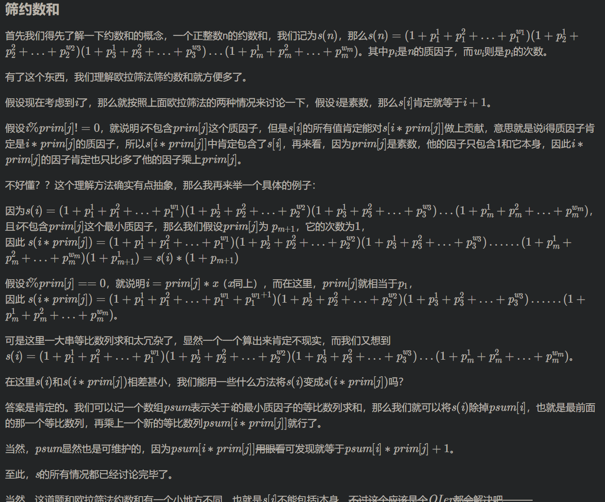

#### CF371C Hamburgers

> https://codeforces.com/problemset/problem/371/C

> Polycarpus loves hamburgers very much. He especially adores the hamburgers he makes with his own hands. Polycarpus thinks that there are only three decent ingredients to make hamburgers from: a bread, sausage and cheese. He writes down the recipe of his favorite "Le Hamburger de Polycarpus" as a string of letters 'B' (bread), 'S' (sausage) и 'C' (cheese). The ingredients in the recipe go from bottom to top, for example, recipe "ВSCBS" represents the hamburger where the ingredients go from bottom to top as bread, sausage, cheese, bread and sausage again.
>
> Polycarpus has *n**b* pieces of bread, *n**s* pieces of sausage and *n**c* pieces of cheese in the kitchen. Besides, the shop nearby has all three ingredients, the prices are *p**b* rubles for a piece of bread, *p**s* for a piece of sausage and *p**c* for a piece of cheese.
>
> Polycarpus has *r* rubles and he is ready to shop on them. What maximum number of hamburgers can he cook? You can assume that Polycarpus cannot break or slice any of the pieces of bread, sausage or cheese. Besides, the shop has an unlimited number of pieces of each ingredient.
>
> Input
>
> The first line of the input contains a non-empty string that describes the recipe of "Le Hamburger de Polycarpus". The length of the string doesn't exceed 100, the string contains only letters 'B' (uppercase English B), 'S' (uppercase English S) and 'C' (uppercase English C).
>
> The second line contains three integers *n**b*, *n**s*, *n**c* (1 ≤ *n**b*, *n**s*, *n**c* ≤ 100) — the number of the pieces of bread, sausage and cheese on Polycarpus' kitchen. The third line contains three integers *p**b*, *p**s*, *p**c* (1 ≤ *p**b*, *p**s*, *p**c* ≤ 100) — the price of one piece of bread, sausage and cheese in the shop. Finally, the fourth line contains integer *r* (1 ≤ *r* ≤ 1012) — the number of rubles Polycarpus has.
>
> Please, do not write the %lld specifier to read or write 64-bit integers in С++. It is preferred to use the cin, cout streams or the %I64d specifier.
>
> Output
>
> Print the maximum number of hamburgers Polycarpus can make. If he can't make any hamburger, print 0.
>
> Examples
>
> input
>
> ```
> BBBSSC
> 6 4 1
> 1 2 3
> 4
> ```
>
> output
>
> ```
> 2
> ```
>
> input
>
> ```
> BBC
> 1 10 1
> 1 10 1
> 21
> ```
>
> output
>
> ```
> 7
> ```
>
> input
>
> ```
> BSC
> 1 1 1
> 1 1 3
> 1000000000000
> ```
>
> output
>
> ```
> 200000000001
> ```

> 这道题就是一道二分的例题
>
> 这里我们可以模拟二分能够制作的汉堡包的数目
>
> 设置 最少能制作0个，最多能制作INF(无穷多个)，如何进行二分枚举
>
> 这里需要注意的是，应该用long long 类型，其次是无穷大的设置应该尽可能大。
> 然后此处check()函数就是判断当前能够制作的汉堡包的数目（减去原料后）去商店进行购买(这里计算每个原料所要花的钱cb,cs,cc)，看身上带的钱是否足够，然后这里也需要特别注意一下：可能会出现负数（也就是说已有的原料已经足够制作相应数目的汉堡包了，此时重置当前原料所要的花费为0）

```C++
#include <bits/stdc++.h>

using namespace std;
const int N = 110;
char str[N];
typedef long long LL;
LL b=0,s=0,c=0;
LL nb,ns,nc;
LL pb,ps,pc;
LL r;

bool check(LL sum_humber)//判断身上带的钱是否足够
{
    LL cb = (LL)(b*sum_humber - nb)*pb;
    LL cs = (LL)(s*sum_humber - ns)*ps;
    LL cc = (LL)(c*sum_humber - nc)*pc;
    if(cb < 0) cb = 0;
    if(cs < 0) cs = 0;
    if(cc < 0) cc = 0;
    //如果钱够的话则返回true，否则false
    if((LL)cb + cs + cc <= r) return true;
    else return false;
}
int main()
{
    ios::sync_with_stdio(false);
    cin >> str;
    cin >> nb >> ns >> nc;
    cin >> pb >> ps >> pc;
    cin >> r;
    LL len = strlen(str);
    for(LL i = 0; i < len; i ++) //字符串处理
    {
        if(str[i] == 'S') s++;
        else if (str[i] == 'C') c++;
        else b++;
    }
    //二分能够做得面包数目
    //一开始设置最少买0个，最多买无限多个
    LL l = 0;
    LL r = 0x3f3f3f3f3f3f; //<---为了能够AC,这里的无穷大应再弄大一点
    while(l < r)//开始二分进行查找
    {
        LL mid = l + r + 1 >> 1;
        if(check(mid)) l = mid;
        else r = mid - 1;
    }
    cout << l;
    return 0;
}
```


#### CF1512G Short Task

> 这道题一定要深入了解欧拉筛；
>
> 首先利用欧拉筛，求出所有和
> 先用欧拉筛筛出 1→10000000 所有数的因数和（调和级数枚举也可以），然后遍历一遍统计就可以了。
>
> > > 欧拉筛筛约数
> > >
> > > 
>
> > 1. *i* 为素数，f*(*i*)=*i*+1
> > 2. i不可被 p_j整除, f*(*i*×*pj)=f(i*)+*f*(*i*)×*pj。因为乘上 p_j就使原数的因子数增加了一倍，增加的因子是原数每个因子分别乘上 p**j* 。
> > 3. i 可被 p_j整除，f*(*i*×*pj)=f(i)+(f(i)−f(i/pj*))×*pj 。因为 i/pj 中的每个因子乘上 p_j都会造成因子的重复计算，所以要去掉重复出现的因子。
>
> `拓展知识点还请查看“我的算法笔记” - 数论 章节`

```C++
#include <bits/stdc++.h>
using namespace std;
typedef long long LL;
const int N = 10000005;
LL sum[N];
int cnt;
int prime[N];
int ans[N];
bool st[N];
void getsum()
{
    ans[1] = sum[1] = 1;
    for(int i = 2; i < N; i ++)
    {
        ans[i] = -1;
    }
    for(int i = 2; i < N; i ++)
    {
        if(!st[i])
        {
            prime[++cnt] = i;
            sum[i] = i + 1;
            //如果此时是质数的话
            //那么sum[n]=n+1;
            //例如 2 是质数， 2 = 1 + 3;
        }
        //从目前所有的已找到的质数中查找
        for(int j = 1; j <= cnt&& prime[j] <= N/i;j++)
        {
            st[i*prime[j]] = 1;//pj为i的最小质因子
            if(i%prime[j] == 0) //如果能够被整除的话
            {
                sum[i*prime[j]] = sum[i] +(sum[i]-sum[i/prime[j]])*prime[j];
                break;
            }
            sum[i*prime[j]] = sum[i] +sum[i]*prime[j]; //如果不能被整除的话
        }
    }
}
int main()
{
    int T;
    int n;
    getsum();
    //先用欧拉筛筛出1~1e7的所有数的因数和
    for(int i = 2; i < N; i ++)
    {
        if(sum[i] > N) continue;
        if(ans[sum[i]] == -1) //替换一下-1所对应的值
        {
            ans[sum[i]] = i;
        }
    }
    scanf("%d",&T);
    while(T -- )
    {
        scanf("%d",&n);
        printf("%d\n",ans[n]);
    }
}
```


#### CF-Hello2022_B

> Problem B - Integers Shop
>
> https://codeforces.com/contest/1621/problem/B

> 思路一定要清晰！！！！
> 不要好高骛远！

```C++
#include <bits/stdc++.h>

using namespace std;
int T;
const int N = 100010;
const int INF = 2e9+10;

int main()
{
    scanf("%d",&T);
    while(T --)
    {
        int n;
        scanf("%d",&n);
        int l,r,c,minl,maxr;
        int ansl,ansr;
        int ans;
        int anst = INF;
        minl=INF;
        maxr=0;
        while(n--)
        {
            scanf("%d%d%d",&l,&r,&c);
            if(l < minl){
                minl = l;
                ansl = c;
                anst = INF;
            }
            else if(l == minl){
                ansl = min(ansl, c);
            }

            if(r > maxr){
                maxr = r;
                ansr = c;
                anst = INF;
            }
            else if(r == maxr){
                ansr = min(ansr, c);
            }

            if(minl == l && maxr == r)
            {
                anst = min(anst, c);
            }
            ans = ansl+ansr;
            printf("%d\n", min(anst,ans));
        }

    }
    return 0;
}
```


### 2022年3月31日

#### Codeforces Round #780 (Div. 3)

