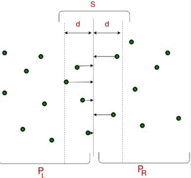
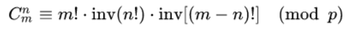
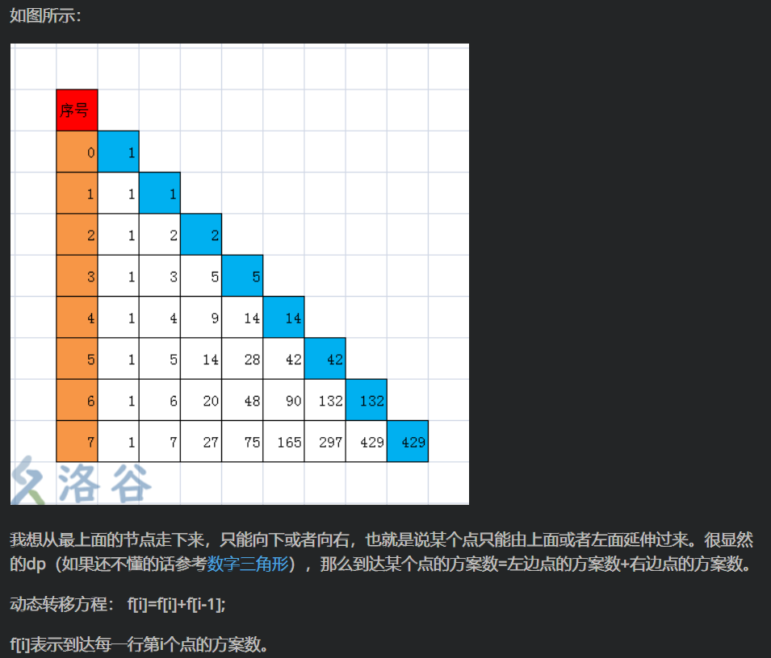

> 让cin和scanf一样快吧！ 
>
> 主函数里面加上 `ios::sync_with_stdio(false);`

> > > **第一周：**
> > >
> > > 2021年7月12日 贪心
> > > 2021年7月13日 递推、前缀和、差分
> > > 2021年7月14日 二分、三分、尺取
> > > 2021年7月15日 数据结构（优先队列[堆])
> > > 2021年7月16日 搜索

### 2021年7月12日

#### P1090 [NOIP2004 提高组] 合并果子 / [USACO06NOV] Fence Repair G

> 该题升级版P6033 [NOIP2004 提高组] 合并果子 加强版

> https://www.luogu.com.cn/problem/P1090

> 思路：
>
> 【也是一种哈夫曼编码为何取得最小值的证明过程】
>
> 堆排序，可以利用小根堆来解决这个问题
> 每次取出堆里面的2个数字，然后存入两个数字的和
>
> 想法Ⅰ：小根堆模板，每次取出最小的两个取出后相应位置变成0，然后计算两者之和，然后将之和重新压入到堆里面。
> 这里每次进行一次出堆和入堆的操作，都完整地进行一次堆排序的过程，时间复杂度较高
>
> 想法Ⅱ：小根堆排序优化版
>
> ```cpp
> //注意：以下是从1~n进行编号的。
> //堆的初始化操作：
> len = 0;
> memeset(heap, 0 , sizeof(heap));
> //将元素压入堆的操作
> void push(int x)
> {
>  heap[++len] = x;
>  int son = len;
>  int parent = son / 2;
>  while(heap[son] < heap[parent] && parent >= 1)
>  {
>      swap(heap[son], heap[parent]);
>      son = parent;
>      parent = son / 2;
>  }
> }
> //压入的同时建好堆
> //将元素从堆中取出来
> void pop()
> {
>  swap(heap[1], heap[len]);
>  henp[len -- ] = 0;
>  int parent = 1;
>  int son = 2;
>  while(son <= len)
>  {
>      if(son < len && heap[son] > heap[son + 1]) son ++;
>      if(heap[parent] > heap[son])
>      {
>          swap(heap[parent], heap[son]);
>          parent = son;
>          son = parent * 2;
>      }else break;
>  }
> }
> ```

```cpp
#include <iostream>
#include <cstdio>
#include <cstdlib>
#include <algorithm>
#include <cstring>

using namespace std;
const int N = 10010;
int n;
int a[N];
int len;
void pop()
{
    swap(a[1],a[len]);
    a[len -- ] = 0;
    int parent = 1;
    int son = 2;
    while(son <= len)
    {
        if(son < len && a[son] > a[son + 1]) son ++;
        if(a[parent] > a[son])
        {
            swap(a[parent],a[son]);
            parent = son;
            son = parent * 2;
        }else break;
    }
}
void push(int x)
{
    a[++len] = x;
    int son = len , parent = son / 2;
    while(a[son] < a[parent] && parent >= 1)
    {
        swap(a[son],a[parent]);
        son = parent,
        parent = son / 2;
    }
}
int main()
{
    int res = 0;
    int x;
    scanf("%d", &n);
    len = 0;
    memset(a,0,sizeof(a));
    for(int i = 1 ; i <= n ; i ++)
    {
        scanf("%d", &x);
        push(x);
    }
    while(len > 1)
    {
        int x,y;
        x = a[1]; pop();
        y = a[1]; pop();
        push(x+y);
        res += x+y;
    }
    printf("%d",res);
    return 0;
}
```


#### P1190 [NOIP2010 普及组] 接水问题

>  https://www.luogu.com.cn/problem/P1190

> 思路：
>
> 要从根本上发现，什么叫模拟，要去思考去模拟算法实现的全过程，去发现隐含条件

```cpp
#include <iostream>
#include <cstdio>
#include <cstdlib>

using namespace std;
const int N = 11000;
const int M = 110;
int w[N];
int p[M];
int main()
{
    int n,m;
    scanf("%d%d", &n, &m);
    for(int i = 1; i <= n ; i ++)
    {
        scanf("%d",&w[i]);
    }
    int ans = 0;
    for(int i = 1; i <= m; i ++)
    {
        p[i] = w[i];
    }
    int next = m + 1;
    while(next <= n + m ) // 此处设置n + m的目的是之后如果所有都完毕后，只需要把当前水量全部流完就行了。当前有m个盆
    {
        for(int i = 1; i <= m; i ++)
        {
            p[i] --;
            if(p[i] == 0)
            {
                p[i] = w[next];
                next++;
            }
        }
        ans++;
    }
    printf("%d", ans);
    return 0;
}
```

#### P7427 [THUPC2017] 玩游戏

> https://www.luogu.com.cn/problem/P7427

> 构造题&&SPJ类题
>
> *//TODO:本题为构造题，SPJ问题，末尾不能有多余的空格和回车*
>
> *//只需要找到一种满足要求的情况即可*
>
> *//构造题发现，只有1+2+3+4+....+i == a + b的时候，才有解*
>
> *//且次数的操作次数是i次*
>
> *//然后对于a而言，在1 ~ i之间*
>
> *//如果a == 1~i之间的某个数那么就直接输出这个数j*
>
> //👆此时结束操作，可以证明当a == j的时候可获得唯一解，且此时的操作i次已经完成
>
> //如果a > 1 ~ i 之间的最大值j ，那么a = a - j 并输出j;然后再一个一个访问 j ~ 1之间的元素,直到a==j

```cpp
#include <iostream>
#include <cstdlib>
#include <cstdio>
//特别注意：
//本题的数据量比较大，已经爆int
//因此本题应该采用long long来存储整型数据
using namespace std;
const int N = 100010;
typedef long long LL;
int main()
{
    LL a,b;
    scanf("%lld%lld", &a, &b);
    LL sum = a + b;
    LL n = 0;
    LL i = 1;
    while(1)
    {
        n += i;
        if(n == sum) //只有n == sum的时候才有解，此时的解就是i次
        {
            printf("%lld ",i);
            for(LL j = i; j >= 1; j --)
            {
                if(a == j) 
                {
                    printf("%lld",j);
                    break;
                }
                if(a > j)
                {
                    printf("%lld " ,j);
                    a = a - j;
                }
            }
            break;
        }
        if (n > sum)
        {
            printf("No");
            break;
        }
        i++;
    }
    return 0;
}
```

#### P1684 考验

> https://www.luogu.com.cn/problem/P1684

> 贪心算法正解：
>
> 由题意可知，满足条件的韵脚有
> AABB，ABBA，ABAB  ---> 两种不同的韵脚分别出现2次
>
> AAAA --->相同的韵脚出现4次
>
> --->注意每次获得一个满足条件的对。要清除一次数据。重新开始遍历
>
> 可以用STL库的map

```cpp
#include <iostream>
#include <cstdio>
#include <cstdlib>
#include <cstring>

using namespace std;
const int N = 4010;
int w[N];
int main()
{
    int n;
    scanf("%d", &n);
    int x;
    int temp = 0;
    int ans = 0;
    memset(w, 0, sizeof(w));
    for(int i = 1; i <= n; i ++)
    {
        scanf("%d", &x);
        w[x] ++;
        if(w[x] == 2) temp ++;
        if(temp == 2)
        {
            ans++;
            temp = 0;
            memset(w, 0, sizeof(w));
        }
        if(w[x] == 4)
        {
            ans ++;
            temp = 0;
            memset(w, 0, sizeof(w));
        }
    }
    printf("%d", ans);
    return 0;
}
```

#### P6878 [JOI 2020 Final] JJOOII 2 [?]

> https://www.luogu.com.cn/problem/P6878

> 思路题解：

```cpp
#include <bits/stdc++.h>
using namespace std;
const int MAXN=2e5+5;
char s[MAXN];
int n,k,ne[MAXN][3]; 
//ne数组存放删除了多少
int main(){
	scanf("%d%d%s",&n,&k,s+1);
    //s+1目的是为了让字符串从1开始
	int cur=1,num=0;
    //计算"J"有多少个
	while(cur<=n && num<k) num+=(s[cur++]=='J');
    cur--;
	for(int i=1;i<=n+1;i++){
		ne[i][0]=cur;
		if(s[i]=='J'){
			if(cur!=n+1) cur++;
			while(cur<=n&&s[cur]!='J') cur++;
		}
	}
	cur=1,num=0;
	while(cur<=n&&num<k) num+=(s[cur++]=='O');
    cur--;
	for(int i=1;i<=n+1;i++){
		ne[i][1]=cur;
		if(s[i]=='O'){
			if(cur!=n+1) cur++;
			while(cur<=n&&s[cur]!='O') cur++;
		}
	}
	cur=1,num=0;
	while(cur<=n&&num<k) num+=(s[cur++]=='I');
    cur--;
	for(int i=1;i<=n+1;i++){
		ne[i][2]=cur;
		if(s[i]=='I'){
			if(cur!=n+1) cur++;
			while(cur<=n&&s[cur]!='I') cur++;
		}
	}
	int ans=n+1;
	for(int i=1;i<=n;i++){
		int r=ne[i][0];
		if(r!=n+1) r=ne[r+1][1];
		if(r!=n+1) r=ne[r+1][2];
		if(r!=n+1) ans=min(ans,r-i+1-(k*3));
	}
    if(ans == n + 1)
    {
        printf("%d",-1);
    }
    else
    {
        printf("%d",ans);
    }
}
```

### 2021年7月13日

#### P3708 koishi的数学题

> https://www.luogu.com.cn/problem/P3708

> 思路与想法：
>
> 递推类型的题目：
>
> > 思考取模MOD运算所要满足的条件：
> >
> > 1. 求整数商：c = a / b;
> >
> > 2. 计算模或余数： r = a - c * b
> >
> >    > (a + b) % p = (a % p + b % p) % p 
> >    >
> >    > (a - b) % p = (a % p - b % p) % p 
> >    >
> >    > (a * b) % p = (a % p * b % p) % p 
> >    >
> >    > a ^ b % p = ((a % p)^b) % p 
> >    >
> >    > 结合律：
> >    >
> >    > ((a+b) % p + c) % p = (a + (b+c) % p) % p 
> >    >
> >    > ((a*b) % p * c)% p = (a * (b*c) % p) % p 
> >    >
> >    > 交换律：
> >    >
> >    > (a + b) % p = (b+a) % p 
> >    >
> >    > (a * b) % p = (b * a) % p 
> >    >
> >    > 分配律：
> >    >
> >    > ((a +b)% p * c) % p = ((a * c) % p + (b * c) % p) % p 
>
> 本题思路：[递推方式]
>
> $f(x)  = \sum_{i=1}^nx(mod\ i)$
>
> $f(x) = nx - \sum_{i=1}^n \lfloor \frac{x}{i}*i \rfloor$  <------ //代码中最后输出的是这个
>
> 直接运算时间复杂度会比较高
>
> //单独分析一下 $\sum_{i=1}^n \lfloor \frac{x}{i}*i \rfloor$
>
> 考虑递推方式:$f(x) - f(x-1) = \sum_{i=1}^ni*(\lfloor\frac{x}{i}\rfloor -\lfloor\frac{x-1}{i}\rfloor)$ 
>
> > 善于发现：对于后面一个式子，当i能被整除的时候，$\lfloor\frac{x}{i}\rfloor -\lfloor\frac{x-1}{i}\rfloor = 1 当其不能被整除的时候，由于整数部分相同，故其值为0$
> >
> > --> $\sum_{i=1}^ni*(\lfloor\frac{x}{i}\rfloor-\lfloor\frac{x-1}{i}\rfloor) = \sum_{d|x}^x = \xi(x)$
> >
> > $f(x) - f(x-1) = \xi(x)$
>
> 关于$\xi(x)$ 因为能够整除的时候其值为1，不能够被整除的时候其值为0，
> 所以其和$\sum$来说就是其所有因子总和。
>
> ```cpp
> for(int i = 1; i <= n; i ++)
> {
>     for(int j = i; j <= n; j = j + i)
>     {
>         f[j] = f[j] + i;
>     }
> }
> //暴力筛：找能被整除的数 （也就是找因子）
> ```

```cpp
#include <iostream>
#include <cstdio>
#include <cstdlib>

using namespace std;
const int N = 1000010;
typedef long long LL;

LL f[N],res[N];
int main()
{
    int n;
    scanf("%d",&n);
    //暴力筛选：目的是求出所有因子
    for(int i = 1; i <= n; i ++)
    {
        for(int j = i; j <= n; j = j + i)
        {
            f[j] = f[j] + i;
        }
    }
    //递推式后一部分就是该数的所有因子的和
    res[1] = 1;
    for(int i = 2; i <= n; i ++)
    {
        res[i] = res[i - 1] + f[i]; //递推式求解
    }
    //👆求出所有θ(X)
    for(int i = 1; i <= n; i ++)
    {
        printf("%lld ",(LL)n*(LL)i - res[i]); //根据分析得到的递推式求得其解
    }
    return 0;
}
```


#### P1255 数楼梯

> https://www.luogu.com.cn/problem/P1255

> 思路：
>
> 高精度与斐波那契数列结合

```cpp
#include <bits/stdc++.h>
#include <vector>

using namespace std;
typedef long long LL;
const int N = 5010;
int num[N][5001];
//数组开太大容易MLE
//高精度加法+斐波那契数列
//斐波那契数列的非递归方式
int main()
{
    int n;
    int len = 1;
    scanf("%d",&n);
    num[1][1] = 1; //第1项
    num[2][1] = 2; //第2项
    for(int i = 3; i <= n; i ++) //从第三项开始
    {
        for(int j = 1; j <= len; j ++)
        {
            num[i][j] = num[i - 1][j] + num[i - 2][j]; //模拟斐波那契数列的由来
        }
        for(int j = 1; j <= len; j ++)//高精度加法
        {
            if(num[i][j] >= 10)//如果有一项大于10的话，则进位
            {
                num[i][j+1] += num[i][j] / 10;
                num[i][j] = num[i][j] % 10;
                if(num[i][len+1]) len++; //如果后一位不为0的话，则长度len++
            }
        }
    }
    for(int i = len; i >= 1; i --)//倒序输出
    {
        printf("%d",num[n][i]);
    }
    return 0;
}
/*
//另外的方法，似乎存在错误
//TPDO:废人一个🐻
int main()
{
    LL n;
    scanf("%lld", &n);
	num[1][N-1]=1;//第一项 
	num[2][N-1]=2;//第二项
	for(int i = 3; i <= n; i ++)
	{
		for(int j = N - 1; j >= 0; j --)
		{
			if((num[i-1][j]+num[i-2][j])>=10)
            {
				num[i][j-1]+=1;
            }
			num[i][j]=num[i][j]+(num[i-1][j]+num[i-2][j])%10; 
        } 
    } 
    int j = 0;
    while(num[n][j] == 0) j++;
    for(int i = j; i < N; i++)
    {
        printf("%lld",num[n][i]);
    }
	return 0;
}
*/
```


#### P1387 最大正方形

> https://www.luogu.com.cn/problem/P1387

> 思路：想法
>
> > 当然，该题可以用神仙动态规划解决
> >
> > > 动态规划，状转方程：
> > >
> > > ``if (a[i][j]==1) f[i][j]=min(min(f[i][j-1],f[i-1][j]),f[i-1][j-1])+1;``
> > >
> > > 说明：
> > >
> > > f[i][j]表示以节点i,j为右下角，可构成的最大正方形的边长。
> > >
> > > 只有a[i][j]==1时，节点i,j才能作为正方形的右下角；
> > >
> > > 对于一个已经确定的f[i][j]=x，它表明包括节点i，j在内向上x个节点，向左x个节点扫过的正方形中所有a值都为1；
> > >
> > > 对于一个待确定的f[i][j]，我们已知f[i-1][j]，f[i][j-1]，f[i-1][j-1]的值，如下：
> > >
> > > f数组:
> > >
> > > ```
> > > ? ? ? ?
> > > ? ? 2 1
> > > ? ? 3 ?
> > > ? ? ? ?
> > > ```
> > >
> > > 则说明原a数组：
> > >
> > > ```
> > > 1 1 1 0
> > > 1 1 1 1
> > > 1 1 1 1
> > > ? ? ? ?
> > > ```
> > >
> > > 由此得出状态转移方程：
> > >
> > > `if (a[i][j]==1) f[i][j]=min(min(f[i][j-1],f[i-1][j]),f[i-1][j-1])+1;`
> > >
> > > **for example:**
> > >
> > > ```
> > > a[i][j]:
> > > 0 0 0 1
> > > 1 1 1 1
> > > 0 1 1 1
> > > 1 1 1 1
> > > f[i][j]:
> > > 0 0 0 1
> > > 1 1 1 1
> > > 0 1 2 2
> > > 1 1 2 3
> > > ```
> > >
> > > ```cpp
> > > #include <iostream>
> > > #include <cstdio>
> > > using namespace std;
> > > int a[101][101],n,m,f[101][101],ans;
> > > int main()
> > > {
> > >     scanf("%d%d",&n,&m);//读入
> > >     for (int i=1;i<=n;++i)
> > >         for (int j=1;j<=m;++j)
> > >         {
> > >             scanf("%d",&a[i][j]);
> > >             //因为只需用到i，j上方，左方，左上方的信息，读入同步处理
> > >             if (a[i][j]==1) f[i][j]=min(min(f[i][j-1],f[i-1][j]),f[i-1][j-1])+1;
> > >             ans=max(ans,f[i][j]);//同步更新答案
> > >         }
> > >     printf("%d",ans);
> > > }
> > > ans=3
> > > ```
>
> 可惜我咋会动态规划，还是老老实实二维前缀和来进行求解吧~
>
> 利用二维前缀和，求得面积，最后判断面积是否能够构成正方形，若能的话，边长就是面积的开方
>
> 二维前缀和：
>
> `s[i][j] = s[i - 1][j] + s[i][j - 1] - s[i - 1][j - 1] + a[i][j];`
>
> 二维前缀和（部分和） x1,y1 与x2,y2之间的和
>
> `s[x2][y2] - s[x2][y1 - 1] - s[x1 - 1][y2] + s[x1 - 1][y1 - 1]`

```cpp
#include <bits/stdc++.h>
#include <cstring>
using namespace std;
const int N = 210;
int a[N][N];
int s[N][N];
int main()
{
    int n,m;
    scanf("%d%d", &n,&m);
    memset(s,0,sizeof(s));
    for(int i = 1; i <= n; i ++)
    {
        for(int j = 1; j <= m; j ++)
        {
            scanf("%d", &a[i][j]);
        }
    }
    for(int i = 1; i <= n; i ++)
    {
        for(int j = 1; j <= m; j ++)
        {
            s[i][j] = s[i - 1][j] + s[i][j - 1] - s[i - 1][j - 1] + a[i][j];
        }
    }
    int ans = 0;

    //DEBUG
    /*
    for(int i = 0 ; i <= n; i ++)
    {
        for(int j = 0; j <= m; j ++)
        {
            cout << s[i][j] << " ";
        }
        cout << endl;
    }
    */
//求正方形边长，不是要你去求面积=c=
    for(int i = 1; i <= n; i ++)
    {
        for(int j = 1; j <= m; j ++)
        {
            int k = i;
            int p = j;
            int res = 0;
            while(k <= n && p <= m)
            {
                res = s[k][p] - s[i - 1][p] - s[k][j - 1] + s[i-1][j-1];
                int temp = (k - i + 1) * (p - j + 1);
                //DEBUG
                //cout << " RES : " << res << endl;
                if (res >= 0 && res == temp)
                {
                    res = sqrt(res); //求正方形边长
                    ans = max(ans, res);
                }
                k++;
                p++;
            }
        }
    }
    printf("%d", ans);
}
```


#### P2327 [SCOI2005]扫雷

> https://www.luogu.com.cn/problem/P2327

> 【递推】
>
> 举例子进行递推后，发现最终的结果只有三种情况：0、1、2
>
> 我们可以从第二列的第一个格子开始进行判断
> 分为两种情况，第一个格子有雷 || 第一个格子无雷
>
> b[1] = 0 or b[1] = 1;
>
> 从i = 2 开始，对b[i]进行判断求解
>
> b[i]的情况，每次以a[i-1]进行选取，b[i]的情况可以根据a[i-1],b[i-1],b[i-2]进行判断
>
> 需要特判：如果b[i]不是0或1的话，直接就是不满足条件
> 				   还需要特判一下到达b[n+1]的时候一定要为0，否则也不满足条件

```cpp
#include<bits/stdc++.h>
using namespace std;
int i,j,k,m,n;
int ans=2;
int a[10010];
int b[10010];
//只有可能是0,1,2
//从第一个位置开始进行判断
//如果第一个位置有雷和无雷都能满足要求的话，那么ans=2;
//可以设最初ans=2;然后去进行特判。
int main()
{
    cin>>n;
    for (i=1;i<=n;i++)
    {
        cin>>a[i];
    }
    b[1]=1;
    //假设第一个有雷
    for(int i = 2;i <= n+1; i++)
    //从第二个位置开始比较
    {
        b[i] = a[i-1] - b[i-1] - b[i-2];
        if (!(b[i]==1||b[i]==0))
        {
            ans--;
            break;
        }
        if (i==n+1 && b[i]!=0)
        {
            ans--;
            break;
        }
    }
    b[1]=0;
    //假设第一个无雷
    for(int i  =2;i  <=n+1;i ++)
    {
        b[i] = a[i-1] - b[i-1] - b[i-2];
        if (!(b[i] == 1||b[i] == 0))
        {
            ans--;
            break;
        }
        if (i == n+1 && b[i] != 0)
        {
            ans--;
            break;
        }
    }
    cout<<ans;   
    return 0;    
}
```

#### P2004 领地选择

> https://www.luogu.com.cn/problem/P2004

> 思路：二维前缀和
> 		首先预处理一下，二位前缀和的值
> 		然后从每个开始计算一下，长度为c的前缀和的大小，选取最大的部分和的左上角的坐标为答案
>
> 注意：本题有情况，如可能出现负数为最大值，所以预处理的ans值应该为负无穷大
>
> ans = -0x3f3f3f3f
>
> //然后要搞清楚右下角的具体位置，相对于左上角 i + c - 1; j + c - 1;

```cpp
#include <bits/stdc++.h>

using namespace std;
const int N = 1010;
int a[N][N];
int s[N][N];
int x;
int y;
int ans = -0x3f3f3f3f;
//4个3f
//要注意题目有可能是最大值是负数，所以初始化可以是负数
int main()
{
    ios::sync_with_stdio(false);
    int n,m,c;
    cin >> n >> m >> c;
    for(int i = 1; i <= n; i ++)
    {
        for(int j = 1; j <= m; j ++)
        {
            cin >> a[i][j];
        }
    }
    for(int i = 1; i <= n; i ++)
    {
        for(int j = 1; j <= m; j ++)
        {
            s[i][j] = s[i - 1][j] + s[i][j - 1] - s[i - 1][j - 1] + a[i][j];
        }
    }
    for(int i = 1; i <= n; i ++)
    {
        for(int j = 1; j <= m; j ++)
        {
            int k = i + c - 1;
            int p = j + c - 1;
            //这里要注意是 x + c - 1(要减去1)
            if(k > n || p > m) continue;
            int res = 0;
            res = s[k][p] - s[i - 1][p] - s[k][j - 1] + s[i-1][j-1];
            if(res > ans)
            {
                ans = res;
                x = i;
                y = j;
            }
        }
    }
    cout << x << " " << y;
}
```

#### P3131 [USACO16JAN]Subsequences Summing to Sevens S

#### P2697 宝石串

#### P1114 “非常男女”计划

> https://www.luogu.com.cn/problem/P3131
> https://www.luogu.com.cn/problem/P2697
> https://www.luogu.com.cn/problem/P1114

> 这三道题都是前缀和的做法，做法一模一样
>
> 需要注意点的是，是否超过INT范围，改用long long，以及为了降低时间复杂度可以在循环中设置退出循环的一些条件。
>
> 然后是一些低级错误要注意，比如要计算的部分和的范围问题，`s[j] - s[i - 1];` 以及区间`j - i + 1`

```cpp
//P3131
#include <bits/stdc++.h>

using namespace std;
const int N = 1000010;
typedef long long LL;

LL s[N];
int main()
{
    int n;
    scanf("%d", &n);
    int t;
    for(int i = 1; i <= n; i ++)
    {
        scanf("%d", &t);
        s[i] = s[i - 1] + t;
    }
    LL maxc = 0;
    for(int i = 1; i <= n; i ++)
    {
        for(int j = n; j > i ; j --)
        {
            if(maxc > j - i + 1) break;
            //👆降低一点时间复杂度的操作
            LL temp = s[j] - s[i - 1];
            if(temp % 7 == 0)
            {
                maxc = max(maxc, (LL)j - i + 1);
            }
        }
    }
    printf("%lld", maxc);
    return 0;
}
```

#### P1192 台阶问题

> https://www.luogu.com.cn/problem/P1192

> 思路/解题方法： 【当然，也可以使用动态规划来解题】
>
> 递推题；
>
> 通过递推发现规律
>
> ```
> k=2 : 1 2 3 5 8 13 21 34...
> k=3 : 1 2 4 7 13 24 44 81...
> k=4 : 1 2 4 8 15 29 56 108...
> k=5 : 1 2 4 8 16 31 61 120...
> ```
>
> ```
> 规律： 
> 当n<=k时,第N项=(上一项*2)%100003;
> 当n>k时 ,第N项=(上一项*2-第n-1-k项)%100003;
> ```
>
> 注意：因为求得的值可能会比较大，故此应该进行取模运算

```cpp
#include<iostream>
#include<cstdio>
using namespace std;
const int mod=100003;
int n,k,a[1000000],ans=0;
int main()
{
	cin>>n>>k;
	a[0]=a[1]=1;
	for(int i=2;i<=n;++i)
	{
		if(i<=k)
		{
			a[i]=(a[i-1]*2)%mod;
		}
		else 
		{
			a[i]=(a[i-1]*2-a[i-k-1])%mod;
		}
	}
	ans=(a[n]+mod)%mod;
    cout<<ans;
    return 0;
}
```

### 2021年7月14日

#### P1314 [NOIP2011 提高组] 聪明的质监员

> https://www.luogu.com.cn/problem/P1314

> 分析，该题隐藏了前缀和和二分两种算法知识
>
> 首先对于Y的求解，观察其有累加操作———>联想到前缀和
>
> 其次对于W的给定值
>
> ·当W取w[N]中最大的那一项的时候，Y此时等于0，Y < s 故为了使得|Y-s|最小，则应该增大Y，故应该减小W
>
> ·当W取w[N]中最小的那一项的时候，Y此时取得最大值，Y存在Y > s则应该减小Y，故应该增大W
>
> > 二分问题的边界处理真的是个折磨人的问题！！！
> >
> > > 第一遍边界问题没有处理好，没有通过全部样例。
> > > wl <= wr，
> > > wr = mid - 1;
> > > wl = mid + 1;

```cpp
#include <bits/stdc++.h>
using namespace std;
typedef long long LL;
const int N = 200010;

LL n,m,s;
LL w[N];
LL v[N];
LL ql[N],qr[N];
LL s_w[N];
LL s_v[N];
LL Y;
LL sum;
LL ans = 0x3f3f3f3f3f3f3f3f;
bool check(LL mid)
{
    Y = 0,sum = 0;
    memset(s_w, 0, sizeof s_w);
    memset(s_v, 0, sizeof s_v);
    //对于Y的计算，我们可以采用前缀和的方式
    for(int i = 1; i <= n; i ++)
    {
        if(w[i] >= mid)
        {
            s_w[i] = s_w[i-1] + 1;
            s_v[i] = s_v[i-1] + v[i];
        }
        else 
        {
            s_w[i] = s_w[i-1];
            s_v[i] = s_v[i-1];
        }
    }
    for(int i = 1; i <= m; i ++)
    {
        Y += (s_w[qr[i]] - s_w[ql[i] - 1]) * (s_v[qr[i]] - s_v[ql[i] - 1]);
    }
    //👆计算Y的值
    //然后开始进行二分
    sum = (LL)abs(Y - s);
    if(Y <= s) return true;
    else return false;
    //能够进行二分的条件判断
    //对于Y;
    //当W为w[N]中最大的那个的时候，Y=0，故应该减小W的值从而增大Y
    //当W为w[N]中最小的那个的时候，Y最大，可能Y>S故应该增大W的值从而减小Y
    //👆以上便是能够进行二分的判断方式
}
int main()
{
    ios::sync_with_stdio(false);
    cin >> n >> m >> s;
    LL wl = 0x3f3f3f3f3f3f3f3f;
    LL wr = 0;
    memset(w, 0, sizeof w);
    memset(v, 0, sizeof v);
    for(int i = 1; i <= n; i ++)
    {
        cin >> w[i] >> v[i];
        wl = min(wl,w[i]);
        wr = max(wr,w[i]);
    }
    for(int i = 1; i <= m ; i ++)
    {
        cin >> ql[i] >> qr[i];
    }
    //?????什么鬼这里改成wl<=wr wr = mid - 1 和 wl = mid + 1才能过
    //二分是真的头疼啊！！我滴妈....
    while(wl <= wr)
    {
        LL mid = wl + wr >> 1;
        if(check(mid)) wr = mid - 1;
        else wl = mid + 1;
        ans = min(ans,sum);
    }
    cout << ans;
    return 0;
}
```

##### 2021年7月14日 今日反思：

> > 做人一定不可好高骛远，一定要耐下心来，脸皮厚点没问题，毕竟我啥也不知道做。只能沉下心来努力积累。
> >
> > 当积累多了，日积月累，当量多了，量变一定会促成质变。你要相信自己！相信自己一定会有所收获！！！！！
> >
> > TODO：有时间的话，一定要找时间去再去练一下二分题。找准分界点，写好check()函数真的很重要！！！
> >
> > 每天一定要做到最晚出地下室的那一人！！！

### 2021年7月15日

#### P1044 栈的应用

> https://www.luogu.com.cn/problem/P1044

> 这道题就是一道卡特兰数的应用题，递推后发现规律，注意运用卡特兰数的递推
>
> > 递归公式1.
> > h(0)=h(1)=1h(0)=h(1)=1
> > h(n)=h(0)∗h(n−1)+h(1)∗h(n−2)+...+h(n−1)∗h(0)(n>=2)
> >
> > 递推公式2.
> > h(n)=h(n−1)∗(4∗n−2)/(n+1)
> >
> > 对于数据过大的情况可以采用组合数学的方式（组合数学也就是杨辉三角的情况）
> > 组合数公式1
> > h(n)=C(2n,n)/(n+1)(n=0,1,2,...)h(n)=C(2n,n)/(n+1)(n=0,1,2,...)
> > 卡特兰数可以与组合数联系起来，得到上面的公式
> >
> > 组合数公式2
> > h(n)=c(2n,n)−c(2n,n−1)(n=0,1,2,...)h(n)=c(2n,n)−c(2n,n−1)(n=0,1,2,...)
> > 与组合数公式1不同这个是两个组合数的减法

#### P1996 约瑟夫问题

> https://www.luogu.com.cn/problem/P1996

> 就是一道约瑟夫环问题，
>
> > 常规数据结构的解法，可以使用一个循环链表，不断更新值，如果报数=m的话，则删除该结点
>
> > 既然学算法了，于是用像个算法er的解法做了一次

```cpp
#include <bits/stdc++.h>
using namespace std;
const int N = 110;

//i表示编号
//j表示报的号
int main()
{
    int n, m;
    cin >> n >> m;
    bool *out = new bool[N + 1];
    for(int i = 1; i <= n; i ++) *(out + i) = true;
    int i = 1;
    int j = 0;
    int count = 0;
    while(1)
    {
        if(*(out + i))
        {
            j ++;
            if(j == m)
            {
                *(out + i) = false;
                j = 0;
                cout << i << " ";
                count ++;
            }
            if(count == n)//如果所有人都出来了，那就结束
            {
                break;
            }
        }
        i ++;
        if(i > n) //复位一下~
        {
            i = 1;
        }
    }
    return 0;
}
```

#### P1631 序列合并

> https://www.luogu.com.cn/problem/P1631

> 善于利用原数组是递增的前提条件
>
> 利用堆排序（优先队列）的方式进行选取
>
> > > 自己想的那个方式无法过的样例信息
> > > 5
> > > 1 1 2 3 4
> > > 1 1 2 3 4

```cpp
#include <bits/stdc++.h>
#include <queue>
using namespace std;
const int N = 100010;
typedef long long LL;
LL minx[N];
LL a[N];
LL b[N];

int main()
{
    int n;
    priority_queue<int> q;
    scanf("%d", &n);
    for(int i = 1; i <= n; i ++)
    {
        scanf("%lld",&a[i]);
    }
    for(int i = 1; i <= n; i ++)
    {
        scanf("%lld",&b[i]);
    }
    for(int i = 1; i <= n; i ++)
    {
        for(int j = 1; j <= n; j ++)
        {
            int x = a[i] + b[j];
            if(q.size() < n)
            {
                q.push(x);
            }
            else
            {
                if(q.top() > x)
                {
                    q.pop();
                    q.push(x);
                }
                else break;
            }
        }
    }
    for(int i = n; i >= 1; i--)
    {
        minx[i] = q.top();
        q.pop();
    }
    /*
    //TODO:分析一下我到底哪里错了
    minx[1] = a[1] + b[1];
    int j = 2;
    int pos = 2;
    for(int i = 2; i <= n; i ++)
    {
        LL res = a[i-1] +b[j];
        if(a[i] + b[j - 1] < res)
        {
            minx[pos++] = a[i] + b[j - 1];
            continue;
        }
        else
        {
            minx[pos++] = res;
            int k = j;
            k ++;
            res = a[i-1]+b[k];
            while(a[i] + b[j - 1] >= res && k <= n)
            {
                minx[pos++] = res;
                res = a[i-1]+b[k];
                k++;
            }
        }
    }
    */
    for(int i = 1; i <= n; i ++)
    {
        printf("%lld ", minx[i]);
    }
    return 0;
}
```

#### P1575 正误问题

> https://www.luogu.com.cn/problem/P1575

> 表达式求值问题
> <u>双栈进行处理，数栈和运算符栈</u>
>
> 首先得看看运算符的优先性、运算符是几元运算符等等..
>
> 很多需要特判的情况，然后可能存在的ERROR的情况

```cpp
#include<bits/stdc++.h>
using namespace std;

string str;
stack<int> op;
stack<bool> num;
bool t,t1,t2;

//这类题之前先想想，运算符的次序
//同时也要想想运算符的性质
//比如这里not是一元运算符，故需要特判一下
//凡是不满足的时候，都要注意返回ERROR错误值
//exit(0)可以在某个地方直接停止程序
//while(cin >> str)也是一种很好的通过字符串的空格分隔字符的功能 <---发现C++内在的奥妙很重要！
void calc() 
{
	if(op.empty()) return;
	if(op.top()==3) //处理not的计算
    {
		if(num.size()<1)  //一元运算符，只需要看数栈里面是否有1个
        {
			printf("error\n");
			exit(0);
		}
		t=num.top();
		num.pop();
		t=!t;
		num.push(t);
	}
    else if(op.top()==2) //处理and的计算
    {
		if(num.size()<2) 
        { //二元运算符，需要看数栈里面是否有两个
			printf("error\n");
			exit(0);
		}
		t2=num.top();
		num.pop();
		t1=num.top();
		num.pop();
		t=(t1 && t2);
		num.push(t);
	}
    else if(op.top()==1)
    {
		if(num.size()<2) 
        {
			printf("error\n");
			exit(0);
		}
		t2=num.top();
		num.pop();
		t1=num.top();
		num.pop();
		t=(t1 || t2);
		num.push(t);
	}
	op.pop();//计算完毕后，记得运算符栈要出一次
}

int main() 
{
    //优先性 not > and > or
    //        3     2    1
    //发现优先性高的，那就进行出栈运算，计算完后再将新的运算符入栈
	while(cin>>str) //这种输入方式可以被空格隔断，故此可以提取出每个单独的内容
    {
		if(str=="not") op.push(3);
		else if(str=="and") 
        {
			if(num.empty())
            {
				printf("error\n");
				return 0;
			}
			while(!op.empty() && op.top() >= 2) calc();
			op.push(2);
		}
        else if(str=="or") 
        {
			if(num.empty())
            {
				printf("error\n");
				return 0;
			}
			while(!op.empty()) calc();
			op.push(1);
		}
        else if(str=="true") num.push(true);
		else if(str=="false") num.push(false);
	}
    //计算的时候是，每次存入运算符栈的时候，进行判断，如果运算符的优先性更大的话，则进行一次计算
    //最后再看运算符栈，如果运算符栈还没空的话，则继续计算，直到运算符栈空了
	while(!op.empty()) calc(); //如果运算符栈还没空的话，则继续进行计算
	if(num.size()==1)
    {
		if(num.top()) printf("true\n");
		else printf("false\n");
    }
	else printf("error\n");
	return 0;
}
```

#### P6033 [NOIP2004 提高组] 合并果子 加强版

> 升级版，数据范围更大了，堆排序、优先队列已经不再适用了，总的来说，需要在O(n)的时间复杂度内实现问题。 在O(n)时间复杂度内求解哈夫曼最小值
>
> > 思想不难，但处处设限

```cpp
#include <bits/stdc++.h>
using namespace std;
typedef long long LL;
const int N = 1e5+100;
const int M = 1e7+100;
//设置两个队列
//用两个队列来模拟优先队列操作
//一个队列放数组中的数，另外一个放之和的数
//每次操作比较两个队列中对头元素的大小
//桶排序+两个队列来模拟优先队列
queue<LL> q1,q2;
LL a[N];
LL readnum[M];
LL n;
//!这么大的数据一定要开long long
//因为数据量实在是太大了 10^7   10e7的巨大数据量
//所以使用快读函数进行数据的读取
inline int read(){
    int x=0,f=1;
    char ch=getchar();
    while(ch<'0'||ch>'9'){
        if(ch=='-')
            f=-1;
        ch=getchar();
    }
    while(ch>='0'&&ch<='9'){
        x=(x<<1)+(x<<3)+(ch^48);
        ch=getchar();
    }
    return x*f;
}

//作为内联函数访问更快
inline LL getnum()
{
    if(q2.empty() || (q1.front() < q2.front() && !q1.empty()))
    {
        LL x = q1.front();
        q1.pop();
        return x;
    }
    else
    {
        LL x = q2.front();
        q2.pop();
        return x;
    }
}

int main()
{
    n = read();
    LL ans = 0ll;
    memset(a, 0, sizeof a);
    for(int i = 1; i <= n; i ++)
    {
        a[readnum[i] = read()]++;
    }
    for(int i = 1; i <= 100000; i ++)
    {
        for(int j = 1; j <= a[i]; j ++)
        {
            q1.push(i);
        }
    }
    for(LL i = 1; i < n; i ++)
    {
        LL x = getnum();
        LL y = getnum();
        ans += (x+y);
        q2.push(x+y);
    }
    printf("%lld",ans);
    return 0;
}
```


### 2021年7月16日

> 搜索算法：BFS、DFS

#### P1219 [USACO1.5]八皇后 Checker Challenge

> https://www.luogu.com.cn/problem/P1219

> 又一典型的BFS、DFS
>
> > DFS关键的一步是找准次序，也就是把握好顺序，也要注意恢复现场
> >
> > 该题有两种DFS搜索方式：
> > 1、模板搜索
> > 2、根据本题题意进行的搜索

```cpp
#include <bits/stdc++.h>
using namespace std;
const int N = 1000;
bool line[N],col[N];
bool lefteg[N],righteg[N];
int path[N];
int n;
int flag = 1;
int counts = 0;
//!搜索最重要的一步就是要想清楚顺序！！
void dfs(int u) //u表示第几层
{
    if(u == n)
    {
        if(flag == 1)
        {
            for(int i = 0; i < n; i ++)
            {
                cout << path[i] << " ";
            }
            if(counts == 2) flag = 0;
            cout << endl;
        }
        counts ++;
        return;
    }
    for(int i = 0; i < n; i ++)
    {
        if(!line[i] && !lefteg[u + i] && !righteg[n - u + i])
        {
            path[u] = i + 1;
            line[i] = lefteg[u + i] = righteg[n - u + i] = 1;
            dfs(u + 1);
            //恢复现场
            line[i] = lefteg[u + i] = righteg[n - u + i] = 0;
        }
    }
}

void dfs2(int x, int y, int s)
//更原始的搜索方式，从左上角开始进行搜索，s表示当前有多少个皇后
{
    if(y == n) y = 0, x ++;
    //表示到达最后一列了，现在返回到第一个位置

    if(x == n)//已经到达最后一行了
    {
        if(s == n) //当前皇后都摆完了
        {
            for(int i = 0; i < n; i ++ ) cout << path[i] << " ";
            counts ++;
            cout << endl;
        }
        return;
    }

    //如果这里不放皇后的话
    dfs2(x, y+1,s);//到下一个位置去放

    //如果放的话
    if(!line[x] && !col[y] && !lefteg[x + y] && !righteg[x - y + n])
    {
        path[x] = y + 1;
        line[x] = col[y] = lefteg[x + y] = righteg[x - y + n] = 1;
        dfs2(x, y + 1, s + 1);
        line[x] = col[y] = lefteg[x + y] = righteg[x - y + n] = 0;
    }
}

int main()
{
    memset(line, 0, sizeof line);
    memset(col, 0, sizeof col);
    memset(lefteg, 0, sizeof lefteg); //左对角线
    memset(righteg, 0, sizeof righteg); //右对角线
    cin >> n;
    dfs(0); //方法一
    dfs2(0,0,0); //更原始的方法
    cout << counts << endl;
    return 0;
}
```

#### P1443 马的遍历

> https://www.luogu.com.cn/problem/P1443

> DFS会出现超时，求最短路可换采用BFS

```cpp
#include <bits/stdc++.h>
#include <queue>
using namespace std;
const int N = 500;
int n, m, x, y;
int st[N][N];
bool vis[N][N];
typedef pair<int, int> PII;
PII q[N*N];
int dx[9]={0,2,-2,2,-2,-1,1,-1,1};
int dy[9]={0,1,1,-1,-1,2,2,-2,-2};

/*
广度优先搜索dfs会有TLE，可以换采用宽度bfs
回溯、剪枝
int dfs(int x, int y, int s)
{
    st[x][y] = s;
    int nx,ny;
    for(int i = 1; i <= 8; i ++) //八个方向都走一走
    {
        nx = x + dx[i];
        ny = y + dy[i];
        //枚举下一个位置
        //检查一下下一个位置是否合法
        if((nx >= 1 && nx <= n && ny >= 1 && ny <= m)&& (s + 1 < st[nx][ny] || st[nx][ny] == -1))
        {
            //cout << "current position: " << nx << " " << ny <<endl;
            dfs(nx, ny, s + 1);
        }
    }
}
*/

void bfs(int x, int y, int s)
{
    st[x][y] = 0;
    int hh = 0, tt = 0;
    q[0] = {x,y};
    vis[x][y] = true;
    while(hh <= tt)
    {
        auto t = q[hh++];
        for(int i = 1; i <= 8; i ++)
        {
            int nx = t.first + dx[i];
            int ny = t.second + dy[i];
            if((nx > 0 && nx <= n && ny > 0 && ny <= m) && !vis[nx][ny])
            {
                st[nx][ny] = st[t.first][t.second] + 1;//为上一个位置多一个
                q[++ tt] = {nx,ny};
                vis[nx][ny] = true;
            }
        }
    }
}

int main()
{
    ios::sync_with_stdio(false);
    cin >>n >> m >> x >> y;
    memset(st, -1, sizeof st);
    memset(vis, false, sizeof vis);
    //dfs(x,y,0);
    bfs(x,y,0);
    for(int i = 1; i <= n; i ++)
    {
        for(int j = 1; j <= m; j ++)
        {
            cout << left << setw(4) << st[i][j] << " ";
        }
        cout << endl;
    }
    return 0;
}
```

#### P1135 奇怪的电梯

> https://www.luogu.com.cn/problem/P1135

> 与上题一样，不过该题BFS和DFS应该都可以撒
> spfa...还有好多算法没好好学好呢！！！

```cpp
#include  <bits/stdc++.h>
using namespace std;
const int N = 2000;
int q[N];
int l[N];
int da[3] = {0,1,-1};
bool vis[N];
int n,a,b;

//最少按键次数，最小问题——>bfs
void bfs(int sa)
{
    int hh = 0, tt = 0;
    q[0] = sa; // 入队
    vis[sa] = true;
    int dis[N];
    int flag = 0;
    memset(dis, 0, sizeof dis);
    dis[0] = 0; //从sa开始到达每个点的距离
    while(hh <= tt)
    {
        int t = q[hh ++];
        if (t == b)
        {
            flag = 1;
            break;
        }
        for(int i = 1; i <= 2; i ++)
        {
            int na = t + da[i]*l[t];
            if(na > 0 && na <= n && vis[na] == false)
            {
                dis[na] = dis[t] + 1;
                q[++ tt] = na;
                vis[na] = true;
            }
        }
    }
    if(flag == 1) cout << dis[b];
    else cout << -1;
    return;
}
int main()
{
    ios::sync_with_stdio(false);
    cin >> n >> a >> b;
    memset(vis, false, sizeof vis);
    for(int i = 1; i <= n; i ++) cin >> l[i];
    bfs(a);
    return 0;
}
```

#### P1605 迷宫

> https://www.luogu.com.cn/problem/P1605

> 迷宫问题的DFS&BFS

```cpp
#include <bits/stdc++.h>
using namespace std;
const int N = 110;
typedef pair<int,int> PII;
int g[N][N];
int n,m,x;
int stx,sty,enx,eny;
int dx[5] = {0, -1, 0, 1, 0};
int dy[5] = {0, 0, 1, 0, -1};
PII q[N*N];
int d[N][N];
int counts = 0;

//宽度优先搜索
void dfs(int xx, int yy)
{
    if(xx == enx && yy == eny)
    {
        counts++;
        return;
    }
    else
    {
        for(int i = 1; i <= 4; i ++)
        {
            int nx = xx + dx[i];
            int ny = yy + dy[i];
            if(nx > 0 && nx <= n && ny > 0 && ny <= m && g[nx][ny] == 0 && d[nx][ny] == -1)
            {
                d[xx][yy] = 1;
                dfs(xx+dx[i],yy+dy[i]);
                d[xx][yy] = -1;
            }
        }
    }
}
int bfs()
{
    int hh = 0, tt = 0;
    q[0] = {stx, sty};
    memset(d, -1, sizeof(d));
    d[1][1] = 1;
    while(hh <= tt)
    {
        auto t = q[hh++];
        for(int i = 1; i <= 4; i ++)
        {
            int x = t.first + dx[i];
            int y = t.second + dy[i];
            if(x > 0 && x <= n && y > 0 && y <= m && g[x][y] == 0 && d[x][y] == -1)
            {
                d[x][y] = 1;
                if(x == enx && y == eny)
                {
                    counts++;
                }
                q[++ tt] = {x,y};
            }
        }
    }
    return counts;
}
int main()
{
    ios::sync_with_stdio(false);
    cin >> n >> m >> x;
    cin >> stx >> sty >> enx >> eny;
    memset(g, 0, sizeof 0);
    memset(d, -1, sizeof(d));
    for(int i = 1; i <= x; i ++)
    {
        int t,p;
        cin >> t >> p;
        g[t][p] = 1;
    }
    //cout << bfs();
    dfs(stx, sty);
    cout << counts;
    return 0;
}
```

#### ❔P1379 八数码难题

> https://www.luogu.com.cn/problem/P1379

> 这是一道难度高的题
>
> 思路与想法:
>
> 
>
> 我们需要一种更为抽象化的思维方式：
>
> 可以把每一种状态看作 一个点
> 从而，从初始状态到最终状态可以转化为，在图中找最短路问题
> 难点：1、如何记录每个状态
> 			2、如何记录所走的距离
> 1状态表示可以使用字符串 
> 比如初始 283104765 ---> 203184765 ------> ..... --------> 最终状态
>
> 2对于如何记录所走的距离
> 可以采用哈希图hash_map、map、unorder_map、字典等数据结构进行保存
>
> `unordered_map<string,int> dist` 表示 状态string 的当前距离 int
>
> 3状态转移，可以以那个空位为研究对象，空位有4个移动方式，分别进行枚举
>
> > 启示：灵活运用STL库，可以事半功倍！STL也一定要花时间去好好了解
> > 关于unordered_map:
> > https://www.cnblogs.com/langyao/p/8823092.html
> >
> > ```cpp
> > 成员函数：
> > =================迭代器========================= 
> > begin 　　返回指向容器起始位置的迭代器（iterator） 
> > end 　　   返回指向容器末尾位置的迭代器 
> > cbegin　   返回指向容器起始位置的常迭代器（const_iterator） 
> > cend 　　 返回指向容器末尾位置的常迭代器 
> > =================Capacity================ 
> > size  　　 返回有效元素个数 
> > max_size  返回 unordered_map 支持的最大元素个数 
> > empty        判断是否为空 
> > =================元素访问================= 
> > operator[]  　　   访问元素 
> > at  　　 　　　　访问元素 
> > =================元素修改================= 
> > insert  　　插入元素 
> > erase　　 删除元素 
> > swap 　　 交换内容 
> > clear　　   清空内容 
> > emplace 　构造及插入一个元素 
> > emplace_hint 按提示构造及插入一个元素 
> > ================操作========================= 
> > find 　　　　　　通过给定主键查找元素,没找到：返回unordered_map::end
> > count 　　　　　返回匹配给定主键的元素的个数 
> > equal_range 　　返回值匹配给定搜索值的元素组成的范围 
> > ================Buckets====================== 
> > bucket_count 　　　返回槽（Bucket）数 
> > max_bucket_count    返回最大槽数 
> > bucket_size 　　　   返回槽大小 
> > bucket 　　　　　　返回元素所在槽的序号 
> > load_factor　　　　 返回载入因子，即一个元素槽（Bucket）的最大元素数 
> > max_load_factor 　  返回或设置最大载入因子 
> > rehash　　　　　　 设置槽数 
> > reserve 　　　　　  请求改变容器容量
> > ```
>
> 其中有几个小技巧
> **如何从一维序号进行转化为x维序号**
> **又如何从x维序号转化回一维**

```cpp
#include <bits/stdc++.h>
#include <unordered_map>
#include <cstring>
#include <queue>

using namespace std;
unordered_map<string,int> dist;
queue<string> q;

int dx[5] = {0,1,-1,0,0};
int dy[5] = {0,0,0,1,-1};

int bfs(string str)
{
    string z = "123804765";
    q.push(str);
    dist[str] = 0;
    while(!q.empty())
    {
        auto t = q.front();
        q.pop();
        int dis = dist[t];
        if(t == z) return dis; //如果已经满足条件则返回步数

        int po = t.find('0');//在字符串中寻找空位所在的位置
        //将一维度转化为三维
        int x = po / 3;
        int y = po % 3;

        for(int i = 1; i <= 4; i ++)
        {
            int nx = x + dx[i];
            int ny = y + dy[i];
            if(nx >= 0 && nx < 3 && ny >= 0 && ny < 3)
            {
                swap(t[po], t[nx*3+ny]);  //<---这里又有将三维情况转化成一维

                if(!dist.count(t)) //map操作，如果t没有出现过的话
                {
                    dist[t] = dis + 1;
                    q.push(t);
                }
                swap(t[po], t[nx*3+ny]);
            }
        }
    }
    return -1;
}
int main()
{
    string p_str;
    cin >> p_str;
    cout << bfs(p_str);
    return 0;
}
```

#### UVA572 油田 Oil Deposits

> https://www.luogu.com.cn/problem/UVA572
>
> > 搜索水题，搞清楚搜索过程就不难

```cpp
#include <bits/stdc++.h>
#include <cstring>

using namespace std;
const int N = 110;
char g[N][N];
bool st[N][N];
int n,m;
int dx[9] = {0,1,1,1,0,0,-1,-1,-1};
int dy[9] = {0,0,1,-1,1,-1,0,1,-1};
void dfs(int x, int y)
{
    st[x][y] = true;
    if(x <= 0 || x > n || y <= 0 || y > m) return;
    for(int i = 1; i <= 8; i ++)
    {
        int nx = x + dx[i];
        int ny = y + dy[i];
        if(g[nx][ny] == '@' && !st[nx][ny])
        {
            dfs(nx,ny);
        }
    }
}
int main()
{
    while(cin >> n >> m)
    {
        memset(st, false, sizeof st);
        int counts = 0;
        if(n == 0|| m == 0) return 0;
        for(int i = 1; i <= n; i ++)
        {
            for(int j = 1; j <= m; j ++)
            {
                cin >> g[i][j];
            }
        }
        for(int i = 1; i <= n; i ++)
        {
            for(int j = 1; j <= m; j ++)
            {
                if(g[i][j] == '@' && !st[i][j])
                {
                    counts++;
                    dfs(i,j);
                }
            }
        }
        cout << counts << endl;
    }
    return 0;
}
```

#### P5194 [USACO05DEC]Scales S

> https://www.luogu.com.cn/problem/P5194
>
> > 注意思考顺序&&题意获取的方式
> >
> > > 利用题干的隐含条件——【不降序】——可以利用前缀和进行剪枝，从高到低进行枚举
> >
> > 防止TLE--->注意去剪枝！

```cpp
#include <bits/stdc++.h>
using namespace std;
typedef long long LL;
const int N = 1010;
bool st[N];
LL a[N];
LL sa[N];
LL ans;
int n,s;

void dfs(int u, LL sum)
{
    ans = max(ans,sum);
    if(u == 0) return; //退出条件-->到达边界
    //👇进行剪枝
    if(sa[u] + sum <= s)//继续枚举下去，肯定都是会比这个sa[u]+sum小的，故直接剪枝优化算法
    {
        ans = max(ans, sa[u] + sum);
        return;
    }//如果u前缀和的项目+sum <= 标准值的话，则更新一下ans，也就是u之前的砝码都可以取用了
    if(a[u] + sum <= s)
    {
        dfs(u - 1, sum + a[u]);
    }//如果当前这个位置的值a[u] + sum <= s的话，取一下当前位置  <---也像一个剪枝
    dfs(u - 1, sum); //都不满足的话，那就继续递归下一个
}

int main()
{
    cin >> n >> s;
    for(int i = 1 ; i <= n; i ++) cin >> a[i];
    for(int i = 1 ; i <= n; i ++) sa[i] = sa[i - 1] + a[i];
    dfs(n,0);
    cout << ans;
    return 0;
}
```

#### UVA11624 Fire!

> https://www.luogu.com.cn/problem/UVA11624

> 两个BFS进行搜索，双向BFS
>
> 有很多需要注意的细节
>
> > 1.火源可能有多个，应该记录最早火蔓延的时间
> > 2.J走到的时候一定要满足火还没蔓延到，也就是J和火不能同时到
> > 3.到达边界即可结束，注意要多+1
> >
> > 一堆细节和代码能力

```cpp
#include <bits/stdc++.h>
#include <queue>
using namespace std;
typedef pair<int,int> PII;
const int N = 1010;
char g[N][N];
int n,m;
int dx[5] = {0,1,0,-1,0};
int dy[5] = {0,0,1,0,-1};
bool flag = false;
int F_time[N][N];
int curtime[N][N];

void bfs_F(int x, int y)
{
    //PII q2[N*N];
    queue<PII> q2;
    bool vis[N][N];
    memset(vis, false, sizeof vis);
    F_time[x][y] = 0;
    vis[x][y] = true;
    q2.push(PII(x,y));
    //q2[0] = {x, y};
    int hh = 0, tt = 0;
    while(!q2.empty())
    {
        auto t = q2.front();
        hh++;
        q2.pop();
        for(int i = 1; i <= 4; i ++)
        {
            int nx = t.first + dx[i];
            int ny = t.second + dy[i];
            if(nx > 0 && nx <= n && ny > 0 && ny <= m && g[nx][ny] != '#' && g[nx][ny] != 'F' && !vis[nx][ny])
            {
                if(F_time[nx][ny] == 0)
                {
                    F_time[nx][ny] = F_time[t.first][t.second] + 1;
                }
                else
                {
                    F_time[nx][ny] = min(F_time[nx][ny],F_time[t.first][t.second] + 1);
                }
                vis[nx][ny] = true;
                q2.push(PII(nx,ny));
                ++tt;
                //q2[++tt] = {nx,ny};
            }
        }
    }
}
bool check_J(int x, int y, int curtime)
{
    if(x > 1 && x < n && y > 1 && y < m && g[x][y] != '#' && F_time[x][y] < curtime + 1)
    {
        return true;
    }
    else return false;
}
void bfs_J(int x,int y)
{
    //PII q1[N*N];
    queue<PII> q1;
    //int dist[N][N];
    bool vis[N][N];
    memset(vis, false, sizeof vis);
    vis[x][y] = true;
    q1.push(PII(x,y));
    //q1[0] = {x,y};
    curtime[x][y] = 0;
    int hh = 0, tt = 0;
    while(!q1.empty())
    {
        auto t = q1.front();
        hh++;
        q1.pop();
        for(int i = 1; i <= 4; i ++)
        {
            int nx = t.first + dx[i];
            int ny = t.second + dy[i];
            if(nx > 0 && nx <= n && ny > 0 && ny <= m && g[nx][ny] != '#' && g[nx][ny] != 'F' && !vis[nx][ny])
            {
                curtime[nx][ny] = curtime[t.first][t.second] + 1;
                vis[nx][ny] = true;
                q1.push(PII(nx,ny));
                ++tt;
            }
        }
    }
}

int bfs_JF(int x,int y)
{
    //PII q3[N*N];
    queue<PII> q3;
    q3.push(PII(x,y));
    //q3[0] = {x,y};
    int hh = 0, tt = 0;
    if(x == 1 || x == n || y == 1 || y == m)
    {
        flag = 1;
        return 1;
    }
    while(!q3.empty())
    {
        auto t = q3.front();
        hh++;
        q3.pop();
        if(t.first == 1 || t.first == n || t.second == 1 || t.second == m)
        {
            flag = true;
            return curtime[t.first][t.second] + 1;
        }
        for(int i = 1; i <= 4; i ++)
        {
            int nx = t.first + dx[i];
            int ny = t.second + dy[i];
            if(curtime[nx][ny] < F_time[nx][ny])
            {
                q3.push(PII(nx,ny));
                ++tt;
            }
        }
    }
    if(curtime[x][y] == 0)
    {
        flag = false;
    }
    return curtime[x][y] + 1;
}

int main()
{
    ios::sync_with_stdio(false);
    int T;
    cin >> T;
    while(T --)
    {
        cin >> n >> m;
        int j_x,j_y;
        memset(F_time,0,sizeof F_time);
        memset(curtime,0,sizeof curtime);
        memset(g,'.',sizeof g);
        for(int i = 1; i <= n; i ++)
        {
            for(int j = 1; j <= m; j ++)
            {
                cin >> g[i][j]; 
                if(g[i][j] == 'J')
                {
                    j_x = i;
                    j_y = j;
                }
            }
        }
        for(int i = 1; i <= n; i ++)
        {
            for(int j = 1; j <= m; j ++)
            {
                if(g[i][j] == 'F')
                {
                    bfs_F(i, j);
                }
            }
        }
        bfs_J(j_x, j_y);
        int c = bfs_JF(j_x,j_y);
        if(flag)
        {
            cout << c << endl;
        }
        else
        {
            cout << "IMPOSSIBLE" << endl;
        }
    }
    return 0;
}
```

### 2021年7月17日 总结&周赛

#### P7095 [yLOI2020] 不离

> https://www.luogu.com.cn/problem/P7095

> 题解&思路：
>
> 善于发现：初始额能力值如果越大的话，越有可能穿上所有装备
> ----->> 决策具有单调性 ------->> 满足二分的性质
>
> > 细化问题、简化思考方式
>
> 一、对于力量值
>
> 对于力量值，发现初始力量越多，穿的也就越多，可以用二分的方法来解决！
>
> 二、对于精神值
>
> 在选定了满足条件的力量值后，然后模拟穿着装备的过程，一件一件穿，找出满足条件的精神值
>
> 可以使用一个堆（优先队列）来维护还未穿着的装备

```cpp
#include <bits/stdc++.h>
#include <queue>
#define int long long
using namespace std;

struct Node
{
    int a,b,c,d;
    bool operator < (Node y) const
    {
        return b > y.b;
    }
}a[100001];
int n;
bool cmp(Node x, Node y)
{
    if(x.a == y.a)
    {
        return x.b < y.b;
    }
    return x.a < y.a;
}

bool check(int mid)
{
    for(int i = 1; i <= n; i ++)
    {
        if(mid < a[i].a) return 0;
        mid += a[i].c;
    }
    return 1;
}
int get_b(int ac) //再已经获得最合适的力量值的前提下找精神值，第二次贪心
{
    //利用堆来维护还未穿的装备
    int ret = 0, sum = 0;
    priority_queue<Node> q;
    int i = 1;
    while(a[i].a <= ac && i <= n)
    {
        q.push(a[i]);
        i++;
    }
    while(!q.empty())
    {
        Node cur = q.top();
        q.pop();
        ret = max(ret, cur.b - sum);
        sum += cur.d;
        ac += cur.c;
        while(a[i].a <= ac && i <= n)
        {
            q.push(a[i]);
            i++;
        }
    }
    return ret;
}
int main()
{
    int T;
    cin >> T;
    cin >> n;
    if(n == 0)
    {
        cout << "0 0" << endl;
        exit(0);
    }
    int sum = 0;
    for(int i = 1; i <= n; i++)
    {
        cin >> a[i].a >> a[i].b >> a[i].c >> a[i].d;
        sum += a[i].a; //初始总力量
    }
    sort(a+1,a+n+1,cmp); //将结构体中以a为准进行排列
    int l = 0, r = sum * 2;
    int ans = 0;
    //一次贪心
    while(l <= r) //!目的是找到最小的满足条件的初始力量值
    {
        int mid = l+r>>1;
        if(check(mid))
        {
            ans = mid;
            r = mid - 1;
        }
        else l = mid + 1;
    }
    //找到完最小的满足条件的力量值后
    //然后模拟穿装备，找到最合适的精神值
    //二次贪心
    cout << ans << " " << get_b(ans);
    return 0;
}
```

#### P4058 [Code+#1]木材

> https://www.luogu.com.cn/problem/P4058

> -->观察题目的数据范围 $1 ≤ S,L ≤ 10^18$
>
> --> long long $10^9$  故应该采用 因为数据量都是正数 unsigned long long 无符号long long满足题目的数据范围
>
> 本题目的是找最少需要等几个月，不妨采用二分方法
>
> 1.考虑二分的端点—— 可能一开始就满足条件，可令左端点为0，
> 对于右端点，我们因为有两个约束条件：一个是单根的长度，另外一个是总长度。
>
> > 我们去比较要求的单根长度和把总任务分配到每一根的需求长度，取最大值就是实际的约束条件；那么二分的右端点**实际上就是每棵树长高到约束条件的时间中的最大值**
>
> 本题的几个难点：
> 		1.数据范围非常大，应该采用unsigned long long 进行存储
> 		2.二分进行查找，右端点的选取

```cpp
#include <bits/stdc++.h>

using namespace std;
const int N = 200200;
unsigned long long h[N],a[N];
unsigned long long n,m,s,i,j,k,minn = 0,maxn = 0,l,r,q;

//快读函数，快速读入整数
inline int rd(){
    int x=0;
    bool f=true;
    char c;
    c=getchar();
    while(c<'0'||c>'9'){
        if(c=='-') f=false;
        c=getchar();
    }
    while(c>='0'&&c<='9'){
        x=(x<<1)+(x<<3)+(c^48);
        c=getchar();
    }
    return f?x:-x;
}

bool check(unsigned long long mid) //二分check函数
{
    unsigned long long sum = 0;
    bool flag = 1;
    for(i = 1; i <= n; i ++)
    {
        if(h[i] + a[i] * mid >= minn)
        {
            if(flag) sum += h[i] + a[i] * mid;
            if(sum >= s) return true;
        }
    }
    return false;
}

int main()
{
    scanf("%lld%lld%lld",&n,&s,&minn);
    for(i = 1; i <= n; i ++) h[i] = rd();
    for(i = 1; i <= n; i ++) a[i] = rd();
    q = max(minn, s/n+1);
    for(i = 1; i <= n; i++)
    {
        if(h[i] < q) maxn = max(maxn,(q-h[i])/a[i]+1);
    }//找右端点
    l = 0;
    r = maxn;
    //开始二分枚举
    while(l < r)
    {
        unsigned long long mid = l + r >> 1;
        if(check(mid))
        {
            r = mid;
        }
        else
        {
            l = mid + 1;
        } 
    }
    printf("%lld",l);
    return 0;
}
```

#### ❔P2331 [SCOI2005]最大子矩阵

> https://www.luogu.com.cn/problem/P2331

> 该题要用到动态规划，等啥时候学到动态规划的时候回来再看看吧


#### P2853 [USACO06DEC]Cow Picnic S

> https://www.luogu.com.cn/problem/P2853

> (lll￢ω￢)，就是一个dfs，从每个给定的地方开始进行一次dfs，如果能够到达，则该点++，能够到达的点等于所要求的数量，则ans++;
>
> > 纯粹用y总的模板写完的题
>
> > > 不过还是得注意一下数据范围以及cin速度太慢了，最好换成scanf进行输入

```cpp
#include <bits/stdc++.h>

using namespace std;
const int N = 10010;
int k,n,m;
int h[N],e[N],ne[N],idx;
int st[N];
int x[N];
int start[N];
void add(int a,int b)
{
    e[idx] = b;
    ne[idx] = h[a];
    h[a] = idx++;
}
void dfs(int u)
{
    st[u] = 1;
    x[u] ++;
    for(int i = h[u]; i != -1; i = ne[i])
    {
        int j = e[i];
        if(!st[j])
        {
            dfs(j);
        }
    }
    return;
}
int main()
{
    ios::sync_with_stdio(false);
    scanf("%d%d%d", &k,&n,&m);
    //cin >> k >> n >> m;
    idx = 0;
    int ans = 0;
    memset(h, -1, sizeof h);
    memset(x, 0, sizeof x);
    memset(st, 0, sizeof st);
    for(int i = 1; i <= k; i ++)
    {
        scanf("%d", &start[i]);
        //cin >> start[i];
    }
    for(int i = 1; i <= m; i ++)
    {
        int in,to;
        scanf("%d%d", &in,&to);
        //cin >> in >> to;
        add(in,to);
    }
    for(int i = 1; i <= k ; i ++)
    {
        memset(st, 0, sizeof st);
        dfs(start[i]);
    }
    for(int i = 1; i <= n; i ++)
    {
        if(x[i] == k) ans++;
    }
    cout << ans;
    return 0;
}
```

#### P2937 [USACO09JAN]Laserphones S

> https://www.luogu.com.cn/problem/P2937

> 看到最短路问题，想到BFS，要满足bfs中的“拐弯数”最少，需要进行特判以及更多约束

> :joy: 通过这一题，我以最快的速度学会了在BFS中记录路径，以及输出BFS所获得的路径
>
> ```cpp
> //注意一下，多维情况如何转化为一个一维情况
> //以及从一维情况转化到多维情况的计算方式 （注意避免麻烦还是下标从0开始吧QAQ）
> void printpre(int x,int y )
> {
>     if(pre[x*n+y] != -1)
>     {
>         printpre(pre[x*n+y]/n, pre[x*n+y]%n);
>     }
>     printf("(%d, %d)\n",x,y);
> }
> 
> int pre[N]; //用于存储前一个位置
> memset(pre, 0, sizeof pre);
> pre[stx*n+sty] = -1;//多维转一维
> if(t.first == enx && t.second == eny)
> {
> 	printpre(enx,eny); //递归进行输出
>     return;
> }
> ```

> 显然最短路的路径可能有多条，每条的拐弯数都不相同。所以这种方式是不行的，但能够学习到BFS输出最短路的路径还是很值得的

> 换一种思路：
>
> > 对于对每个格子进行标记（也就是染色）可以采用DFS
>
> ```cpp
> ....... 
> ......C 
> ......* 
> *****.*     
> ....*.. 
> ....*.. 
> .C..*.. 
> ....... 
> ---->>//也是利用类似贪心的方法，记录每个点能够到达的话，需要的最少的拐弯次数
> ......1 
> 111111C 
> ......* 
> *****.* 
> ....*..   为1的地方无需拐弯
> ....*.. 
> .C..*.. 
> ....... 
>  
> 然后对每个点都进行延申
> 2222221 
> 111111C 
> 222222* 
> *****2* 
> ....*2.   为2的地方需要拐弯1次
> ....*2. 
> .C..*2. 
> .....2.
>     
> 2222221 
> 111111C 
> 222222* 
> *****2* 
> ....*23   为3的地方需要拐弯2次
> ....*23 
> .C..*23 
> 3333323
>     
> 2222221 
> 111111C 
> 222222* 
> *****2* 
> 4444*23   为4的地方需要拐弯3次
> 4444*23 
> 4C44*23 
> 3333323
> ```

```cpp
#include <bits/stdc++.h>
#include <queue>
#define inf 0x3f3f3f3f
using namespace std;
int n,m;
int a[110][110];//保存地图 //将字符地图转化为整型地图
struct node
{
    int x,y;
    int num;
}s,t;
queue<node> q;

void dfs(int fx,node u) //在宽搜中每种延申方式就是一种广搜
{ 
    //fx记录方向（1上2下3左4右） u为当前所在点 
    int x=u.x,y=u.y,p=u.num; 
    if(a[x][y]<p || a[x][y]==inf) return;
    if(x<1 || y<1 || x>n || y>m) return;

    //判断延申方向
    if(fx==1)
    {
        a[x][y]=p;
        q.push((node){x,y,p});
        dfs(1,(node){x-1,y,p});
    }
    if(fx==2)
    {
        a[x][y]=p;
        q.push((node){x,y,p});
        dfs(2,(node){x+1,y,p});
    }
    if(fx==3)
    {
        a[x][y]=p;
        q.push((node){x,y,p});
        dfs(3,(node){x,y-1,p});
    }
    if(fx==4)
    {
        a[x][y]=p;
        q.push((node){x,y,p});
        dfs(4,(node){x,y+1,p});
    }
}

void bfs(){
    while(!q.empty())
    {
        node u=q.front(),v=q.front();
        q.pop();
        u.num++;
        v=u; v.x=u.x-1;//上 
        dfs(1,v);
        v=u; v.x=u.x+1;//下 
        dfs(2,v);
        v=u; v.y=u.y-1;//左 
        dfs(3,v);
        v=u; v.y=u.y+1;//右 
        dfs(4,v);
    }
}

int main(){
    cin>>m>>n;
    char zwh;
    memset(a,inf,sizeof(a));
    for(int i=1;i<=n;i++)for(int j=1;j<=m;j++) a[i][j]=inf-1;
    //如果地图范围全部是比答案小的数字（比如0），那么在dfs染色的时候就会直接返回，导致错误。
    for(int i=1;i<=n;i++){
        for(int j=1;j<=m;j++){
            scanf(" %c",&zwh);
            if(zwh=='C') //这一步找起点和终点
            {
                if(s.x) t.x=i,t.y=j,t.num=0;//找到起点和终点
                else s.x=i,s.y=j,s.num=0;
            }
            if(zwh=='*')
            {//如果是墙的话那就设置为无穷大
                a[i][j]=inf;
            }
            
        }
    }
    q.push(s); //队列中将起点入队
    bfs(); //进行宽搜
    cout<<a[t.x][t.y]-1;//注意减一
    return 0;
}
```

#### P1031 [NOIP2002 提高组] 均分纸牌

> https://www.luogu.com.cn/problem/P1031

> 嘤嘤嘤，这道签到题，我居然思路出现的错误，嘤嘤嘤，还是得坐得下板凳！要努力去学习才行。
> 一定要对能够学到新的东西，充满求知欲，对未知充满期待，加油！努力！终会有所收获

> 这道题很简单，因为移动只能从相邻的位置进行移动;
> 首先我们需要先求一下平均值ave;
>
> 然后从第一堆开始，如果a[i] == ave 的话那就直接下一个;
>
> 如果a[i] != ave的话， 那么此时需要进行一次操作，也就是从i+1个位置搬运过来纸牌，或者从i位置向i+1的位置搬运纸牌
> a[i + 1] += a[i] - ave 具体是从i-->i+1 还是i+1-->i，主要看a[i]-ave是正还是负。反正不管怎样，这里都算操作一次，故此counts++;

```cpp
#include <bits/stdc++.h>
using namespace std;
typedef long long LL;
const int N = 110;
LL a[N];
int main()
{
    ios::sync_with_stdio(false);
    int n;
    scanf("%d", &n);
    LL sum = 0;
    for(int i = 1; i <= n; i ++)
    {
        scanf("%lld", &a[i]);
        sum += a[i];
    }
    LL ave = sum / n;
    LL counts = 0;
    for(int i = 1; i <= n - 1; i ++)
    {
        if(a[i] - ave != 0)
        {
            counts++;
            a[i+1] += a[i] - ave;
        }
    }
    printf("%lld",counts);
    return 0;
}
```

#### P7404 [JOI 2021 Final] とてもたのしい家庭菜園 4

> https://www.luogu.com.cn/problem/P7404

> 思路与题解
>
> 数据量巨大，可采用【差分】进行求解
>
> 对于差分数组
>
> $b_i = a_{i+1} - a_i$
> 因为题目的操作，只能对给定的区间进行“+1”运算
>
> `可以有个结论，bi差分数组的正负情况与ai,ai+1的递增还是递减情况对应`
>
> 对于前半段，要满足恒递增的情况，
> 对于$b_i$如果 $b_i$ <=0 的话，对答案有贡献，此时必须进行一次操作； $x_i←x_{i−1}+∣bi∣+1$；
> 对于$b_i$如果$b_i$  > 0 的话，对答案没有贡献，无需进行操作；
>
> 对于后半段，要满足恒递减的情况，
> 对于$b_i$如果 $b_i$ < 0 的话，对答案没有贡献，无需进行操作；
> 对于$b_i$如果$b_i$  >= 0 的话，对答案有贡献，此时必须进行一次操作；
>
> > 定义front[N],behind[N];
> >
> > - front数组，$front_i$ 表示从$1 \rightarrow i$ 严格递增所需的步数
> > - $behind$数组，$behind_i$表示从 $ i + 1 \rightarrow n$ 严格递增所需的步数
> >
> > 可知：$ans = min{max(x_i,y_{i+1})} ~~~from~~i~~to~~n$

```cpp
#include <bits/stdc++.h>
using namespace std;
typedef long long LL;
const int N = 200010;
LL a[N],b[N];
LL front[N],behind[N];
int n;
LL ans = 0x3f3f3f3f3f3f3f3f;
int main()
{
    scanf("%d", &n);
    for(int i = 1; i <= n; i ++)
    {
        scanf("%lld", &a[i]);
        b[i] = a[i] - a[i - 1];
    }
    for(int i = 2,j = n; i <= n; i ++, j --)
    {
        if(b[i] <= 0)
        {
            front[i] = front[i - 1] - (b[i] - 1);//front[i]表示需要进行多少次操作才能让其大于前一项
        }
        else front[i] = front[i - 1]; //无需操作就让其与前一个相等

        if(b[j] >= 0)
        {
            behind[j] = behind[j + 1] + (b[j] + 1);//behind[i]表示需要进行多少次操作才能让其小于前一项
        }
        else behind[j] = behind[j + 1]; //无需操作就让其与前一个相等
    }
    for(int i = 1; i <= n; i ++)
    {
        ans = min(ans, max(front[i],behind[i+1])); //找出最小的满足条件的步数
    }
    printf("%lld",ans);
    return 0;
}
```

#### P6155 修改

> https://www.luogu.com.cn/problem/P6155

> 题解&思路：
>
> **贪心 + 数据结构[栈]**
>
> > 首先，如果没有 b_i的限制。我们可以用一个队列，枚举每个位置，如果这个位置上有点，则将这个位置的所有 a_i加入。然后，将一个 a_i放在这个位置。
> >
> > 举个例子。
> > 假如有 2,2,3 三个点：
> > 枚举位置 1，没有点。
> > 枚举位置 2，将两个 2 加入队列，将一个 2 弹出。
> > 枚举位置 3，将 3 加入队列，将另一个 2 弹出。
> > 枚举位置 4，将 3 弹出。
> > 每个点被修改的次数即为 出队时间 -− 入队时间。然后按修改的次数排序再乘上 b_i即可。
> >
> > 但有时有多种选择，比如在上述样例中，时间 3 时，既可以弹出 2 又可以弹出 3 ，但弹出 2 肯定是更优的，因为2的入队时间比 3 靠前，乘上的 b_i一定比 3 少，所以多修改一次 2的代价更小。
> > 所以将上述的队列改为栈。
> > 但时间复杂度还是 O*(*n*log*n*+max*a_i) 的。
> > 但可以发现，其实很多时候栈都是空的，优化就是在栈为空的时候跳到下一个 a_i。
> > 可以证明栈有值的点至多有 2n个。
> > 总复杂度 O*(*n*log*n*) (排序)。

```cpp
#include <bits/stdc++.h>
#define re register
#include <stack>
//? 结果很大 需要对2^64进行取模？？？
using namespace std;
typedef long long LL;
struct node{
	int x,id;
};
struct d{
	int ans,pos;
}p[1000002];
int n,a[1000002],b[1000002],x,l;
unsigned long long ans;
inline int read(){
	int t=0;
	char v=getchar();
	while(v<'0')v=getchar();
	while(v>='0'){
		t=(t<<3)+(t<<1)+v-48;
		v=getchar();
	}
	return t;
}
inline bool cmp(d x,d y){
	return x.ans>y.ans;
}
stack <node> q;
signed main(){
	n=read();
	for(re int i=1;i<=n;++i)a[i]=read();
	sort(a+1,a+n+1);
	for(re int i=1;i<=n;++i)b[i]=read();
	sort(b+1,b+n+1);
	l=1;
	x=1;
	while(1){
		if(q.empty()){
			if(l<=n)
			x=a[l];
			else break;
		}
		while(a[l]==x){
			q.push(node{a[l],l});
			++l;
		}
		node tmp=q.top();
		q.pop();
		p[tmp.id].ans=x-tmp.x;
		++x;
	}
	sort(p+1,p+n+1,cmp);
	for(re int i=1;i<=n;++i)
    {
        ans+=1llu*p[i].ans*b[i];
	}
	printf("%llu",ans);
}
```

> 仍存在疑惑：https://www.luogu.com.cn/problem/solution/P6155

#### ❔P1248 加工生产调度

> https://www.luogu.com.cn/problem/P1248


### 2021年7月19日

> 2021年7月19日 分治 
> 2021年7月20日 数学知识选讲Ⅰ （约数、整除划分）
> 2021年7月21日 数学知识选讲 Ⅱ （质数筛）
> 2021年7月22日 组合数学（卡特兰,lgv算法,隔板法,容斥原理,卢卡斯定理)
> 2021年7月23日 基础图论

#### P1908 逆序对

> https://www.luogu.com.cn/problem/P1908

> 分治思想的应用；[归并排序思想]
>
> > 回顾一下归并排序：
> >
> > 1.区间一分为二 [L，mid]  [mid+1 , R]
> > 2.递归排序左右两边
> > 3.归并，将两个有序序列合并为一个有序序列
>
> 基于归并，可以分为三大类：
>
> > 注意归并前的左右两边已经是有序的情况了。
> > 要深刻理解归并算法的本质，以及分治算法的具体应用
>
> 1.两个数同时在左半边
> 2.两个数同时在右半边
> 3.一个数在左半边，一个数在右半边
>
> 1. ans = merge_sort(L, mid);
> 2. ans = merge_sortt(mid+1, r);
> 3. ans = mid - i + 1;  如果第i个要大于第j个，那么第i~mid个都会大于j，ans = mid - i + 1

```cpp
#include <bits/stdc++.h>
using namespace std;
typedef long long LL;
const int N = 500010;
LL q[N];
LL tmp[N];//归并排序需要一个中间数组存储中间归并过程
int n;
LL merge_sort(int l,int r)
{
    if (l >= r) return 0;
    int mid = l+r >> 1;
    LL res = merge_sort(l,mid) + merge_sort(mid+1,r);
    //左边的逆序对+右边的逆序对
    int k=0,i=l,j=mid+1;
    while (i <= mid && j<=r)
        if (q[i] <= q[j]) tmp[k++] = q[i++];
        else 
        {
            tmp[k++] =q[j++];
            res += mid - i + 1;
            //因为左右两边以及有序了，如果左边第i个位置大于右边第j个位置
            //那么i~mid个位置都大于第j个位置，此处的逆序对个数为mid-i+1
        }
    while (i <= mid) tmp[k++] = q[i++];
    while (j <= r) tmp[k++] = q[j++];
    for (i = l,j = 0;i <= r;i++,j++) q[i]=tmp[j];
    return res;
}
int main()
{
    int k;
    k = read();
    for (int i=0 ;i < k; i++) q[i] = read();
    write(merge_sort(0,k-1));
    return 0;
}
```

#### P1115 最大子段和

> https://www.luogu.com.cn/problem/P1115

> 方法一：分治
>
> 去该数列的中间值mid
>
> 可知最大的序列只有三种情况：
> 1.左侧最大
> 2.右侧最大
> 3.左侧和右侧都有一部分加起来才最大
>
> 👆分别求取，最后ans就是这三种情况的最大值

> 方法二：DP动态规划
>

```cpp
#include<bits/stdc++.h>
int n , arr[200200];
const int minn = -0x3f3f3f3f;
inline int Max( int a , int b) { return a > b ? a : b ;}

//分治算法类似于归并排序，时间复杂度O(nlogn)
int rec( int l , int r ) 
{
    if ( l == r )  //分治到最后只剩下一个数，那就返回这个数就行了
    {
        return arr[l];
    }
    int mid = ( l + r ) >> 1;  
    int sum = 0 , ret1 = minn , ret2 = minn; 
    //ret1表示左边的最大
    //ret2表示右边的最大
    for( int i = mid ; i >= l ; i-- )
    {
        sum += arr[i];
        ret1 = Max( ret1 , sum );
    }
    //找到左边的最大值
    sum = 0;
    for( int i = mid+1 ; i <= r ; i++ ) 
    {
        sum += arr[i];
        ret2 = Max( ret2 , sum );
    }
    //找到右边的最大值
    return Max( Max( rec( l , mid ) , rec( mid + 1 , r ) ) , ret1 + ret2 );
    //最大值有三种可能，可能都在左边，可能都在右边，可能一部分在左边一部分在右边
    //反正就是这三种可能中的最大值
    //LL ans = Maxx(Maxx(dac(l, mid),dac(mid+1,r)),left+right);
}
inline int read(){
    int x=0,f=1;
    char ch=getchar();
    while(ch<'0'||ch>'9'){
        if(ch=='-')
            f=-1;
        ch=getchar();
    }
    while(ch>='0'&&ch<='9'){
        x=(x<<1)+(x<<3)+(ch^48);
        ch=getchar();
    }
    return x*f;
}
inline void write(int x)
{
    if(!x) putchar('0');
    char F[200];
    int tmp=x>0?x:-x ;
    if(x<0)putchar('-') ;
    int cnt=0 ;
        while(tmp>0)
        {
            F[cnt++]=tmp%10+'0';
            tmp/=10;
        }
        while(cnt>0)putchar(F[--cnt]) ;
}
int main()
{
    n = read();
    for( int i = 1 ; i <= n ; i++ ) 
    {
        arr[i] = read();
    }
    write(rec(1,n));
    return 0;
}
```

> 该题的动态规划做法

```cpp
#include <bits/stdc++.h>
using namespace std;
const int N = 200010;
int num[N];
int ans[N] = {0};
int sum = -1e9;
int main()
{
    ios::sync_with_stdio(false);
    int m;
    cin >> m; 
    for(int i = 1; i <= m; i ++)
    {
        cin >> num[i];
        //DP ans[N]数组存放的是最大的连续子段和
        ans[i] = max(ans[i-1] + num[i], num[i]);
        sum = max(sum,ans[i]);
    }
    cout << sum;
    return 0;
}
```

#### P1177 【模板】快速排序

> https://www.luogu.com.cn/problem/P1177

> 快速排序实际上也是分治算法的拓展
>
> 首先对整个序列进行一趟快速排序
> 然后分治，对左侧和右侧分别进行一次一趟快速排序
>
> 结束条件是 分治到最后只剩下一个元素，那一定是有序的，无需进行操作

```cpp
void quicksort(int l, int r)
{
    //如果最后，分治到只有一个元素，那肯定是有序的，无需操作直接返回即可
    if(l >= r) return;
    
    //否则，该序列仍然无序，则应该进行如下操作才行
    //将问题分解成小问题
    //处理一趟快速排序的过程
    LL x = a[l + r >> 1];
    int i = l-1;
    int j = r+1;
    while(i<j)
    {
        do i ++; while(a[i] < x);
        do j --; while(a[j] > x);
        if(i < j ) swap(a[i],a[j]);
    }
    //递归处理左右两边，进行多趟快速排序
    quicksort(l, j);
    quicksort(j+1, r);
}
```

#### ❔P3810 【模板】三维偏序（陌上花开）

> https://www.luogu.com.cn/problem/P3810

> CDQ分治用法要求前面区间的变动会影响后面区间，但是如果后面区间也会影响前面区间那样cdq分治就不能用了。
>
> > 要注意如果是完全相同CDQ分治会出问题的，因此也更加深刻的了解了CDQ分治，原因是如果两个一模一样的三维数组容易出现后面区间会影响到前面区间的情况(两个三元组在前后两个区间）
>
> > 因此要先去重，而且要按照三维坐标从小到大排序，从而保证后面不会影响到前面。


#### [分治]P1257 平面上的最接近点对

> https://www.luogu.com.cn/problem/P1257

> 虽然该题可以用暴力解法
>
> 尝试分治的解法：$O(n(logn)^2)$
>
> 参考： http://people.csail.mit.edu/indyk/6.838-old/handouts/lec17.pdf
>
> 1.首先在排序序列中找到一个中间点$P(\frac{n}{2})$ 
> 2.将这个序列分为两个部分，P[0]~P(n/2)  和 P[n/2+1]~P[n-1]
> 3.递归在这左右两个序列中查找最小的距离 dl, dr，然后找到其最小的距离d = min(dl,dr)
> 4.接下来我们要找的是，位于中间部分的可能存在的最小的距离，从上面三个步骤，我们可以获得一个最小的上界距离d
>
> > 我们需要以中间为基准，找半径为d，x轴的距离与中间mid最接近的点，创建一个数组 strip[]来存储所有像这样的点
>
> 5.接下来以y为基准，将strip[]数组进行排序，这一步的时间复杂度是$O(nlogn)$ ，也可以被优化到O(n)的时间复杂度通过递归排序和合并
> 6.在数组strip[]中找最小的距离，这看上去需要On^2的时间复杂度，实际上只需要O(n)，因为可以利用几何证明strip[]中的每一个点，我们只需要检查最多7个点（在对y进行排序之后）
> 7.最后我们只需返回最小的d和通过上面6个步骤计算出的距离

> 代码中的tmp数组同题解的strip[]数组

```cpp
#include <bits/stdc++.h>
using namespace std;
typedef long long LL;
const int N = 200010;
int n;
struct node
{
    double x,y;
}P[N];
int tmp[N];

bool cmp(const node &a, const node &b)//按x进行排序，如果x相等，则较小的y排在前面
{
    if(a.x == b.x)
    {
        return a.y < b.y;
    }
    else return a.x < b.x;
}
bool cmp2(const int &a, const int &b)//按y进行排序
{
    return P[a].y < P[b].y;
}
double distance(int i, int j)
{
    return sqrt((P[i].x-P[j].x)*(P[i].x-P[j].x)+(P[i].y-P[j].y)*(P[i].y-P[j].y));
}
double dac(int l, int r)
{
    double dist = 1.79769e+308;
    if(l == r) return dist;
    if(l+1 == r) return distance(l,r);
    int mid = l + r >> 1;
    //分治
    double dl = dac(l, mid);
    double dr = dac(mid+1, r);
    dist = min(dl,dr);//获取左右两边最短的距离

    //再来考虑 [mid-d,mid+d]之间部分的距离情况
    //合并
    int k = 0;
    for(int i = l; i <= r; i ++)
    {
        if(fabs(P[i].x-P[mid].x) <= dist) tmp[k++] = i; //如果i.x在[mid-d,mid+d]的范围内的话，则加入到归并数组内
    }
    sort(tmp,tmp+k,cmp2);//然后在tmp数组中以y进行排序
    //进行这一步的目的是为了缩小在tmp数组中查找最小的距离的点的时间复杂度
    //在tmp数组中对y进行排序后，再进行最小的距离查找实际上可以通过几何证明最多也就只需要找7个点
    for(int i = 0;i < k; i ++)//寻找tmp[]中也就是点位于[mid-d]~[mid+d]的范围内的点的最短距离。
    {
        for(int j = i + 1; j < k && P[tmp[j]].y-P[tmp[i]].y<dist; j ++) //也判断一下i.y是否在[mid-d,mid+d]的范围内
        {
            dist = min(dist,distance(tmp[i],tmp[j])); //这里获取的就是如果在[mid-d,mid+d]的情况下的最小距离的值
        }
    }
    return dist;
}
int main()
{
    scanf("%d",&n);
    for(int i = 1; i <= n; i ++)
    {
        scanf("%lf%lf",&P[i].x,&P[i].y);
    }
    sort(P,P+n,cmp);//按x进行排序，如果x相等，则较小的y排在前面
    printf("%.4lf\n",dac(1,n));
    return 0;
}
```

#### P1911 L 国的战斗之排兵布阵

> https://www.luogu.com.cn/problem/P1911

> > 类似题：P1228 地毯填补问题
> > https://www.luogu.com.cn/problem/P1228
>
> 地毯填补问题采用分治算法：
> 行数上对半t，列数上也对半t，
> 原问题中有1个特殊方格，则分出来后的新问题也要有1个特殊方格
> `特殊方格的退出方式：当k=0时`
>
> > 地毯填补的数据结构的设计：
> > 1.棋盘：二维数组`board[size][size]` 
> > 2.子棋盘，其中的子棋盘由棋盘左上角的下标和棋盘大小s表示
> > 3.特殊方格，`board[dr][dc]`表示特殊方格，dr和dc时该特殊方格在二维数组board中的下标
> > 4.L型地毯，一个$2^k*2^k$的棋盘中有一个特殊方格，所以，用到L型地毯的个数为$(4^k-1)/3$，将所有地毯从1开始连续编号，用一个全局变量t表示
> >
> > ```cpp
> > void dac(int tr,int tc,int dr,int dc,int size)
> > {
> >     //tr,tc是棋盘左上角的下标
> >     //dr,dc是特殊方格的下标
> >     //size是棋盘的大小，t初始化为0
> >     if(size == 1) return; //是1x1的棋盘，那就不要填了
> >     t++;//地毯++;
> >     s = size/2;
> >     //覆盖左上角子棋盘
> >     if(dr < tr + s&&dc < tc + s) //特殊方块在左上角子棋盘中
> > 		dac(tr,tc,dr,dc,s); //递归处理左上角子棋盘 (因为左上角和原问题一样)
> >     else//用t号L型骨牌覆盖右下角，再递归处理
> >         board[tr+s-1][tc+s-1] = t; //这是为了让其变得和原问题一样,那就在子块的右下角加一个特殊方块，使其变得和原问题一样，再开始进行递归求解
> >     	dac(tr,tc,tr+s-1,tc+s-1,s);
> >     if(dr < tr+s && dc >= tc+s) //特殊方块在右上角
> >         dac(tr,tc+s,dr,dc,s); //那就递归处理右上角
> >     else
> >         board[tr+s-1][tc+s]=t; //在右上角子块的左下角加个特殊方块
> >     	dac(tr,tc+s,tr+s-1,tc+s,s);
> >     if(dr >= tr+s && dc < tc+s) //左下角
> >         dac(tr+s,tc,dr,dc,s);
> >     else
> >         board[tr+s][tc+s-1] = t; //左下角的右上角加个特殊方块
> >     	dac(tr+s,tc,tr+s,tc+s-1,s);
> >     if(dr >= tr+s && dc >= tc+s)
> >         dac(tr+s,tc+s,dr,dc,s);
> >     else
> >         board[tr+s][tc+s] = t;
> >     	dac(tr+s,tc+s,tr+s,tc+s,s);
> > }
> > ```
> >
> > > 设$T(k)$是覆盖一个$2^k*2^k$棋盘所需时间
> > > $$ T(k)=\left\{
> > > \begin{aligned}
> > > O(1)     k = 1 \\
> > > 4T(k-1) + O(1)  k > 1
> > > \end{aligned}
> > > \right.$$ 由此可知$T(k) = O(4^k)$ ，由于覆盖一个满足要求的正方形，所需要的L型块件的个数为$(4^k-1)/3$ 故此该算法可以说是在一个渐进意义下的最优算法
> > >
> > > > ```cpp
> > > > #include <bits/stdc++.h>
> > > > using namespace std;
> > > > const int N = 1050;
> > > > int n;
> > > > void dac(int x, int y, int xt, int yt, int size)
> > > > {
> > > >     if(size == 1) return;
> > > >     int s = size/2;
> > > >     //采用分治的方法，只需要让最中间正方形摆放一个L型地毯，就能满足四个区域都有一个特殊方块
> > > >     if(xt <= x+s-1 && yt <= y+s-1) //如果初始特殊方块在左上角的话
> > > >     {
> > > >         printf("%d %d 1\n",x+s,y+s);
> > > >         dac(x,y,xt,yt,s);
> > > >         dac(x,y+s,x+s-1,y+s,s);
> > > >         dac(x+s,y,x+s,y+s-1,s);
> > > >         dac(x+s,y+s,x+s,y+s,s);
> > > >     }
> > > >     else if(xt <= x+s-1 && yt > y+s-1)//右上角
> > > >     {
> > > >         printf("%d %d 2\n",x+s,y+s-1);
> > > >         dac(x,y,x+s-1,y+s-1,s);
> > > >         dac(x,y+s,xt,yt,s);
> > > >         dac(x+s,y,x+s,y+s-1,s);
> > > >         dac(x+s,y+s,x+s,y+s,s);
> > > >     }
> > > >     else if(xt > x+s-1 && yt <= y+s-1) //左下角
> > > >     {
> > > >         printf("%d %d 3\n",x+s-1,y+s);
> > > >         dac(x,y,x+s-1,y+s-1,s);
> > > >         dac(x,y+s,x+s-1,y+s,s);
> > > >         dac(x+s,y,xt,yt,s);
> > > >         dac(x+s,y+s,x+s,y+s,s);
> > > >     }
> > > >     else //右下角
> > > >     {
> > > >         printf("%d %d 4\n",x+s-1,y+s-1);
> > > >         dac(x,y,x+s-1,y+s-1,s);
> > > >         dac(x,y+s,x+s-1,y+s,s);
> > > >         dac(x+s,y,x+s,y+s-1,s);
> > > >         dac(x+s,y+s,xt,yt,s);
> > > >     }
> > > > }
> > > > int main()
> > > > {
> > > >     int x, y;
> > > >     scanf("%d",&n);
> > > >     int len = pow(2,n);
> > > >     scanf("%d%d",&x,&y);
> > > >     dac(1,1,x,y,len);
> > > >     return 0;
> > > > }
> > > > ```

> 联想到分治：
> $2^k*2^k$的正方形内，只要有一个点不覆盖，就有办法把其他店覆盖。
> 可以将这个大的正方形分割成四个$2^{\frac{k}{2}}*2^{\frac{k}{2}}$的小正方形来进行求解

```cpp
#include <bits/stdc++.h>
using namespace std;
int n;
const int N = 1050;
int g[N][N];
int t = 0;
void dac(int x,int y, int xt, int yt, int size)
{
    if(size == 1) return;
    int s = size/2;
    t++;
    if(xt <= x+s-1 && yt <= y+s-1) //左上角
    {
        g[x+s][y+s] = t;  //第一个方向
        g[x+s][y+s-1] = t;
        g[x+s-1][y+s] = t;
        dac(x,y,xt,yt,s);
        dac(x,y+s,x+s-1,y+s,s);
        dac(x+s,y,x+s,y+s-1,s);
        dac(x+s,y+s,x+s,y+s,s);
    }
    else if(xt <= x+s-1 && yt > y+s-1) //右上角
    {
        g[x+s][y+s-1] = t; //第二个方向
        g[x+s][y+s] = t;
        g[x+s-1][y+s-1] = t;
        dac(x,y,x+s-1,y+s-1,s);
        dac(x,y+s,xt,yt,s);
        dac(x+s,y,x+s,y+s-1,s);
        dac(x+s,y+s,x+s,y+s,s);
    }
    else if(xt > x+s-1 && yt <= y+s-1) //左下角
    {
        g[x+s-1][y+s] = t; //第三个方向
        g[x+s-1][y+s-1] = t;
        g[x+s][y+s] = t;
        dac(x,y,x+s-1,y+s-1,s);
        dac(x,y+s,x+s-1,y+s,s);
        dac(x+s,y,xt,yt,s);
        dac(x+s,y+s,x+s,y+s,s);
    }
    else //右下角
    {
        g[x+s-1][y+s-1] = t; //第四个方向
        g[x+s-1][y+s] = t;
        g[x+s][y+s-1] = t;
        dac(x,y,x+s-1,y+s-1,s);
        dac(x,y+s,x+s-1,y+s,s);
        dac(x+s,y,x+s,y+s-1,s);
        dac(x+s,y+s,xt,yt,s);
    }
}
int main()
{
    int x,y;
    scanf("%d%d%d", &n, &x, &y);
    int len = pow(2,n);
    dac(1,1,x,y,len);
    for(int i = 1; i <= len; i ++)
    {
        for(int j = 1; j <= len; j ++)
        {
            cout << g[i][j] << " ";
        }
        cout << endl;
    }
    return 0;
}
```

> 当然上面的代码在luogu上是无法通过的，需要改一下左上右上左下右下的编号才行的，但方法才是最重要的撒~~
>
> //暴力重新编号：
>
> ```cpp
> bool vis[N][N];
> int dx[8]={-1,-1,-1,0,1,1,1,0};
> int dy[8]={-1,0,1,1,1,0,-1,-1};
> memset(vis,false,sizeof vis);
> int cnt = 0;
> for(int i = 1;i <= len; i ++)
> {
>     for(int j = 1; j <= len; j ++)
>     {
>         if(vis[i][j] || g[i][j] == 0) continue;
>         vis[i][j] = 1;
>         int w = g[i][j];
>         g[i][j] = ++ cnt;
>         for(int p = 0; p < 8;p++)
>         {
>             int xx = i + dx[p];
>             int yy = j + dy[p];
>             if(g[xx][yy] == w && vis[xx][yy] == 0)
>             {
>                 g[xx][yy] = cnt;
>                 vis[xx][yy] = 1;
>             }
>         }
>     }
> }
> ```

#### ❔P5094 [USACO04OPEN]MooFest

> https://www.luogu.com.cn/problem/P5094
> CDQ分治典题👌

> 树状数组可以更轻松地解决这个问题：
>
> 有关树状数组的解决方法：https://blog.csdn.net/weixin_30572613/article/details/99887389


#### P2717 寒假作业[CDQ分治]

> https://www.luogu.com.cn/problem/P2717

> *//看到平均值无脑所有 $a_i←a_i−k$*
> 例如：案例：（平均值：2） 样例：1,2,3
>
> 减去平均值后： -1, 0, 1; 【也就是CDQ分治中，每个数对答案的贡献】
>
> 故此该题可以转化为，求在这个序列中 $1<=i<=j<=n$ 满足$\sum_{i=i}^{j=j}a_i >= 0$的序列的个数
> 转化为前缀和数组 -1，-1，0；
> 从而转化成了只需要$x≤y ~~~且 a_x≤a_y$ 即可 （也就是$a_y-a_x≥0$ $x≤y$ 的满足要求的$(x,y)$序列的个数。
>
> 因为求部分区间和也就是前后两个端点的前缀和相减
> //!启发：如果确定自己的思路没有错误后，调试程序可以从这些参数开始进行调试，根据获取的结果对参数进行微调。CDQ容易出细节上的错误
>
> **还是好好掌握好树状数组，利用好树状数组没那么容易出现那种细节错误**

```cpp
#include <bits/stdc++.h>
using namespace std;
const int N = 100010;
typedef long long LL;
int n,k;
LL a[N];
LL tmp[N];
LL ans = 0;
//看到平均值无脑所有 $a_i←a_i−k$
//实际上就是通过cdq求顺序对
void cdq(int l, int r)
{
    if(l >= r) return;
    int mid = l + r >> 1;
    //分治
    cdq(l,mid);
    cdq(mid+1,r);
    //求跨区间的顺序对个数
    int i = l;
    int j = mid+1;
    int k = l;
    while(j <= r)
    {
        while(i <= mid && a[i] <= a[j])
        {
            tmp[k++] = a[i++];
        }
        tmp[k++] = a[j++];
        ans += i - l;  //实际上这里记录的就是顺序和的数目 (i-1) - (l-1) = i - l
    }
    while(i <= mid) tmp[k++] = a[i++];
    //合并
    for(int i = l; i <= r; i ++) a[i] = tmp[i];
}
int main()
{
    scanf("%d%d",&n,&k);
    for(int i = 1;i <= n; i ++)
    {
        scanf("%lld",&a[i]);
        a[i] -= k; //先都减去平均值
        a[i] = a[i-1] + a[i]; //再转化为前缀和
    }
    //注意点
    cdq(0,n); // 注意这里的l~r是在0~n之间，
    //这里应该要包含0
    //!启发：如果确定自己的思路没有错误后，调试程序可以从这些参数开始进行调试，根据获取的结果对参数进行微调
    //那么求得就是在 [0,n]范围内 x<yx<y 且ax ≤ay的数对个数，即二维偏序。
    printf("%lld",ans);
    return 0;
}
```

### 2021年7月20日

> 数论基础

#### 约数

> 详见我的算法笔记/数论/约数 章节

#### P2424 约数和

> https://www.luogu.com.cn/problem/P2424

> 运用到整除分块的方法，降低时间复杂度

```cpp
LL sum(LL n)
{
    LL s = 0;
    if(n <= 1) return n;
    for(LL l = 1,r; l <= n; l = r + 1)
    {
        r = n/(n/l);
        s  += (r - l + 1) * (n/l) * (l+r) /2; // n(a1+an)/2
    }
    return s;
}
//👆利用整除分块求出的是[1,n]的所有约数之和。
```

#### P3811 【模板】乘法逆元

> https://www.luogu.com.cn/problem/P3811

> 求乘法逆元有许多种方式；
> 1.依据拓展的欧几里得算法进行求解
> 2.费马小定理+快速幂求取。
>
> 但上面两种方式只适合快速求取某个数的逆元
>
> 如果要求一段序列的逆元的话，速度较慢
> 故此，可采用逆元的递推公式进行求取
>
> `inv[i] = (p - p / i) * inv[p % i] % p;`

```cpp
inv[1] = 1;
printf("%d\n",inv[1]);
for(int i = 2; i <= n; ++ i)
{
 	inv[i] = (LL)(p - p / i) * inv[p % i] % p;
    printf("%d\n",inv[i]);
}
//利用逆元的递推公式
//只需要获得第一个逆元，即可凭此推出之后的逆元
```

#### P1082 [NOIP2012 提高组] 同余方程

> https://www.luogu.com.cn/problem/P1082

> 同余方程
>
> $ax\equiv1(mod\ p)$
> 求x，这个x便就是a的乘法逆元
>
> 可以采用扩展的欧几里得算法
> 或快速幂+欧拉函数+费马小定理
>
> 两种方法求解

```cpp
void Exgcd(LL a, LL b, LL &x, LL &y) 
{
    if (!b) x = 1, y = 0;
    else Exgcd(b, a % b, y, x), y -= a / b * x;
}

x = (x%p+p)%p;// 得出的x就是其逆元
```

#### P2261 [CQOI2007]余数求和

> https://www.luogu.com.cn/problem/P2261

> 反思：
> 遇到这种题，一定要动笔去推导计算一下！！得到一个显著的公式，并依据公式去进行计算
>
> 对于余数有
>
> $t = \lfloor\frac{b}{a}\rfloor$
> $t*a + r = b$
> $∴r = b - t*a \rarr r=b-\lfloor\frac{b}{a}\rfloor*a$
>
> $\sum_{i=1}^nk~mod~i = \sum_{i=1}^nk-\sum_{i=1}^n\lfloor\frac{k}{i}\rfloor*i\rarr n*k-\sum_{i=1}^ni*\lfloor\frac{k}{i}\rfloor$
>
> 发现：$\lfloor\frac{k}{i}\rfloor$ 采用整除分块的方法，大约有$\sqrt k$​种取值。
>
> 遇到相同的取值只需要使用等差数列的求和公式进行求解即可！

|整除分块将时间复杂度降低到$\sqrt n$|

```cpp
LL ans = n*k;
    for(LL l = 1, r; l <= n; l = r+1)
    {
        //通过打表枚举善于发现
        //如果l < k 的话，也有可能存在一段连续的等差数列求和的区间
        //该连续区间的右边界r便是min(k/(k/l),n)
        if(k / l != 0) r = min(k/(k/l),n);
        //如果l >= k的话，后面的取值都是k,只需要将其直接加进去即可
        else r = n; 
        ans -= (r - l + 1) * (k/l) * (l+r) /2;
    }
```

#### P2312 [NOIP2014 提高组] 解方程

> https://www.luogu.com.cn/problem/P2312

> 这题没啥好说的，但是有很多细节需要去注意一下！
>
> //然后为了避免最后求出一些奇奇怪怪的值，可以mod上一个很大的质数1e9+7
> 这样可以避免最后结果出现奇怪的数。
>
> 暴力能过。但要注意数据量很大，记得快读
>
> 主要是秦九韶算法的应用
>
> 在[1, m]的范围内，枚举每个值，带入bool check函数中利用秦九韶算法计算该值是否 满足条件即可

```cpp
//秦九韶算法计算这个多项式的值
const int p = 1e9+7;
bool calc(ll x)
{
    sum=0;
    for(ll i=n;i>=1;i--)
    {
        sum=((A[i]+sum)*x)%p;//这里从最高位开始进行秦九韶计算
        //这里套用秦九韶算法求多项式的值 注意A[0]并不需要乘x！
    }
    sum=(sum+A[0])%p;//这里再算上A[0]
    return !sum;//如果答案是0说明x值为该多项式的解，返回1(true) 
}
```

#### P2054 [AHOI2005]洗牌

> https://www.luogu.com.cn/problem/P2054

> 分析题目：
>
> ```
> 洗牌如下：
> 1  2  3  4
> 3  1  4  2
> 4  3  2  1
> 2  4  1  3
> 1  2  3  4
> //可以发现，对应位置的数字，每次洗牌都位置的变化
> // 2*x%(n+1)
> //如 1：1 ---> 1：2 ---> 1：4 ---> 1：3
> //故此下m次x的位置是 2^m*x%(n+1)
> ---> 故此 我们要求的就是满足 [线性同余方程]
>   2^m*x%(n+1)≡ L (mod n+1) 中的x的值
> ```
>
> $也就是求解线性同余方程2^m*x ≡ L ~(mod ~n+1) 中的x的值$
>
> $x\equiv L*t^m\ (mod \ n+1)$​
>
> 其中t是2在(mod n+1)意义下的逆元，显然$t = \frac{n}{2}+1$​ [2*(n/2+1) = n+2,  n+2%n+1 = 1]
>
> !! 该题的数据范围极大...
> 一定要采用快速幂、快速乘。。否则会爆long long

```cpp
#include <bits/stdc++.h>
using namespace std;
typedef long long ll;
ll n, m, l;
ll x, y;
ll mul(ll a, ll b, ll mod) //快速乘，数据量太大了10^10，ll直接相乘会爆。一定要快速乘
{
    ll r = 0;
    while(b)
    {
        if(b & 1) r = (r+a) % mod;
        a = (a + a) % mod;
        b >>= 1;
    }
    return r % mod;
}
int main()
{
    ios::sync_with_stdio(false);
    cin >> n >> m >> l;
    ll t = n/2 + 1;
    ll s = 1;
    //快速幂
    while(m)//求解 t^m次方
    {
        if(m&1) s = mul(s, t, n+1);
        t = mul(t, t, n+1);
        m >>= 1;
    }
    cout << mul(s, l, n+1); //x = L*t^m (mod n+1)
    return 0;
}
```

### 2021年7月21日

#### CF757B Bash's Big Day

> 这题没啥好讲的，就是不能粗心呐
>
> 要搞清楚题目的要求，不要想当然做题！！！

```cpp
#include <bits/stdc++.h>
using namespace std;
int a,ans,mx=1,n,vis[100100];
bool v[100100];
//用个桶vis[N]存的是数据
int main()
{
    scanf("%d",&n);
    int r = 100000;
    for(int i=1;i<=n;i++)
    {
        scanf("%d",&a);
        vis[a]++;  //数据可能出现多次，故++
    }
    //类似埃筛，将其倍数筛走
    for(int i = 2; i <= r; i++)
    {
        if(v[i]) continue;
        ans = vis[i];
        for(int j = 2; j <= r/i; j++) // j <= r/i 因为只要枚举√r个就好了，没必要全部枚举
        {
            v[i*j]=true;
            ans += vis[i*j]; //如果是其倍数，那么约数就不会是1
        }
        mx=max(mx,ans); //结果判断的是哪个的约数最多
    }
    printf("%d",mx);//如果全部都是质数的话，那么最起码要取出1个，所以mx默认为1
    return 0;
}
```

#### P1835 素数密度

>https://www.luogu.com.cn/problem/P1835

> 由于 $R^{31} ≈ 2147483648$ <---两亿个数
> 显然，如果用线性筛，时间复杂度上可能没啥问题，但空间肯定会爆
>
> 但是题目只要求  L\~R之间的素数个数，L\~R <= 10^6 
> 显然数据范围小得多。
>
> > 对于1~R之间的所有数
> > 我们都一定可以在$1-\sqrt R$​之间找到它的一个质因数
> > 故此我们只需要先打表将$1-\sqrt R$​之间的所有质因数找出来
> > 可知就是找1~50000之间的所有质因数
> > 然后依据这些质因数去判断L~R之间是否为质数
>
> > 注意一些特判情况
>
> ```cpp
> 1.筛出根号R之间的所有质数
> 2.在L-R的范围内用已求出的质数筛出其中的合数(若p为质数，那么p*i一定不为质数)，并标记
> !3.遍历L-R，没有被标记的元素就是我们要求的素数 
>     👆注意：我们只需要存下L~R之间的数，只需要知道其是否为质数，而其具体是多少无需考虑
> 	一定要从L~R开始，不能是1~R，因为2亿的数据量可能会爆st[N]数组！
>     
> 🔰：启发：一定要先计算一下空间，并考虑存储范围，如果可能出现爆存储范围的情况，我们需要进行缩小区间处理。然后要灵活使用模板，要正确理解数学推导过程和含义以及时间|空间复杂度，就像线性筛对空间复杂度要求高一样。
> ```

```cpp
#include <bits/stdc++.h>
using namespace std;
const int N = 1000007;
typedef long long LL;
LL prime[N];
bool st[N];
LL cnt = 0;
LL l,r;
//线性筛素数，预处理根号R内的素数
void get_primes()
{
    for(LL i = 2; i <= 50000; i ++)
    {
        if(!st[i]) prime[++cnt] = i;
        for(LL j = 1; prime[j] <= 50000/i; j ++)
        {
            st[prime[j] * i] = true;
            if(i % prime[j] == 0) break;
        }
    }
}
int main()
{
    scanf("%lld%lld", &l,&r);
    get_primes(); 
    //先筛一下根号R内的所有质数以及剩下的合数
    //获取1~√R之间的所有素数，R表示200000000;
    LL ans = 0;
    l = l==1?2:l; //特判一下，l一定要从2开始，如果是1的话就变成2
    memset(st,0,sizeof st); //少开辟点空间，直接用原来的，清空一下就好了
    //从大于L的最小的能被p整除的数开始，
    for(LL i = 1; i <= cnt; i++)
    {
        LL p = prime[i];
        LL start=(l+p-1)/p*p>2*p ? (l+p-1)/p*p:2*p; //从大于L的最小能被p整除的数开始，有可能会出现把自己筛了的情况，故此进行一次特判
        for(LL j = start; j <= r; j += p) 
        {
            st[j-l+1] = 1; //如果写成st[j]会爆st[]-->RE
                          //调整方法是将其st[j] 换成st[j-l+1]，这样之后只需要从1 ~ r-l+1之间开始枚举就行了
                        //因为这里只需要记录合数/质数的个数，无需记录具体的值为多少，故可采用此方法。
        }
    }
    //L ~ R
    //--->
    //1 ~ R-(L-1)
    for(LL i = 1; i <= r-l+1; i ++)//r-l+1区间长度
    {
        if(!st[i]) ans++;
    }
    printf("%lld",ans);
    return 0;
}
```

#### P1463 [POI2002]\[HAOI2007]反素数

> https://www.luogu.com.cn/problem/P1463

> 理解题意：
>
> 先整理一下数据N = 2e9
> 该题的目的是求取1~N之间，最小的约数最多的数。
>
> > 预备知识：
> > 1~N中任何不同的质因子都不会超过10个，且所有质因子的指数总和不超过30
> >
> > ```
> > 证明：
> > 2 * 3 * 5 * 7 * 11 * 13 * 17 * 19 * 23 * 29 * 31 ＞ 2 * 10^9
> > 即使只包含最小的质数2，仍然有 2 ^ 31 ＞ 2 * 10^9 所以 N ≤ 2 * 10^9 的质因子不会超过30个。
> > ```
> >
> > 1~N任何一个数
> > **都能写成 $N = p_1^{c_1}*p_2^{c_2}*...p_k*^{c_k}$​**​
> > `x为反质数的必要条件是：x分解质因数后可写作2^c1 * 3^c2 * ...... *29 ^ c10，并且c1≥c2≥c3≥......≥c10≥0 。`
> >
> > **1~N内任何一个数的约数的个数**
> > $m = (c_1+1)*(c_2+1)*...*(c_k+1)$
> > **1~N内所有约数的和为**
> > $sum = (p_1^0+p_1^1+...+p_k^{c_1})*...*(p_k^0+p_k^1+...+p_k^{ck})$​​

```cpp
#include <algorithm>
#include <iostream>
#include <cstdio>
#define ll long long
using namespace std ;
int pri[15] = {0,2,3,5,7,11,13,17,19,23,29,31};
//打表最小的11个质数 
ll best = -1 , num = -1 ;
//初始值设置为-1，是解决答案是0的情况 
int n ;

//通过一个DFS搜索，所有情况，注意剪枝来降低时间复杂度
void dfs(ll x  , int rest , int m, int up)
//x为当前数字的大小，m为当前数字约数的个数
//rest为当前质数的编号，up为小于三十的当前指数和
{
    if(m > best || (m == best && x < num))
        num = x , best = m ;
        //根据要求更新答案过程 
    ll ans = x ;
    int i = 0 ;
    while(i < up)
    {
        ++ i ;
        if(n / ans < pri[rest]) 
        //保证总乘积不超过N 
            return ;
        int kkk = m * (i + 1 ) ;
        ans *= pri[rest] ;
        if(ans <= n)
            dfs(ans , rest + 1 , kkk , i) ;
            //保证了质数的单调递减 
    }
}
//从 2^1*-->*p^c
//从 2^2*-->*p^c
//从 2^3*-->*p^c
//....
//直到 2^x*-->*p^c > n ，那就停止
//记录过程中 m > best(约数个数最多) 且 若约数相等m == best && x < num则找x最小的
int main()
{
    scanf("%d" , &n) ;
    dfs(1 , 1 , 1 , 30);
    printf("%lld\n" , num);
}
```

#### SP3591 PATHEADS - Patting Heads

> 这题也没啥好讲的
>
> 用一个桶存下每个值出现的次数
>
> 然后每次从1~a[i]进行枚举，看桶中有多少个满足要求的数
> 注意N 要开`const int N = 1001000;` 因为数组开小了RE好几次，太不值得了
>
> 如果是暴力进行枚举的话，时间复杂度比较高
> 想个办法优化一下，我们只需要枚举从1~√a[i] 就好了
> `要注意当枚举到√a[i]时，只需要加一次`

```cpp
#include <bits/stdc++.h>
using namespace std;
const int N = 1001000;
int a[N];
int temp[N];
int res[N];
int n;
int main()
{
    scanf("%d",&n);
    memset(temp,0,sizeof temp);
    for(int i = 1; i <= n; i ++)
    {
        scanf("%d",&a[i]);
        temp[a[i]]++;
    }
    //用一个桶temp[]记录一下出现的次数
    for(int i = 1; i <= n; i ++)
    {
        int ans = 0;
        //从 1~i进行枚举 也就是在比i小的数中找约数
        for(int j = 1; j <= a[i]/j; j ++) //优化一下，只枚举到sqrt(a[i])
        {
            if(a[i] % j == 0 && j == a[i]/j)
            {
                ans += temp[j];
                break;
            }
            if(a[i] % j == 0)
            {
                ans += temp[j] + temp[a[i]/j];
            }
        }
        res[i] = ans-1;
    }
    for(int i = 1; i <= n; i ++)
    {
        printf("%d\n",res[i]);
    }
    return 0;
}
```

#### 欧拉筛（线性筛的一些应用）

> 数论中还是挺重要的欧拉筛的一些应用：
>
> 如：欧拉筛求约数个数与欧拉筛求约数和。详细内容查看我的算法笔记-数论章节

#### P2158 [SDOI2008]仪仗队

> https://www.luogu.com.cn/problem/P2158

> 有题意可知：
> 所有的点都关于`y=x`对称，从原点(0，0)连线，可以发现，从原点（0，0）往后的连线上的点一定都是看不到的，对任意整点（x，y）有点（λx，λy）(λ>1)是看不到的，我们显然可以发现:gcd(λx,λy) = λgcd(x,y) >λ·1 =λ >1
> 也就是说，对于一个点(x,y)，当gcd(x,y)≠1时这个点看不到。

```cpp
//我的代码....虽然有点难看，但都是模板
//果然数论最难的是数学思维，编码能力体现不高
#include <bits/stdc++.h>
using namespace std;
int phi(int x) //欧拉函数//求1~n，与n互质的正整数(包括1)
{
    int res = x;
    for (int i = 2; i <= x / i; i ++ )
        if (x % i == 0)
        {
            res = res / i * (i - 1);
            while (x % i == 0) x /= i;
        }
    if (x > 1) res = res / x * (x - 1);
    return res;
}
int main()
{
    int n;
    cin >> n;
    int ans = 0;
    while(1)
    {
        if(n == 1)
        {
            ans = 0;
            break;
        }
        for(int i = 2; i < n; i ++)
        {
            ans += phi(i)*2;
        }
        ans += 3;
        break;
    }
    cout << ans;
    return 0;
}
```

### 2021年7月22日

> 今天好多~~水题~~ （可是我连水题都不会....）
> 但是得自己去主动去学新的东西，不能固步自封！！

#### P1149 [NOIP2008 提高组] 火柴棒等式

> https://www.luogu.com.cn/problem/P1149

> 观察数据量n <= 25 数据量很小--->其实可以直接打表把所有情况求出来。。//逃
>
> 但作为一个初学者，肯定得沉下心来，学新的东西才行
>
> 这道题可以说是很经典的搜索回溯题，只需要进行一次回溯DFS即可
>
> `从第一层开始-->处理当前(注意递归退出条件)-->回溯-->恢复现场`

```cpp
#include <bits/stdc++.h>
using namespace std;
int cost[1010] = {6,2,5,5,4,5,6,3,7,6}; //花费火柴
int b[10]; // 存下过程中 A,B,C的情况
int n;
int ans = 0;
//经典的搜索回溯算法(与DFS类似)
void search(int l)
{
    int i;
    for(i = 0; i < 1000; i ++)
    {
        if(n - cost[i] >= 0)
        {
            b[l] = i;
            n -= cost[i];
            if(l == 3)
            {
                if(b[1]+b[2] == b[3] && n == 0) ans ++; //如果A + B = C则满足的条件+1
            }
            else
            {
                search(l+1); //回溯
            }
            n += cost[i]; // 恢复现场
        }
    }
}
int main()
{
    cin >> n;
    n -= 4;

    for(int i = 10; i < 1000; i ++) //记录一下2位数和三位数的数字需要花费的火柴
    {
        cost[i] = cost[i/10] + cost[i%10];
    }
    search(1);
    cout << ans;
    return 0;
}
```

#### P1147 连续自然数和

> https://www.luogu.com.cn/problem/P1147

> 嘤嘤嘤，不想说话，这仅仅是道普及-难度的黄题
>
> 还无从下手，这就很危险了....告诉自己，绝对不能被水题打倒！！！！
>
> 分析一下，连续区间和为$sum(L,R)=\frac{(L+R)*(R-L+1)}{2}=M //等差数列求和$
>
> 可以转化为$(L+R)(R-L+1)=2*M$
> 可以将其转化为两个数之积，枚举假设分成了两个数k1,k2 令 k1 < k2
>
> 有 $$\left\{  
> \begin{array}{}
>      R-L+1=k_1   \\ 
>       L+R=k_2
> \end{array}
> \right. $$​​ ​​​​   
> 解得：
>
> $$\left\{  
> \begin{array}{}
>      L = \frac{k_2-k_1+1}{2}   \\ 
>      R=\frac{k_1+k_2-1}{2}
> \end{array}
> \right. $$​​​​ 
>
> 显然只有当 k1，k2中一个为奇数一个为偶数时，L,R才是整数
> 注：并且 L != R 也就是 k1 != 1

```cpp
#include<bits/stdc++.h>
using namespace std;
int m;
int main(){
    cin>>m;
    for(int k1=sqrt(2*m);k1>1;k1--)//枚举k1(注意是k1>1而不是k1>=1)
        if(2*m%k1==0 && (k1+2*m/k1)%2){//如果K2是整数而且与K1一奇一偶
            int k2=2*m/k1;
            cout<<(k2-k1+1)/2<<" "<<(k1+k2-1)/2<<endl;//输出答案
        }
    return 0;
}
```

#### P3807 【模板】卢卡斯定理/Lucas 定理

> https://www.luogu.com.cn/problem/P3807

> 卢卡斯定理的模板题
>
> 当m和n比较大的时候，求取组合数%p的值应该采用卢卡斯定理
>
> > 但当p<m时，分母的乘法逆元可能不存在(m可能是p的倍数)，所以就轮到卢卡斯定理出场了。
>
> 

```cpp
#include <bits/stdc++.h>
using namespace std;
typedef long long LL;
const int N = 100100;
int f[N];
int Inf[N];
int qmi(int a, int k, int p)  // 快速幂模板
{
    int res = 1 % p;
    while (k)
    {
        if (k & 1) res = (LL)res * a % p;
        a = (LL)a * a % p;
        k >>= 1;
    }
    return res;
}
//求C_a^b的方法一
/*
LL C(LL a, LL b, LL p)
{
    for(int i = 1; i < N; i ++)
    {
        f[i]=f[i-1]%p;
        Inf[i] = Inf[i-1]*qmi(i,p-2,p)%p;
    }
    return f[a]*Inf[a-b]%p*Inf[b]%p;
}
*/
//求C_a^b的方法二
int C(int a, int b, int p)  // 通过定理求组合数C(a, b)
{
    if (a < b) return 0;

    LL x = 1, y = 1;  // x是分子，y是分母
    for (int i = a, j = 1; j <= b; i --, j ++ )
    {
        x = (LL)x * i % p;
        y = (LL) y * j % p;
    }
    return x * (LL)qmi(y, p - 2, p) % p;
}
LL lucas(LL a, LL b, int p)
{
    if (a < p && b < p) return C(a, b, p);
    return (LL)C(a % p, b % p, p) * lucas(a / p, b / p, p) % p;
    //要保证a,b足够小，故此必须不断递归卢卡斯(a,b);
}
int main()
{
    int T;
    cin >> T;
    int a,b,p;
    while(T--)
    {
        f[0] = Inf[0] = 1;
        cin >> a >> b >> p;
        cout << lucas(a+b,b,p) <<endl;
    }
}
```

#### P2532 (卡特兰+高精度)[AHOI2012]树屋阶梯

> https://www.luogu.com.cn/problem/P2532

> 思路：该题数据量很大，对于四则运算应该采用高精度进行计算才可以！
>
> > 关于卡特兰数的求解，可采用DP
> >
> > 

```cpp
//卡特兰数+高精度算法
#include <bits/stdc++.h>
using namespace std;
typedef long long ll;
const int N = 1010;
int f[N][N];
int len = 1;
void catlan(ll u)
{
    for(int i = 1; i <= len; i ++)
    {
        f[u][i] = f[u-1][i] + f[u][i];
    }
    for(int i = 1; i <= len; i ++)
    {
        f[u][i+1] += f[u][i]/10;
        f[u][i] %= 10;
    }
    if(f[u][len+1]) len++;
}
int main()
{
    ios::sync_with_stdio(false);
    int n;
    f[1][1] = 1;
    cin >> n;
    for(int i = 2 ;i <= n + 1; i++)
    {
        for(int j = 1; j <= i; j ++)
        {
            catlan(j);
        }
    }
    for(int i = len; i >= 1; i --)
    {
        cout << f[n][i];
    }
    return 0;
}
```

### 2021年7月23日

#### P1137 旅行计划

> https://www.luogu.com.cn/problem/P1137

> 额...虽然看题解都是用的DP动态规划求解的...
>
> 但我目前还没咋学动态规划....
>
> 仔细分析题目发现答案就是拓扑排序序列，其中的值就是拓扑排序时点所在的深度，
>
> 只需要在进行拓扑排序的时候，对结点的深度也进行一下记录就好了。

```cpp
#include <bits/stdc++.h>

using namespace std;
const int N = 100010;
const int M = 200010;
int h[N],ne[M],e[M],idx;
int d[N];
int q[N];
int n,m;
int res[N]; //记录深度数组
void add(int a, int b)
{
    e[idx] = b;
    ne[idx] = h[a];
    h[a] = idx++;
}
void topsort()
{
    int hh = 0,tt = -1;
    for(int i = 1 ; i <= n; i ++)
    {
        if(!d[i])
        {
            q[++tt] = i; //如果一开始入度就是0
            res[i] = 1;//那么深度就设置为1
        }
    }
    while(hh <= tt)
    {
        int t = q[hh++]; //取队头元素
        for(int i = h[t]; i != -1; i = ne[i])
        {
            int j = e[i];
            res[j] = res[t] + 1; //下一个结点的深度+1
            if(-- d[j] == 0){
                q[++ tt] = j;
            }
        }
    }
}
int main()
{
    memset(h,-1,sizeof h);
    memset(d,0,sizeof d);
    cin >> n >> m;
    int in,to;
    for(int i = 1; i <= m; i ++)
    {
        cin >> in >> to;
        add(in,to);
        d[to] ++;
    }
    topsort();
    for(int i = 1; i <= n ; i ++)
    {
        cout << res[i] << " ";
    }
    return 0;
}
```

#### P4316 ?绿豆蛙的归宿

> https://www.luogu.com.cn/problem/P4316

> 反向建图，进行dp搜索求期望
>
> > 何时用dp动态规划思想？
> >
> > 发现因为这里第一个位置的期望一定为0，终止状态为0
> > 故可以采用逆推的方式进行逆向递推处理，最后获得终止状态0

```cpp
#include <bits/stdc++.h>
using namespace std;
const int N = 100010;
int ne[N],h[N],e[N],w[N],idx;
int ind[N],tod[N];
int q[N];
int n,m;
double dp[N];
void add(int a, int b, int wi)
{
    e[++idx] = b;
    ne[idx] = h[a];
    h[a] = idx;
    w[idx] = wi;
}
void topsort()
{
    int hh = 0, tt = -1;
    dp[n] = 0;
    for(int i = 1; i <= n; i ++)
    {
        if(!ind[i])
        {
            q[++tt] = i;
        }
    }
    while(hh <= tt)
    {
        int t = q[hh ++];
        for(int i = h[t]; i; i = ne[i])
        {
            int j = e[i];
            dp[j] += (dp[t]+(double)w[i])/(double)tod[j];
            if(-- ind[j] == 0)
            {
                q[++tt] = j;
            }
        }
    }
}
int main()
{

    cin >> n >> m;
    int in,to,wi;

    //md,采用逆推的方法进行DP
    //为了逆推方便，采用反向建图，但注意，反向建图的出度还是以原图为准
    //逆向建图我们可以知道dp[n] = 0一定为0，因为逆向到达初始点了。
    for(int i = 1; i <= m; i ++)
    {
        //!dp反向建图求期望，思维很重要！！
        cin >> in >> to >> wi;
        add(to, in, wi); //反向建图！！！
        tod[in]++;
        ind[in]++;
    }
    topsort();
    printf("%0.2lf",dp[1]);//因为是反向建图，所以第一个位置就是最后一个位置
    return 0;
}
```

#### ❕P1983 [NOIP2013 普及组] 车站分级

> https://www.luogu.com.cn/problem/P1983

> emmm.....
>
> 我真的好弱啊....这仅仅是一道绿题...
>
> 想到进行拓扑排序，然后求拓扑排序中最大的深度..
> 可是如果连边，鲁莽建图连边的空间复杂度是(O(n*m^2))
>
> 结果只有70'，原因就是超内存了，我丢...我真是个蒟蒻.
>
> > 降低空间复杂度的方法，原来要连n^2条边
> > 我们只需要**增加一个虚点**，这样我们就只需要连2n条边了..
>
> > 当然如果还有更高的空间复杂度要求的话...
> > 参考某高中OIer大佬的 **线段树优化建边**
> >
> > > 优化建边例题：https://www.luogu.com.cn/problem/CF786B
> >
> > `https://blog.csdn.net/xumingyang0/article/details/81021793`

```cpp
//[这是我的超内存的MLE代码]
#include<bits/stdc++.h>
using namespace std;
const int N=11000000;
const int M = 1010;
int n,m,h[M],e[N],ne[N],idx;
int a[M];
bool st[M];
int deep[M];
int d[M];
int q[M];

//70.....超内存了....
void add(int a, int b)
{
    e[idx] = b;
    ne[idx] = h[a];
    h[a] = idx++;
}

void print()
{
	for(int i = 1;i <= n; i++)
	{
		for(int j = h[i]; j != -1; j = ne[j])
		{
            cout << i << "->" << e[j] << " ";
		}
        cout << endl;
	}
}

void topsort()
{
    int hh = 0;
    int tt = -1;

    for(int i = 1; i <= n; i ++)
    {
        if(!d[i])
        {
            q[++tt] = i;
            deep[i] = 1;
        }
    }
    while(hh <= tt)
    {
        int t = q[hh++];
        for(int i = h[t]; i != -1; i = ne[i])
        {
            int j = e[i];
            deep[j] = deep[t]+1;
            if(--d[j] == 0)
            {
                q[++tt] = j;
            }
        }
    }
}

int main()
{
    cin >> n >> m;
    int t;
    memset(h,-1,sizeof h);
    memset(d,0,sizeof d);
    idx = 0;
    for(int i = 1; i <= m; i ++)
    {
        cin >> t;
        memset(st,false,sizeof st);
        int l,r;
        for(int j = 1; j <= t; j ++)
        {
            cin >> a[j];
            st[a[j]] = true;
        }
        l = a[1];
        r = a[t];
        for(int k = l; k <= r; k ++)
        {
            if(st[k])
            {
                for(int p = l; p <= r; p ++)
                {
                    if(!st[p])
                    {
                        add(k,p);
                        d[p]++;
                    }
                }
            }
        }
    }
    topsort();
    int ans = 0;
    for(int i = 1; i <= n; i ++)
    {
        ans = max(ans,deep[i]);
    }
    cout << ans;
    return 0;
}
```

### 2021年7月24日

> 周赛|记得补题

### 2021年7月25日

> 放假~
> 但是今天太颓废了。。。。。。。
> 一定不要轻易满足，要充满危机意识

### 2021年7月26日

> 最短路问题

> **一定要熟练并掌握求解最短路问题的模板！**

#### P1629 邮递员送信

> https://www.luogu.com.cn/problem/P1629

> 正确理解题意：
> 第一步是计算1~x的最短距离 之和
> 第二步则是计算x~1的最短距离之和
>
> > 巧妙之处1：因为该图可能存在重边或自环，我们在进行权值存储的时候，应该只存储权值最小的那一个边
> >
> > 巧妙之处2：求x\~1的最短距离之和，因为题目中规定了任何两点之间都能相互到达，故此我们只需将邻接矩阵进行反向，再次进行一次dijkstra就能获得x\~1的最短距离了。
> >
> > 难理解的地方1：dijkstra算法用邻接矩阵算法该如何进行，与模板邻接表类似，也是首先找最短距离的点j，然后去更新dist[j]为1\~j最小还是1\~t\~j最小。
> > 					2：关于dist[N]数组的初始化，使用1能直接到达的点的权值进行初始化处理

```cpp
#include <bits/stdc++.h>
#include <queue>

using namespace std;
typedef pair<int,int> PII;
const int N = 1100;
int ans = 0;
int g1[N][N];
int g2[N][N]; //反向建的图
int n,m;
int in,to,wi;
int dist[N];

//邻接矩阵实现的dijkstra算法
void dijkstra(int x,int g[][N])
{
    bool st[N] = {0};
    st[1] = 1;
    int v;
    for(int i = 1; i < n; i ++)
    {
        int min = 0x3f3f3f3f;
        for(int j = 1; j <= n; j ++)
        {
            if(!st[j] && min > dist[j])
            {
                min = dist[j];
                v = j;
            }
        }
        st[v] = 1;
        for(int j = 1; j <= n; j ++)
        {
            if(!st[j] && g[v][j] + dist[v] < dist[j])
            {
                dist[j] = g[v][j] + dist[v];
            }
        }
    }
}
void initial(int n,int g[][N])
{
    for(int i = 1; i <= n; i ++)
    {
        for(int j = 1; j <= n; j ++)
        {
            if(i!=j)
            {
                g[i][j] = 0x3f3f3f3f;
            }
        }
    }
}

int main()
{
    ios::sync_with_stdio(false);
    cin >> n >> m;
    initial(n,g1);
    initial(n,g2);
    for(int i = 1; i <= m; i ++)
    {
        cin >> in >> to >> wi;
        g1[in][to] = min(g1[in][to],wi);
        g2[to][in] = min(g2[to][in],wi); //反转的逆向图
    }

    //首先正向进行一次dijkstra算法求1~x的距离
    //?用1能直接到达的点的权值进行初始化
    for(int i = 1; i <= n; i ++)
    {
        dist[i] = g1[1][i];
    }
    dijkstra(n,g1);
    for(int i = 1; i <= n; i ++)
    {
        ans += dist[i]; //1~x的距离都加起来
    }
    //然后逆向进行一次dijkstra算法求x~1的距离
    //!何时可以逆向处理？ 需要题目已经说明：输入保证任意两点都能互相到达。
    //?也是用1能直接到达的点进行初始化
    for(int i = 1; i <= n; i ++)
    {
        dist[i] = g2[1][i];
    }
    dijkstra(n,g2);
    for(int i = 1; i <= n; i ++)
    {
        ans += dist[i];
    }
    cout << ans << endl;
    return 0;
}
```

#### P1144 最短路计数

> https://www.luogu.com.cn/problem/P1144

> 这道题有两种思路&解决方法：-c-读题要细心，这是无向图
>
> 法一：BFS宽度优先搜索，
> 因为权重值都相等为1，故此可以利用宽度优先搜索BFS来求最小值
> 因为权值都为1，故此一个点的最短路就相当于是它在bfs搜索树中的深度
> 一个点最短路一定经过了一个层数比它少1的节点（否则就不是最短路）
> 故此用每个相邻且层数比当前节点层数少1的点更新当前点的路径跳数即可
>
> ```cpp
>  queue<int>Q;dep[1]=0;vis[1]=1;Q.push(1);cnt[1]=1;
>     while(!Q.empty()){
>         int x=Q.front();Q.pop();
>         for(int i=0;i<G[x].size();i++){
>             int t=G[x][i];
>             if(!vis[t]){vis[t]=1;dep[t]=dep[x]+1;Q.push(t);}
>             if(dep[t]==dep[x]+1){cnt[t]=(cnt[t]+cnt[x])%MOD;}
>         }
>     }
>     for(int i=1;i<=N;i++){
>         printf("%d\n",cnt[i]);
> ```
>
> 法二：SPFA算法：
>
> > 更新边长的时候如果大于号就覆盖，相等的话（即有相同最短路径）就相加
> >
> > 注：自环和重边不会对本题造成影响

```cpp
#include <bits/stdc++.h>
#include <queue>
using namespace std;
const int INF = 0x3f3f3f3f;
const int mod = 100003;
const int N = 1000010;
const int M = 2000010;
int h[N],e[M],ne[N],idx;
long long ans[N] = {0};
bool st[N];
int dist[N];
int n,m;
int x,y;

void add(int a, int b)
{
    e[idx] = b;
    ne[idx] = h[a];
    h[a] = idx++;
}
void spfa()
{
    for(int i = 0; i <= n; i ++) dist[i] = INF;
    dist[1] = 0;

    queue<int> q;
    q.push(1);
    st[1] = true;

    while(q.size())
    {
        auto t = q.front();
        q.pop();
        st[t] = false;

        for(int i = h[t]; i != -1; i = ne[i])
        {
            int j = e[i];
            if(dist[j] > dist[t] + 1)
            {
                dist[j] = dist[t] + 1;
                ans[j] = ans[t];
                if(!st[j])
                {
                    q.push(j);
                    st[j] = true;
                }
            }
            else if(dist[j] == dist[t] + 1)
            {
                ans[j] += ans[t];
                ans[j] %= mod;
            }
        }
    }
}
int main()
{
    ios::sync_with_stdio(false);
    cin >> n >> m;
    memset(h, -1, sizeof h);
    idx = 0;
    for(int i = 1; i <= m; i ++)
    {
        cin >> x >> y;
        add(x,y);
        add(y,x);
    }
    ans[1] = 1;
    spfa();
    for(int i = 1; i <= n; i ++)
    {
        cout << ans[i] << endl;
    }
    return 0;
}
```

#### P5905 【模板】Johnson 全源最短路

> https://www.luogu.com.cn/problem/P5905

```cpp
#include <bits/stdc++.h>
#include <queue>
using namespace std;
typedef long long ll;
typedef pair<int,int> PII;
const int maxn = 9010;
const int inf = 0x3f3f3f3f;

int h[maxn],ne[maxn],e[maxn],w[maxn],idx,n,m;
int dis[maxn],d[maxn],cnt[maxn];
bool vis[maxn];
//!【Johnson算法模板】
void add(int a, int b, int wi)
{
    e[idx] = b;
    w[idx] = wi;
    ne[idx] = h[a];
    h[a] = idx ++;
}
//SPFA判是否有负环，并求出dis[N]数组
bool spfa (int x) 
{
    queue<int> q;
    dis[x] = 0;
    q.push(x);
    vis[x] = true;
    cnt[x]++;
    while (!q.empty()) 
    {
        int t = q.front();
        q.pop();
        vis[t] = false;
        for (int i = h[t]; i != 0; i = ne[i])
        {
            int j = e[i];
            if (dis[j] > dis[t] + w[i]) 
            {
                dis[j] = dis[t] + w[i];
                if (!vis[j]) 
                {
                    q.push(j);
                    vis[j] = true;
                    cnt[j]++;
                    if (cnt[j] > n)  //原来是cnt[j] >= n 因为增加了一个零虚点，这里改为 > n
                        return false;
                }
            }
        }
    }
    return true;
}
//堆优化版的dijkstra算法
void dijkstra (int x) 
{
    priority_queue<PII, vector<PII>, greater<PII>> heap;
    d[x] = 0;
    heap.push({0,x});
    while (heap.size()) 
    {
        auto t = heap.top();
        heap.pop();
        int ver = t.second;
        int distance = t.first;

        if (vis[ver]) continue;
        vis[ver] = true;
        
        for (int i = h[ver]; i != 0; i = ne[i])
        {
            int j = e[i];
            if (d[j] > distance + w[i]) 
            {
                d[j] = distance + w[i];
                heap.push({d[j],j});
            }
        }
    }
}

int main () 
{
    memset(dis, inf, sizeof(dis));
    memset(vis, false, sizeof(vis));
    idx = 1;  //注意此处idx应从1开始编号
    scanf("%d %d", &n, &m);
    for (int i = 1; i <= m; i++) 
    {
        int u, v, wi;
        scanf("%d %d %d", &u, &v, &wi);
        add(u, v, wi);
    }
    for (int i = 1; i <= n; i++) //建立一个虚点，每个点都连线到该虚点，且权值为0
    {
        add(n + 1, i, 0);
    }
    bool flag = spfa(n + 1);//从虚点开始到每个点进行的spfa
    if (!flag) 
    {
        puts("-1");
        return 0;
    }
    //为了进行dijkstra算法，对原边权值进行的操作
    for (int i = 1; i <= n; i++)
    {
        for (int j = h[i]; j != 0; j = ne[j])
        {
            w[j] += dis[i] - dis[e[j]]; // w = w + dis_i - dis_e[j]
            //根据三角形不等式，新图上任意一边(i,j)上两点满足 dis_e[j] <= dis_i + w[i,j]
            //这条边重新标记后的边权为w'[i,j] = w[i,j] + dis_i - dis_e[j] >= 0
        }
    }
    for (int i = 1; i <= n; i++)  // 对1~n号点进行dijkstra并统计答案
    {
        memset(d, inf, sizeof(d));
        memset(vis, false, sizeof(vis));
        dijkstra(i);
        ll ans = 0;
        for (int j = 1; j <= n; j++) 
        {
            if (d[j] == inf)
            {
                ans += 1ll * 1e9 * j;
            }
            else
            {
                ans += 1ll * (d[j] - dis[i] + dis[j]) * j;  //w = d[j] - dis[i] + dist[j]
            }
        }
        printf("%lld\n", ans);
    }
    return 0;
}
```

### 2021年7月27日

#### P2758 编辑距离

> 动态规划思想求最优化解
>
> > 确定子问题：就是通过4种操作将str1变为str2需要多少步
>
> - 状态表示：
>   我们可以采用f\[i]\[j]表示：从长度为i的str1变化到长度为j的str2需要多少步
> - 状态计算：
>   4种操作：
>   1.删除操作：问题转化也就是，str1的前i-1个字符变为str2的前j个需要多少步（把字符串的第i个字符（最后一个）删除了），这一步的操作需要一步+1；dp\[i-1]\[j]+1
>   2.添加操作：将str2字符在str1字符串的最后面添加，可以理解为将str2[j]删除（因为str2[j]不必再考虑了） dp\[i]\[j-1]+1 
>   3.替换操作：str1前i-1个字符变成str2的前j-1个需要多少步 dp\[i-1]\[j-1] + 1;
>   4.不变的情况：如果str1的i-1和str2的j-1相同的话，那么无需进行操作

```cpp
#include <bits/stdc++.h>
using namespace std;
const int N = 3010;
int f[N][N];
int f2[N][N];
char str1[N];
char str2[N];
int str1_len;
int str2_len;
//递推
void dp()
{
    for(int i = 1; i <= str1_len; i ++)
    {
        f[i][0] = i;
    }
    for(int i = 1; i <= str2_len; i ++)
    {
        f[0][i] = i;
    }
    //👆如果某个字符串长度为0的话，那么更新的次数就是增加i或j个
    for(int i = 1; i <= str1_len; i ++)
    {
        for(int j = 1; j <= str2_len; j ++)
        {
            if(str1[i - 1] == str2[j - 1])
            {
                f[i][j] = f[i-1][j-1];
                continue;
            }
            f[i][j] = min(min(f[i-1][j],f[i][j-1]),f[i-1][j-1])+1;
            //这里是指在三种情况下去最小的情况
            //1.删除: f[i-1][j]
            //2.增加: f[i][j-1]
            //3.替换: f[i-1][j-1]
        }
    }
}
//递归
/*
int dp2(int i, int j) //从i变成j需要多少步
{
    if(f2[i][j] != -1) return f2[i][j];
    if(i == 0) return f2[i][j] = j;
    if(j == 0) return f2[i][j] = i;
    int bonus = 1; //是为了判断替换操作是否需要更改，为1表示需要改1次，为0表示无需更改
    if(str1[i] == str2[j]) bonus = 0;
    return f2[i][j] = min(min(dp2(i-1, j)+1 ,dp2(i, j-1)+1),dp2(i-1,j-1)+bonus);
}
*/
int main()
{
    ios::sync_with_stdio(false);
    memset(f2,-1,sizeof f2);
    cin >> str1;
    cin >> str2;
    str1_len = strlen(str1);
    str2_len = strlen(str2);
    dp();
    //dp2(str1_len,str2_len);
    cout << f[str1_len][str2_len] << endl;
    //cout << f2[str1_len][str2_len] << endl;
    return 0;
}
```

#### P1002 [NOIP2002 普及组] 过河卒

> https://www.luogu.com.cn/problem/P1002

> 动态规划DP递推式：
>
> 易于发现：从(0,0)到(n,m)的路径数量为
> n,m的左点的数量+n,m的上点数量
>
> 故此a[n,m] = a[n-1]\[m] + a\[n]\[m-1]
>
> `注意巧妙去进行标记马的位置🐎`

```cpp
#include <bits/stdc++.h>
#define MAXN 110
bool b[MAXN][MAXN]; //更简洁的标记方法，b数组标记此处是否被标记
long long a[MAXN][MAXN];
int dx[8]={2,1,-1,-2,-2,-1,1,2}; //马的日字移动方向标记
int dy[8]={1,2,2,1,-1,-2,-2,-1};
int n,m,x,y;
using namespace std;
int main()
{
    ios::sync_with_stdio(false);
	cin>>n>>m>>x>>y;
	memset(b,0,sizeof(b));
	b[x][y]=1;
	for(int i=0;i<=7;i++)
    {
		if(x+dx[i]>=0&&x+dx[i]<=n&&y+dy[i]>=0&&y+dy[i]<=m) //标记马
        {
            b[x+dx[i]][y+dy[i]]=1;
		}
	}
	int k=0;
	while(!b[k][0]&&k<=n) //横线只有一种情况
    {
		a[k++][0]=1;
	}
	int l=0;
	while(!b[0][l]&&l<=m) //纵向也是只有一种情况
    {
		a[0][l++]=1;
	}
	for(int i=1;i<=n;i++)
    {
		for(int j=1;j<=m;j++)
        {
			if(b[i][j])// 如果有马被标记的话，那么置此处的值为0
            {
				a[i][j]=0;
			}
			else
            {
				a[i][j]=a[i-1][j]+a[i][j-1];
			}
		}
	}
	cout<<a[n][m];
	return 0;
}
```

#### P1434 [SHOI2002]滑雪

> https://www.luogu.com.cn/problem/P1434

> 方法一：记忆化搜索：

```cpp
#include <bits/stdc++.h>
using namespace std;
int n,m;
const int N = 210;
int dp[N][N];
int dx[4] = {0, 0, 1, -1};
int dy[4] = {1, -1, 0, 0};
int a[N][N];
int ans = 0;
int dfs(int x, int y)
{
    if(dp[x][y]) return dp[x][y]; //记忆化，已经记录过了的话，直接返回
    dp[x][y] = 1;
    for(int i = 0; i < 4; i ++)
    {
        int nx = x + dx[i];
        int ny = y + dy[i];
        if(nx > 0 && ny > 0 && nx <= n && ny <= m && a[x][y] > a[nx][ny])
        {
            dfs(nx,ny);
            dp[x][y] = max(dp[x][y], dp[nx][ny] + 1);
        }
    }
    return dp[x][y];
}
int main()
{
    ios::sync_with_stdio(false);
    cin >> n >> m;
    for(int i = 1; i <= n; i ++)
    {
        for(int j = 1; j <= m; j ++)
        {
            cin >> a[i][j];
        }
    }
    for(int i = 1; i <= n; i ++)
    {
        for(int j = 1; j <= m; j ++)
        {
            ans = max(ans, dfs(i,j));
        }
    }
    cout << ans;
    return 0;
}
```

> 方法二：线性DP

```cpp
using namespace std;
const int N = 110;
const int M = 110000;
int a[N][N];
int f[N][N];
int dx[4]={-1,0,0,1};
int dy[4]={0,-1,1,0};
int n,m;
int ans = 0;
struct node
{
    int x,y,h;
}P[M]; //太粗心了，P是点数，应该达到maxM个，导致RE好几次！！
bool cmp(node &a, node &b)
{
    return a.h < b.h;
}
int main()
{
    ios::sync_with_stdio(false);
    cin >> n >> m;
    int id = 1;
    for(int i = 1; i <= n; i ++)
    {
        for(int j = 1; j <= m; j ++)
        {
            cin >> a[i][j];
            P[id].x = i;
            P[id].y = j;
            P[id].h = a[i][j];
            f[i][j] = 1; //题目有要求包括自己这个点
            id++;
        }
    }
    sort(P,P+id,cmp);
    //这里需要将高度进行排序，从最低的高度开始进行处理，这样是为了满足DP的后效性。
    //如果不进行处理的话，前面出现过的结果可能会影响后面的结果。
    //后效性：计算能够*按顺序、不重复地进行*，动态规划要求已经求解的子问题不受后续阶段的影响。
    for(int i = 1; i < id; i ++)
    {
        int x = P[i].x, y = P[i].y;
        for(int j = 0; j < 4; j ++)
        {
            int nx = x + dx[j];
            int ny = y + dy[j];
            if(nx > 0 && nx <= n && ny > 0 && ny <= m && a[nx][ny] < a[x][y]) //向上下左右四个方向走，如果发现更低的话，那么f[x][y]进行更新，找更大的。
            {
                f[x][y] = max(f[x][y], f[nx][ny] + 1);
            }
        }
        ans = max(ans, f[x][y]);
    }
    cout << ans;
    return 0;
}
```

#### P1439 【模板】最长公共子序列

> https://www.luogu.com.cn/problem/P1439

> 1. 如果A[i]和B[j]相同，也就是有了新的公共元素。
>    	那么： dp\[i]\[j] = max(dp\[i]\[j], dp\[i-1]\[j-1] + 1)
> 2. 如果不相同的话，无法更新公共元素，那么只能考虑去继承
>       那么选择继承其中最大的那个dp\[i]\[j] = max(dp\[i-1]\[j], dp\[i]\[j-1])
>
> 但是该题卡了数据，数据量巨大，如果采用原始方法$O(n^2)$的时间复杂度 10^5的数据绝对会爆

> 仔细观察该题
> P1和P2其实就是两个全排列的数组，也就是意味着P1,P2两个数组元素都相同，唯一不同的是排列顺序
>
> ```
> 不妨我们以P1数组为基准
> 3 2 1 4 5
> 重新编号为
> a b c d e
> 
> 而P2数组
> 1 2 3 4 5
> 就变成了
> c b a d e
> 
> 开一个map重新映射P1数组的元素
> 因为P1数组映射后是一个严格递增的数组
> 故此我们也就是以P1为基准，在P2中找其最长递增序列
> 由此从LCS问题转化成了LIS问题
> //注意得用nlogn二分优化的方式去求解该LIS问题
> ```

```cpp
#include <bits/stdc++.h>
using namespace std;
const int N = 100010;
int a[N],b[N];
int m[N];
int f[N]; //将此题转化为一个LIS问题（求最长上升子序列）
int n;
//状态表示 f[i,j]表示A[1~i] B[1~j]的序列的最长公共序列长度

int main()
{
    ios::sync_with_stdio(false);
    cin >> n;
    for(int i = 1; i <= n; i ++)
    {
        cin>>a[i];
        m[a[i]] = i; //m数组映射a数组中的值
    }
    for(int j = 1; j <= n; j ++) 
    {
        cin>>b[j];
    }
    int len = 0;
    f[0] = 0;
    for(int i = 1; i <= n; i ++) // LIS问题的二分模板
    {
        int l = 0;
        int r = len;
        int mid;
        if(m[b[i]] > f[len]) f[++len] = m[b[i]];
        else
        {
            while(l < r)
            {
                mid = l + r >> 1;
                if(f[mid] > m[b[i]]) r = mid;
                else l = mid + 1;
            }
            f[l] = m[b[i]];
        }
    }
    cout << len;
    return 0;
}
```

#### P1091 [NOIP2004 提高组] 合唱队形

> https://www.luogu.com.cn/problem/P1091

> 首先正向进行一次求最长递增子序列，
>
> 然后逆向再求一次最长递增子序列
>
> 求两次： 1~ti 递增 | ti~n递减
>
> !TIP: 注意赋初值
> 解释： F[i] 表示以某个人为$t_i$​合唱队的人数长度
> 获取一次最长递增序列和一次最长递减序列
>
> ```
> 例如：
> 186 186 150 200 160 130 197 220
>  1   1   1   2   2   1   3   4   <---最长递增序列F1[i]
>  3   3   2   3   2   1   1   1   <---最长递减序列F2[i]
>  3   3   2   4   3   1   3   4   <---以第i个元素为Ti，此时合唱团的人数长度F1[i]+F2[i]-1
>  										注意要减去1，因为其中第i个元素被加了2次
>  目标：max{N - (F1[i] + F2[i] - 1)}
> ```

```cpp
#include <bits/stdc++.h>
using namespace std;
const int N = 110;
int n;
int a[N];
int b[N];
int f1[N],f2[N];

void LIS(int x, int w[], int f[])
{
    for(int i = 1; i <= x; i ++)
    {
        f[i] = 1;
        for(int j = 1; j <= i; j ++)
        {
            if(w[j] < w[i] && f[j] + 1 > f[i])
            {
                f[i] = f[i] + 1;
            }
        }
    }
}
int main()
{
    ios::sync_with_stdio(false);
    cin >> n;
    a[0] = 0;
    for(int i = 1; i <= n; i ++)
    {
        cin >> a[i];
    }
    b[0] = 0;
    for(int i = 1; i <= n; i ++)
    {
        b[i] = a[n-i+1];
    }
    int ans = 0;
    LIS(n,a,f1);
    LIS(n,b,f2);
    for(int i = 1; i <= n; i ++)
    {
        ans = max(f1[i]+f2[n-i+1]-1,ans);
    }
    cout << n - ans;
    return 0;
}
```


### 2021年7月28日

#### P1833 樱花

> https://www.luogu.com.cn/problem/P1833

> 混合背包问题
>
> 如果遇到可以无限次使用的话，我们可以转化为完全背包
>
> 为了降低时间复杂度，我们可以将里面的元素进行拆分，n元素可以拆分为log(n)个二进制拆分元素
>
> 对于其中的完全背包问题，可以将其拆分次数标记为999999次

```cpp
#include<cstdio>
#include<algorithm>
using namespace std;
const int N = 1010;
const int M = 1000010;
int nx,ny,ex,ey,n,f[N];
int a[10005],b[10005],c[10005];
int tp,co[M],v[M];
//co[M],v[M]存放拆分后的数组
void pre() 
{
	for(int i = 1;i <= n;i ++) //拆分每一个元素
    {
		int t = 1; //用t来进行二进制拆分
		while(c[i]) //直到c[i]还能拆
        {
			co[++tp] = t*a[i];
			v[tp] = t*b[i];
			c[i] -= t; t *= 2;
			if(c[i] < t) //如果剩下的不能再拆了，那么就直接放进去
            {
				co[++tp] = a[i]*c[i];
				v[tp] = b[i]*c[i];
				break;
			}
		}
	}
}
int main()
{
	scanf("%d:%d%d:%d%d",&nx,&ny,&ex,&ey,&n);
	int t = (ex*60+ey) - (nx*60+ny);
	for(int i = 1; i <= n; i ++)
    {
		scanf("%d%d%d",&a[i],&b[i],&c[i]);
		if(!c[i]) c[i] = 999999; //如果看的次数为0的话，表示无限次，可以当作完全背包问题
	}
	pre();

    //进行0/1背包处理👇下面是0/1背包模板
	for(int i = 1; i <= tp; i ++)
    {
		for(int j = t; j >= co[i]; j --)
			f[j] = max(f[j], f[j - co[i]] + v[i]);
	}
	printf("%d", f[t]);
	return 0;
} 
```

#### P1776 宝物筛选

> https://www.luogu.com.cn/problem/P1776

> 这是一道多重背包的模板题
> 数据量太大了，故此需要用到二进制拆分
>
> > 当然还可以再进一步优化——采用单调队列进行优化

```cpp
#include <bits/stdc++.h>
#include <vector>

using namespace std;
const int N = 150;
const int M = 1e7;
int n,w;
int a[N],b[N],c[N];
int tp,m[M],v[M];
int f[M];
struct node
{
    int v;
    int w;
};
int main()
{
    scanf("%d%d", &n,&w);
    for(int i = 1; i <= n; i ++)
    {
        cin >> a[i] >> b[i] >> c[i];
    }
    vector<node> pv;
    for(int i = 1; i <= n; i ++)
    {
        for(int k = 1; k <= c[i]; k *= 2)
        {
            c[i] -= k;
            pv.push_back({a[i]*k,b[i]*k});
        }
        if(c[i] > 0) pv.push_back({a[i]*c[i],b[i]*c[i]});
    }
    for(auto p:pv)
    {
        for(int j = w; j >= p.w; j --)
        {
            f[j] = max(f[j], f[j - p.w] + p.v);
        }
    }
    printf("%d",f[w]);
    return 0;
}
```

### 2021年7月29日

#### P1433 吃奶酪[状态压缩DP]

> https://www.luogu.com.cn/problem/P1433

> 定义一下F[i]\[j] 表示在i点经过j中的点的集合，走过的最短的距离
>
> s[i]\[j] 表示 从i到j的直线距离
> `memset(f, 127, sizeof f) --> 可以用来为浮点数赋极大值`
>
> 由于到达第i块奶酪时，中间只会经过i，就是原点到第i块奶酪的距离，故此要进行初始化为f[i]\[(1<<(i-1))] = s[0]\[i]
>
> 然后开始三重循环，枚举所有的状态、当前点所在的位置和能在当前状态下到达当前点的位置
>
> 在第二层循环中要判断一下 i在当前二进制状态下是否已走过，如果根本没走过则不需要进行接下来的计算，直接continue就可以。
>
> 在第三层运算中同样要判断当前点是否已走过，且当前点不与 i点相同。
>
> 然后开始进行状态转移:$F_{i,k}=min(F_{i,k},\ F_{j,k-2^{i-1}}+S_{i,j})$​
> `f[j][k - (1 << (i - 1))] 表示在j点且没有走过i点的最短距离 s[i][j]是i到j的距离`

```cpp
#include <bits/stdc++.h>
using namespace std;
const int N = 100010;
const int M = 20;
double x[M],y[M];
double s[20][20];
double f[M][N]; //这是状态压缩数组，表示在第i个点上，走过的二进制状态的十进制表达为j时，最短的距离
int n;
double cal(double x1, double y1, double x2, double y2)
{
    return sqrt((x1-x2)*(x1-x2)+(y1-y2)*(y1-y2));
}
int main()
{
    scanf("%d",&n);
    for(int i = 1; i <= n; i ++)
    {
        scanf("%lf%lf",&x[i],&y[i]);
    }
    //计算任意两点之间的距离
    x[0] = 0;
    y[0] = 0;
    for(int i = 0; i <= n; i ++)
    {
        for(int j = i + 1; j <= n; j ++)
        {
            s[i][j] = cal(x[i], y[i], x[j], y[j]);
            s[j][i] = s[i][j];
        }
    }
    //!
    memset(f, 127, sizeof f); //浮点数无穷大赋值方式
    double ans = f[0][0];
    for(int i = 1; i <= n; i ++)
    {
        f[i][(1 << (i - 1))] = s[0][i]; // 如果在i点上，且只经过i点的情况下的距离就是原点到i点的距离
    }
    int maxn = 1 << n; //一共有2^n个集合
    for(int k = 1; k < maxn; k ++) //将所有二进制情况进行枚举
    {
        for(int i = 1; i <= n; i ++)
        {
            if((k & (1 << (i - 1))) == 0) continue; //如果i还没有走过的话，则跳过（这里的位运算表示 的是i不在k这个集合中
            for(int j = 1; j <= n; j ++)
            {
                if(i == j) continue;
                if((k & (1 << (j - 1))) == 0) continue; //j不在k这个集合中的话

                f[i][k] = min(f[i][k], f[j][k - (1 << (i - 1))] + s[i][j]);
                //f[j][k - (1 << (i - 1))] 表示在j点且没有走过i点的最短距离 s[i][j]是i到j的距离
            }
        }
    }
    for(int i = 1; i <= n; i ++)
    {
        ans = min(ans, f[i][maxn - 1]);
    }
    printf("%.2lf",ans);
    return 0;
}
```

#### P1880 [NOI1995] 石子合并

> https://www.luogu.com.cn/problem/P1880

> 区间DP的模板题。该题综合运用了一些技巧
> 1.区间DP的最大和最小
> 2.环形区间-->拆为链

`记忆化搜索方式 or DP循环`

```cpp
#include <bits/stdc++.h>
using namespace std;
const int N = 1100;
int a[2*N];
int s[2*N];
int f1[N][N];
int f2[N][N];
int n;

/*
//?记忆化搜索的DP递归方式
int dfs1(int L,int R){                //求出最小得分 
    if(f1[L][R])return f1[L][R];    //已保存的状态不必搜索 
    if(L==R)    return f1[L][R]=0;    //L==R时返回0 
    int res=INF;                    //初始值赋为最大值以求最小值 
    for(int k=L;k<R;k++)            //枚举K搜索 
        res=min(res,dfs1(L,k)+dfs1(k+1,R)+A[R]-A[L-1]);
    return f1[L][R]=res;            //记录状态 
}
int dfs2(int L,int R){                //求出最大得分 
    if(f2[L][R])return f2[L][R];
    if(L==R)    return f2[L][R]=0;    //若初始值为0可省略该句 
    int res=0;                        //初始值设为0 
    for(int k=L;k<R;k++)
        res=max(res,dfs2(L,k)+dfs2(k+1,R)+A[R]-A[L-1]);
    return f2[L][R]=res;
}
*/

int main()
{
    ios::sync_with_stdio(false);
    cin >> n;
    for(int i = 1; i <= n; i ++)
    {
        cin >> a[i];
        a[i + n] = a[i];
    }
    for(int i = 1; i <= 2*n; i ++)
    {
        s[i] = s[i-1] + a[i];
    }
    //初始化
    memset(f1, 0x3f, sizeof f1);
    memset(f2, 0, sizeof f2);
    for(int i = 1; i <= 2*n; i ++)
    {
        f1[i][i] = 0;
        f2[i][i] = 0;
    }
    for(int len = 2; len <= 2*n; len ++)
    {
        for(int l = 1; l <= 2*n - len + 1; l ++)
        {
            int r = l + len - 1;
            for(int k = l; k < r; k ++)
            {
                f1[l][r] = min(f1[l][r], f1[l][k] + f1[k+1][r]);
                f2[l][r] = max(f2[l][r], f2[l][k] + f2[k+1][r]);
            }
            f1[l][r] += s[r] - s[l - 1];
            f2[l][r] += s[r] - s[l - 1];
        }
    }
    int minf = 0x3f3f3f3f;
    int maxf = 0;
    for(int i = 1; i <= n; i ++)
    {
        minf = min(minf, f1[i][n + i - 1]);
        maxf = max(maxf, f2[i][n + i - 1]);
    }
    cout << minf << endl;
    cout << maxf;
    return 0;
}
```

#### P1063 [NOIP2006 提高组] 能量项链

> https://www.luogu.com.cn/problem/P1063

> 与上面那题的类型相同，也是带环的区间DP问题
>
> 环状结构有两种好的解决方法：1. position % size    2.扩展数组为原来的两倍（注意这样的话，最后输出的时候也要注意l,r区间的变化）
>
> 凡是求解这类问题的时候，一定要心里留底，一定要清晰地明白动态规划的过程那些变量所指的具体含义
>
> 该题合并的时候包含了k ,  [l,k]+[k,r]
> `f[l][r]=max(f[l][r],f[l][k]+f[k][r]+a[l]*a[k]*a[r]);`

```cpp
#include <bits/stdc++.h>

using namespace std;
const int N = 110;
int a[2*N];
int f[5*N][5*N];
int n;
int main()
{
    ios::sync_with_stdio(false);
    cin >> n;
    for(int i = 1; i <= n; i ++)
    {
        cin >> a[i];
        a[n + i] = a[i];
    }
    int ans = 0;
    for(int len = 2; len <= 2*n ; len ++)
    {
        for(int l = 1; l <= 2*n - len + 1; l ++)
        {
            int r = l + len - 1;
            for(int k = l + 1; k < r; k ++)
            {
                f[l][r] = max(f[l][r], f[l][k] + f[k][r] + a[l]*a[k]*a[r]);
            }
        }
    }
    for(int i = 1; i <= n; i ++)
    {
        ans = max(ans, f[i][n + i]);
    }
    cout << ans;
    return 0;
}
```

#### P3147 [USACO16OPEN]262144 P

> https://www.luogu.com.cn/problem/P3147

> 状态表示：$f[i][j]$ 表示以j为起点能够合成为i的区间长度
> 			那么f[i]\[j] 又是如何得到的呢？
> 		易知：$f[i-1][j] 与 f[i-1][j+f[i-1][j]]$
>
> 于是乎，我们得到了状态转移方程：$f[i][j] = f[i-1][j]+f[i-1][j+f[i-1][j]]$​ -->小坑点：区间长度一定要大于0才行，否则无法构成一个区间！！！需要特判一下！ `考查思维的严密性`​
>
> 枚举所有状态，由题意给的数据可以知道最多的状态为58 --> $40+log2(262144)=58$​

`启发：一定要在心里对DP动态规划的实质有个更深刻和确切的理解，做题的时候要头脑清醒，明确DP的状态、阶段和决策`

`同时，也要对题目中所给的数据要有清晰的认识和反射`

```cpp
#include <bits/stdc++.h>
using namespace std;
const int N = 300010;
int f[60][N];
int main()
{
    ios::sync_with_stdio(false);
    int n;
    cin >> n;
    int x;
    for(int i = 1; i <= n; i ++)
    {
        cin >> x;
        f[x][i] = 1;  //以i为起点合成x的右端点的位置是i+1，把他
    }
    int ans;
    //这个58是分析题目数据所得到的最大枚举数目40+log2(262144)=58
    for(int len = 2; len <= 58; len ++)
    {
        for(int j = 1; j <= n; j ++)
        {
            if(!f[len][j])
            {
                if(f[len-1][j+f[len-1][j]] && f[len-1][j])//判断是否能构成区间
                {
                    f[len][j] = f[len-1][j+f[len-1][j]] + f[len-1][j]; 
                }
                if(f[len][j]) ans = len; //len是单调递增的
            }
        }
    }
    cout << ans;
    return 0;
}
```

> #### P3146 [USACO16OPEN]248 G
>
> > https://www.luogu.com.cn/problem/P3146
>
> 这一题跟P3147如出一辙，就是区间DP(石子合并的同类型题目)
>
> ```
> f[i][j] 表示将i~j之间的数字全部合并最终能够得到的最大数
> ```

```cpp
#include <bits/stdc++.h>
using namespace std;
const int N = 260;
int f[N][N];
int main()
{
    ios::sync_with_stdio(false);
    int n;
    cin >> n;
    int x;
    for(int i = 1; i <= n; i ++)
    {
        cin >> x;
        f[i][i] = x; //i~j之间的数字全部合并能够得到的最大值是x
    }
    int ans = 0;
    //👇区间DP(石子合并模板)
    for(int len = 2; len <= n; len ++)
    {
        for(int i = 1; i <= n - len + 1; i ++)
        {
            int j = i + len - 1;
            for(int k = i; k < j; k ++)
            {
                if(f[i][k] == f[k+1][j] && f[i][k] != 0 && f[k+1][j] != 0)
                {
                    f[i][j] = max(f[i][j],f[i][k] + 1); //与石子合并不同的是，这里只+1
                    //这一步表示将i~k || k+1~j 进行合并成一个区间i,j; 判断并取得合并后和未合并的最大值
                    ans = max(ans,f[i][k]+1);
                }
            }
        }
    }
    cout << ans;
    return 0;
}
```


#### P3205 [HNOI2010]合唱队 [区间DP好题！]

> https://www.luogu.com.cn/problem/P3205

> 区间DP的核心思想就是，大区间要包含小的区间
>
> 1 ~ n区间 可以 转化为较小的区间 i ~ j 枚举相应的小区间！！区间DP的精髓所在
>
> 每次有新的人加入到队伍里面的话，区间就会越来越大---->由此可知，大区间包含小的区间
>
> 状态表示：可以发现队伍中加入新的人只有两种情况 [i]\[j] 表示i~j这段区间
>
> $f[i][j][0] \ \ \ 表示第i人从左边进来的方案数目 \\ f[i][j][1] \ \ \ 表示第j人从右边进来的方案数目$
>
> 如果i号从左边进来，那么前面一个人肯定比它高，则它的位置可能是i+1号或j 号  两种
> 如果j号从右边进来，那么前面一个人肯定比它矮，则它的位置可能是j-1 号或i 号  两种 
>
> > 于是乎得到了状态转移方程
> >
> > ```
> > if(a[i] < a[i+1]) f[i][j][0] += f[i+1][j][0];
> > if(a[i] < a[j]) f[i][j][0] += f[i+1][j][1];
> > if(a[j] > a[i]) f[i][j][1] += f[i][j-1][0];
> > if(a[j] > a[j-1]) f[i][j][1] += f[i][j-1][1];
> > 
> > //边界条件
> > for(int i=1;i<=n;i++)f[i][i][0]=1,f[i][i][1]=1;  × 因为第一个人进去只有一种情况，这样求得话也会出现两种情况，不符合题意
> > //修改后的边界条件
> > for(int i=1;i<=n;i++)f[i][i][0]=1;
> > ```

```cpp
#include <bits/stdc++.h>

using namespace std;
const int mod = 19650827;
const int N = 1010;
int a[N];
int f[N][N][2];
int n;
int main()
{
    ios::sync_with_stdio(false);
    cin >> n;
    for(int i = 1; i <= n; i ++) cin >> a[i];
    for(int i = 1; i <= n; i ++) f[i][i][0] = 1;
    for(int len = 1; len <= n; len ++)
    {
        for(int i = 1, j = i + len; j <= n; i ++, j ++)
        {
            if(a[i] < a[i + 1]) f[i][j][0] += f[i+1][j][0];
            if(a[i] < a[j]) f[i][j][0] += f[i+1][j][1];
            if(a[j] > a[j-1]) f[i][j][1] += f[i][j-1][1];
            if(a[j] > a[i]) f[i][j][1] += f[i][j-1][0];
            f[i][j][0] %= mod;
            f[i][j][1] %= mod;
        }
    }
    cout << (f[1][n][0] + f[1][n][1])%mod;
    return 0;
}
```

#### P4302 [SCOI2003]字符串折叠 [区间DP好题]

> https://www.luogu.com.cn/problem/P4302

> 看到数据量n <= 100 ，可以联想到可以使用$O(n^3)$的时间复杂度算法
> 自然而然地想到区间DP
>
> 状态定义：$f[i][j] 表示区间为 [i,j]的最短折叠长度$
>
> 初始化：$f[i][i] = 1 ，也就是每个单独字符的最短折叠长度为1$
>
> 状态转移方程：
>
> 1. 当前区间如果不考虑折叠的话，则枚举分界点进行转移
>    	$f[i][j]=min(f[i][d]+f[d+1][j](i<=d<=j))$
> 2. 当前区间考虑折叠，则枚举循环节的长度，注意判断是否可以折叠
>        $f[i][j] = min(f[i][k]+2+循环次数的长度)(其中s[i][k]是s[i][j]的循环节，2表示一对括号的长度)$

AC代码自行取网站上去看，这里我们分析一下如何去写

[区间DP的思考方式]

```cpp
//思考到状态表示后，我们再来看，f[i][j]区间又能拆成f[i][k]、f[k+1][j]
//然后打出区间DP的一般模板，进行深度思考
for(int len = 2; len <= n; len ++)
{
    for(int i = 1, j = i + len - 1; j <= n; i ++ , j ++)
    {
        for(int k = i; k < j; k ++)
        {
            f[i][j] = min(f[i][j], f[i][k] + f[k+1][j]);
        }
	}
}
```

[判断字符串是否有折叠，也就是这段区域是否有相同的子串]

```cpp
bool check(int l, int r, int len)
{
    for(int i = l; i <= r; i ++)
    {
        if(str[i] != str[(i-1)%len+1]) return false;
    }
    return true;
}
```

[状态方程]

```cpp
for(int len = 2; len <= n; len ++)
	for(int i = 1, j = i + len - 1; j <= n; i ++, j ++)
        for(int k = i; k < j; k ++)
            f[i][j] = min(f[i][j], f[i][k] + f[k+1][j]); //先拆成两个部分进行合并，然后再进行后续操作
		for(int k = i; k < j; k ++){
            int slen = k - i + 1;
            if(len % slen != 0) continue; //比较的区间长度不是枚举的区间长度的整数倍，那么一定不能全部折叠
            if(check(i, j, slen)) f[i][j] = min(f[i][j], f[i][k] + 2 + m[len/slen]);
        }

对于m[N]数组的解释，m数组存放的是循环折叠的次数
m[1~9] = 1;
m[10~99] = 2;
m[100] = 3;
就是N的位数
2表示的是括号的长度
```

[初始化条件]

```
1.显然f[][]应该初始化为INF，因为我们要找的是最小的折叠长度
2.对于最开始每个单独的区间，我们可以把每个区间内的元素只看成一个，这样可以初始化f[i][i] = 1
```

[目标]

```
显然，f[i][j]表示 i~j区间内的最小折叠长度
那么我们求得的目标就是f[1][n]  //注意字符串or字符数组的处理方式，一定要脑子里面有明确的下标结构
```


#### P2016 战略游戏 [树形DP模板题]

> https://www.luogu.com.cn/problem/P2016

> 这题就是树形DP的模板题，太容易了，懒得写了
>
> 跟”没有上司的舞会“:https://www.luogu.com.cn/problem/P1352  完全一样

### 2021年7月30日

#### P2866 [USACO06NOV]Bad Hair Day S

> https://www.luogu.com.cn/problem/P2866

> 做这种用到单调栈的题目，脑子一定要灵活且一定要清晰当前具体要去做什么
> 不要盲目做题，要沉下心来细心去思考，此路不通换彼路
>
> 1.每次记录输入的高度
> 2.将栈内比当前输入的高度的矮的全部都出栈
> 3.然后剩下占栈内的都是能够比当前高的
>
> 加起来即可√
>
> 启发：当我们以其中一种方式做起来比较困难或很难行通时，不妨完全打破之前的思维定势，换一种方式去想！

```cpp
#include <bits/stdc++.h>
using namespace std;
const int N = 80010;
int n, a[N], st[N];
int top,cur;
int main()
{
    //单调栈：思路一定要清晰，脑子要灵活处理这些问题才行
    scanf("%d", &n);
    long long ans = 0;
    for(int i = 1; i <= n; i ++)
    {
        scanf("%d", &cur);
        while(top != 0 && st[top] <= cur) top--;
        ans +=  top;
        st[++top] = cur;
    }
    printf("%lld", ans);
    return 0;
}
```


#### SP1805 HISTOGRA - Largest Rectangle in a Histogram[单调栈好题√]

> https://www.luogu.com.cn/problem/SP1805

> 这道题是单调栈的应用：
> 我们可以假设每一块高度为h[i]的矩形，能够形成的最大矩形是以h[i]为高，向左右两边延申为宽度所得的面积区域
>
> `脑海里要随时有初始化这个概念！`
>
> 利用这个特性，我们可以去求每个矩形最大能向左边或右边延申多少
>
> ---> 很容易想到单调栈
> 首先从左边开始求一次递增单调栈 ---> 知晓能延申到的右端点
> 然后又从右边开始求一次递增单调栈 --->知晓能延申到的左端点
> 以防边界条件，可以设置h[0] = -1  h[n+1] = -1;
>
> 面积就是 h[i] * (r[i] - l[i] - 1) <<---注意减去1

```cpp
#include <bits/stdc++.h>
using namespace std;
typedef long long ll;
const int  N = 100100;
ll st[N],h[N];
ll n,top;
//利用单调栈找到某个元素左右两边比这个元素小的下标，再用区间个数乘以最小值就可以了。
int main()
{
    while(1)
    {
        scanf("%lld", &n);
        if(n == 0) break;
        for(ll i = 1; i <= n; i ++)
        {
            scanf("%lld", &h[i]);
        }
        ll ans = 0;
        ll left[N],right[N];
        memset(left, 0, sizeof left);
        memset(right, 0, sizeof right);
        h[n+1] = -1;
        top = 0;
        for(ll i = 1; i <= n + 1; i ++)
        {
            while(top && h[i] < h[st[top]])
            {
                right[st[top]] = i;
                top--;
            }
            st[++top] = i;
        }
        top = 0;
        h[0] = -1;
        memset(st, 0, sizeof st); // 一定要脑子里时刻有“初始化“
        for(ll i = n; i >= 1; i --)
        {
            while(top && h[i] < h[st[top]])
            {
                left[st[top]] = i;
                top--;
            }
            st[++top] = i;
        }
        
        /*
        for(int i = 1; i <= n; i ++)
        {
            cout << left[i] << " ";
        }
        cout << endl;
        for(int i = 1; i <= n; i ++)
        {
            cout << right[i] << " ";
        }
        cout << endl;
        */
        
        for(ll i = 1; i <= n; i ++)
        {
            ans = max(ans, (ll)h[i] * (right[i] - left[i] - 1ll));
        }
        printf("%lld\n",ans);
    }
    return 0;
}
```

#### P2034 选择数字 [单调队列+DP]\[思维很活跃的好题！]

> https://www.luogu.com.cn/problem/P2034

> 该题有两种解法：
>
> 1.常规DP法：
> 善于发现可知，本题目的是求一个具体的数最大
> 可以想到动态规划的思想：
> $f[i][0]表示不取i元素的最大值方案 f[i][0]=max\{f[i-1][0],f[i-1][1]\}$​
> $f[i][1]表示取i元素的最大值的方案f[i][1]=max(f[0][j]-sum[j])+sum[i]$​ <-- $f[0][j] +sum[i\rarr j]$ (准确含义)​​
> 👆解释，如果取了第i个元素，那个i-k-1 ~ i之间的元素都不能取了，此时$max(f[0][j]-sum[j])满足单调性原则，可以用单调队列进行优化时间复杂度$​​​

```cpp
int main()
{
	n=read();d=read();
	for(int i=1;i<=n;i++) a[i]=read(),sum[i]=sum[i-1]+a[i]; //初始化前缀和
	f[1][1]=a[1];tail++;//注意head与tail的初始化，单调队列容易head&tail取错
	for(int i=2;i<=n;i++)
    {
		f[0][i] = max(f[0][i-1], f[1][i-1]);//动态规划1：不选第i个数的情况
		while(head <= tail && i - q[head] > d) head++;//维护队首，i-k>j(q[head]) //不在k的滑动区间内
		f[1][i] = f[0][q[head]]-sum[q[head]] + sum[i]; //<--利用了单调队列，可以保证每次这里取到的f[0][q[head]] - sum[q[head]]是最大的值
		while(head<=tail&&f[0][i]-sum[i]>f[0][q[tail]]-sum[q[tail]])tail--;//维护队列单调性，新数大于原数就出队<----这其实就是个单调递减队列，队头元素是最大的元素
		q[++tail]=i;
	}
	cout<<max(f[0][n],f[1][n]);
}
```

> 2. 正难则反法：
>
> 题目是要求取出的数要达到最大，也就是要使得留下的数最小
> 可以这样想，现在取出满足要求且和最小的数lim，然后留下的数sum-lim的和就是最大的-->转化为取出的数要最小，注意此时约束条件也要由原来的不能取连续k个改为两个相邻的被取的数中间最多只能有k个数
>
> 此时的动态转移方程可为 $dp[i]=min\{dp[j]\}+a[i],i-k-1≤j≤i-1$​​​​
> 表示满足条件的前i个数被选且**第i个数也被选**的和的最小值
> 约束条件转化为：**两个相邻的被选择的数中间最多只能有k个数。**

```cpp
int h = 0, t = 0;
for(int i = 1; i <= k + 1; i ++)
{
    dp[i] = a[i];
    while(h != t && dp[q[h-1]] >= dp[i]) --h;
    q[h++] = i;
}
for(int i = k + 2; i <= n + 1; i ++)
{
    while(h != t && q[t] < i - k - 1) t ++;
    dp[i] = dp[q[t]] + a[i];
    while(h != t && dp[q[h - 1]] >= dp[i]) --h;
    q[h++] = i; 
}
return sum - dp[n + 1];
```


### 2021年7月31日

> 2021年7月的最后一天
> 也就是基础算法班的最后一天的训练结束。
>
> 我希望我能做一个不以物喜、不以己悲的人
> 竭尽全力后的不强求，而不是无所事是后的不作为
>
> 加油！少雄！

#### 周赛补题

#### P1734 最大约数和

> 本题可以转化为一个0/1背包问题
>
> 输入的s也就是可以当作是总体积
> 而小于s的每个数都因数和就是价值，每个数就是单个体积
>
> 也就是求不超过s总体积的所有数的因素和最大

```cpp
//遇到这种筛因数和、质数的题目，要善于去进行初始化操作。
筛每个数的因数和
for(int i = 1; i <= n/2; i ++)
{
    for(int j = 2; i * j <= n; j ++)
    {
        a[i*j] += i; 
    }
}
//a[i] 就是i不包括自身的因数和👆是进行了简单优化的版本
//在这里其实每个i的大小就是每个单独的体积，a[i]就是每个i的价值
//0/1背包模板
for(int i = 1; i <= n; i ++)
{
    for(int j = n; j >= i; j --)
    {
        dp[j] = max(dp[j], dp[j-i] + a[i]);
    }
}
```

#### P2384 最短路

> https://www.luogu.com.cn/problem/P2384

> 说来尴尬，做题的时候不小心被我去看到题解。
>
> > 难点1：该题可能会爆long * long数据，超出ll能够存放的数据范围
> > 故此该题可以采用巧妙的方法，也就是通过取log将原来的乘法转化为加法，然后SPFA算法进行的同时进行路径保存。
>
> `对w[i]取log后可以将原来的乘法转化为加法`

```cpp
#include <bits/stdc++.h>
#include <queue>
#include <cmath>
using namespace std;
typedef long long ll;
const int N = 1100;
const int M = 1000100;
const int mod = 9987;
int h[N],e[M],ne[M],idx;
double w[M];
bool st[M];
int g[N][N];
int pre[M];//<---记录路径前驱
double dist[N];
int n, m;
int x,y,z;
void add(int a, int b, double wi)
{
    e[idx] = b;
    w[idx] = wi;
    ne[idx] = h[a];
    h[a] = idx++;
}
ll ksc(ll a, ll b)
{
    ll r = 0;
    while(b)
    {
        if(b & 1) r = (r + a) % mod;
        a = (a + a) % mod;
        b >>= 1;
    }
    return r % mod;
}
void spfa()
{
    for(int i = 1; i <= n + 1; i ++) dist[i] = 0x3f3f3f3f3f3f3f3f;
    dist[1] = 0;
    queue<int> q;
    q.push(1);
    st[1] = true;
    while(q.size())
    {
        auto t = q.front();
        q.pop();
        st[t] = false;
        for(int i = h[t]; i != -1; i = ne[i]){
            int j = e[i];
            if(dist[j] > dist[t] + w[i]){ //<---dist[t]*w[i]，因为w[i]转化成了log，这样乘法就能以很巧妙的方式转化成加法了
                dist[j] = dist[t] + w[i];
                pre[j] = t; //<===记录一下前驱
                if(!st[j]){
                    q.push(j);
                    st[j] = true;
                }
            }
        }
    }
}
int main()
{
    memset(h, -1, sizeof h);
    scanf("%d%d", &n,&m);
    for(int i = 1; i <= m; i ++)
    {
        scanf("%d%d%d", &x,&y,&z);
        g[x][y] = z; //<---这里存放原来的权值
        double r = log(z);
        add(x, y, r);
    }
    if(n == 1)
    {
        printf("0");
        return 0;
    }
    spfa();
    ll ans = 1;
    for(int i = n; i > 1; i = pre[i]){ //<---这里的目的是将log转化回来，采用的方式是倒过来进行累乘，由log恢复成原来的答案，注意对答案进行取模
        ans = ksc(ans, (ll)g[pre[i]][i]);
    }
    printf("%lld", ans % mod);
    return 0;
}
```

#### P3183 [HAOI2016]食物链

> https://www.luogu.com.cn/problem/P3183

> 这道题只是一道简单的记忆化搜索题
> 但是显然在这里如果采用邻接表的存储方式出现了MLE的错误
>
> 故此，不妨采用结构体来存储点
>
> 注意此处要忽略单点

```cpp
#include <bits/stdc++.h>

using namespace std;
const int N = 100010;
const int M = 200010;
struct node
{
    int a,b,ne;
}e[M];
int h[N],idx;
int n,m;
int x, y;
int in[N],out[N];
int f[N];
void add(int a, int b)
{
    e[++idx].a = a;
    e[idx].b = b;
    e[idx].ne = h[a];
    h[a] = idx;
}
int dfs(int u) //记忆化搜索
{
    if(f[u]) return f[u];
    int cur = 0;
    if(out[u] == 0) return 1;
    for(int i = h[u]; i; i = e[i].ne)
    {
        int j = e[i].b;
        cur += dfs(j);
    }
    return f[u] = cur;
}
int main()
{
    cin >> n >> m;
    for(int i = 1; i <= m; i ++)
    {
        cin >> x >> y;
        add(x,y);
        in[y] ++;
        out[x] ++;
    }
    int ans = 0;
    for(int i = 0; i <= n; i ++)
    {
        if(in[i] == 0 && out[i] != 0)
        {
            ans += dfs(i);
        }
    }
    cout << ans;
    return 0;
}
```


### 2021年8月2日

> 并查集
> Prim最小生成树算法

#### P1621 集合

> https://www.luogu.com.cn/problem/P1621
>
> > 思考问题的时候思路一定要清晰

```cpp
#include <bits/stdc++.h>

using namespace std;
const int N = 100010;
int a,b,p;
int f[N];
int ans;
int prime[501000];
int cnt;
bool st[501000];
int find(int x)
{
    if(f[x] != x) f[x] = find(f[x]);
    return f[x];
}
int main()
{
    ios::sync_with_stdio(false);
    cin >> a >> b >> p;
    for(int i = a; i <= b; i ++) f[i] = i;
    for(int i = 2; i <= b; i ++)//埃筛筛质数
    {
        if(!st[i])
        {
            if(i >= p) //如果这个质数满足要求的话，则去求一下这个质数p的倍数，肯定都是满足要求的
            {
                for(int j = i * 2; j <= b; j += i)
                {
                    st[j] = true;
                    if(j - i >= a && find(j) != find(j - i)) //j-i实际上就是i这个质数的倍数
                    {
                        f[find(j)] = find(j-i); //则j和j-i进行合并
                    }
                }
            }  
            else
            {
                for(int j = i * 2; j <= b; j += i)
                {
                    st[j] = true;
                }
            }
        }
    }
    for(int i = a; i <= b; i++)
    {
        if(f[i] == i)
        {
            ans ++;
        }
    }
    cout << ans;
    return 0;
}
```

#### P3366 【模板】最小生成树

> https://www.luogu.com.cn/problem/P3366

`Prim()算法的模板题`

```cpp
#include <bits/stdc++.h>
using namespace std;
const int N = 5010;
const int M = 200010;
const int INF = 0x3f3f3f3f;
struct edge
{
    int v,w,next;
}e[M<<1];
int h[N],dist[N],cnt,n,m,now=1,ans=0;
bool vis[N];

void add(int u, int v, int w)
{
    e[++cnt].v = v;
    e[cnt].w = w;
    e[cnt].next = h[u];
    h[u] = cnt;
}
int prim()
{
    for(int i = 2; i <= n; i ++) dist[i] = INF;
    dist[1] = 0;
    //处理重边
    for(int i = h[1]; i; i = e[i].next)
    {
        dist[e[i].v] = min(dist[e[i].v], e[i].w);
    }
    for(int i = 0; i < n - 1; i ++) //最小生成树的边等于点数-1
    {
        int minn = INF;
        vis[now] = 1;

        for(int j = 1; j <= n; j ++)
        {
            if(!vis[j] && minn > dist[j])
            {
                minn = dist[j];
                now = j;
            }
        }
        ans += minn;
        for(int j = h[now]; j; j = e[j].next)
        {
            int v = e[j].v;
            if(dist[v] > e[j].w && !vis[v])
            {
                dist[v] = e[j].w;
            }
        }
    }
    return ans;
}
int main()
{
    cin >> n >> m;
    for(int i = 1; i <= m; i ++)
    {
        int u,v,w;
        cin >> u >> v >> w;
        add(u,v,w);
        add(v,u,w);
    }
    int t = prim();
    if(t >= INF/2)
    {
        cout << "orz" <<endl;
    }
    else cout << t << endl;
    return 0;
}
```

#### P4047 [JSOI2010]部落划分 [Kruscal算法思路]

> https://www.luogu.com.cn/problem/P4047

> 该题的思路就是，首先把每一个点都连起来，权值赋值为每两个点之间的欧几里得距离
> 然后进行Kruscal算法，将边进行合并，因为Kruscal算法是从小到大进行边的合并的，
> 最开始的时候是将所有单独的村落都看作是一个集群
> 然后进行kruscal算法的时候从小到大进行边的合并，每合并一次“村落集群的数目n”都减一
> 直到村落集群的数量与规定的目标数量一样的时候，此时就直接输出当前待合并的权值（因为是从Kruscal算法中获得的权值，故此可知该权值一定是满足要求的最小值)

```cpp
#include <bits/stdc++.h>

using namespace std;
const int N = 1e7+10;
int p[N];
int num; //存放有多少边
struct edge
{
    int u,v;
    double w;
    bool operator<(const edge &t)const
    {
        return w < t.w;
    }
}pre[N],e[N];
int n,k;
int find(int x)
{
    if(p[x] != x) p[x] = find(p[x]);
    return p[x];
}
double cal(int a, int b)
{
    return sqrt((pre[a].u-pre[b].u)*(pre[a].u-pre[b].u) + (pre[a].v-pre[b].v)*(pre[a].v-pre[b].v));
}
void kruscal()
{
    for(int i = 1; i <= n; i ++) p[i] = i;
    sort(e+1, e+num+1);
    bool flag = false;
    int cur = 0;
    for(int i = 1; i <= num; i ++)
    {
        if(cur == n - k) flag = true;
        if(find(e[i].u) != find(e[i].v))
        {
            cur++;
            p[find(e[i].u)] = find(e[i].v);
            if(flag)
            {
                printf("%.2lf\n", e[i].w);
                return;
            }
        }
    }
}
int main()
{
    scanf("%d%d", &n,&k);
    int a,b;
    for(int i = 1; i <= n; i ++)
    {
        scanf("%d%d", &a,&b);
        pre[i].u = a;
        pre[i].v = b;
    }
    //建图存边
    for(int i = 1; i <= n; i ++)
    {
        for(int j = 1; j <= n; j ++)
        {
            if(i != j)
            {
                e[++num].u = i;
                e[num].v = j;
                e[num].w = cal(i,j);
            }
        }
    }
    kruscal();
    return 0;
}
```


### 2021年8月3日

> Hash及其应用


### 2022年3月19日

#### P1955[NOI2015] 程序自动分析 [离散化]

> https://www.luogu.com.cn/problem/P1955

> 离散化的一般方法:
>
> 离散化，就是把一些很离散的点给重新分配。
>
> 举个例子，如果一个坐标轴很长(>1e10)，给你1e4个坐标，询问某一个点，坐标比它小的点有多少。
>
> 很容易就知道，对于1e4个点，我们不必把他们在坐标轴上的位置都表示出来，因为我们比较有多少比它小的话，只需要知道他们之间的相对大小就可以，而不是绝对大小，这，就需要离散化。
>
> 而离散化又分为两种，分为的两种是对于重复元素来划分的。第一种是重复元素离散化后的数字相同，第二种就是不同。
>
> > 第一种 yxc的离散化模板
> >
> > 其实就是用一个辅助的数组把你要[离散](https://so.csdn.net/so/search?q=离散&spm=1001.2101.3001.7020)的所有数据存下来。
> >
> > 然后排序，排序是为了后面的二分。
> >
> > 去重，因为我们要保证相同的元素离散化后数字相同。
> >
> > 再用二分把离散化后的数字放回原数组。
>
> > 第二种
> >
> > 第二种方式其实就是排序之后，枚举着放回原数组
> >
> > 用一个结构体存下原数和位置，按照原数排序
> >

> 先排序，把所有e\==1的操作放在前面，然后再进行e\==0的操作，在进行e\==1的操作的时候，我们只要把它约束的两个变量放在同一个集合里面即可。在e\==0，即存在一条不相等的约束条件，对于它约束的两个变量，如果在一个集合里面，那就不可能满足！如不相等的约束条件都满足，那就YES。
>
> 还有啊，我们要关注一下数据范围，是有10的9次方那么大，如果开一个10的9次方大的fa数组的话，空间肯定超限，超限就凉凉（亲身经历，请勿模仿，谢谢配合！！！）所以，各位亲爱的小伙伴们，我们需要用到离！散！化！。
>
> 总得来说离散化有三步走战略：
>
> 1.去重（可以用到unique去重函数）
>
> 2.排序
>
> 3.二分索引（可以用到lower_bound函数）
>
> 也要注意：相等具有传递性!!


### 2022年3月26日

#### 两道树状数组模板

> https://www.luogu.com.cn/problem/P3374 ——单点更新与查询
>
> https://www.luogu.com.cn/problem/P3368 ——区间更新与查询
>
> 难的总不是数据结构的模板，而是那个思考的过程和转化成树状数组类型题目的能力！！

```cpp
#include<bits/stdc++.h>

using namespace std;
const int N = 1000010;
typedef long long ll;
ll a[N],c[N];
int n,l,r,k,op;
int lowbit(int x)
{
    return x&(-x);
}
void update(int i, int k)
{
    while(i <= n)
    {
        c[i] += k;
        i += lowbit(i);
    }
}
ll getsum(int i){//返回的是[1,i-1]之间的和
    ll res = 0;
    while(i > 0){
        res += c[i];
        i -= lowbit(i);
    }
    return res;
}
int main()
{
    scanf("%d%d",&n,&k);
    for(int i = 1; i <= n; i ++)
    {
        scanf("%lld",&a[i]);
        update(i,a[i]);
    }
    while(k--)
    {
        scanf("%d%d%d",&op,&l,&r);
        if(op == 1){
            //scanf("%d%d",&l,&r);
            update(l,r);
        }
        else{
            //scanf("%d%d",&l,&r);
            printf("%lld\n",(ll)getsum(r) - (ll)getsum(l-1));
        }
    }
    return 0;
}
```


### 2022年4月4日

#### P1004 [NOIP2000 提高组] 方格取数

> 状态转移：
>
> 多一维度，需要判重 类似题：https://jasaxion.github.io/#/Acwing/acwing%E9%A2%98%E8%AE%B0?id=%e8%93%9d%e6%a1%a5%e6%9d%af%e7%9c%81%e8%b5%9b%e8%b5%b0%e6%96%b9%e6%a0%bc
>
> `dp[i][j][l][k] = max(max(dp[i-1][j][l-1][k],dp[i][j - 1][l][k-1]),max(dp[i - 1][j][l][k - 1],dp[i][j - 1][l - 1][k]))+g[i][j];`

```cpp
#include <bits/stdc++.h>

using namespace std;
const int N = 110;
int g[N][N];
int dx[2] = {0,1};
int dy[2] = {-1,0};
int dp[10][10][10][10];
int n;
int main()
{
    cin >> n;
    int x,y,w;
    do{
        cin >> x >> y >> w;
        g[x][y] = w;
    }while(x != 0 && y != 0 && w != 0);
    for(int i = 1; i <= n; i ++){
        for(int j = 1; j <= n; j ++){
            for(int l = 1; l <= n; l ++){
                for(int k = 1; k <= n; k ++){
                    dp[i][j][l][k] = max(max(dp[i-1][j][l-1][k],dp[i][j - 1][l][k-1]),max(dp[i - 1][j][l][k - 1],dp[i][j - 1][l - 1][k]))+g[i][j];
                
                    if(i != l && j != k) dp[i][j][l][k] += g[l][k]; //去重
                }
            }
        }
    }
    cout << dp[n][n][n][n];
    return 0;
}
```


