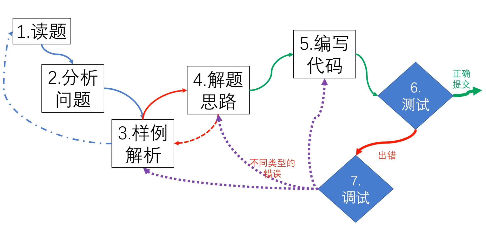
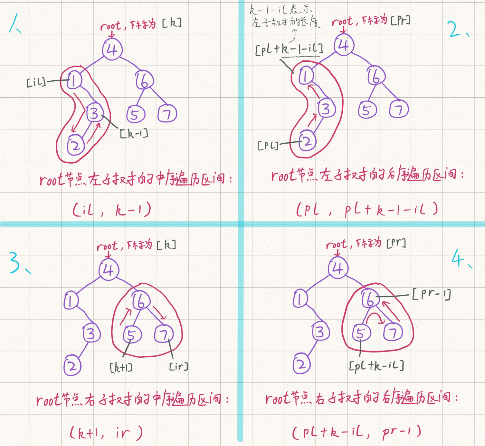

# 计算机CSP算法以及机试指南

> 打响计算机CSP算法以及机试必胜的第一战✌️

**算法解题思路七步法：**



### 前缀和

#### 模板回顾

```cpp
//一维前缀和
S[i] = a[1] + a[2] + ... a[i]
a[l] + ... + a[r] = S[r] - S[l - 1]
做一个Sn数组，表示前n个数的和
单独求某区段的和 就只需要 S[r] - S[l-1];

求前n项和的数组Sn
for (int i = 1; i <= n; i ++ ) scanf("%d", &a[i]);
    for (int i = 1; i <= n; i ++ ) S[i] = S[i-1] + a[i];  //前缀和的初始化

--区间和的计算 S[r] - S[l-1]
```

```cpp
//二维前缀和
[含容斥原理的应用]
自己分析的时候注意 x表示行、y表示列。
分析时不要看成点，而是应该把点看成格子去理解！！！
S[i, j] = 第i行j列格子左上部分所有元素的和
以(x1, y1)为左上角，(x2, y2)为右下角的子矩阵的和为：
S[x2, y2] - S[x1 - 1, y2] - S[x2, y1 - 1] + S[x1 - 1, y1 - 1]
```

```cpp
//注意事项
用模板前缀和时，默认i >= 1 ; j >= 1;
定义数组时；数组大小比规定大小大 10 最为保险
100000 ---> 100010
```

#### 3956.截断数组

> https://www.acwing.com/problem/content/description/3959/
>
> 不要想当然的做题，一定要善于分析，懂得思考，善于进行抽象思维，固定一刀的情况，去枚举另外的切割方式，思路见代码中的注释。
>
> **思路：利用前缀和，固定第二刀，分析第一刀的可能情况即可**，凡是涉及累加运算的，一定要想到前缀和！

```cpp
#include<bits/stdc++.h>

using namespace std;
const int N = 100010;
typedef long long ll;
ll n,sum;
ll a[N],s[N];
int main()
{
    scanf("%lld",&n);
    for(int i = 1; i <= n; i ++){
        scanf("%lld",&a[i]);
        s[i] = s[i-1] + a[i];
    }
    //如果不能被分为三段则表示有0种方案
    if(s[n] % 3 != 0){
        printf("0\n");
        return 0;
    }
    //为了降低时间复杂度，我们单独枚举第二刀的位置即可
    //固定第二刀位置，我们分析第一刀恰好为num的情况，计为cnt
    //如果第二刀之前总和为2*num，那么此时的情况数应该为已有的情况数+cnt
    ll num = s[n] / 3;
    ll cnt = 0, res = 0;
    for(int i = 2; i < n; i ++){
        if(s[i - 1] == num) cnt ++; //表示第一刀的可能情况
        if(s[i] == num * 2) res += cnt; //此时放置第二刀
    }
    printf("%lld\n",res);
    return 0;
}
```

#### 1230. K倍区间

> 很巧妙的一道题，这里我们采用前缀和的方式存放余数
> $$
> s[i] = (s[i-1] + a[i])\%k\ -->余数前缀和\\
> if \ s[i] == 0 \ -->表示1～i其区间本身就是一个满足条件的解\\
> if \ (s[R] - s[L - 1])\%k == 0\ (表示L-R区间满足条件)\\
> \ 	也就是说，s[R]\%k == s[L-1]\%k \ 如果两个区间的余数相同，那么也能构成一个k倍区间\\
> answer=sum(s[0]) + C_{cnt(余数相同的个数)}^2
> $$
> 大概思路如上所示，在编写代码的时候有几个很巧妙的地方
> ```
> 例如：设置初始值cnt[0]=1
> -ans += cnt[s[i]];
> -cnt[s[i]]++;
> 这两行代码的顺序不能变更，这样还不需要用组合公示，虽然理解难度增加了，但代码长度和时间复杂度减少一个常数
> ```

```cpp
#include <bits/stdc++.h>

using namespace std;
typedef long long ll;
const int N = 100010;
ll a[N],s[N];
int cnt[N];
ll ans;
int n,k;
int main()
{
    scanf("%d%d",&n,&k);
    cnt[0] = 1; //如果余数为0的话，那么其本身就是一个合法的区间
    for(int i = 1; i <= n; i ++){
        scanf("%lld",&a[i]);
        s[i] = (s[i-1] + a[i])%k; //用前缀和的方法存下其模的余数
    }
    for(int i = 1;i <= n; i ++){
        ans += cnt[s[i]];  //这里两行代码不能更改顺序，这里的处理方法类似于组合C^2_n
        cnt[s[i]]++; //此时余数相等的情况+1
    }
    printf("%lld\n",ans);
    return 0;
}
```

> 类题：https://www.acwing.com/problem/content/101/
>
> **注意点：**1.不能开long long；2.注意给出的坐标的下标是从0开始的；3.时刻注意数组的范围，不要想当然做题；

```cpp
#include<bits/stdc++.h>

using namespace std;
typedef long long ll;
int ans;
const int N = 5010;
int s[N][N]; //注意这里不要开long long,否则会MLE，要学会自己计算Memory
int n;
int r;
int maxx,maxy;
int main()
{
    scanf("%d%d",&n,&r);
    r = min(r, 5001); //考虑周到
    maxx = maxy = r; //限制初始边界
    for(int i = 0; i < n; i ++){
        int x,y,w;
        scanf("%d%d%d",&x,&y,&w);
        x++,y++;//注意前缀和算法要从下标为1开始！！！！粗心大意
        s[x][y]+=w;
        maxx = max(maxx,x);
        maxy = max(maxy,y);
    }
    for(int i = 1; i <= maxx; i ++){ //二维前缀和
        for(int j = 1; j <= maxy; j ++){
            s[i][j] = s[i - 1][j] + s[i][j - 1] + s[i][j] - s[i - 1][j - 1];
        }
    }
    for(int i = r; i <= maxx; i ++){ //二维前缀和的求解，枚举右下角的端点
        for(int j = r; j <= maxy; j ++){
            ans = max(ans, s[i][j] - s[i-r][j] - s[i][j-r] + s[i-r][j-r]);
        }
    }
    printf("%lld\n",ans);
    return 0;
}
```

### 差分

#### 模板回顾

```cpp
//一维差分
a数组是b数组的前缀和。
假想一个B数组，使得A数组是B数组的前缀和，那么称B数组为A数组的差分。
对B数组求一个前缀和就能得到A数组
假设a数组全部都是0，a数组中的值，相当于进行了n次插入操作。

差分模板：
  给区间[l,r]中的每个数加上c;
	B[l] += c;
	B[r+1] -= c;
//实例
void insert(int l, int r,int c)
{
   b[l] += c;   //b为a的差分，bl+c则bl后的每一项al都会+c
   b[r + 1] -= c;  //所以要使得后面r+1都要-c
}
//不同问题在这一步的处理方式不同
for (int i = 1; i <= n; i ++)
{
    scanf("%d",&a[i]);
    insert(i,i,a[i]);   //假设a里面全是0，a内的每一项都是通过插入实现的
}
while(m --)
{
		int l,r,c;     
  	scanf("%d%d%d",&l,&r,&c);
    insert(l,r,c);
}
for (int i = 1; i <= n ;i ++) b[i] += b[i - 1]; //将b变成前缀和-->为了得到原来的数组
```

```cpp
//二维差分
给以(x1, y1)为左上角，(x2, y2)为右下角的子矩阵中的所有元素加上c：
S[x1, y1] += c, S[x2 + 1, y1] -= c, S[x1, y2 + 1] -= c, S[x2 + 1, y2 + 1] += c
  
对数组b进行前缀和累加可以恢复到原来数组a
b[i][j] = b[i][j] + b[i - 1][j] + b[i][j - 1] - b[i - 1][j - 1]; //二维数组自身的前缀和求法
```

#### 100.增减序列

> https://www.acwing.com/problem/content/102/

> **差分思路：**将区间都需要+C的情况，转化为只需要对两个数进行加减。
> 原序列为$a$，差分序列为$b$
>
> 差分数组有几个特殊的值$b_1$和$b_{n+1}$，如果需要原序列相等，那么差分数组应该为$\{b_1,0,...,0\} 其中b_1为一个常数，只需要让b_2\sim b_n为0即可$
>
> 对于差分数组的$L$和$R$的取值有如下四种操作方式：
>
> 1⃣️$2\le L\le R \le n-1$ 选择一个$b_i$在$2\le n-1$中，一个$+/-1，另一个$ $-/+1$
>
> 2⃣️$L=1,R \le n-1$ 让$b_1 +/-1$，选一个在$2\le n-1$中的数$-/+1$
>
> 3⃣️$L\ge2, R=n$ 让$b_{n+1} +/-1$，选择另外一个数$-/+1$
>
> 4⃣️$L=1,R=n$，表示让这个序列都$+/-1$ –>在本题中没有意义；
>
> 对于差分序列$b_2\sim b_n$ ，假设其所有的正数和为$q$，所有的负数和为$p$
>
> 以贪心的方式选择1⃣️，这样能够更快的选择两个数进行变换【2⃣️3⃣️只能变一个数】，那么首先优先选择1⃣️，此时需要的操作次数为$min\{q,p\}$ 次，也就是将其中的正数/负数首先变成0，然后再使用2⃣️3⃣️方法对于剩下的数，剩下的数有$||q|-|p||$次，也就是最少还需要$||q|-|p||$次操作2⃣️和3⃣️：
> **结论：**最少需要的次数$ans1 = min\{q,p\}+||q|-|p|| =max\{q,p\}$
>
> 接下来讨论此时的方案数有多少种？对于1⃣️的操作是固定不变的，那么方案差异主要在于2⃣️和3⃣️，对于2⃣️和3⃣️的不同种情况一共有：$ans2=||p|-|q||+1$种 （理由如下：）
>
> ```
> 2⃣️			3⃣️
> 0			||p|-|q||
> 1			||p|-|q||-1
> 2			||p|-|q||-2
> ...			...
> ||p|-|q||		0
> ```

```cpp
#include <bits/stdc++.h>

using namespace std;
const int N = 100010;
typedef long long ll;
int b[N];
int a[N];
int n;
ll q,p;
int main()
{
    scanf("%d",&n);
    for(int i = 1; i <= n; i ++){
        scanf("%d",&a[i]);
        b[i] = a[i] - a[i-1];
        if(i == 1) continue;
        if(b[i] < 0) q += b[i];
        if(b[i] > 0) p += b[i];
    }
    ll ans1 = max(abs(q),abs(p));
    ll ans2 = abs(abs(q) - abs(p)) + 1ll;
    printf("%lld\n%lld",ans1,ans2);
    return 0;
}
```

#### 3729.改变数组元素

> https://www.acwing.com/problem/content/3732/

> 平平无奇的差分数组方法，对于差分数组，脑袋里面一定要时刻有那个差分/前缀和的概念

```cpp
#include <bits/stdc++.h>

using namespace std;
int T;
const int N = 200010;
int b[N];
void insert(int l,int r){
    b[l] += 1;
    b[r] -= 1;
}
int main()
{
    scanf("%d",&T);
    while(T--){
        int n;
        scanf("%d",&n);
        memset(b,0,sizeof b); //记得每次清0
        for(int i = 1; i <= n; i ++){
            int x;
            scanf("%d",&x); //当前操作
            if(x == 0) continue; //如果为0表示不操作
            insert(max(0,i-x+1),i+1); //否则将这一段区间进行差分+1
        }
        for(int i = 1; i <= n; i ++){
            b[i] += b[i-1]; //前缀和恢复原数组
        }
        for(int i = 1; i <= n; i ++){
            if(b[i] > 0) b[i] = 1; //这里只记录>1的为1即可！
            printf("%d ", b[i]);
        }
        printf("\n");
    }
    return 0;
}
```

### 二分

#### 模版回顾

```cpp
//整数二分【易错点：边界问题的选取】
当l = mid 的时候要补上l+r+1;
当r = mid 的时候不需要补上;

//模版一：
适用条件：区间[L,R]被划分为[L,mid], [mid+1,R]时使用;
//区间[l,r] 被划分位[l,mid] 和[mid+1,r]时使用
int bsearch_1(int l, int r)
{
    while (l < r)
    {
        int mid = l + r >> 1; //取中间值 相当于 (l+r)/2;
        if (check(mid)) r = mid;  // check()判定mid是否满足性质
        else l = mid + 1;
    }
    return 1;
}

//模版二
适用条件：区间[L,R]被划分为[L,mid-1],[mid,R]时使用;
int bsearch_2(int l, int r)
{
    while(l < r)
    {
        int mid = l + r + 1 >> 1;
        if (check(mid)) l = mid;
        else r = mid - 1;
    }
    return 1;
}
```

```cpp
//浮点数二分
特点：没有整除的概念，所以没有整数二分的边界问题，可以严格的二分
不断二分，直到二分的长度足够小的时候可以认为二分获得的是一个数了;
bool check(double x);

double bsearch_3(double l, double r)
{
    const double eps=1e-6; //精度
    while (r-l > eps)
    {
        double mid = (l+r)/2;
        if (check()) r=mid;
        else l=mid;
    }
    return l;
}
注意：精确度比要求的精确度多两位的情况下是比较保险的
如：保留6位，1e-8更为保险。
```

有单调性一定可以二分，但没有单调性有可能可以二分，所以二分的本质不是单调性

**本质：把整个区间一分为二，一部分满足、一部分不满足；二分能找到边界点分出这两个部分 [本质：边界]**

> 模板题：查找数的范围，分别是选择的lower和upper两种二分查找的方式，最终获得其区间。https://www.acwing.com/problem/content/791/
>
> ```cpp
> #include<bits/stdc++.h>
> 
> using namespace std;
> int n,q,k;
> const int N = 100010;
> int a[N];
> int main()
> {
>     scanf("%d%d",&n,&q);
>     for(int i = 0; i < n; i ++){
>         scanf("%d",&a[i]);
>     }
>     while(q --){
>         scanf("%d",&k);
>         int l = 0,r = n - 1;
>       	//lower方式获取下区间边界
>         while(l < r){
>             int mid = l + r >> 1;
>             if(a[mid] >= k){
>                 r = mid;
>             }
>             else{
>                 l = mid+1;
>             }
>         }
>       	//找不到的情况
>         if(a[l] != k) printf("-1 -1\n");
>         else{//upper方式获取上区间边界
>             printf("%d ",l);
>             l = 0, r = n-1;
>             while(l < r){
>                 int mid = l + r + 1 >> 1;
>                 if(a[mid] <= k){
>                     l = mid;
>                 }
>                 else{
>                     r = mid - 1;
>                 }
>             }
>             printf("%d\n",l);
>         }
>     }
>     return 0;
> }
> ```

#### 1460.我在哪？（哈希+二分）

> https://www.acwing.com/problem/content/1462/

```cpp
//本题主要难点在于获取当前字符串的所有子串，用二分的方法查找合适情况。
#include <bits/stdc++.h>
#include <cstring>
#include <unordered_set>
using namespace std;
int n;
string str;
bool check(int mid){
    unordered_set<string> st; //set来代替字符串哈希
    for(int i = 0; i + mid <= n; i ++){
        string curstr = str.substr(i,mid);
        if(st.count(curstr)) return false;
        st.insert(curstr);
    }
    return true;
}
int main()
{
    scanf("%d",&n);
    cin >> str;
    int l = 0, r = n;
    while(l < r){ //二分查找
        int mid = l + r >> 1;
        if(check(mid)){
            r = mid;
        }
        else{
            l = mid + 1;
        }
    }
    printf("%d\n",l);
    return 0;
}
```

#### 1221.四平方和 （哈希+二分）以及几点启发

> https://www.acwing.com/problem/content/1223/

> 1. 符号重载的方式，代码示例种使用得很经典，还有另外的方式，通过手写bool cmp，导入到sort(a,a+n,cmp)中
> 2. 关于二分中L和R的边界值的选取，应该要选择满足要答案要求的边界范围，不能盲目将LR区间设置很大！！比如说在本题，二分查找答案是在0~pos中寻找满足条件的下标，因此此时L=0,R=pos才行！

```cpp
#include <bits/stdc++.h>
#include <vector>
using namespace std;
typedef long long ll;
int n;
const int N = 2500010;
struct sumup4{
    ll sum,c,d;
    bool operator< (const sumup4 &t) const{ //符号重载，主要用于sort函数
        if(sum != t.sum) return sum < t.sum;
        if(c != t.c) return c < t.c;
        return d < t.d;
    }
}sumup4[N];
int main()
{
    scanf("%d",&n);
    int pos = 0;
    for(int c = 0; c*c <= n; c ++){
        for(int d = c; c*c+d*d <= n; d++){
            sumup4[pos++] = {c*c+d*d,c,d}; //充分利用C++11的特性
        }
    }
    sort(sumup4,sumup4+pos);
    for(int a = 0; a*a <= n; a ++){
        for(int b = 0; a*a+b*b <= n; b ++){
            ll t = n - (a*a+b*b);
            int l = 0, r = pos-1;
            while(l < r){
                int mid = l + r >> 1;
                if(sumup4[mid].sum >= t) r=mid;
                else l=mid+1;
            }
            if(sumup4[l].sum == t){
                printf("%d %d %d %d\n",a,b,sumup4[l].c,sumup4[l].d);
                return 0;
            }
        }
    }
    return 0;
}
```

#### 1227.分巧克力

> https://www.acwing.com/problem/content/1229/

```cpp
//关于二分边界问题——此路不通走彼路
//r=mid不行就换成l=mid试一下
#include <bits/stdc++.h>
using namespace std;
const int N = 100010;
int n,k;
int pos = 0;
struct Cake{
    int h;
    int w;
}cake[N];
bool check(int mid){
    int cnt = 0;
    for(int i = 0; i < pos; i ++){
        int h = cake[i].h, w = cake[i].w;
        if(mid > h || mid > w) continue;
        int hnum = h / mid;
        int wnum = w / mid;
        cnt += hnum*wnum;
        if(cnt >= k) return true;
    }
    return false;
}
int main()
{
    scanf("%d%d",&n,&k);
    int maxsize = 0;
    for(int i = 0; i < n; i ++){
        int h,w;
        scanf("%d%d",&h,&w);
        cake[pos ++] = {h,w};
        maxsize = max(maxsize,h);
        maxsize = max(maxsize,w);
    }
    int l = 0, r = maxsize;
    while(l < r){
        int mid = l + r + 1 >> 1;
        if(check(mid)) l = mid;
        else r = mid - 1;
    }
    printf("%d\n",l);
    return 0;
}
```

#### 113.特殊排序（交互题）

> https://www.acwing.com/problem/content/115/
> 读懂题目甚至比题目本身还难；
> 反对称性：$a>b,b<a$
> 传递性：$a<b,b<c\rightarrow a<c$

```cpp
// Forward declaration of compare API.
// bool compare(int a, int b);
// return bool means whether a is less than b.
//**这道题目其实就可以转化为对于一个已排好序多数组，插入元素**
//**选择合适的位置插入元素，这里选择位置时，可以使用二分查找算法**
class Solution {
public:
    vector<int> specialSort(int N) {
        scanf("%d", &N);
        vector <int> ans;
        ans.push_back(1); //插入二分，先把1插进去，这样其他数就能和1进行比较了
        for(int i = 2 ; i <= N ; i ++)
        {
            int l = 0 , r = ans.size(); //在ans中进行二分
            while(l < r)
            {
                int mid = (l + r) >> 1; //大于mid 的 第一个数
                if(compare(i,ans[mid])) //
                r = mid;
                else l = mid + 1;
            }
            ans.insert(ans.begin() + l, i);//然后在给定位置插入i
        }
        return ans;
    }
};
```

### 双指针算法

```cpp
实际上将原来的多重循环，使用双指针的方式在一个循环内完成
for (int i = 0, j = 0; i < n; i ++ )
{
    while (j < i && check(i, j)) j ++ ;

    // 具体问题的逻辑
}
核心思想--->将穷举O(n^2)算法优化到O(n)
常见问题分类：
    (1) 对于一个序列，用两个指针维护一段区间
    (2) 对于两个序列，维护某种次序，比如归并排序中合并两个有序序列的操作
```

**窍门**：先写一个暴力解法，去思考**限制条件**和**单调性关系**，然后想办法去优化，将On2 --> On;

#### 799.最长连续不重复字序列（双指针经典咏流传）

> https://www.acwing.com/problem/content/801/

```cpp
#include <bits/stdc++.h>
using namespace std;
const int N = 100010;
int a[N],n;
int x[N];
int main()
{
    scanf("%d",&n);
    for(int i = 0; i < n; i ++) scanf("%d",&a[i]);
    int ans = 0;
    // --j------------i--，考虑i为右端点去思考j的情况，双指针算法常用
    //特别经典，一定要熟透于心，很多时候都要想到，固定一个端点
    for(int i = 0, j = 0; i < n; i ++){
        x[a[i]] ++;
        int res = 0;
        while(j < i && x[a[i]] > 1){ // 经典咏流传， 这里j < i和x[a[i]] > 1都很经典
            x[a[j]] --;
            j++;
        }
        res = i - j + 1;
        ans = max(ans,res);
    }
    printf("%d\n",ans);
    return 0;
}
```

```cpp
//两个序列，一个从前往后，一个从后往前寻找两个序列的下标，使得a[i] + b[j] = k的i，j值
//注意，这里成立的前提条件是a,b是升序序列
int main()
{
    scanf("%d%d%lld",&n,&m,&x);
    for(int i = 0;i < n; i ++) scanf("%d",&a[i]);
    for(int i = 0;i < m; i ++) scanf("%d",&b[i]);
    for(int i = 0, j = m - 1; i < n; i ++){
        while(a[i] + b[j] > x) j --; //与暴力的区别，j不会回退
        if(a[i] + b[j] == x) printf("%d %d\n",i,j);
    }
    return 0;
}
```

#### 1238.日志统计（双指针经典II）

> https://www.acwing.com/problem/content/1240/

```cpp
int main()
{
    scanf("%d%d%d", &n, &d, &k);
    for (int i = 0; i < n; i ++ ) scanf("%d%d", &logs[i].x, &logs[i].y);
    sort(logs, logs + n); //先给时间排个序!
  //这一步跟上面经典的双指针算法如出一辙，变了一点点，一定要灵活应对。
    for (int i = 0, j = 0; i < n; i ++ )//将j---i,这里i为右端点进行枚举
    {
        int id = logs[i].y;
        cnt[id] ++ ; //也是一样记录当前元素的个数
        while (logs[i].x - logs[j].x >= d) //给定两端点的枚举条件
        {
            cnt[logs[j].y] -- ; //当j需要移动的情况
            j ++ ; //现在移动j左端点指针
        }
        if (cnt[id] >= k) st[id] = true; //当满足题目所给条件时进行输出
    }
    for (int i = 0; i <= 100000; i ++ )
        if (st[i])
            printf("%d\n", i);
    return 0;
}
```

### 递推

> 这就像道智力题啦，要发现规律

#### 3777.砖块

> https://www.acwing.com/problem/content/description/3780/

```cpp
思路：贪心——遇到这种数据量很少的，就直接暴力枚举吧～
最终的字符串，要么全为白色，要么全为黑色。
>以目标全为白色为例，遍历字符串的前 n−1个砖块，每遇到一个黑色砖块，就对其进行一次操作，将该砖块和下一个砖块变为另一种颜色，并将结果记录到数组中。如果发现最后一个砖块不为白色，那说明无法将砖块全部转化为白色；黑色同理。
>若最终全转化为白色和全转化为黑色均不可行，则输出 −1，否则输出一种可行的方案即可。
```

#### 95.费解的开关

> https://www.acwing.com/problem/content/97/

```cpp
#include<iostream>
#include<queue>
#include<unordered_map>
using namespace std;
int t;
//当前状态，当前到最终状态所需步数
unordered_map<int, int>vis;
//改这个灯及其上下左右相邻的灯的状态
//改第idx个灯;左,不为最左一个;上，不为第一排;下，不为最后一排;右，不为右一个
int turn(int st, int idx) { //这里用位运算压缩的方式存放一种状态
    st ^= (1 << idx);
    if (idx % 5) st ^= 1 << idx - 1;
    if (idx >= 5) st ^= 1 << idx - 5;
    if (idx < 20) st ^= 1 << idx + 5;
    if ((idx % 5) < 4) st ^= 1 << idx + 1;
    return st;
}
//从最终状态逆序遍历，遍历所有的状态，所以不用管地图什么样，直接bfs完，查对应map就完事了
void bfs() {
    //0-2^25-1（25个1），共2^25种状态
    int st = (1 << 25) - 1;//左移 右移的优先级是最低的，比加减还要低。所以这里的括号是必需的
    queue<int>q;
    q.push(st);
    while (q.size())
    {
        int t = q.front();
        q.pop();
        if (vis[t] == 6) break;//判断6步以内使所有的灯都变亮。
        for (int i = 0; i < 25; i++) {//尝试当前状态的每盏灯
            st = turn(t, i);//新的状态
            if (!vis.count(st)) {//该状态未被遍历过
                vis[st] = vis[t] + 1;
                q.push(st);
            }
        }
    }
}
int main() {
    bfs();//用map+深搜的方式存下所有可能的情况以及对应的解决方法
    cin >> t;
    while (t--)
    {
        int sum = 0;
        for (int i = 0; i < 25; i++) {
            char ch;
            cin >> ch;
            sum += ((ch - '0') << i);//25个字符二进制压缩成数字
        }
        if (vis[sum] == 0 && sum != (1 << 25) - 1) cout << -1 << endl;
        else cout << vis[sum] << endl;

    }
    return 0;
}
```

### 递归

#### 树的遍历🌲（回顾了一下建树/前序/中序/后序/层次遍历）

> https://www.acwing.com/problem/content/1499/

>

```cpp
#include <iostream>
#include <cstring>
#include <algorithm>
#include <unordered_map>
#include <queue>

using namespace std;
const int N = 40;
int n;
int postorder[N], inorder[N];               //前序遍历，中序遍历
unordered_map<int, int> l, r, pos;          //用哈希表模拟二叉树

//il ir中序遍历区间； pl pr后序遍历区间
int build(int il, int ir, int pl, int pr)
{
    int root = postorder[pr];
    int k = pos[root];                      //得到根节点在中序遍历中的下标

    //k大于il表示根节点左边还有节点，即当前根节点存在左子树，下同
    //下面两行是难点，举例解释见图
    if (il < k) l[root] = build(il, k - 1, pl, pl + k - 1 - il);
    if (ir > k) r[root] = build(k + 1, ir, pl + k - il, pr - 1);

    return root;
}

void bfs(int root)                          //BFS用来层序遍历输出
{
    queue<int> q;
    q.push(root);
    while (q.size())
    {
        auto t = q.front();
        q.pop();
        cout << t << ' ';

        if (l.count(t)) q.push(l[t]);       //判断该节点的左右儿子是否存在
        if (r.count(t)) q.push(r[t]);       //存在则加入队列，等待下一层遍历
    }
}

int main()
{
    cin >> n;
    for (int i = 0; i < n; i ++ ) cin >> postorder[i]; //输入后序遍历树
    for (int i = 0; i < n; i ++ )
    {
        cin >> inorder[i]; //输入中序遍历树
        pos[inorder[i]] = i;                //记录中序遍历每个点位置（剪枝）
    }

    int root = build(0, n - 1, 0, n - 1);   //参数为中序遍历区间和后序遍历区间
    bfs(root);

    return 0;
}
```

#### 约数之和【经典数学知识】

> https://www.acwing.com/problem/content/99/

##### 补充数学知识（1）约数相关性质

> [1，n]里约数有i的个数是$\lfloor\frac{n}{i}\rfloor$ 
>
> 如上，n = 12时；
>
> 1~12之间的数，有以1为约数的有 12/1 = 12个
> 							有以2为约数的有 12/2 = 6个
> 							有以3为约数的有  12/3 = 4个
>
> 求所有约数的和，可以使用 s+=n/i
>
> > **上述算法的进一步优化**：
> >
> > 打表后发现，表中有很多$\lfloor\frac{n}{i}\rfloor$是相等的，比如12的5、6都是一样的。
> >
> > 对于这些一样的数每次都计算一次非常浪费时间，可以每次$i$跳转到$\lfloor\frac{n}{j}\rfloor = \lfloor\frac{n}{i}\rfloor+1$
> >
> > 这样的j上 对于中间一样的数一次性计算完毕。
> >
> > ```cpp
> > for(int i = 1, j; i <= n; i=j+1)
> > {
> > 	j = n/(n/i);
> >  ans += (n/i)*(j-i+1);
> > }
> > ```
>
> 试除法求所有约数
>
> ```cpp
> vector<int> get_divisors(int x)
> {
>     vector<int> res;
>     for (int i = 1; i <= x / i; i ++ )
>         if (x % i == 0)
>         {
>             res.push_back(i);
>             if (i != x / i) res.push_back(x / i);//如果n是i的平方，可能有两个，这里目的是只存下一个
>         }
>     sort(res.begin(), res.end());
>     return res;
> }
> ```

**约数个数与约数之和**$N = p_1^{c_1} * p_2^{c_2} * ... *p_k^{c_k}$ 

```cpp
如果 N = p1^c1 * p2^c2 * ... *pk^ck
约数个数： (c1 + 1) * (c2 + 1) * ... * (ck + 1)
约数之和： (p1^0 + p1^1 + ... + p1^c1) * ... * (pk^0 + pk^1 + ... + pk^ck)
```

**数论常见的问题：**

- 对于每一个大于等于2的正整数n，都有$N=p_1^{c_1}*p_2^{c_2}*...*p_m^{c_m}$
- 正整数N的欧拉函数$phi(N)=N*(1-\frac{1}{p_1})*(1-\frac{1}{p_2})*...*(1-\frac{1}{p_m})=p_1^{c_1-1}*(p_1-1)*p_2^{c_2-1}*(p_2-1)*...*p_m^{c_m-1}*(p_m-1)$
- 正整数N的约数个数：$d(N)=(1+c_1)*(1+c_2)*...*(1+c_m)$
- 正整数N的所有约数和：$s(N)=(1+p_1+p_1^2+...+p_1^{c_1})*(1+p_2+p_2^2+...+p_2^{c_2})*(1+p_m+p_m^2+...+p_m^{c_m})$

##### 欧拉筛约数的方法⭐️

> 证明见：https://blog.csdn.net/weixin_43896346/article/details/88396182

- 欧拉筛

```cpp
inline void sieve(int x) {
    for(reg int i = 2;i <= x;i ++) {
        if(! vis[i])
            prim[++ len] = i;
        for(reg int j = 1;j <= len && i * prim[j] <= x;j ++) {
            vis[i * prim[j]] = 1;
            if(i % prim[j] == 0)
                break;
        }
    }
}
//试除法求质数
for (int i = 2; i <= x / i; i ++ ){
  while(x%i == 0){
    x/=i;
    primes[i]++;
  }
  if(x > 1) primes[x]++;
}
```

- 欧拉函数

```cpp
inline void sieve(int x) {
	phi[1] = 1;
    for(reg int i = 2;i <= x;i ++) {
        if(! vis[i]) {
        	prim[++ len] = i;
        	phi[i] = i - 1;	//因为欧拉函数代表小于这个数的且与这个数互质的数的个数，所以质数的欧拉函数为它本身减1
        }
        for(reg int j = 1;j <= len && i * prim[j] <= x;j ++) {
            vis[i * prim[j]] = 1;
            if(i % prim[j] == 0) {
            	phi[i * prim[j]] = phi[i] * prim[j];
                break;
            }
            phi[i * prim[j]] = phi[i] * (prim[j] - 1);
        }
    }
}
```

- 约数个数

```cpp
inline void sieve(int x) {
    for(reg int i = 2;i <= x;i ++) {
        if(! vis[i]) {
        	prim[++ len] = i;
        	d[i] = 2;	//质数的约数只有1和它本身
        	sum[i] = 1;
        }
        for(reg int j = 1;j <= len && i * prim[j] <= x;j ++) {
            vis[i * prim[j]] = 1;
            if(i % prim[j] == 0) {
            	sum[i * prim[j]] = sum[i] + 1;
            	d[i * prim[j]] = d[i] / (sum[i] + 1) * (sum[i] + 2);
                break;
            }
            sum[i * prim[j]] = 1;
            d[i * prim[j]] = d[i] * 2;
        }
    }
}
```

- 约数和

```cpp
inline void sieve(int x) {
    for(reg int i = 2;i <= x;i ++) {
        if(! vis[i]) {
        	prim[++ len] = i;
        	psum[i] = s[i] = i + 1;
        }
        for(reg int j = 1;j <= len && i * prim[j] <= x;j ++) {
            vis[i * prim[j]] = 1;
            if(i % prim[j] == 0) {
            	psum[i * prim[j]] = psum[i] * prim[j] + 1;
            	s[i * prim[j]] = s[i] / psum[i] * psum[i * prim[j]]
                break;
            }
            psum[i * prim[j]] = prim[j] + 1;
            s[i * prim[j]] = s[i] * psum[i * prim[j]];
        }
    }
}
```

> 本题思路：【分治法(分解为k为偶数和k为奇数的情况进行分治讨论)+约数+快速幂】

```cpp
#include<iostream>
#include<unordered_map>
using namespace std;
typedef long long LL;
const int mod = 9901;
int A, B;
//保存质因子以及出现的次数
unordered_map<int, int> primes;
//试除法质因子分解
void divide(int n) {
    for(int i = 2; i <= n / i; i++) {
        if(n % i == 0) {
            while(n % i == 0) {
                primes[i]++;
                n /= i;
            }
        }
    }
    if(n > 1) {
        primes[n]++;
    }
}
//快速幂
int qmid(int a, int b) {
    int res = 1;
    while(b) {
        if(b & 1) res = (LL)res * a % mod;
        a = (LL)a * a % mod;
        b >>= 1;
    }
    return res;
}
//p0 + .. + pk-1
int sum(int p, int k) {
    if(k == 1) return 1;  //边界
    if(k % 2 == 0) {  
        return (LL)(qmid(p, k / 2) + 1) * sum(p, k / 2) % mod;
    }
    return (qmid(p, k - 1) + sum(p, k - 1)) % mod;
}
int main(){
    cin >> A >> B;

    //对A分解质因子
    divide(A);

    int res = 1;
    for(auto it : primes) {
        //p是质因子，k是质因子的次数
        int p = it.first, k = it.second * B;
        // res要乘上每一项, 注意这里是k + 1
        res = (LL)res * sum(p, k + 1) % mod;
    }
    if(!A) res = 0;

    cout << res << endl;

    return 0;
}
```

### 并查集

- 朴素的并查集

  ```cpp
  int p[N]; //存储每个点的祖宗节点
  //返回x的祖宗节点
  int find(int x)
  {
      if(p[x] != x) p[x] = find(p[x]); //如果p[x]不是根节点的话，那么就让p[x]为他的祖宗结点
      return p[x];
  }
  
  //初始化，假设节点编号是1~n
  for(int i = 1; i <= n; i ++) p[i] = i;
  
  //合并a和b所在的两个集合
  p[find(a)] = find(b); //合并操作 也就是让a的祖宗结点的父亲等于b的祖宗结点
  ```

- 维护size的并查集

  ```cpp
  int p[N], size[N];
  //p[]存储每个点的祖宗结点，size[]只有祖宗结点的有意义，表示祖宗结点所在集合中的点的数量
  
  //返回x的祖宗结点
  int find(int x)
  {
      if(p[x] != x) p[x] = find(p[x]);
      return p[x];
  }
  //初始化，假定结点编号1~n
  for(int i = 1; i <= n; i ++)
  {
      p[i] = i;
      size[i] = 1;
  }
  
  //合并a和b所在的两个集合
  size[find(b)] += size[find(a)];
  p[find(a)] = find(b);
  ```

- 维护到祖宗节点的并查集

  ```cpp
  int p[N],d[N];
  //p[]存储每个点的祖宗结点，d[x]存储x到p[x]的距离
  
  //返回x的祖宗结点
  int find(int x)
  {
      if(p[x] != x)
      {
          int u = find(p[x]);
          d[x] += d[p[x]];
          p[x] = u;
      }
      return p[x];
  }
  
  //初始化，假定结点编号是1~n
  for(int i = 1; i <= n; i ++)
  {
      p[i] = i;
      d[i] = 0;
  }
  
  //合并a和b所在的两个集合
  p[find(a)] = find(b);
  d[find(a)] = distance; //根据具体问题，初始化find(a)的偏移量
  ```

#### 带权的综合并查集

> https://www.acwing.com/problem/content/240/

```cpp
#include <bits/stdc++.h>

using namespace std;
const int N = 30010,M = 30000;
int T;
int p[N];
int dist[N],s[N];
int find(int x){
    if(p[x] != x){
        int u = find(p[x]);
        dist[x] += dist[p[x]];
        p[x] = u;
    }
    return p[x];
}
int main()
{
    ios::sync_with_stdio(false);
    cin.tie(0),cout.tie(0);
    cin >> T;
    for(int i = 1; i <= M; i ++){
        p[i] = i;
        s[i] = 1;
    }
    while(T --){
        string op;
        int a,b;
        cin >> op >> a >> b;
        int pa = find(a), pb = find(b);
        if(op == "M"){
            if(pa != pb){
                p[pa] = pb;
                dist[pa] = s[pb];
                s[pb] += s[pa];
            }
        }
        else{
            if(pa != pb) cout << "-1\n";
            else{
                cout << max(0,abs(dist[a] - dist[b]) - 1) << "\n";
            }
        }
    }
    return 0;
}
```

### 哈希

- 一般哈希

```cpp
(1) 拉链法
    int h[N], e[N], ne[N], idx;

    // 向哈希表中插入一个数
    void insert(int x)
    {
        int k = (x % N + N) % N;
        e[idx] = x;
        ne[idx] = h[k];
        h[k] = idx ++ ;
    }

    // 在哈希表中查询某个数是否存在
    bool find(int x)
    {
        int k = (x % N + N) % N;
        for (int i = h[k]; i != -1; i = ne[i])
            if (e[i] == x)
                return true;
        return false;
    }
(2) 开放寻址法
    //注意开坑位N的时候要多开比原数据多两到三倍
    const int null = 0x3f3f3f3f;
    int h[N];

    // 如果x在哈希表中，返回x的下标；如果x不在哈希表中，返回x应该插入的位置
    int find(int x)
    {
        int t = (x % N + N) % N;
        while (h[t] != null && h[t] != x)
        {
            t ++ ;
            if (t == N) t = 0;
        }
        return t;
    }
//开放寻址法的话，如果是删除，就是先找到那个数，然后打上一个标记，表示这个数被删除了
```

- 字符串哈希

```cpp
核心思想：将字符串看成P进制数，P的经验值是131或13331，取这两个值的冲突概率低
小技巧：取模的数用2^64，这样直接用unsigned long long存储，溢出的结果就是取模的结果

typedef unsigned long long ULL; //可以不用取模了，这个溢出就等价于进行取模
ULL h[N], p[N]; // h[k]存储字符串前k个字母的哈希值, p[k]存储 P^k mod 2^64

// 初始化
p[0] = 1;
for (int i = 1; i <= n; i ++ )
{
    h[i] = h[i - 1] * P + str[i];
    p[i] = p[i - 1] * P;
}

// 计算子串 str[l ~ r] 的哈希值
ULL get(int l, int r)
{
    return h[r] - h[l - 1] * p[r - l + 1];
}
```


### 树状数组


### 线段树
